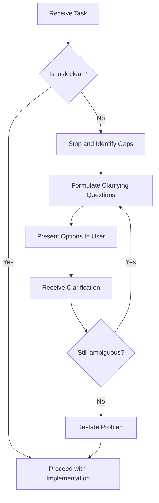

### **02: Problem Framing & Ambiguity Resolution**

> 
> **Current Level:** Expert (Enterprise Scale) 
> 
> 
> **Domain:** Meta Skills / Communication 
> 

---

### **1. Executive Summary & Strategic Necessity**

* **Context:** ในโลกปี 2025-2026 การทำงานระหว่าง AI Agents และมนุษย์มีความซับซ้อนเพิ่มขึ้นอย่างมาก การทำความเข้าใจปัญหาที่ชัดเจนก่อนเริ่มทำงานเป็นทักษะสำคัญที่ช่วยลดการสร้างผลลัพธ์ที่ผิดพลาด (Hallucinations) และประหยัดเวลาในการทำงานซ้ำ
* **Business Impact:** การทำความเข้าใจปัญหาที่ดีช่วย:
  - เพิ่มอัตราความสำเร็จในการทำงานครั้งแรก (First-shot Success Rate)
  - ลดเวลาที่ใช้ในการทำงานซ้ำ (Re-work)
  - เพิ่มความพึงพอใจของลูกค้า
  - ลดต้นทุนในการพัฒนาและการแก้ไข
  - เพิ่มประสิทธิภาพของทีม AI/Dev
* **Product Thinking:** ทักษะนี้ช่วยแก้ปัญหา (Pain Point) ให้กับ:
  - AI Agents ที่ต้องการทำความเข้าใจคำสั่งที่ไม่ชัดเจน
  - ผู้ใช้งานที่ต้องการผลลัพธ์ที่ตรงตามความต้องการ
  - ทีมพัฒนาที่ต้องการลดการสื่อสารกลับไปมา
  - ผู้บริหารที่ต้องการความมั่นใจในการลงทุน

### **2. Technical Deep Dive (The "How-to")**

* **Core Logic:** Problem Framing เป็นกระบวนการที่ช่วยให้ AI Agents ตรวจสอบและทำความเข้าใจคำสั่งที่ได้รับก่อนเริ่มปฏิบัติงาน โดยใช้กลไกต่อไปนี้:
  - **Ambiguity Detection:** การตรวจสอบคำสั่งที่ไม่ชัดเจน (Lazy Prompts, Missing Context, Undefined Success Criteria)
  - **Stop-and-Ask Protocol:** การหยุดและถามคำถามเพื่อขอข้อมูลเพิ่มเติม
  - **Question Formulation:** การสร้างคำถามที่มีประสิทธิภาพ (Specific, Actionable, Non-leading, Prioritized, Multiple-choice)
  - **Problem Restatement:** การยืนยันความเข้าใจโดยการเขียนปัญหาใหม่ด้วยคำของตัวเอง

* **Architecture Diagram Requirements:** แผนผังสถาปัตยกรรมที่ต้องมี:
  - **Decision Flow Diagram:** แผนผังแสดงการตัดสินใจว่าจะดำเนินการหรือถามเพิ่มเติม
  - **Question Template Library:** คลัง Template สำหรับการถามคำถาม
  - **Ambiguity Detection Rules:** กฎการตรวจสอบความไม่ชัดเจน
  - **Context Gathering Workflow:** กระบวนการเก็บข้อมูลเพิ่มเติม

* **Implementation Workflow:**
  1. **Receive Task:** รับคำสั่งงาน
  2. **Detect Ambiguity:** ตรวจสอบความชัดเจนของคำสั่ง
  3. **Stop and Identify Gaps:** หยุดและระบุข้อมูลที่ขาดหาย
  4. **Formulate Clarifying Questions:** สร้างคำถามเพื่อขอข้อมูลเพิ่มเติม
  5. **Present Options to User:** นำเสนอตัวเลือกให้ผู้ใช้งาน
  6. **Receive Clarification:** รับข้อมูลเพิ่มเติมจากผู้ใช้งาน
  7. **Restate Problem:** เขียนปัญหาใหม่ด้วยคำของตัวเอง
  8. **Confirm Understanding:** ขอยืนยันจากผู้ใช้งาน
  9. **Proceed with Implementation:** ดำเนินการตามที่ตกลง

### **3. Tooling & Tech Stack**

* **Enterprise Tools:** เครื่องมือระดับอุตสาหกรรมที่เลือกใช้:
  - **Prompt Engineering Tools:** LangChain, PromptPerfect, PromptBase
  - **Documentation Platforms:** Confluence, Notion, GitHub Wiki
  - **Collaboration Tools:** Slack, Microsoft Teams, Discord
  - **Version Control:** Git, GitHub, GitLab
  - **Testing Tools:** Jest, PyTest, Playwright

* **Configuration Essentials:** ส่วนประกอบสำคัญในการตั้งค่า:
  - **Question Templates:** Template มาตรฐานสำหรับการถามคำถาม
  - **Ambiguity Detection Rules:** กฎการตรวจสอบความไม่ชัดเจน
  - **Context Gathering Prompts:** Prompt สำหรับเก็บข้อมูลเพิ่มเติม
  - **Restatement Template:** Template สำหรับการเขียนปัญหาใหม่
  - **Integration with AI Models:** การผนวกกับ AI Models เช่น GPT-4, Claude, etc.

### **4. Standards, Compliance & Security**

* **International Standards:** มาตรฐานที่เกี่ยวข้อง:
  - **ISO/IEC 9241:** Ergonomics of Human-System Interaction
  - **ISO/IEC 25010:** Software Quality Model
  - **IEEE 830:** Recommended Practice for Software Requirements Specifications

* **Security Protocol:** กลไกการป้องกัน:
  - **Input Validation:** การตรวจสอบและ sanitize ข้อมูลที่รับมา
  - **Context Sanitization:** การลบข้อมูลที่เป็นความลับจาก context
  - **Access Control:** การควบคุมการเข้าถึงข้อมูล
  - **Audit Logging:** การบันทึกการโต้ตอบเพื่อการตรวจสอบ

* **Explainability:** ความสามารถในการอธิบาย:
  - **Reasoning Documentation:** การบันทึกเหตุผลของการตัดสินใจ
  - **Question Rationale:** การอธิบายเหตุผลของการถามคำถาม
  - **Assumption Tracking:** การติดตามสมมติที่ใช้ในการทำความเข้าใจ
  - **Decision Transparency:** การแสดงให้เห็นกระบวนการตัดสินใจ

### **5. Unit Economics & Performance Metrics (KPIs)**

* **Cost Calculation:** สูตรการคำนวณต้นทุนต่อหน่วย (COGS):
  ```
  Total Cost = (Clarification Time × Hourly Rate) + (Re-work Time Avoided × Hourly Rate)
  
  ROI = (Re-work Cost Saved - Clarification Cost) / Clarification Cost × 100%
  
  Re-work Cost Saved = (Average Re-work Hours × Hourly Rate) × (Tasks Avoided)
  ```

* **Key Performance Indicators:** ตัวชี้วัดความสำเร็จทางเทคนิค:
  - **First-shot Success Rate:** % ของงานที่สำเร็จในครั้งแรก (Target: > 80%)
  - **Clarification Time:** เวลาเฉลี่ยในการถามคำถามเพื่อชี้แจ้ง (Target: < 5 min)
  - **Re-work Rate:** % ของงานที่ต้องทำใหม่ (Target: < 10%)
  - **User Satisfaction:** ความพึงพอใจของผู้ใช้งาน (Target: > 4/5)
  - **Ambiguity Detection Accuracy:** % ของความไม่ชัดเจนที่ตรวจพบ (Target: > 90%)

### **6. Strategic Recommendations (CTO Insights)**

* **Phase Rollout:** คำแนะนำในการทยอยเริ่มใช้งาน:
  1. **Phase 1 (Months 1-2):** สร้าง Template และ Guidelines, ฝึกอบรมทีม
  2. **Phase 2 (Months 3-4):** เริ่มใช้ Stop-and-Ask Protocol ในงานจริง
  3. **Phase 3 (Months 5-6):** วัดผลและปรับปรุง Template และกฎ
  4. **Phase 4 (Year 2+):** ขยายไปยังทุกทีม, สร้าง Culture ของการทำความเข้าใจ

* **Pitfalls to Avoid:** ข้อควรระวังที่มักจะผิดพลาด:
  - **Over-clarifying:** หลีกเลี่ยงการถามคำถามที่ไม่ส่งผลต่อการแก้ปัญหา
  - **Leading Questions:** หลีกเลี่ยงการถามคำถามที่บอกคำตอบ
  - **Skipping Restatement:** ต้องยืนยันความเข้าใจเสมอ
  - **Assuming Intent:** หลีกเลี่ยงการเดาความต้องการของผู้ใช้งาน
  - **Not Offering Options:** ควรให้ตัวเลือกเมื่อเหมาะสม
  - **Ignoring Context:** ต้องใช้ context ที่มีอยู่ให้เป็นประโยชน์

---

## Overview

Problem framing is the critical first step before any implementation. This skill teaches the agent to detect vague or incomplete requirements, pause execution, and ask clarifying questions. This reduces hallucinations, prevents wasted effort, and improves first-shot success rate by ensuring the agent understands the problem before attempting to solve it.

**When to use this skill:** When receiving any task, request, or prompt that lacks sufficient detail, clarity, or specificity.

## Table of Contents

1. [Detecting Ambiguity](#detecting-ambiguity)
2. [The Stop-and-Ask Protocol](#the-stop-and-ask-protocol)
3. [Formulating Clarifying Questions](#formulating-clarifying-questions)
4. [Problem Restatement](#problem-restatement)
5. [Common Ambiguity Patterns](#common-ambiguity-patterns)
6. [Quick Reference](#quick-reference)

---

## Detecting Ambiguity

### Lazy Prompt Indicators

A "lazy prompt" is a request that lacks sufficient context, constraints, or specificity. Common indicators include:

| Pattern | Example | Risk Level |
|---------|---------|------------|
| **Generic verbs** | "Fix it", "Make it work", "Update this" | High |
| **Missing context** | "Add a feature" (what feature?) | High |
| **No constraints** | "Optimize this code" (for what? speed? memory?) | Medium |
| **Ambiguous scope** | "Improve the UI" (which part? what improvements?) | Medium |
| **Missing data** | "Handle errors" (what errors? how?) | High |
| **Undefined success** | "Make it better" (better than what? by what metric?) | High |

### Ambiguity Detection Checklist

Before proceeding with any task, verify:

```markdown
## Ambiguity Detection Checklist

### Input Clarity
- [ ] What exactly needs to be done?
- [ ] What are the success criteria?
- [ ] What are the constraints (time, resources, scope)?

### Context Understanding
- [ ] What is the current state/context?
- [ ] What is the desired end state?
- [ ] Who are the stakeholders/users?

### Technical Specificity
- [ ] What technologies/frameworks are involved?
- [ ] What are the performance requirements?
- [ ] What are the edge cases to consider?

### Missing Information
- [ ] What assumptions am I making?
- [ ] What information is missing?
- [ ] What dependencies exist?
```

---

## The Stop-and-Ask Protocol

### Decision Flow



### When to Stop

**ALWAYS stop and ask when:**

1. **The prompt is under 20 words** and lacks technical specifics
2. **Multiple interpretations exist** for the same request
3. **Critical constraints are missing** (performance, security, compatibility)
4. **The scope is undefined** (what's included vs. excluded)
5. **Success criteria are absent** (how do we know it's done?)
6. **Context is insufficient** (no file paths, no code snippets, no error messages)

### When to Proceed

**You may proceed when:**

1. **The request is specific** with clear deliverables
2. **Constraints are stated** (explicit or implied by context)
3. **Success is measurable** (tests, metrics, observable behavior)
4. **Context is sufficient** (files, code, environment details provided)

---

## Formulating Clarifying Questions

### Question Formulation Principles

**Good clarifying questions are:**

- **Specific** - Target the exact missing information
- **Actionable** - The user can answer with concrete details
- **Non-leading** - Don't assume the answer
- **Prioritized** - Ask critical questions first
- **Multiple-choice** - Offer options when appropriate

### Question Templates

#### Template 1: A/B Testing Intent

```markdown
I want to clarify the scope of this request. Which of these best matches what you need?

**Option A:** [Specific interpretation A with details]
**Option B:** [Specific interpretation B with details]
**Option C:** [Specific interpretation C with details]

Please let me know which option is correct, or provide additional details if none match.
```

#### Template 2: Constraint Clarification

```markdown
To implement this correctly, I need to understand the constraints:

- **Performance:** Are there specific latency/throughput requirements?
- **Compatibility:** Which browsers/versions must be supported?
- **Security:** Are there specific security requirements or compliance standards?
- **Resources:** Are there limitations on memory, storage, or external services?

Please provide any relevant constraints, or confirm if standard practices apply.
```

#### Template 3: Success Criteria

```markdown
To ensure I deliver what you need, help me define success:

1. **What should happen when this works correctly?**
2. **What should NOT happen (edge cases to avoid)?**
3. **How will this be tested or verified?**
4. **What observable behavior confirms completion?**

Please provide specific examples or expected outcomes.
```

#### Template 4: Context Gathering

```markdown
I need more context to provide the best solution:

- **Current state:** What does the existing implementation look like?
- **Problem statement:** What specific issue are we solving?
- **Use case:** How will this feature/functionality be used?
- **Related code:** Are there other files or components I should consider?

Please share relevant code snippets, file paths, or error messages.
```

### Question Prioritization

Ask questions in this order:

1. **Blockers** - Information that absolutely prevents progress
2. **Critical** - Information that significantly affects the approach
3. **Important** - Information that refines the implementation
4. **Nice-to-have** - Information that improves quality but isn't essential

---

## Problem Restatement

### The Restatement Protocol

After receiving clarification, **always** restate the problem in your own words before proceeding. This ensures mutual understanding and catches any remaining ambiguities.

### Restatement Template

```markdown
## Problem Restatement

Based on our discussion, I understand the task as follows:

### Objective
[Clear, single-sentence statement of what needs to be accomplished]

### Requirements
- [ ] Requirement 1
- [ ] Requirement 2
- [ ] Requirement 3

### Constraints
- [ ] Constraint 1
- [ ] Constraint 2

### Success Criteria
- [ ] Success criterion 1
- [ ] Success criterion 2

### Approach
[High-level description of how I plan to solve this]

**Please confirm this understanding is correct before I proceed.**
```

### Restatement Examples

#### Example 1: API Endpoint Creation

```markdown
## Problem Restatement

### Objective
Create a new REST API endpoint for user authentication with JWT tokens.

### Requirements
- Accept username/password via POST request
- Validate credentials against existing user database
- Return JWT token on successful authentication
- Return appropriate error messages for invalid credentials
- Implement rate limiting to prevent brute force attacks

### Constraints
- Must use existing User model from `/models/user.js`
- JWT secret stored in environment variable `JWT_SECRET`
- Token expiration: 24 hours
- Rate limit: 5 attempts per 15 minutes per IP

### Success Criteria
- Valid credentials return 200 with `{ token: "jwt_token_here" }`
- Invalid credentials return 401 with `{ error: "Invalid credentials" }`
- Rate limit exceeded returns 429 with `{ error: "Too many attempts" }`
- Integration tests pass for all scenarios

### Approach
1. Create new route handler in `/routes/auth.js`
2. Implement credential validation using bcrypt
3. Generate JWT tokens using jsonwebtoken library
4. Add rate limiting middleware using express-rate-limit
5. Write integration tests using Jest

**Please confirm this understanding is correct before I proceed.**
```

#### Example 2: Bug Fix

```markdown
## Problem Restatement

### Objective
Fix the memory leak in the image processing service.

### Requirements
- Identify the source of the memory leak
- Implement a fix that prevents memory accumulation
- Ensure image processing functionality remains intact
- Add monitoring to detect future memory issues

### Constraints
- Must not break existing image processing features
- Must maintain backward compatibility with API
- Fix should be minimal and targeted
- No major refactoring allowed at this time

### Success Criteria
- Memory usage remains stable after processing 1000+ images
- No increase in memory usage over extended operation (24+ hours)
- All existing image processing tests pass
- Memory monitoring dashboard shows stable metrics

### Approach
1. Profile memory usage using Chrome DevTools Memory Profiler
2. Identify objects not being garbage collected
3. Add explicit cleanup in image processing pipeline
4. Implement weak references for cached image data
5. Add memory monitoring endpoint
6. Verify fix with load testing

**Please confirm this understanding is correct before I proceed.**
```

---

## Common Ambiguity Patterns

### Pattern 1: "Fix This"

**Ambiguity:** What's broken? What's the expected behavior?

**Clarifying Questions:**
```markdown
To help you fix this, I need more information:

1. **What is the current behavior?** (What's happening now?)
2. **What is the expected behavior?** (What should happen instead?)
3. **When does this occur?** (Specific steps, conditions, or inputs)
4. **Are there any error messages?** (Please share the full error)
5. **What have you tried so far?** (To avoid repeating efforts)

Please provide as much detail as possible.
```

### Pattern 2: "Optimize This"

**Ambiguity:** Optimize for what? Speed? Memory? Code size? Readability?

**Clarifying Questions:**
```markdown
To optimize this effectively, I need to understand the goal:

**What aspect needs optimization?**
- [ ] Execution speed (reduce runtime)
- [ ] Memory usage (reduce RAM consumption)
- [ ] Code size (reduce bundle/bytecode size)
- [ ] Maintainability (improve code clarity)
- [ ] Scalability (handle more load)

**What are the current metrics?**
- Current runtime: ___
- Current memory usage: ___
- Current bundle size: ___

**What are the target metrics?**
- Target runtime: ___
- Target memory usage: ___
- Target bundle size: ___
```

### Pattern 3: "Add a Feature"

**Ambiguity:** What feature? Where? How should it behave?

**Clarifying Questions:**
```markdown
To add this feature correctly, I need details:

**Feature Description**
- What should the feature do?
- Where should it be accessible (UI, API, etc.)?
- Who can use it (authentication/authorization)?

**User Experience**
- How does the user interact with it?
- What are the expected inputs/outputs?
- Are there any edge cases or error conditions?

**Technical Requirements**
- Are there existing components to integrate with?
- Any specific technologies or libraries to use?
- Are there performance requirements?

Please provide a detailed description or mockup if available.
```

### Pattern 4: "Make It Better"

**Ambiguity:** Better in what way? By what metric?

**Clarifying Questions:**
```markdown
To improve this, I need to understand what "better" means:

**Which aspect should be improved?**
- [ ] Performance (speed, efficiency)
- [ ] User experience (usability, accessibility)
- [ ] Code quality (maintainability, readability)
- [ ] Reliability (error handling, robustness)
- [ ] Security (vulnerabilities, compliance)
- [ ] Design (aesthetics, consistency)

**What is the current issue?**
- What problems are users experiencing?
- What feedback have you received?
- What metrics indicate a problem?

**What is the desired outcome?**
- What should improve and by how much?
- How will we measure success?

Please provide specific examples or metrics.
```

### Pattern 5: "Handle Errors"

**Ambiguity:** What errors? How should they be handled?

**Clarifying Questions:**
```markdown
To implement proper error handling, I need specifics:

**Which errors need handling?**
- Network errors (timeouts, connection failures)
- Validation errors (invalid input, missing data)
- Business logic errors (permission denied, resource not found)
- System errors (out of memory, disk full)

**How should each error be handled?**
- Retry the operation?
- Show a user-friendly message?
- Log for debugging?
- Alert administrators?
- Graceful degradation?

**What should the user see?**
- Error message text?
- Recovery options?
- Fallback behavior?

Please provide examples of error scenarios and desired responses.
```

---

## Quick Reference

### Decision Tree

```
Is the request clear?
├─ Yes → Proceed with implementation
└─ No → Stop and identify gaps
    ├─ Is it a lazy prompt?
    │   └─ Ask for specific details
    ├─ Are constraints missing?
    │   └─ Ask for performance/security/compatibility requirements
    ├─ Is scope undefined?
    │   └─ Ask what's included/excluded
    └─ Is success criteria absent?
        └─ Ask how to measure completion
```

### Question Templates

| Situation | Template |
|-----------|----------|
| **Multiple interpretations** | "Which of these options best matches your need: A, B, or C?" |
| **Missing constraints** | "What are the performance/security/compatibility requirements?" |
| **Undefined scope** | "What should be included vs. excluded from this change?" |
| **No success criteria** | "How will we know when this is complete?" |
| **Insufficient context** | "Please share relevant code, error messages, or file paths" |
| **Ambiguous "better"** | "Better in what way? Speed, UX, code quality, etc.?" |

### Restatement Checklist

```markdown
Before proceeding, confirm:
- [ ] Objective is clear and specific
- [ ] Requirements are listed
- [ ] Constraints are identified
- [ ] Success criteria are defined
- [ ] Approach is outlined
- [ ] User has confirmed understanding
```

---

## Common Pitfalls

1. **Assuming intent** - Don't guess what the user wants; ask
2. **Over-clarifying** - Don't ask for details that don't affect the solution
3. **Leading questions** - Don't suggest answers; let the user provide them
4. **Skipping restatement** - Always restate the problem after clarification
5. **Proceeding with ambiguity** - If unsure, ask rather than guess
6. **Ignoring context** - Use available context, but don't assume
7. **Asking too many questions** - Prioritize and group related questions
8. **Not offering options** - When appropriate, provide multiple-choice options

## Additional Resources

- [The Art of Asking Questions](https://medium.com/@davidlee/the-art-of-asking-questions-2d9b5b4b5f6b)
- [Requirements Engineering Best Practices](https://ieeexplore.ieee.org/document/5558220)
- [Ambiguity in Software Requirements](https://dl.acm.org/doi/10.1145/3183440.3183446)
