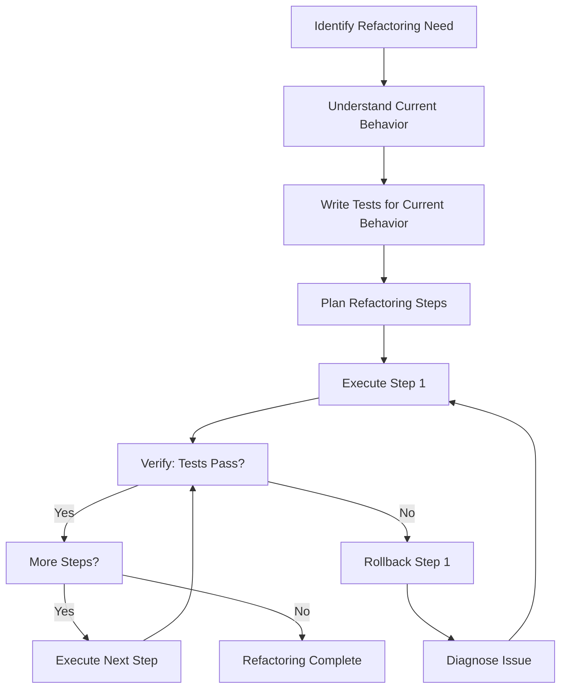
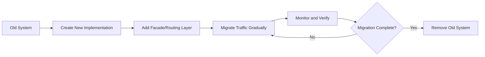
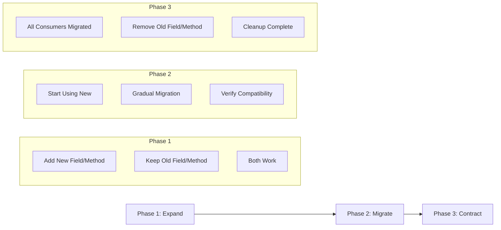

# Safe Refactoring Patterns

## Overview

Safe refactoring is the practice of modifying existing code without breaking functionality. This skill teaches patterns and protocols for making changes to production codebases safely, focusing on "brownfield" development where existing systems must remain operational while improvements are made.

**When to use this skill:** When modifying, improving, or restructuring existing code that is currently in use or production.

## Table of Contents

1. [Refactoring Safety Principles](#refactoring-safety-principles)
2. [The Strangler Fig Pattern](#the-strangler-fig-pattern)
3. [The Parallel Change Pattern](#the-parallel-change-pattern)
4. [Verification Between Changes](#verification-between-changes)
5. [Refactoring Checklist](#refactoring-checklist)
6. [Common Refactoring Scenarios](#common-refactoring-scenarios)
7. [Quick Reference](#quick-reference)

---

## Refactoring Safety Principles

### Core Principles

1. **Never Break What Works** - Existing functionality must remain intact
2. **Change in Small Steps** - Each change should be independently verifiable
3. **Verify After Each Step** - Run tests and checks before proceeding
4. **Maintain Backward Compatibility** - Don't break existing consumers
5. **Have a Rollback Plan** - Know how to revert if something goes wrong
6. **Document the Change** - Explain why and what was changed

### The Safety Protocol



### Pre-Refactoring Checklist

```markdown
## Pre-Refactoring Checklist

### Understanding
- [ ] I understand what the current code does
- [ ] I understand why it was written this way
- [ ] I know who/what depends on this code
- [ ] I have identified all entry points and side effects

### Safety
- [ ] Tests exist for current behavior
- [ ] If no tests, I will add tests first
- [ ] I know how to rollback changes
- [ ] I have a backup/branch of working code

### Planning
- [ ] Refactoring is broken into small steps
- [ ] Each step can be verified independently
- [ ] Dependencies between steps are understood
- [ ] Time estimate includes testing and verification
```

---

## The Strangler Fig Pattern

### Concept

The Strangler Fig pattern involves gradually replacing an old system by building new functionality alongside it, then migrating usage incrementally. The old system is "strangled" piece by piece until it can be completely removed.

### When to Use

- Replacing legacy systems
- Major architectural changes
- Migrating between frameworks/libraries
- When a complete rewrite is too risky

### Implementation Steps



### Step-by-Step Process

#### Step 1: Create New Implementation

```javascript
// OLD: Legacy user service
class LegacyUserService {
  async getUser(id) {
    // Old implementation
    return database.query('SELECT * FROM users WHERE id = ?', [id]);
  }
}

// NEW: Modern user service
class ModernUserService {
  async getUser(id) {
    // New implementation with better structure
    const user = await this.userRepository.findById(id);
    return this.userMapper.toDTO(user);
  }
}
```

#### Step 2: Add Facade/Routing Layer

```javascript
// Facade that routes between old and new
class UserServiceFacade {
  constructor(legacyService, modernService) {
    this.legacyService = legacyService;
    this.modernService = modernService;
    this.useModern = false; // Feature flag
  }

  async getUser(id) {
    if (this.useModern) {
      return this.modernService.getUser(id);
    }
    return this.legacyService.getUser(id);
  }

  setUseModern(useModern) {
    this.useModern = useModern;
  }
}
```

#### Step 3: Migrate Traffic Gradually

```javascript
// Gradual migration strategy
async function migrateUsers() {
  const facade = new UserServiceFacade(legacyService, modernService);
  const migratedUserIds = new Set();

  // Migrate users incrementally
  for (const userId of allUsers) {
    // Test with new implementation
    const legacyResult = await facade.legacyService.getUser(userId);
    const modernResult = await facade.modernService.getUser(userId);

    // Verify results match
    if (resultsMatch(legacyResult, modernResult)) {
      migratedUserIds.add(userId);
      facade.setUseModern(userId, true);
    } else {
      // Log discrepancy for investigation
      logMismatch(userId, legacyResult, modernResult);
    }
  }

  return migratedUserIds;
}
```

#### Step 4: Monitor and Verify

```javascript
// Monitoring during migration
class MigrationMonitor {
  constructor() {
    this.metrics = {
      totalRequests: 0,
      modernRequests: 0,
      legacyRequests: 0,
      errors: 0,
      mismatches: 0
    };
  }

  trackRequest(userId, usedModern, error, mismatch) {
    this.metrics.totalRequests++;
    if (usedModern) this.metrics.modernRequests++;
    else this.metrics.legacyRequests++;
    if (error) this.metrics.errors++;
    if (mismatch) this.metrics.mismatches++;
  }

  getMetrics() {
    return {
      ...this.metrics,
      modernPercentage: (this.metrics.modernRequests / this.metrics.totalRequests * 100).toFixed(2),
      errorRate: (this.metrics.errors / this.metrics.totalRequests * 100).toFixed(2)
    };
  }
}
```

#### Step 5: Remove Old System

```javascript
// Once migration is complete and verified
async function completeMigration() {
  const metrics = monitor.getMetrics();

  // Verify migration success
  if (metrics.modernPercentage >= 99.9 && metrics.errorRate < 0.01) {
    // Remove old implementation
    delete this.legacyService;
    // Remove facade, use modern directly
    this.userService = this.modernService;
    console.log('Migration complete: old system removed');
  } else {
    console.warn('Migration not complete:', metrics);
  }
}
```

### Strangler Fig Example: API Migration

```typescript
// OLD: Express API
app.get('/api/users/:id', async (req, res) => {
  const user = await legacyDb.query('SELECT * FROM users WHERE id = ?', [req.params.id]);
  res.json(user[0]);
});

// NEW: Fastify API
fastify.get('/api/users/:id', async (request, reply) => {
  const user = await userRepository.findById(request.params.id);
  return userMapper.toDTO(user);
});

// FACADE: Routing layer
app.use('/api/*', async (req, res, next) => {
  if (useFastify && isMigratedRoute(req.path)) {
    // Proxy to Fastify
    const response = await fastify.inject({
      method: req.method,
      url: req.url,
      headers: req.headers,
      body: req.body
    });
    res.status(response.statusCode).send(response.json());
  } else {
    next(); // Use Express
  }
});
```

---

## The Parallel Change Pattern

### Concept

The Parallel Change pattern involves making changes in three phases: expand, migrate, contract. This ensures backward compatibility while allowing safe evolution of APIs and data structures.

### Three Phases



### Phase 1: Expand

**Goal:** Add new functionality while keeping old functionality working.

```javascript
// BEFORE: Old API
class UserService {
  async getUser(id) {
    return database.query('SELECT * FROM users WHERE id = ?', [id]);
  }
}

// AFTER PHASE 1: Both old and new
class UserService {
  // OLD: Still works
  async getUser(id) {
    return database.query('SELECT * FROM users WHERE id = ?', [id]);
  }

  // NEW: Added, but not used yet
  async getUserById(id) {
    const user = await this.userRepository.findById(id);
    return this.userMapper.toDTO(user);
  }
}
```

**Verification after Phase 1:**
```javascript
// Verify old functionality still works
describe('UserService - Phase 1', () => {
  it('old getUser method still works', async () => {
    const user = await userService.getUser(1);
    expect(user).toBeDefined();
    expect(user.id).toBe(1);
  });

  it('new getUserById method works', async () => {
    const user = await userService.getUserById(1);
    expect(user).toBeDefined();
    expect(user.id).toBe(1);
  });

  it('both methods return equivalent results', async () => {
    const oldUser = await userService.getUser(1);
    const newUser = await userService.getUserById(1);
    expect(oldUser).toEqual(newUser);
  });
});
```

### Phase 2: Migrate

**Goal:** Gradually switch consumers to use the new implementation.

```javascript
// Migrate consumers one at a time
class UserController {
  // Consumer 1: Still using old
  async getOldWay(req, res) {
    const user = await userService.getUser(req.params.id);
    res.json(user);
  }

  // Consumer 2: Using new
  async getNewWay(req, res) {
    const user = await userService.getUserById(req.params.id);
    res.json(user);
  }
}

// Feature flag for gradual rollout
const useNewMethod = process.env.USE_NEW_USER_METHOD === 'true';

class UserController {
  async getUser(req, res) {
    const user = useNewMethod
      ? await userService.getUserById(req.params.id)
      : await userService.getUser(req.params.id);
    res.json(user);
  }
}
```

**Migration tracking:**
```javascript
class MigrationTracker {
  constructor() {
    this.migratedConsumers = new Set();
  }

  markMigrated(consumerId) {
    this.migratedConsumers.add(consumerId);
  }

  isMigrated(consumerId) {
    return this.migratedConsumers.has(consumerId);
  }

  getMigrationProgress(totalConsumers) {
    return {
      migrated: this.migratedConsumers.size,
      total: totalConsumers,
      percentage: (this.migratedConsumers.size / totalConsumers * 100).toFixed(2)
    };
  }
}
```

**Verification after Phase 2:**
```javascript
// Verify migration is working
describe('UserService - Phase 2', () => {
  it('migrated consumers use new method', async () => {
    const result = await userController.getNewWay({ params: { id: 1 } });
    expect(result).toBeDefined();
  });

  it('non-migrated consumers still work', async () => {
    const result = await userController.getOldWay({ params: { id: 1 } });
    expect(result).toBeDefined();
  });

  it('both methods produce same output', async () => {
    const oldResult = await userController.getOldWay({ params: { id: 1 } });
    const newResult = await userController.getNewWay({ params: { id: 1 } });
    expect(oldResult.body).toEqual(newResult.body);
  });
});
```

### Phase 3: Contract

**Goal:** Remove old functionality once all consumers are migrated.

```javascript
// BEFORE PHASE 3: Both methods exist
class UserService {
  async getUser(id) { /* old */ }
  async getUserById(id) { /* new */ }
}

// AFTER PHASE 3: Only new method
class UserService {
  async getUserById(id) {
    const user = await this.userRepository.findById(id);
    return this.userMapper.toDTO(user);
  }

  // Old method removed
  // async getUser(id) { ... }
}
```

**Pre-removal checklist:**
```markdown
## Phase 3: Pre-Removal Checklist

### Migration Status
- [ ] All consumers have been migrated
- [ ] No references to old method in codebase
- [ ] No external API dependencies on old method
- [ ] Documentation has been updated

### Testing
- [ ] All tests pass with new method only
- [ ] Integration tests verify new behavior
- [ ] Load tests perform as expected
- [ ] No performance regression

### Safety
- [ ] Rollback plan documented
- [ ] Monitoring in place
- [ ] Team notified of breaking change
- [ ] Version bumped (if API)
```

---

## Verification Between Changes

### The Verification Protocol

**CRITICAL:** Run verification tests AFTER EACH change, not just at the end.

### Verification Types

#### 1. Unit Verification

```javascript
// Test that individual components still work
describe('Post-refactoring unit tests', () => {
  it('calculates tax correctly', () => {
    const result = calculateTax(100, 0.1);
    expect(result).toBe(10);
  });

  it('validates email correctly', () => {
    const result = validateEmail('test@example.com');
    expect(result).toBe(true);
  });
});
```

#### 2. Integration Verification

```javascript
// Test that components work together
describe('Post-refactoring integration tests', () => {
  it('user can complete checkout flow', async () => {
    const user = await createUser();
    const cart = await addToCart(user.id, product);
    const order = await checkout(user.id, cart.id);
    expect(order.status).toBe('completed');
  });
});
```

#### 3. Regression Verification

```javascript
// Test that old functionality still works
describe('Post-refactoring regression tests', () => {
  it('legacy API endpoint still returns expected format', async () => {
    const response = await request(app).get('/api/v1/users/1');
    expect(response.status).toBe(200);
    expect(response.body).toHaveProperty('id');
    expect(response.body).toHaveProperty('name');
  });
});
```

#### 4. Performance Verification

```javascript
// Test that performance hasn't degraded
describe('Post-refactoring performance tests', () => {
  it('response time is within acceptable range', async () => {
    const start = Date.now();
    await userService.getUser(1);
    const duration = Date.now() - start;
    expect(duration).toBeLessThan(100); // 100ms threshold
  });
});
```

### Automated Verification Script

```bash
#!/bin/bash
# verify.sh - Run after each refactoring step

echo "=== Running Post-Refactoring Verification ==="

# Step 1: Unit tests
echo "1. Running unit tests..."
npm run test:unit
if [ $? -ne 0 ]; then
  echo "❌ Unit tests failed!"
  exit 1
fi
echo "✅ Unit tests passed"

# Step 2: Integration tests
echo "2. Running integration tests..."
npm run test:integration
if [ $? -ne 0 ]; then
  echo "❌ Integration tests failed!"
  exit 1
fi
echo "✅ Integration tests passed"

# Step 3: Linting
echo "3. Running linter..."
npm run lint
if [ $? -ne 0 ]; then
  echo "❌ Linting failed!"
  exit 1
fi
echo "✅ Linting passed"

# Step 4: Type checking (if TypeScript)
echo "4. Running type check..."
npm run type-check
if [ $? -ne 0 ]; then
  echo "❌ Type check failed!"
  exit 1
fi
echo "✅ Type check passed"

# Step 5: Build
echo "5. Running build..."
npm run build
if [ $? -ne 0 ]; then
  echo "❌ Build failed!"
  exit 1
fi
echo "✅ Build passed"

echo "=== All Verifications Passed! ==="
```

### Manual Verification Checklist

```markdown
## Manual Verification Checklist

After each refactoring step:

### Functionality
- [ ] Core features work as expected
- [ ] Edge cases handled correctly
- [ ] Error messages are appropriate
- [ ] User experience unchanged (unless intentional)

### Data Integrity
- [ ] No data corruption
- [ ] No data loss
- [ ] Data relationships maintained
- [ ] Database constraints satisfied

### Performance
- [ ] Response times acceptable
- [ ] No memory leaks
- [ ] CPU usage normal
- [ ] Database queries efficient

### Compatibility
- [ ] Backward compatibility maintained
- [ ] API contracts unchanged (unless in Phase 3)
- [ ] External integrations work
- [ ] Third-party dependencies compatible

### Security
- [ ] Authentication still works
- [ ] Authorization checks in place
- [ ] No new vulnerabilities introduced
- [ ] Sensitive data protected
```

---

## Refactoring Checklist

### Before Starting

```markdown
## Pre-Refactoring Checklist

### Preparation
- [ ] I understand the current code
- [ ] I have identified all dependencies
- [ ] I have written tests for current behavior
- [ ] I have a clear refactoring plan
- [ ] I have estimated the work

### Safety
- [ ] I have a backup/branch
- [ ] I know how to rollback
- [ ] I have notified stakeholders
- [ ] I have scheduled appropriate time

### Environment
- [ ] Development environment is ready
- [ ] Test environment is available
- [ ] CI/CD pipeline is configured
- [ ] Monitoring tools are set up
```

### During Refactoring

```markdown
## During Refactoring Checklist

### Process
- [ ] Changes are made in small steps
- [ ] Each step is verified before proceeding
- [ ] Tests are run after each change
- [ ] Changes are committed frequently

### Quality
- [ ] Code follows style guide
- [ ] Code is readable and maintainable
- [ ] Comments explain "why" not "what"
- [ ] No unnecessary complexity added

### Safety
- [ ] Backward compatibility maintained
- [ ] No breaking changes introduced
- [ ] Error handling preserved
- [ ] Security measures intact
```

### After Refactoring

```markdown
## Post-Refactoring Checklist

### Verification
- [ ] All tests pass
- [ ] Manual testing completed
- [ ] Integration verified
- [ ] Performance validated

### Documentation
- [ ] Code comments updated
- [ ] README updated
- [ ] API documentation updated
- [ ] Changelog updated

### Cleanup
- [ ] Dead code removed
- [ ] Unused dependencies removed
- [ ] Temporary files deleted
- [ ] Debug code removed

### Deployment
- [ ] Code reviewed
- [ ] Approved for merge
- [ ] Deployed to staging
- [ ] Monitored for issues
```

---

## Common Refactoring Scenarios

### Scenario 1: Extracting a Function

**Before:**
```javascript
function processOrder(order) {
  // Calculate tax
  const taxRate = order.state === 'CA' ? 0.08 : 0.05;
  const tax = order.subtotal * taxRate;

  // Calculate discount
  let discount = 0;
  if (order.couponCode) {
    discount = order.subtotal * 0.1;
  }

  // Calculate total
  const total = order.subtotal + tax - discount;

  return { subtotal: order.subtotal, tax, discount, total };
}
```

**Step 1: Extract tax calculation (verify still works)**
```javascript
function calculateTax(subtotal, state) {
  const taxRate = state === 'CA' ? 0.08 : 0.05;
  return subtotal * taxRate;
}

function processOrder(order) {
  const tax = calculateTax(order.subtotal, order.state);

  let discount = 0;
  if (order.couponCode) {
    discount = order.subtotal * 0.1;
  }

  const total = order.subtotal + tax - discount;

  return { subtotal: order.subtotal, tax, discount, total };
}
```

**Step 2: Extract discount calculation (verify still works)**
```javascript
function calculateTax(subtotal, state) {
  const taxRate = state === 'CA' ? 0.08 : 0.05;
  return subtotal * taxRate;
}

function calculateDiscount(subtotal, couponCode) {
  if (!couponCode) return 0;
  return subtotal * 0.1;
}

function processOrder(order) {
  const tax = calculateTax(order.subtotal, order.state);
  const discount = calculateDiscount(order.subtotal, order.couponCode);
  const total = order.subtotal + tax - discount;

  return { subtotal: order.subtotal, tax, discount, total };
}
```

**Step 3: Extract total calculation (verify still works)**
```javascript
function calculateTax(subtotal, state) {
  const taxRate = state === 'CA' ? 0.08 : 0.05;
  return subtotal * taxRate;
}

function calculateDiscount(subtotal, couponCode) {
  if (!couponCode) return 0;
  return subtotal * 0.1;
}

function calculateTotal(subtotal, tax, discount) {
  return subtotal + tax - discount;
}

function processOrder(order) {
  const tax = calculateTax(order.subtotal, order.state);
  const discount = calculateDiscount(order.subtotal, order.couponCode);
  const total = calculateTotal(order.subtotal, tax, discount);

  return { subtotal: order.subtotal, tax, discount, total };
}
```

### Scenario 2: Renaming a Method (Parallel Change)

**Phase 1: Expand**
```javascript
class UserService {
  // Old method (keep working)
  async getUser(id) {
    return database.query('SELECT * FROM users WHERE id = ?', [id]);
  }

  // New method (add, but don't use yet)
  async fetchUser(id) {
    return database.query('SELECT * FROM users WHERE id = ?', [id]);
  }
}
```

**Phase 2: Migrate**
```javascript
// Migrate one consumer at a time
class OrderController {
  // Still using old
  async getOrdersForUser(userId) {
    const user = await userService.getUser(userId);
    // ...
  }
}

class ProfileController {
  // Now using new
  async getProfile(userId) {
    const user = await userService.fetchUser(userId);
    // ...
  }
}
```

**Phase 3: Contract**
```javascript
class UserService {
  // Remove old method
  // async getUser(id) { ... }

  // Only new method remains
  async fetchUser(id) {
    return database.query('SELECT * FROM users WHERE id = ?', [id]);
  }
}
```

### Scenario 3: Changing Data Structure (Strangler Fig)

**Before:**
```javascript
// Old data structure
const user = {
  id: 1,
  name: 'John Doe',
  email: 'john@example.com',
  address: '123 Main St, City, State'
};
```

**Step 1: Add new structure alongside old**
```javascript
// Both structures exist
const user = {
  // Old fields (keep)
  id: 1,
  name: 'John Doe',
  email: 'john@example.com',
  address: '123 Main St, City, State',

  // New fields (add)
  profile: {
    firstName: 'John',
    lastName: 'Doe',
    contact: {
      email: 'john@example.com',
      address: {
        street: '123 Main St',
        city: 'City',
        state: 'State'
      }
    }
  }
};
```

**Step 2: Create migration function**
```javascript
function migrateUserToNewStructure(oldUser) {
  const parts = oldUser.name.split(' ');
  const addressParts = oldUser.address.split(', ');

  return {
    ...oldUser,
    profile: {
      firstName: parts[0],
      lastName: parts[1],
      contact: {
        email: oldUser.email,
        address: {
          street: addressParts[0],
          city: addressParts[1],
          state: addressParts[2]
        }
      }
    }
  };
}
```

**Step 3: Gradually migrate consumers**
```javascript
// Consumer 1: Still using old
function renderUserCard(user) {
  return `<div>${user.name}</div>`;
}

// Consumer 2: Using new
function renderUserProfile(user) {
  return `<div>${user.profile.firstName} ${user.profile.lastName}</div>`;
}
```

**Step 4: Remove old structure**
```javascript
// Final structure
const user = {
  id: 1,
  profile: {
    firstName: 'John',
    lastName: 'Doe',
    contact: {
      email: 'john@example.com',
      address: {
        street: '123 Main St',
        city: 'City',
        state: 'State'
      }
    }
  }
};
```

---

## Quick Reference

### Pattern Selection

| Situation | Recommended Pattern |
|-----------|---------------------|
| Replacing entire system/module | Strangler Fig |
| Changing API method signature | Parallel Change |
| Migrating data structure | Parallel Change |
| Refactoring internal logic | Small steps + verification |
| Multiple consumers affected | Strangler Fig |
| Single consumer affected | Direct refactoring |

### Verification Commands

```bash
# Run all tests
npm test

# Run specific test suite
npm test -- --grep "UserService"

# Run linting
npm run lint

# Type check (TypeScript)
npm run type-check

# Build
npm run build

# Run verification script
./verify.sh
```

### Rollback Commands

```bash
# Undo last commit (keep changes)
git reset --soft HEAD~1

# Undo last commit (discard changes)
git reset --hard HEAD~1

# Revert specific commit
git revert <commit-hash>

# Checkout previous version
git checkout HEAD~1 -- <file>

# Reset to specific commit
git reset --hard <commit-hash>
```

### Git Workflow for Refactoring

```bash
# Create feature branch
git checkout -b refactor/user-service

# Make small change
# ... edit code ...

# Verify change
npm test

# Commit if verification passes
git add .
git commit -m "refactor: extract tax calculation"

# Continue with next change
# ... repeat ...

# When complete, create PR
git push origin refactor/user-service
gh pr create --title "Refactor user service" --body "..."
```

---

## Common Pitfalls

1. **Skipping verification** - Always verify after each change
2. **Making too many changes at once** - Break into small steps
3. **Not having tests** - Write tests before refactoring
4. **Breaking backward compatibility** - Use Parallel Change pattern
5. **No rollback plan** - Always know how to revert
6. **Refactoring without understanding** - Understand before changing
7. **Forgetting to update documentation** - Keep docs in sync
8. **Premature optimization** - Focus on correctness first

## Additional Resources

- [Refactoring Guru](https://refactoring.guru/)
- [Working Effectively with Legacy Code](https://www.amazon.com/Working-Effectively-Legacy-Michael-Feathers/dp/0131177052)
- [Martin Fowler's Refactoring](https://refactoring.com/)
