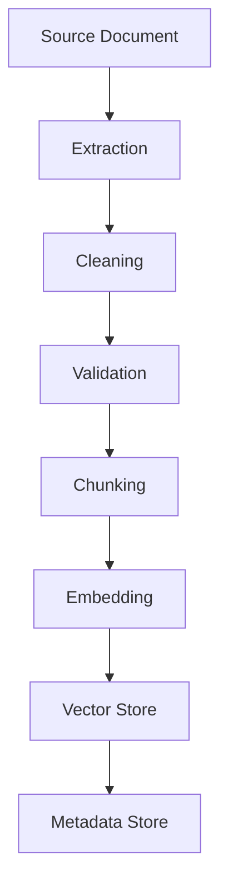

# Document Ingestion Pipeline

## Overview

Document ingestion pipeline covers the complete workflow of processing raw documents from various sources, extracting content, and preparing them for RAG systems. This skill includes source connectors, text extraction, preprocessing, and quality validation.

**When to use this skill:** When building or maintaining document processing pipelines for RAG applications.

## Table of Contents

1. [Pipeline Architecture](#pipeline-architecture)
2. [Source Connectors](#source-connectors)
3. [Text Extraction](#text-extraction)
4. [Data Cleaning](#data-cleaning)
5. [Quality Validation](#quality-validation)
6. [Ingestion Checklist](#ingestion-checklist)
7. [Quick Reference](#quick-reference)

---

## Pipeline Architecture

### Pipeline Stages



### Component Design

```yaml
# Pipeline components
components:
  # Source connectors
  pdf_loader:
      module: document_loaders.pdf
      config:
        max_file_size: 100MB
        ocr_enabled: true
        table_extraction: true
    
  web_crawler:
      module: web_crawlers.playwright
      config:
        max_depth: 3
        follow_links: true
        respect_robots: true
    
  database_loader:
      module: database_connectors.postgres
      config:
        batch_size: 100
      connection_pool_size: 10
  
  # Processing
  text_extractor:
      module: text_extraction.nlp
      config:
        language_detection: true
        entity_extraction: true
        section_detection: true
    
  data_cleaner:
      module: data_cleaning.standard
      config:
        remove_duplicates: true
        normalize_whitespace: true
        fix_encoding: true
  
  validator:
      module: validation.schema_validator
      config:
        schema_path: ./schemas/document_schema.json
        strict_mode: false
  
  # Storage
  chunk_store:
      module: storage.document_store
      config:
        batch_size: 100
        index: document_id
  
  embedding_service:
      module: embedding.openai
      config:
        model: text-embedding-3-small
        batch_size: 100
  
  vector_store:
      module: vector_stores.pinecone
      config:
        index_name: documents
        dimension: 1536
```

---

## Source Connectors

### PDF Processing

```python
# PDF document loader
import PyPDF2
from typing import Dict, List
import io

class PDFLoader:
    def __init__(self, config: dict):
        self.config = config
        self.max_file_size = config.get('max_file_size', 100 * 1024 * 1024)  # 100MB default
    
    async def load(self, file_path: str) -> Dict[str, any]:
        """Load PDF document"""
        # Check file size
        import os
        file_size = os.path.getsize(file_path)
        
        if file_size > self.max_file_size:
            raise ValueError(f"File too large: {file_size} bytes (max: {self.max_file_size})")
        
        # Extract text from PDF
        reader = PyPDF2.PdfReader(file_path)
        text = ""
        
        for page in reader.pages:
            text += page.extract_text()
        
        # Extract metadata
        metadata = {
            'file_path': file_path,
            'file_size': file_size,
            'page_count': len(reader.pages),
            'created_at': datetime.utcnow().isoformat()
        }
        
        return {
            'text': text,
            'metadata': metadata
        }
    
    async def load_with_ocr(self, file_path: str) -> Dict[str, any]:
        """Load PDF with OCR for scanned documents"""
        # Check file size
        import os
        file_size = os.path.getsize(file_path)
        
        if file_size > self.max_file_size:
            raise ValueError(f"File too large: {file_size} bytes (max: {self.max_file_size})")
        
        # Extract images from PDF
        reader = PyPDF2.PdfReader(file_path)
        images = []
        
        for page in reader.pages:
            for image in page.images:
                images.append(image)
        
        # Perform OCR on images
        # This would integrate with OCR service
        # For now, return placeholder
        
        return {
            'text': "OCR text would be here",
            'images': images,
            'metadata': {
                'file_path': file_path,
                'file_size': file_size,
                'page_count': len(reader.pages),
                'created_at': datetime.utcnow().isoformat()
            }
        }
```

### Web Crawling

```python
# Web document crawler
from playwright.async_api import async_playwright
from typing import List

class WebCrawler:
    def __init__(self, config: dict):
        self.config = config
        self.max_depth = config.get('max_depth', 3)
        self.follow_links = config.get('follow_links', True)
        self.respect_robots = config.get('respect_robots', True)
    
    async def crawl(self, url: str) -> Dict[str, any]:
        """Crawl web page"""
        browser = await async_playwright.async_api.async_playwright()
        page = await browser.new_page()
        
        await page.goto(url)
        
        # Wait for page to load
        await page.wait_for_load_state('networkidle')
        
        # Extract text content
        text = await page.inner_text()
        
        # Extract links
        links = await page.locator('a[href^="https?://"]').all()
        link_urls = [await link.get_attribute('href') for link in links]
        
        # Extract metadata
        metadata = {
            'url': url,
            'title': await page.title(),
            'depth': 0,
            'link_count': len(link_urls),
            'created_at': datetime.utcnow().isoformat()
        }
        
        await browser.close()
        
        return {
            'text': text,
            'links': link_urls,
            'metadata': metadata
        }
```

### Database Loading

```python
# Database document loader
import asyncpg
from typing import Dict, List

class DatabaseLoader:
    def __init__(self, config: dict):
        self.config = config
        self.batch_size = config.get('batch_size', 100)
        self.connection_pool_size = config.get('connection_pool_size', 10)
        self.connection_pool = None
    
    async def connect(self):
        """Create connection pool"""
        self.connection_pool = await asyncpg.create_pool(
            minsize=1,
            maxsize=self.connection_pool_size,
            host=self.config['host'],
            database=self.config['database'],
            user=self.config['user'],
            password=self.config['password']
        )
    
    async def load_documents(self, document_ids: List[str]) -> List[Dict[str, any]]:
        """Load documents from database"""
        if not self.connection_pool:
            await self.connect()
        
        async with self.connection_pool.acquire() as conn:
            query = """
                SELECT id, title, content, metadata, created_at, updated_at
                FROM documents
                WHERE id = ANY($1)
            """
            
            result = await conn.fetch(query, document_ids)
        
        return result
```

---

## Text Extraction

### Text Extraction Methods

| Method | Use Case | Pros | Cons |
|--------|---------|------|------|-------|
| **PDF Text Extraction** | PDF documents | Fast, accurate | May miss images |
| **OCR** | Scanned documents | Handles images | Slower, error-prone |
| **Web Scraping** | Web pages | Dynamic content | May miss structured data |
| **Database Export** | Database records | Structured data | May need joins |
| **API Extraction** | API responses | Clean data | Rate limits |

### Text Extraction Implementation

```python
# Text extraction service
class TextExtractionService:
    def __init__(self, extractors: Dict):
        self.extractors = extractors
    
    async def extract(self, source: Dict[str, any]) -> str:
        """Extract text from document source"""
        source_type = source.get('type')
        
        if source_type == 'pdf':
            return await self._extract_from_pdf(source)
        elif source_type == 'web':
            return await self._extract_from_web(source)
        elif source_type == 'database':
            return source.get('text', '')
        else:
            raise ValueError(f"Unsupported source type: {source_type}")
    
    async def _extract_from_pdf(self, source: Dict[str, any]) -> str:
        """Extract text from PDF source"""
        loader = PDFLoader(self.config.get('pdf', {}))
        result = await loader.load(source['path'])
        
        return result['text']
    
    async def _extract_from_web(self, source: Dict[str, any]) -> str:
        """Extract text from web source"""
        crawler = WebCrawler(self.config.get('web', {}))
        result = await crawler.crawl(source['url'])
        
        return result['text']
```

---

## Data Cleaning

### Cleaning Operations

```python
# Data cleaning operations
class DataCleaner:
    def __init__(self, config: Dict):
        self.config = config
    
    def clean_text(self, text: str) -> str:
        """Clean extracted text"""
        # Remove extra whitespace
        text = ' '.join(text.split())
        
        # Normalize line endings
        text = text.replace('\r\n', '\n')
        
        # Remove special characters
        import re
        text = re.sub(r'[\x00-\x1F]+', '', text)
        
        # Remove control characters
        text = re.sub(r'[\x00-\x08-\x0B]+', '', text)
        
        return text
    
    def remove_duplicates(self, documents: List[Dict[str, any]]) -> List[Dict[str, any]]:
        """Remove duplicate documents"""
        seen = set()
        unique_documents = []
        
        for doc in documents:
            doc_hash = self._hash_document(doc)
            
            if doc_hash not in seen:
                unique_documents.append(doc)
                seen.add(doc_hash)
        
        return unique_documents
    
    def normalize_whitespace(self, text: str) -> str:
        """Normalize whitespace in text"""
        # Replace multiple spaces with single space
        import re
        text = re.sub(r' +', ' ', text)
        
        # Normalize tabs to spaces
        text = text.replace('\t', '    ')
        
        return text
    
    def _hash_document(self, doc: Dict[str, any]) -> str:
        """Generate document hash"""
        content = doc.get('text', '')
        return hash(content)
```

### Quality Validation

```python
# Quality validation
class QualityValidator:
    def __init__(self, config: Dict):
        self.config = config
        self.min_length = config.get('min_length', 100)
        self.max_length = config.get('max_length', 100000)
        self.min_quality_score = config.get('min_quality', 0.7)
    
    def validate_text(self, text: str) -> Dict[str, any]:
        """Validate text quality"""
        issues = []
        
        # Check length
        text_length = len(text)
        if text_length < self.min_length:
            issues.append({
                'type': 'length',
                'severity': 'warning',
                'message': f"Text too short: {text_length} chars (minimum: {self.min_length})"
            })
        elif text_length > self.max_length:
            issues.append({
                'type': 'length',
                'severity': 'warning',
                'message': f"Text too long: {text_length} chars (maximum: {self.max_length})"
            })
        
        # Check for special characters
        import re
        if re.search(r'[\x00-\x1F]+', text):
            issues.append({
                'type': 'special_characters',
                'severity': 'warning',
                'message': 'Text contains special characters'
            })
        
        # Check for control characters
        if re.search(r'[\x00-\x08-\x0B]+', text):
            issues.append({
                'type': 'control_characters',
                'severity': 'warning',
                'message': 'Text contains control characters'
            })
        
        # Check quality score
        quality_score = self._calculate_quality_score(text, issues)
        
        return {
            'text': text,
            'issues': issues,
            'quality_score': quality_score,
            'passes_validation': quality_score >= self.min_quality_score
        }
    
    def _calculate_quality_score(self, text: str, issues: List[Dict]) -> float:
        """Calculate quality score"""
        base_score = 1.0
        
        for issue in issues:
            if issue['severity'] == 'error':
                base_score -= 0.3
            elif issue['severity'] == 'warning':
                base_score -= 0.1
        
        return max(0.0, base_score)
```

---

## Ingestion Checklist

### Source Validation

```markdown
## Source Validation Checklist

### File Checks
- [ ] File exists
- [ ] File is accessible
- [ ] File size within limits
- [ ] File format supported
- [ ] File not corrupted

### Content Checks
- [ ] Text extracted successfully
- [ ] Content is not empty
- [ ] Content is readable
- [ ] Content is not garbage
```

### Processing Checks

```markdown
## Processing Checklist

### Data Cleaning
- [ ] Whitespace normalized
- [ ] Duplicates removed
- [ ] Special characters removed
- [ ] Line endings normalized
- [ ] Encoding fixed

### Validation
- [ ] Length requirements met
- [ ] Quality score acceptable
- [ ] No critical issues found
- [ ] Metadata extracted
- [ ] Links extracted (for web sources)
```

### Storage Checks

```markdown
## Storage Checklist

### Document Storage
- [ ] Document stored in document store
- [ ] Metadata indexed
- [ ] Links to chunks created
- [ ] Access controls applied
- [ ] Backup created

### Quality Checks
- [ ] Quality metrics recorded
- [ ] Validation results logged
- [ ] Processing time tracked
- [ ] Error handling tested
```

---

## Quick Reference

### Pipeline Operations

```python
# Pipeline operations
class IngestionPipeline:
    def __init__(self, config: Dict):
        self.config = config
        self.source_connectors = SourceConnectors(config.get('sources', {}))
        self.text_extractor = TextExtractionService(config.get('extraction', {}))
        self.data_cleaner = DataCleaner(config.get('cleaning', {}))
        self.validator = QualityValidator(config.get('validation', {}))
    
    async def ingest_document(self, source: Dict[str, any]) -> Dict[str, any]:
        """Ingest a single document"""
        # Extract text
        extracted = await self.text_extractor.extract(source)
        
        # Clean text
        cleaned = self.data_cleaner.clean_text(extracted['text'])
        
        # Validate quality
        validated = self.validator.validate_text(cleaned)
        
        # Store document
        document_id = await self._store_document(source, cleaned, validated)
        
        return {
            'document_id': document_id,
            'extraction': extracted,
            'cleaning': cleaned,
            'validation': validated,
            'status': 'success'
        }
    
    async def ingest_batch(self, sources: List[Dict[str, any]]) -> List[Dict[str, any]]:
        """Ingest multiple documents"""
        results = []
        
        for source in sources:
            try:
                result = await self.ingest_document(source)
                results.append(result)
            except Exception as e:
                results.append({
                    'source': source,
                    'status': 'error',
                    'error': str(e)
                })
        
        return results
    
    async def _store_document(self, source: Dict[str, any], text: str, validated: Dict[str, any]) -> str:
        """Store document in document store"""
        # This would store in document database
        import uuid
        document_id = str(uuid.uuid4())
        
        # Store document
        # await self.document_store.create({
        #     'id': document_id,
        #     'source': source,
        #     'text': text,
        #     'metadata': validated['metadata'],
        #     'created_at': datetime.utcnow().isoformat()
        # })
        
        return document_id
```

### Error Handling

```python
# Error handling
class ErrorHandler:
    def __init__(self):
        pass
    
    def handle_extraction_error(self, source: Dict[str, any], error: Exception) -> Dict[str, any]:
        """Handle extraction errors"""
        return {
            'source': source,
            'status': 'error',
            'error': str(error),
            'retry_count': source.get('retry_count', 0) + 1,
            'created_at': datetime.utcnow().isoformat()
        }
    
    def handle_validation_error(self, document_id: str, error: Exception) -> Dict[str, any]:
        """Handle validation errors"""
        return {
            'document_id': document_id,
            'status': 'error',
            'error': str(error),
            'created_at': datetime.utcnow().isoformat()
        }
    
    def should_retry(self, error: Dict[str, any]) -> bool:
        """Determine if error should trigger retry"""
        retry_count = error.get('retry_count', 0)
        max_retries = 3
        
        if retry_count < max_retries:
            return True
        
        return False
```

### Monitoring

```python
# Pipeline monitoring
class PipelineMonitor:
    def __init__(self):
        self.metrics = {
            'documents_processed': 0,
            'documents_failed': 0,
            'total_chars_processed': 0,
            'processing_time_ms': 0,
            'errors': []
        }
    
    def record_success(self, document_id: str):
        """Record successful processing"""
        self.metrics['documents_processed'] += 1
        self.metrics['documents_failed'] += 0
    
    def record_error(self, error: str):
        """Record processing error"""
        self.metrics['errors'].append({
            'error': error,
            'timestamp': datetime.utcnow().isoformat()
        })
        self.metrics['documents_failed'] += 1
    
    def get_metrics(self) -> Dict[str, any]:
        """Get pipeline metrics"""
        return self.metrics
```

---

## Common Pitfalls

1. **No validation** - Always validate extracted content before storage
2. **Poor error handling** - Implement retry logic and monitoring
3. **No monitoring** - Track metrics and performance
4. **Ignoring quality** - Quality checks prevent bad data
5. **No deduplication** - Duplicate documents waste storage
6. **No source tracking** - Track document sources for debugging
7. **No metadata** - Metadata is crucial for retrieval
8. **No async processing** - Synchronous processing blocks pipeline

## Related Skills

- [`07-document-processing/document-parsing`](07-document-processing/document-parsing/SKILL.md)
- [`07-document-processing/image-preprocessing`](07-document-processing/image-preprocessing/SKILL.md)
- [`07-document-processing/ocr-paddleocr`](07-document-processing/ocr-paddleocr/SKILL.md)
- [`07-document-processing/ocr-tesseract`](07-document-processing/ocr-tesseract/SKILL.md)
- [`07-document-processing/pdf-processing`](07-document-processing/pdf-processing/SKILL.md)
- [`06-ai-ml-production/rag-implementation`](06-ai-ml-production/rag-implementation/SKILL.md)
- [`06-ai-ml-production/embedding-models`](06-ai-ml-production/embedding-models/SKILL.md)
- [`04-database/database-connections`](04-database/database-connections/SKILL.md)

## Additional Resources

- [Document Processing Libraries](https://python.langchain.com/docs/modules/data_connection/document_loaders/)
- [PyPDF2 Documentation](https://pypdf2.readthedocs.io/)
- [Playwright Documentation](https://playwright.dev/python/)
- [Data Cleaning Best Practices](https://towardsdatascience.com/data-cleaning/)
