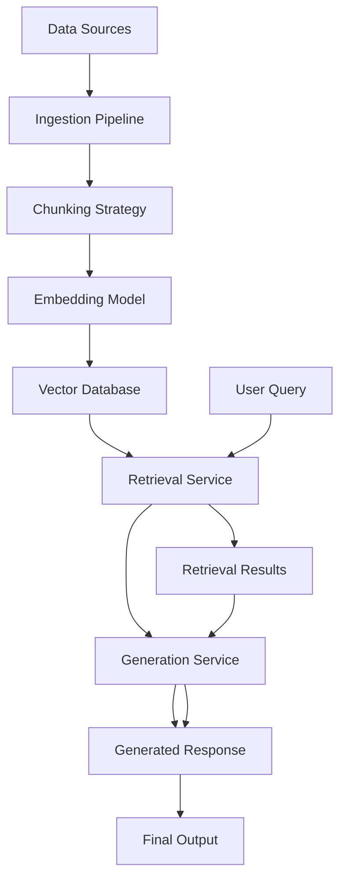
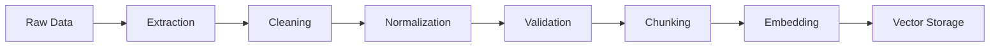

# RAG Architecture Patterns

## Overview

RAG (Retrieval-Augmented Generation) architecture patterns cover the system design for building efficient, scalable, and accurate RAG systems. This skill covers data ingestion, chunking strategies, embedding models, vector databases, retrieval optimization, and generation orchestration.

**When to use this skill:** When designing or implementing RAG systems for production applications.

## Table of Contents

1. [RAG System Architecture](#rag-system-architecture)
2. [Data Ingestion Pipeline](#data-ingestion-pipeline)
3. [Chunking Strategies](#chunking-strategies)
4. [Embedding Models](#embedding-models)
5. [Vector Database Selection](#vector-database-selection)
6. [Retrieval Optimization](#retrieval-optimization)
7. [Generation Orchestration](#generation-orchestration)
8. [RAG Checklist](#rag-checklist)
9. [Quick Reference](#quick-reference)

---

## RAG System Architecture

### Core Components



### Architecture Patterns

| Pattern | Description | Use Case |
|---------|-------------|----------|
| **Naive RAG** | Simple retrieval without optimization | Quick prototypes, small datasets |
| **Advanced RAG** | Reranking, fusion, hybrid search | Production systems, high accuracy |
| **Agentic RAG** | Agents for retrieval and reasoning | Complex queries, multi-step tasks |
| **Graph RAG** | Knowledge graph-based retrieval | Structured data, relationship queries |
| **Modular RAG** | Separate retrieval and generation services | Scalable systems, independent scaling |

### System Components

```yaml
# RAG system components
components:
  # Data Layer
  data_ingestion:
      - document_loaders
      - text_extractors
      - data_cleaners
  
  # Processing Layer
  chunking:
      - semantic_chunker
      - fixed_size_chunker
      - recursive_chunker
  embedding:
      - text_embedding_model
      - embedding_cache
      - batch_processor
  
  # Storage Layer
  vector_database:
      - vector_store
      - metadata_store
      - index_manager
  
  # Retrieval Layer
  retrieval:
      - similarity_search
      - hybrid_search
      - reranker
      - query_expander
  
  # Generation Layer
  generation:
      - prompt_builder
      - llm_client
      - response_formatter
      - citation_generator
```

---

## Data Ingestion Pipeline

### Ingestion Workflow



### Document Processing

```python
# Document ingestion pipeline
class DocumentIngestor:
    def __init__(self, loader, chunker, embedder):
        self.loader = loader
        self.chunker = chunker
        self.embedder = embedder
    
    async def ingest(self, documents):
        """Ingest documents into RAG system"""
        results = []
        for doc in documents:
            # Extract text
            text = await self.loader.extract(doc)
            
            # Clean and normalize
            text = self.cleaner.normalize(text)
            
            # Chunk document
            chunks = await self.chunker.chunk(text)
            
            # Generate embeddings
            embeddings = await self.embedder.embed_batch(chunks)
            
            # Store in vector database
            await self.vector_store.store(chunks, embeddings)
            
            results.append({
                'doc_id': doc.id,
                'chunk_count': len(chunks)
                'status': 'success'
            })
        
        return results
```

### Data Quality Checks

```markdown
## Data Quality Checklist

### Pre-Ingestion
- [ ] Document format validated
- [ ] Encoding detected and handled
- [ ] File size within limits
- [ ] Content type identified
- [ ] Language detected

### During Ingestion
- [ ] Text extraction complete
- [ ] Special characters handled
- [ ] Whitespace normalized
- [ ] Duplicates removed
- [ ] Metadata extracted

### Post-Ingestion
- [ ] Chunks stored successfully
- [ ] Embeddings generated
- [ ] Vector index updated
- [ ] Error logs reviewed
- [ ] Quality metrics calculated
```

---

## Chunking Strategies

### Chunking Approaches

| Strategy | Description | Pros | Cons |
|----------|-------------|------|-------|
| **Fixed Size** | Fixed character/token count | Simple, predictable | May break context |
| **Semantic** | Split by paragraphs/sentences | Preserves meaning | Variable chunk sizes |
| **Recursive** | Hierarchical splitting | Maintains structure | Complex to implement |
| **Sliding Window** | Overlapping chunks | Maintains context | More storage |
| **Hybrid** | Combine multiple approaches | Best of both worlds | More complex |

### Chunk Size Guidelines

```python
# Chunk size optimization
CHUNK_SIZES = {
    'small': {
        'max_chars': 500,
        'max_tokens': 150,
        'overlap': 50,
        'use_case': 'Quick queries, low latency'
    },
    'medium': {
        'max_chars': 1000,
        'max_tokens': 300,
        'overlap': 100,
        'use_case': 'Balanced retrieval and context'
    },
    'large': {
        'max_chars': 2000,
        'max_tokens': 500,
        'overlap': 200,
        'use_case': 'Complex queries, full context'
    }
}

def get_chunk_size_for_model(model_name: str) -> dict:
    """Get optimal chunk size for model"""
    model_sizes = {
        'gpt-3.5-turbo': CHUNK_SIZES['small'],
        'gpt-4': CHUNK_SIZES['medium'],
        'claude-3': CHUNK_SIZES['large']
    }
    return model_sizes.get(model_name, CHUNK_SIZES['medium'])
```

### Semantic Chunking

```python
# Semantic chunking with NLP
import nltk
from typing import List

class SemanticChunker:
    def __init__(self, max_chunk_size: int = 1000):
        self.max_chunk_size = max_chunk_size
        self.sent_detector = nltk.load('tokenizers/punkt/english.pickle')
    
    def chunk(self, text: str) -> List[str]:
        """Split text into semantic chunks"""
        sentences = self.sent_detector.tokenize(text)
        chunks = []
        current_chunk = ""
        
        for sentence in sentences:
            if len(current_chunk) + len(sentence) < self.max_chunk_size:
                current_chunk += " " + sentence
            else:
                chunks.append(current_chunk.strip())
                current_chunk = sentence
        
        if current_chunk:
            chunks.append(current_chunk.strip())
        
        return chunks
```

---

## Embedding Models

### Model Selection Criteria

| Factor | Consideration | Options |
|---------|---------------|--------|
| **Dimensionality** | 384, 768, 1024, 1536 | Higher = more info, more storage |
| **Performance** | Inference speed, batch size | Faster = lower latency |
| **Cost** | API pricing per token | Balance quality vs cost |
| **Language Support** | Multilingual models | Match content language |
| **Domain** | General vs specialized | Domain-specific for better results |

### Popular Embedding Models

| Model | Dimensions | Cost | Best For |
|-------|-----------|------|----------|
| **OpenAI text-embedding-3-small** | 1536 | $$ | General text |
| **OpenAI text-embedding-3-large** | 3072 | $$$ | Complex documents |
| **Cohere embed-v3** | 1024 | $ | Multilingual |
| **HuggingFace all-MiniLM-L6-v2** | 384 | Free | General purpose |
| **E5-large-v2** | 1024 | Free | English text |

### Embedding Best Practices

```python
# Embedding optimization
import asyncio
from typing import List

class EmbeddingService:
    def __init__(self, model, batch_size: int = 100):
        self.model = model
        self.batch_size = batch_size
        self.cache = {}
    
    async def embed_batch(self, texts: List[str]) -> List[List[float]]:
        """Batch embedding with caching"""
        # Check cache first
        uncached_texts = [t for t in texts if t not in self.cache]
        
        if uncached_texts:
            # Batch embed uncached texts
            embeddings = await self.model.embed(uncached_texts)
            
            # Cache results
            for text, emb in zip(uncached_texts, embeddings):
                self.cache[text] = emb
        
        # Return all embeddings in order
        return [self.cache.get(t) for t in texts]
    
    async def embed_with_retry(self, text: str, max_retries: int = 3) -> List[float]:
        """Embed with retry logic"""
        for attempt in range(max_retries):
            try:
                return await self.model.embed(text)
            except Exception as e:
                if attempt == max_retries - 1:
                    raise e
                await asyncio.sleep(2 ** attempt)  # Exponential backoff
```

---

## Vector Database Selection

### Database Comparison

| Database | Best For | Scaling | Cost | Features |
|-----------|----------|--------|------|----------|
| **Pinecone** | Production apps | Managed | $ | Serverless, easy setup |
| **Qdrant** | Large datasets | Self-hosted | $ | Advanced filtering |
| **Weaviate** | Enterprise | Self-hosted | $$ | Modular, hybrid search |
| **Chroma** | Small apps | Self-hosted | Free | Open source, easy local |
| **pgvector** | PostgreSQL users | Self-hosted | $ | SQL-based, familiar |
| **Milvus** | Production | Managed | $ | Advanced search, filtering |

### Vector Database Configuration

```python
# Vector database configuration
VECTOR_DB_CONFIG = {
    'pinecone': {
        'index_type': 'hnsw',  # Hierarchical Navigable Small World
        'metric': 'cosine',
        'dimension': 1536,
        'pods': 1,  # Number of replicas
        'replicas': 2,  # Replicas per pod
        'environment': 'us-west-2'
    },
    'qdrant': {
        'distance': 'cosine',
        'vector_params': {
            'm': 16,
            'ef_construction': None
        },
        'hnsw_config': {
            'ef': 128,
            'm': 16
        }
    },
    'weaviate': {
        'vectorizer': 'text2vec-openai',
        'module_config': {
            'min_distance': 0.25,
            'vector_cache_max_objects': 1000000000
        }
    }
}
```

---

## Retrieval Optimization

### Retrieval Strategies

| Strategy | Description | Implementation |
|----------|-------------|----------------|
| **Dense Retrieval** | Vector similarity search | Fast, semantic |
| **Sparse Retrieval** | Keyword/BM25 search | Exact matches, fast |
| **Hybrid Retrieval** | Combine dense + sparse | Best of both |
| **Reranking** | Re-score retrieved results | Higher accuracy |
| **Query Expansion** | Expand with synonyms | Better recall |
| **Filtering** | Pre-filter by metadata | Faster, more relevant |

### Hybrid Search Implementation

```python
# Hybrid search implementation
class HybridRetriever:
    def __init__(self, vector_db, keyword_index):
        self.vector_db = vector_db
        self.keyword_index = keyword_index
    
    async def retrieve(self, query: str, top_k: int = 10) -> List[dict]:
        """Hybrid retrieval combining vector and keyword search"""
        # Vector search
        vector_results = await self.vector_db.search(
            query_vector=await self.embed(query),
            top_k=top_k * 2  # Get more for reranking
        )
        
        # Keyword search
        keyword_results = await self.keyword_index.search(
            query=query,
            top_k=top_k * 2
        )
        
        # Combine and deduplicate
        combined = self._combine_results(vector_results, keyword_results)
        
        # Rerank combined results
        reranked = self._rerank(query, combined)
        
        return reranked[:top_k]
    
    def _combine_results(self, vector_results, keyword_results):
        """Combine and deduplicate results"""
        seen = set()
        combined = []
        
        for result in vector_results + keyword_results:
            if result['id'] not in seen:
                combined.append(result)
                seen.add(result['id'])
        
        return combined
    
    def _rerank(self, query: str, results: List[dict]) -> List[dict]:
        """Rerank results based on query relevance"""
        scored = []
        for result in results:
            # Calculate relevance score
            score = self._calculate_relevance(query, result)
            scored.append({**result, 'score': score})
        
        # Sort by score
        scored.sort(key=lambda x: x['score'], reverse=True)
        return scored
```

---

## Generation Orchestration

### Prompt Construction

```python
# RAG prompt construction
class PromptBuilder:
    def __init__(self, template: str = None):
        self.template = template or self._default_template()
    
    def _default_template(self) -> str:
        """Default RAG prompt template"""
        return """Answer the question based on the following context:

{context}

Question: {question}

Instructions:
- Use only the provided context to answer the question
- If the answer is not in the context, say "I don't know"
- Do not use outside knowledge
- Be concise and accurate
- Cite sources when possible

Answer:"""
    
    def build_prompt(self, query: str, context_chunks: List[str]) -> str:
        """Build RAG prompt with context"""
        # Format context chunks
        formatted_context = self._format_context(context_chunks)
        
        # Build prompt
        prompt = self.template.format(
            context=formatted_context,
            question=query
        )
        
        return prompt
    
    def _format_context(self, chunks: List[str]) -> str:
        """Format context chunks for prompt"""
        context_parts = []
        for i, chunk in enumerate(chunks, 1):
            context_parts.append(f"[{i}] {chunk['text']}")
        
        return "\n\n".join(context_parts)
```

### Response Generation

```python
# RAG response generation
class RAGGenerator:
    def __init__(self, llm_client, retriever):
        self.llm = llm_client
        self.retriever = retriever
    
    async def generate(self, query: str) -> str:
        """Generate response using RAG"""
        # Retrieve relevant context
        context = await self.retriever.retrieve(query, top_k=5)
        
        # Build prompt
        prompt = self._build_prompt(query, context)
        
        # Generate response
        response = await self.llm.generate(prompt)
        
        return response
    
    async def generate_with_citations(self, query: str) -> dict:
        """Generate response with source citations"""
        context = await self.retriever.retrieve(query, top_k=5)
        
        # Build prompt with citation instructions
        prompt = self._build_citation_prompt(query, context)
        
        response = await self.llm.generate(prompt)
        
        return {
            'response': response,
            'sources': [c['source'] for c in context]
        }
```

---

## RAG Checklist

### System Design

```markdown
## RAG System Design Checklist

### Architecture
- [ ] Data sources identified
- [ ] Ingestion pipeline designed
- [ ] Chunking strategy selected
- [ ] Embedding model chosen
- [ ] Vector database selected
- [ ] Retrieval strategy defined
- [ ] Generation approach determined

### Scalability
- [ ] Horizontal scaling planned
- [ ] Caching strategy implemented
- [ ] Load balancing configured
- [ ] Database sharding considered
- [ ] CDN for static assets

### Performance
- [ ] Latency targets defined (< 500ms)
- [ ] Throughput targets defined
- [ ] Caching for embeddings
- [ ] Batch processing implemented
- [ ] Query optimization planned

### Reliability
- [ ] Error handling defined
- [ ] Retry logic implemented
- [ ] Fallback mechanisms planned
- [ ] Monitoring configured
- [ ] Alert thresholds set
```

### Implementation

```markdown
## RAG Implementation Checklist

### Data Pipeline
- [ ] Document loaders implemented
- [ ] Text extraction tested
- [ ] Data cleaning validated
- [ ] Chunking logic tested
- [ ] Embedding service integrated
- [ ] Vector store connected

### Retrieval
- [ ] Similarity search configured
- [ ] Hybrid search implemented
- [ ] Reranking logic added
- [ ] Query expansion considered
- [ ] Filtering by metadata

### Generation
- [ ] Prompt templates created
- [ ] LLM integration tested
- [ ] Response formatting defined
- [ ] Citation generation added
- [ ] Streaming responses considered
```

---

## Quick Reference

### RAG Pipeline Commands

```python
# Initialize RAG system
from rag_system import RAGSystem

# Create RAG system with default components
rag = RAGSystem(
    embedding_model='openai/text-embedding-3-large',
    vector_db='pinecone',
    retriever='hybrid',
    generator='claude-3'
)

# Ingest documents
await rag.ingest_documents([
    'document1.pdf',
    'document2.txt'
])

# Query the system
response = await rag.query("What is the return policy?")

# Get retrieval details
retrieval = await rag.get_retrieval_details(query_id)
```

### Performance Metrics

| Metric | Target | How to Measure |
|--------|--------|----------------|
| **End-to-end latency** | < 500ms | Query to response time |
| **Retrieval accuracy** | > 85% | Relevant chunks in top K |
| **Generation quality** | Human rated | Response accuracy score |
| **Throughput** | > 100 QPS | Queries per second |
| **Cache hit rate** | > 80% | Embedding cache hits |

### Common Issues

| Issue | Solution |
|-------|----------|
| **Poor retrieval** | Improve chunking, use hybrid search |
| **Slow embedding** | Batch processing, caching |
| **High latency** | Optimize vector DB, use CDN |
| **Inaccurate responses** | Better prompts, reranking |
| **Context window issues** | Adjust chunk size, overlap |

---

## Common Pitfalls

1. **Poor chunking** - Use semantic chunking, not fixed sizes
2. **Wrong embedding model** - Match model to use case and language
3. **No reranking** - Vector similarity isn't always optimal
4. **Ignoring metadata** - Use all available metadata for filtering
5. **No caching** - Embeddings are expensive, cache aggressively
6. **Single retrieval strategy** - Combine multiple approaches
7. **Poor prompts** - Structure prompts with clear instructions
8. **No monitoring** - You can't improve what you don't measure

## Additional Resources

- [LangChain RAG Documentation](https://python.langchain.com/docs/use_cases/question_answering)
- [Pinecone Documentation](https://docs.pinecone.io/)
- [Qdrant Documentation](https://qdrant.tech/documentation/)
- [Weaviate Documentation](https://weaviate.io/developers/weaviate/)
- [Vector Database Comparison](https://supabase.com/blog/vector-databases)
