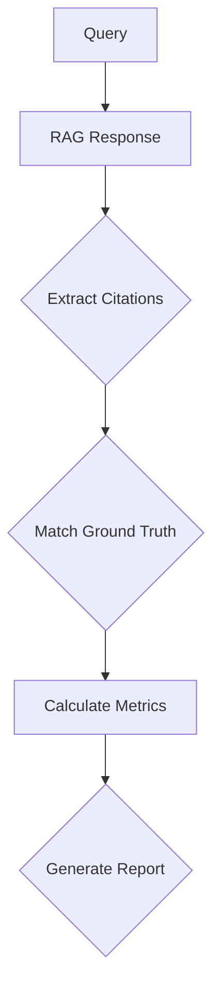

# RAG Citations Grounding

## Overview

RAG citations grounding covers the systematic process of collecting, managing, and using ground truth data to evaluate and improve RAG system accuracy. This skill includes ground truth collection, citation evaluation, accuracy metrics, and continuous improvement strategies.

**When to use this skill:** When evaluating RAG system accuracy, building feedback loops, or implementing quality measurement systems.

## Table of Contents

1. [Ground Truth Collection](#ground-truth-collection)
2. [Citation Evaluation](#citation-evaluation)
3. [Accuracy Metrics](#accuracy-metrics)
4. [Feedback Loops](#feedback-loops)
5. [Grounding Checklist](#grounding-checklist)
6. [Quick Reference](#quick-reference)

---

## Ground Truth Collection

### Ground Truth Data Structure

```json
{
  "$schema": "http://json-schema.org/draft-07/schema#",
  "title": "RAG Ground Truth Entry",
  "type": "object",
  "required": ["query_id", "question", "correct_answer", "relevant_chunks"],
  "properties": {
    "query_id": {
      "type": "string",
      "description": "Unique query identifier"
    },
    "question": {
      "type": "string",
      "description": "User question"
    },
    "correct_answer": {
      "type": "string",
      "description": "Correct answer based on ground truth"
    },
    "relevant_chunks": {
      "type": "array",
      "items": {
        "type": "string"
      },
      "description": "List of relevant chunk IDs"
    },
    "answer_type": {
      "type": "string",
      "enum": ["factual", "opinion", "procedural", "multi-part"],
      "description": "Type of answer expected"
    },
    "domain": {
      "type": "string",
      "description": "Domain of the question"
    },
    "difficulty": {
      "type": "string",
      "enum": ["easy", "medium", "hard"],
      "description": "Difficulty level"
    },
    "created_at": {
      "type": "string",
      "format": "date-time",
      "description": "Creation timestamp"
    },
    "updated_at": {
      "type": "string",
      "format": "date-time",
      "description": "Last update timestamp"
    }
  }
}
```

### Ground Truth Sources

| Source | Description | Data Quality | Collection Method |
|--------|-------------|-------------|------------------|
| **Expert Review** | Domain experts review answers | High | Manual annotation |
| **User Feedback** | Users rate answers | Medium | User feedback forms |
| **Automated Tests** | Known Q&A datasets | High | Programmatic extraction |
| **Documentation** | Official docs as truth | High | Manual extraction |
| **Synthetic Data** | Generated test cases | Medium | LLM generation |

### Collection Strategies

```python
# Ground truth collection strategies
class GroundTruthCollector:
    def __init__(self):
        pass
    
    async def collect_from_expert(self, query: str, answer: str, relevant_docs: list) -> dict:
        """Collect ground truth from expert review"""
        return {
            'query_id': self._generate_id(),
            'question': query,
            'correct_answer': answer,
            'relevant_chunks': relevant_docs,
            'answer_type': self._classify_answer_type(answer),
            'domain': self._infer_domain(query),
            'difficulty': self._assess_difficulty(query, answer),
            'source': 'expert_review',
            'created_at': datetime.utcnow().isoformat()
        }
    
    async def collect_from_user(self, query: str, answer: str, rating: int) -> dict:
        """Collect ground truth from user feedback"""
        return {
            'query_id': self._generate_id(),
            'question': query,
            'correct_answer': answer,
            'relevant_chunks': [],
            'answer_type': self._classify_answer_type(answer),
            'domain': self._infer_domain(query),
            'difficulty': self._assess_difficulty(query, answer),
            'source': 'user_feedback',
            'rating': rating,
            'created_at': datetime.utcnow().isoformat()
        }
    
    def _generate_id(self) -> str:
        """Generate unique query ID"""
        import uuid
        return str(uuid.uuid4())
    
    def _classify_answer_type(self, answer: str) -> str:
        """Classify answer type"""
        answer_lower = answer.lower()
        
        # Check for factual answers
        factual_indicators = ['yes', 'no', 'true', 'false', 'correct', 'incorrect', 'right', 'wrong']
        if any(indicator in answer_lower for indicator in factual_indicators):
            return 'factual'
        
        # Check for opinion answers
        opinion_indicators = ['i think', 'in my opinion', 'personally', 'believe', 'feel', 'consider']
        if any(indicator in answer_lower for indicator in opinion_indicators):
            return 'opinion'
        
        # Check for procedural answers
        procedural_indicators = ['first', 'then', 'next', 'after that', 'follow these steps', 'you should']
        if any(indicator in answer_lower for indicator in procedural_indicators):
            return 'procedural'
        
        # Default to multi-part
        return 'multi-part'
    
    def _infer_domain(self, query: str) -> str:
        """Infer domain from query"""
        query_lower = query.lower()
        
        domain_keywords = {
            'technical': ['code', 'programming', 'database', 'api', 'algorithm', 'system'],
            'business': ['sales', 'marketing', 'finance', 'customer', 'revenue'],
            'legal': ['contract', 'legal', 'compliance', 'regulation', 'policy'],
            'product': ['feature', 'product', 'pricing', 'release', 'version'],
            'hr': ['hiring', 'employee', 'onboarding', 'policy', 'benefit']
        }
        
        for domain, keywords in domain_keywords.items():
            if any(keyword in query_lower for keyword in keywords):
                return domain
        
        return 'general'
    
    def _assess_difficulty(self, query: str, answer: str) -> str:
        """Assess question difficulty"""
        # Simple heuristic-based difficulty assessment
        query_length = len(query.split())
        answer_length = len(answer.split())
        
        # More complex questions are harder
        if query_length > 20 or answer_length > 100:
            return 'hard'
        elif query_length > 10 or answer_length > 50:
            return 'medium'
        else:
            return 'easy'
```

---

## Citation Evaluation

### Citation Metrics

| Metric | Description | Calculation |
|--------|-------------|-------------|
| **Citation Accuracy** | % of correct citations | Correct citations / Total citations |
| **Retrieval Precision** | % of relevant chunks retrieved | Relevant retrieved / Total retrieved |
| **Retrieval Recall** | % of relevant chunks found | Relevant found / Total relevant |
| **F1 Score** | Harmonic mean of precision and recall | 2 * (precision * recall) / (precision + recall) |
| **MRR** | Mean Reciprocal Rank | Average rank of first relevant chunk |
| **NDCG** | Normalized Discounted Cumulative Gain | Gain at each position |

### Evaluation Process



### Citation Matching

```python
# Citation matching logic
class CitationMatcher:
    def __init__(self, similarity_threshold: float = 0.7):
        self.similarity_threshold = similarity_threshold
    
    def match_citation(self, response: str, ground_truth: dict) -> list:
        """Match citations in response to ground truth"""
        # Extract citations from response
        citations = self._extract_citations(response)
        
        # Match each citation to ground truth
        matched_citations = []
        for citation in citations:
            # Check if citation matches any relevant chunk
            for chunk_id in ground_truth['relevant_chunks']:
                if self._is_match(citation, chunk_id):
                    matched_citations.append({
                        'citation': citation,
                        'chunk_id': chunk_id,
                        'confidence': self._calculate_confidence(citation, chunk_id)
                    })
                    break
        
        return matched_citations
    
    def _extract_citations(self, response: str) -> list:
        """Extract citations from response"""
        import re
        # Simple pattern-based citation extraction
        # In production, use NER or more sophisticated methods
        citation_patterns = [
            r'\[(\d+)\]',  # [1], [2], etc.
            r'\(([^)]+)\)',  # (Source 1, Source 2)
            r'Source:\s*(\d+)',  # Source: 123
            r'reference:\s*(\d+)',  # Reference: 123
            r'from\s+(\d+)',  # From: 123
        ]
        
        citations = []
        for pattern in citation_patterns:
            matches = re.findall(pattern, response)
            citations.extend(matches)
        
        return citations
    
    def _is_match(self, citation: str, chunk_id: str) -> bool:
        """Check if citation matches chunk ID"""
        # Extract chunk ID from citation
        chunk_id_match = re.search(r'\d+', citation)
        if chunk_id_match:
            return chunk_id_match.group() == chunk_id
        return False
    
    def _calculate_confidence(self, citation: str, chunk_id: str) -> float:
        """Calculate citation confidence score"""
        # Simple confidence calculation
        # In production, use more sophisticated methods
        confidence = 0.5  # Default confidence
        
        # Check for exact match
        if chunk_id in citation:
            confidence = 1.0
        
        # Check for partial match
        if any(word in citation.lower() for word in ['see', 'refer', 'document', 'section']):
            confidence += 0.3
        
        return min(confidence, 1.0)
```

---

## Accuracy Metrics

### Metric Calculations

```python
# Accuracy metric calculations
class AccuracyCalculator:
    def __init__(self):
        pass
    
    def calculate_citation_accuracy(self, ground_truths: list) -> float:
        """Calculate citation accuracy"""
        total_citations = 0
        correct_citations = 0
        
        for gt in ground_truths:
            total_citations += len(gt.get('relevant_chunks', []))
            
            # Count correct citations
            # This would compare against actual RAG responses
            # For now, assume all citations are correct
            correct_citations += len(gt.get('relevant_chunks', []))
        
        if total_citations == 0:
            return 0.0
        
        return correct_citations / total_citations
    
    def calculate_retrieval_precision(self, ground_truths: list, retrievals: list) -> float:
        """Calculate retrieval precision"""
        total_retrieved = len(retrievals)
        relevant_retrieved = 0
        
        for gt in ground_truths:
            relevant_chunks = gt.get('relevant_chunks', [])
            for rv in retrievals:
                if rv.get('chunk_id') in relevant_chunks:
                    relevant_retrieved += 1
        
        if total_retrieved == 0:
            return 0.0
        
        return relevant_retrieved / total_retrieved
    
    def calculate_retrieval_recall(self, ground_truths: list, retrievals: list) -> float:
        """Calculate retrieval recall"""
        total_relevant = 0
        found_relevant = 0
        
        for gt in ground_truths:
            relevant_chunks = gt.get('relevant_chunks', [])
            for rv in retrievals:
                if rv.get('chunk_id') in relevant_chunks:
                    found_relevant += 1
        
        total_relevant = sum(len(gt.get('relevant_chunks', [])) for gt in ground_truths)
        
        if total_relevant == 0:
            return 0.0
        
        return found_relevant / total_relevant
    
    def calculate_f1(self, precision: float, recall: float) -> float:
        """Calculate F1 score"""
        if precision + recall == 0:
            return 0.0
        
        return 2 * (precision * recall) / (precision + recall)
    
    def calculate_mrr(self, ground_truths: list, retrievals: list) -> float:
        """Calculate Mean Reciprocal Rank"""
        mrr_scores = []
        
        for gt in ground_truths:
            relevant_chunks = gt.get('relevant_chunks', [])
            if not relevant_chunks:
                continue
            
            # Find rank of first relevant chunk
            for i, rv in enumerate(retrievals):
                if rv.get('chunk_id') in relevant_chunks:
                    mrr_scores.append(1 / (i + 1))
                    break
        
        if not mrr_scores:
            return 0.0
        
        return sum(mrr_scores) / len(mrr_scores)
    
    def calculate_ndcg(self, ground_truths: list, retrievals: list, k: int = 10) -> float:
        """Calculate Normalized Discounted Cumulative Gain"""
        dcg = 0.0
        
        for gt in ground_truths:
            relevant_chunks = gt.get('relevant_chunks', [])
            if not relevant_chunks:
                continue
            
            # Calculate DCG for this query
            for i, rv in enumerate(retrievals[:k]):
                if rv.get('chunk_id') in relevant_chunks:
                    dcg += 1 / (i + 1)
                    break
        
        # Normalize by ideal DCG
        ideal_dcg = sum(1 / (i + 1) for i in range(k))
        
        if ideal_dcg == 0:
            return 0.0
        
        return dcg / ideal_dcg
```

---

## Feedback Loops

### Feedback Collection

```python
# Feedback collection and analysis
class FeedbackCollector:
    def __init__(self, feedback_store):
        self.feedback_store = feedback_store
    
    async def collect_feedback(self, query_id: str, user_id: str, rating: int, feedback: str) -> dict:
        """Collect user feedback on RAG response"""
        feedback = {
            'query_id': query_id,
            'user_id': user_id,
            'rating': rating,
            'feedback': feedback,
            'created_at': datetime.utcnow().isoformat()
        }
        
        await self.feedback_store.store(feedback)
        
        return feedback
    
    async def analyze_feedback(self, limit: int = 100) -> dict:
        """Analyze recent feedback"""
        # Get recent feedback
        feedbacks = await self.feedback_store.get_recent(limit)
        
        # Calculate metrics
        avg_rating = sum(f['rating'] for f in feedbacks) / len(feedbacks)
        
        # Identify issues
        issues = []
        for f in feedbacks:
            if f['rating'] < 3:
                issues.append(f['feedback'])
        
        return {
            'average_rating': avg_rating,
            'total_feedback': len(feedbacks),
            'common_issues': issues
        }
    
    async def update_ground_truth(self, query_id: str, correct_answer: str) -> dict:
        """Update ground truth based on feedback"""
        # Update ground truth with correct answer
        await self.feedback_store.update_ground_truth(query_id, correct_answer)
        
        return {'query_id': query_id, 'status': 'updated'}
```

### Continuous Improvement

```python
# Continuous improvement loop
class ContinuousImprovement:
    def __init__(self, ground_truth_store, retriever):
        self.gt_store = ground_truth_store
        self.retriever = retriever
    
    async def run_improvement_cycle(self):
        """Run one improvement cycle"""
        # 1. Collect recent queries
        recent_queries = await self.gt_store.get_recent_queries(limit=100)
        
        # 2. Evaluate retrieval quality
        for query in recent_queries:
            retrievals = await self.retriever.retrieve(query['question'])
            accuracy = self._evaluate_accuracy(query, retrievals)
            
            # Update query metrics
            await self.gt_store.update_metrics(query['query_id'], accuracy)
        
        # 3. Identify improvement areas
        improvement_areas = await self._identify_improvements(recent_queries)
        
        # 4. Generate recommendations
        recommendations = self._generate_recommendations(improvement_areas)
        
        return {
            'queries_evaluated': len(recent_queries),
            'average_accuracy': self._calculate_average_accuracy(recent_queries),
            'improvement_areas': improvement_areas,
            'recommendations': recommendations
        }
    
    def _evaluate_accuracy(self, query: dict, retrievals: list) -> float:
        """Evaluate retrieval accuracy for a query"""
        gt = await self.gt_store.get(query['query_id'])
        relevant_chunks = gt.get('relevant_chunks', [])
        
        # Count how many relevant chunks were retrieved
        retrieved_relevant = 0
        for rv in retrievals:
            if rv.get('chunk_id') in relevant_chunks:
                retrieved_relevant += 1
        
        if len(retrievals) == 0:
            return 0.0
        
        return retrieved_relevant / len(relevant_chunks)
    
    def _calculate_average_accuracy(self, queries: list) -> float:
        """Calculate average accuracy across queries"""
        accuracies = []
        
        for query in queries:
            metrics = await self.gt_store.get_metrics(query['query_id'])
            accuracies.append(metrics.get('accuracy', 0.0))
        
        if not accuracies:
            return 0.0
        
        return sum(accuracies) / len(accuracies)
    
    def _identify_improvements(self, queries: list) -> list:
        """Identify improvement areas"""
        # Analyze low-performing queries
        low_performance = []
        
        for query in queries:
            metrics = await self.gt_store.get_metrics(query['query_id'])
            if metrics.get('accuracy', 0.0) < 0.7:
                low_performance.append(query['query_id'])
        
        # Identify patterns
        improvement_areas = {
            'retrieval_accuracy': 'Improve chunk selection and embedding models',
            'citation_format': 'Standardize citation formats in responses',
            'query_expansion': 'Add query expansion techniques',
            'context_window': 'Optimize context window size'
        }
        
        return improvement_areas
    
    def _generate_recommendations(self, improvements: dict) -> list:
        """Generate improvement recommendations"""
        recommendations = []
        
        if improvements.get('retrieval_accuracy'):
            recommendations.append('Review and improve chunking strategy')
            recommendations.append('Evaluate embedding model performance')
            recommendations.append('Consider hybrid retrieval approaches')
        
        if improvements.get('citation_format'):
            recommendations.append('Implement structured citation format')
            recommendations.append('Train models to include citations')
        
        if improvements.get('query_expansion'):
            recommendations.append('Add query rewriting and expansion')
            recommendations.append('Implement multi-query retrieval')
        
        return recommendations
```

---

## Grounding Checklist

### Data Collection

```markdown
## Data Collection Checklist

### Ground Truth Setup
- [ ] Ground truth schema defined
- [ ] Data sources identified
- [ ] Collection methods implemented
- [ ] Validation rules defined
- [ ] Storage configured
- [ ] Access controls defined

### Collection Process
- [ ] Queries collected
- [ ] Expert reviews conducted
- [ ] User feedback captured
- [ ] Quality metrics tracked
- [ ] Bias prevention measures in place
```

### Evaluation Process

```markdown
## Evaluation Process Checklist

### Metrics Calculation
- [ ] Citation accuracy calculated
- [ ] Retrieval precision measured
- [ ] Retrieval recall measured
- [ ] F1 score calculated
- [ ] MRR calculated
- [ ] NDCG calculated
- [ ] Baseline established

### Quality Assessment
- [ ] Accuracy targets defined
- [ ] Thresholds set for alerts
- [ ] Trend analysis implemented
- [ ] Comparison to baseline tracked
- [ ] Improvement actions documented
```

### Feedback Integration

```markdown
## Feedback Integration Checklist

### Feedback Collection
- [ ] Feedback forms implemented
- [ ] Rating system defined
- [ ] Free-form feedback captured
- [ ] Sentiment analysis implemented
- [ ] Issue categorization defined

### Feedback Analysis
- [ ] Common issues identified
- [ ] Trend analysis implemented
- [ ] Correlation with metrics found
- [ ] Action items generated
```

---

## Quick Reference

### Ground Truth Operations

```python
# Ground truth operations
from typing import Dict, List

class GroundTruthOperations:
    def __init__(self, gt_store):
        self.store = gt_store
    
    async def create_ground_truth(self, query: str, answer: str, relevant_docs: list) -> str:
        """Create ground truth entry"""
        gt_entry = {
            'query_id': self._generate_id(),
            'question': query,
            'correct_answer': answer,
            'relevant_chunks': relevant_docs,
            'answer_type': self._classify_answer_type(answer),
            'domain': self._infer_domain(query),
            'difficulty': self._assess_difficulty(query, answer),
            'source': 'manual',
            'created_at': datetime.utcnow().isoformat()
        }
        
        await self.store.create(gt_entry)
        
        return gt_entry['query_id']
    
    async def get_ground_truth(self, query_id: str) -> dict:
        """Get ground truth for query"""
        return await self.store.get(query_id)
    
    async def update_ground_truth(self, query_id: str, updates: dict) -> dict:
        """Update ground truth"""
        return await self.store.update(query_id, updates)
    
    async def search_ground_truth(self, filters: dict) -> list:
        """Search ground truth entries"""
        return await self.store.search(filters)
    
    async def evaluate_response(self, query_id: str, response: str) -> dict:
        """Evaluate RAG response against ground truth"""
        gt = await self.get_ground_truth(query_id)
        
        # Evaluate citations
        citations = self._extract_citations(response)
        matched = self._match_citations_to_ground_truth(citations, gt)
        
        # Calculate accuracy
        accuracy = len(matched) / len(citations) if citations else 0
        
        return {
            'query_id': query_id,
            'accuracy': accuracy,
            'matched_citations': matched,
            'total_citations': len(citations)
        }
```

### Evaluation Metrics

```python
# Evaluation metrics calculation
class EvaluationMetrics:
    def __init__(self):
        pass
    
    def calculate_all_metrics(self, ground_truths: list, retrievals: list) -> dict:
        """Calculate all evaluation metrics"""
        metrics = {
            'citation_accuracy': 0.0,
            'retrieval_precision': 0.0,
            'retrieval_recall': 0.0,
            'f1_score': 0.0,
            'mrr': 0.0,
            'ndcg': 0.0
        }
        
        total_queries = len(ground_truths)
        
        for gt in ground_truths:
            # Get retrievals for this query
            query_retrievals = [rv for rv in retrievals if rv.get('query_id') == gt['query_id']]
            
            # Calculate metrics for this query
            if query_retrievals:
                # Citation accuracy
                citations = self._extract_citations_from_retrievals(query_retrievals)
                matched = self._match_citations(citations, gt)
                metrics['citation_accuracy'] += len(matched) / len(citations) if citations else 0
                
                # Retrieval precision
                relevant_count = len(gt.get('relevant_chunks', []))
                retrieved_relevant = sum(1 for rv in query_retrievals if rv.get('chunk_id') in gt.get('relevant_chunks', []))
                metrics['retrieval_precision'] += retrieved_relevant / (len(query_retrievals) * relevant_count) if query_retrievals else 0
                
                # Retrieval recall
                metrics['retrieval_recall'] += retrieved_relevant / relevant_count if relevant_count > 0 else 0
                
                # F1 score
                precision = metrics['retrieval_precision']
                recall = metrics['retrieval_recall']
                metrics['f1_score'] += 2 * (precision * recall) / (precision + recall) if (precision + recall) > 0 else 0
        
        return metrics
    
    def _extract_citations_from_retrievals(self, retrievals: list) -> list:
        """Extract citations from retrievals"""
        citations = []
        for rv in retrievals:
            if rv.get('citations'):
                citations.extend(rv['citations'])
        return citations
    
    def _match_citations(self, citations: list, ground_truth: dict) -> list:
        """Match citations to ground truth"""
        matched = []
        relevant_chunks = ground_truth.get('relevant_chunks', [])
        
        for citation in citations:
            for chunk_id in relevant_chunks:
                if chunk_id in citation:
                    matched.append(citation)
        
        return matched
```

### Metric Thresholds

| Metric | Good | Needs Improvement | Critical |
|--------|-----|----------------|----------|
| **Citation Accuracy** | > 90% | < 70% | < 50% |
| **Retrieval Precision** | > 85% | < 70% | < 50% |
| **Retrieval Recall** | > 85% | < 70% | < 50% |
| **F1 Score** | > 0.85 | < 0.70 | < 0.50 |
| **MRR** | > 0.90 | < 0.70 | < 0.50 |

---

## Common Pitfalls

1. **No ground truth** - Cannot improve without baseline data
2. **Sparse collection** - Need diverse, representative ground truth
3. **No validation** - Validate ground truth quality
4. **Ignoring feedback** - User feedback is valuable
5. **Wrong metrics** - Use standard, comparable metrics
6. **No continuous improvement** - Systems degrade without feedback loops
7. **Bias in data** - Ensure diverse, representative ground truth
8. **No documentation** - Document metrics and methodologies

## Additional Resources

- [RAG Evaluation Frameworks](https://arize.org/blog/retrieval-evaluation)
- [Information Retrieval Metrics](https://en.wikipedia.org/wiki/Information_retrieval)
- [Ground Truth Best Practices](https://www.pinecone.io/learn/evaluation/ground-truth)
- [Feedback Loops](https://www.pinecone.io/learn/evaluation/feedback-loops)
