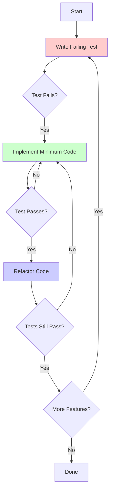
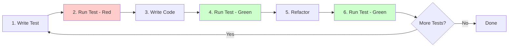

# Test-Driven Development for Agents

## Overview

Test-Driven Development (TDD) for AI agents is a disciplined approach where tests are written before implementation. For AI agents, the test serves as both specification and verification - it defines what the agent should produce and ensures the implementation meets those requirements. This skill teaches the Red-Green-Refactor cycle adapted for agentic development.

**When to use this skill:** When implementing new features, fixing bugs, or modifying existing code in an agentic development environment.

## Table of Contents

1. [The Agentic TDD Cycle](#the-agentic-tdd-cycle)
2. [Writing Tests as Specifications](#writing-tests-as-specifications)
3. [The Red Phase](#the-red-phase)
4. [The Green Phase](#the-green-phase)
5. [The Refactor Phase](#the-refactor-phase)
6. [TDD Patterns for Agents](#tdd-patterns-for-agents)
7. [Quick Reference](#quick-reference)

---

## The Agentic TDD Cycle

### The Red-Green-Refactor Loop



### The Three Phases

#### Phase 1: Red
- Write a test that defines the desired behavior
- Run the test and confirm it fails
- The test failure confirms the test is valid

#### Phase 2: Green
- Write the minimum code to make the test pass
- Run the test and confirm it passes
- Do not worry about code quality yet

#### Phase 3: Refactor
- Improve the code structure without changing behavior
- Run tests to ensure nothing broke
- Repeat until code is clean

### Why TDD for Agents?

1. **Tests as Specs** - The test is the specification for the AI
2. **Prevents Hallucinations** - Tests constrain what the AI can produce
3. **Improves First-Shot Success** - Clear expectations reduce iterations
4. **Enables Safe Refactoring** - Tests catch regressions
5. **Documents Behavior** - Tests serve as living documentation

---

## Writing Tests as Specifications

### The Test-First Philosophy

For AI agents, the test is not just verification—it's the specification. The test tells the agent exactly what to produce.

### Test as Specification Example

```javascript
// TEST: This is the specification
describe('calculateOrderTotal', () => {
  it('should calculate total with tax and discount', () => {
    // Given
    const order = {
      subtotal: 100,
      taxRate: 0.1,
      discount: 10
    };

    // When
    const total = calculateOrderTotal(order);

    // Then
    expect(total).toBe(100); // 100 + 10(tax) - 10(discount)
  });
});
```

**This test specifies:**
- The function name: `calculateOrderTotal`
- The input structure: `{ subtotal, taxRate, discount }`
- The output type: number
- The calculation logic: subtotal + (subtotal * taxRate) - discount

### Specification Checklist

```markdown
## Test Specification Checklist

### Input Specification
- [ ] What are the required inputs?
- [ ] What are the optional inputs?
- [ ] What are the input types?
- [ ] What are the valid input ranges?

### Output Specification
- [ ] What is the return type?
- [ ] What are the possible return values?
- [ ] What are the error conditions?
- [ ] What are the edge cases?

### Behavior Specification
- [ ] What should happen in normal cases?
- [ ] What should happen in error cases?
- [ ] What are the side effects?
- [ ] What are the invariants?
```

### Test Structure for Agents

```javascript
// AAA Pattern: Arrange, Act, Assert
describe('functionName', () => {
  it('should do X when Y', () => {
    // ARRANGE: Set up the test
    const input = { /* test data */ };
    const expected = { /* expected result */ };

    // ACT: Execute the function
    const result = functionName(input);

    // ASSERT: Verify the result
    expect(result).toEqual(expected);
  });
});
```

### Writing Descriptive Test Names

**Good test names:**
```javascript
// Clear and specific
it('should return 404 when user does not exist');
it('should calculate tax based on user state');
it('should throw error when email is invalid');
```

**Bad test names:**
```javascript
// Vague and unclear
it('should work');
it('test user');
it('check function');
```

---

## The Red Phase

### Writing the Failing Test

The Red phase is about writing a test that clearly defines the expected behavior and fails because the implementation doesn't exist yet.

### Step 1: Identify the Requirement

```markdown
## Requirement Analysis

### What needs to be implemented?
- Function to calculate order total
- Must include tax calculation
- Must apply discount
- Must handle edge cases

### What are the inputs?
- Order object with subtotal, taxRate, discount

### What are the outputs?
- Calculated total as a number

### What are the edge cases?
- Negative values
- Zero values
- Missing fields
```

### Step 2: Write the Test

```javascript
// tests/orderCalculator.test.js
describe('Order Calculator', () => {
  describe('calculateOrderTotal', () => {
    it('should calculate total with tax and discount', () => {
      const order = {
        subtotal: 100,
        taxRate: 0.1,
        discount: 10
      };

      const result = calculateOrderTotal(order);

      expect(result).toBe(100);
    });

    it('should handle zero discount', () => {
      const order = {
        subtotal: 100,
        taxRate: 0.1,
        discount: 0
      };

      const result = calculateOrderTotal(order);

      expect(result).toBe(110);
    });

    it('should throw error for negative subtotal', () => {
      const order = {
        subtotal: -100,
        taxRate: 0.1,
        discount: 10
      };

      expect(() => calculateOrderTotal(order)).toThrow('Subtotal must be positive');
    });
  });
});
```

### Step 3: Run the Test (Confirm It Fails)

```bash
$ npm test

FAIL  tests/orderCalculator.test.js
  Order Calculator
    calculateOrderTotal
      ✕ should calculate total with tax and discount

  ● Order Calculator › calculateOrderTotal › should calculate total with tax and discount

    ReferenceError: calculateOrderTotal is not defined

      at Object.<anonymous> (tests/orderCalculator.test.js:8:21)
```

**The test fails! This is correct.** The function doesn't exist yet.

### Red Phase Checklist

```markdown
## Red Phase Checklist

### Test Quality
- [ ] Test clearly specifies expected behavior
- [ ] Test name is descriptive
- [ ] Test follows AAA pattern
- [ ] Test is independent (doesn't depend on other tests)

### Test Failure
- [ ] Test runs and fails
- [ ] Failure message is clear
- [ ] Failure is expected (not a bug in test)
- [ ] Test would pass if implementation existed

### Specification
- [ ] Input types are specified
- [ ] Output types are specified
- [ ] Edge cases are covered
- [ ] Error conditions are defined
```

---

## The Green Phase

### Writing the Minimum Implementation

The Green phase is about writing the simplest possible code to make the test pass. Don't worry about quality—just make it work.

### Step 1: Write the Minimum Code

```javascript
// src/orderCalculator.js

function calculateOrderTotal(order) {
  // Minimum implementation to pass the test
  const subtotal = order.subtotal;
  const taxRate = order.taxRate;
  const discount = order.discount;

  const tax = subtotal * taxRate;
  const total = subtotal + tax - discount;

  return total;
}

module.exports = { calculateOrderTotal };
```

### Step 2: Run the Test (Confirm It Passes)

```bash
$ npm test

PASS  tests/orderCalculator.test.js
  Order Calculator
    calculateOrderTotal
      ✓ should calculate total with tax and discount (2ms)
      ✕ should handle zero discount
      ✕ should throw error for negative subtotal

Test Suites: 1 passed, 1 total
Tests:       1 passed, 2 failed
```

**First test passes! Now handle the next test.**

### Step 3: Handle the Next Test

```javascript
function calculateOrderTotal(order) {
  const subtotal = order.subtotal;
  const taxRate = order.taxRate;
  const discount = order.discount;

  // Add validation for negative subtotal
  if (subtotal < 0) {
    throw new Error('Subtotal must be positive');
  }

  const tax = subtotal * taxRate;
  const total = subtotal + tax - discount;

  return total;
}
```

```bash
$ npm test

PASS  tests/orderCalculator.test.js
  Order Calculator
    calculateOrderTotal
      ✓ should calculate total with tax and discount
      ✓ should handle zero discount
      ✓ should throw error for negative subtotal

Test Suites: 1 passed, 1 total
Tests:       3 passed, 3 total
```

**All tests pass! Green phase complete.**

### Green Phase Principles

1. **Write the minimum code** - Don't over-engineer
2. **Make tests pass** - That's the only goal
3. **Don't refactor yet** - Save that for the next phase
4. **One test at a time** - Write code for one test, then move to the next

### Green Phase Checklist

```markdown
## Green Phase Checklist

### Implementation
- [ ] Code is minimal (no extra features)
- [ ] Code makes tests pass
- [ ] No premature optimization
- [ ] No refactoring yet

### Verification
- [ ] All tests pass
- [ ] No new tests are broken
- [ ] Code is syntactically correct
- [ ] No console errors

### Progress
- [ ] One test at a time
- [ ] Each test passes before moving on
- [ ] Implementation matches test specification
```

---

## The Refactor Phase

### Improving Code Without Changing Behavior

The Refactor phase is about improving code quality while keeping the same behavior. Tests ensure nothing breaks.

### Step 1: Identify Refactoring Opportunities

```javascript
// Current implementation (Green phase)
function calculateOrderTotal(order) {
  const subtotal = order.subtotal;
  const taxRate = order.taxRate;
  const discount = order.discount;

  if (subtotal < 0) {
    throw new Error('Subtotal must be positive');
  }

  const tax = subtotal * taxRate;
  const total = subtotal + tax - discount;

  return total;
}
```

**Refactoring opportunities:**
- Extract validation logic
- Add input validation for other fields
- Add JSDoc comments
- Consider edge cases not covered

### Step 2: Refactor (Keep Tests Passing)

```javascript
/**
 * Calculates the total cost of an order including tax and discount.
 *
 * @param {Object} order - The order to calculate
 * @param {number} order.subtotal - The subtotal before tax and discount
 * @param {number} order.taxRate - The tax rate as a decimal (e.g., 0.1 for 10%)
 * @param {number} order.discount - The discount amount to subtract
 * @returns {number} The calculated total
 * @throws {Error} If subtotal is negative
 */
function calculateOrderTotal(order) {
  // Validate inputs
  validateOrder(order);

  // Calculate tax
  const tax = calculateTax(order.subtotal, order.taxRate);

  // Calculate total
  return order.subtotal + tax - order.discount;
}

/**
 * Validates the order object.
 *
 * @param {Object} order - The order to validate
 * @throws {Error} If validation fails
 */
function validateOrder(order) {
  if (!order || typeof order !== 'object') {
    throw new Error('Order must be an object');
  }

  if (typeof order.subtotal !== 'number' || order.subtotal < 0) {
    throw new Error('Subtotal must be a positive number');
  }

  if (typeof order.taxRate !== 'number' || order.taxRate < 0) {
    throw new Error('Tax rate must be a positive number');
  }

  if (typeof order.discount !== 'number' || order.discount < 0) {
    throw new Error('Discount must be a positive number');
  }
}

/**
 * Calculates tax amount.
 *
 * @param {number} subtotal - The subtotal
 * @param {number} taxRate - The tax rate
 * @returns {number} The tax amount
 */
function calculateTax(subtotal, taxRate) {
  return subtotal * taxRate;
}

module.exports = {
  calculateOrderTotal,
  validateOrder,
  calculateTax
};
```

### Step 3: Run Tests (Verify Nothing Broke)

```bash
$ npm test

PASS  tests/orderCalculator.test.js
  Order Calculator
    calculateOrderTotal
      ✓ should calculate total with tax and discount
      ✓ should handle zero discount
      ✓ should throw error for negative subtotal

Test Suites: 1 passed, 1 total
Tests:       3 passed, 3 total
```

**All tests still pass! Refactoring successful.**

### Refactoring Techniques

#### Extract Function

```javascript
// Before
function processOrder(order) {
  const tax = order.subtotal * order.taxRate;
  const total = order.subtotal + tax - order.discount;
  return total;
}

// After
function processOrder(order) {
  const tax = calculateTax(order.subtotal, order.taxRate);
  return calculateTotal(order.subtotal, tax, order.discount);
}

function calculateTax(subtotal, taxRate) {
  return subtotal * taxRate;
}

function calculateTotal(subtotal, tax, discount) {
  return subtotal + tax - discount;
}
```

#### Extract Variable

```javascript
// Before
function calculateDiscount(price, percentage, isPremium) {
  return isPremium ? price * percentage * 1.5 : price * percentage;
}

// After
function calculateDiscount(price, percentage, isPremium) {
  const multiplier = isPremium ? 1.5 : 1;
  const baseDiscount = price * percentage;
  return baseDiscount * multiplier;
}
```

#### Introduce Parameter Object

```javascript
// Before
function createUser(name, email, age, address, phone) {
  // ...
}

// After
function createUser(user) {
  // ...
}

// Usage
createUser({
  name: 'John',
  email: 'john@example.com',
  age: 30,
  address: '123 Main St',
  phone: '555-1234'
});
```

### Refactor Phase Checklist

```markdown
## Refactor Phase Checklist

### Code Quality
- [ ] Code is more readable
- [ ] Code is more maintainable
- [ ] Code follows best practices
- [ ] Code is well-documented

### Behavior
- [ ] All tests still pass
- [ ] No behavior changed
- [ ] No new features added
- [ ] No bugs introduced

### Structure
- [ ] Functions have single responsibility
- [ ] Code is DRY (Don't Repeat Yourself)
- [ ] Naming is clear and consistent
- [ ] Abstractions are appropriate
```

---

## TDD Patterns for Agents

### Pattern 1: The Test-First API Design

Write tests for the API before implementing. This forces you to think about the interface first.

```javascript
// Test: Define the API
describe('UserService API', () => {
  it('should have a createUser method', () => {
    expect(typeof UserService.createUser).toBe('function');
  });

  it('should have a getUser method', () => {
    expect(typeof UserService.getUser).toBe('function');
  });

  it('should have an updateUser method', () => {
    expect(typeof UserService.updateUser).toBe('function');
  });

  it('should have a deleteUser method', () => {
    expect(typeof UserService.deleteUser).toBe('function');
  });
});
```

### Pattern 2: The Specification Test

Write a test that serves as a complete specification for a feature.

```javascript
// Test: Complete specification
describe('Password Hashing', () => {
  describe('hashPassword', () => {
    it('should return a string', async () => {
      const hash = await hashPassword('password123');
      expect(typeof hash).toBe('string');
    });

    it('should produce different hashes for same password', async () => {
      const hash1 = await hashPassword('password123');
      const hash2 = await hashPassword('password123');
      expect(hash1).not.toBe(hash2);
    });

    it('should include salt in hash', async () => {
      const hash = await hashPassword('password123');
      expect(hash).toContain('$'); // bcrypt format
    });

    it('should throw error for empty password', async () => {
      await expect(hashPassword('')).rejects.toThrow('Password cannot be empty');
    });
  });

  describe('verifyPassword', () => {
    it('should return true for correct password', async () => {
      const hash = await hashPassword('password123');
      const result = await verifyPassword('password123', hash);
      expect(result).toBe(true);
    });

    it('should return false for incorrect password', async () => {
      const hash = await hashPassword('password123');
      const result = await verifyPassword('wrongpassword', hash);
      expect(result).toBe(false);
    });
  });
});
```

### Pattern 3: The Edge Case Test

Write tests for edge cases first to ensure they're handled.

```javascript
describe('Edge Cases', () => {
  it('should handle null input', () => {
    expect(() => processOrder(null)).toThrow('Order cannot be null');
  });

  it('should handle undefined input', () => {
    expect(() => processOrder(undefined)).toThrow('Order cannot be undefined');
  });

  it('should handle empty object', () => {
    expect(() => processOrder({})).toThrow('Invalid order structure');
  });

  it('should handle very large numbers', () => {
    const order = { subtotal: Number.MAX_SAFE_INTEGER, taxRate: 0.1, discount: 0 };
    expect(() => processOrder(order)).not.toThrow();
  });

  it('should handle very small numbers', () => {
    const order = { subtotal: 0.0001, taxRate: 0.1, discount: 0 };
    const result = processOrder(order);
    expect(result).toBeGreaterThan(0);
  });
});
```

### Pattern 4: The Integration Test

Write tests that verify components work together.

```javascript
describe('Order Processing Integration', () => {
  it('should create order, process payment, and update inventory', async () => {
    // Arrange
    const orderData = {
      userId: 1,
      items: [{ productId: 1, quantity: 2 }]
    };

    // Act
    const order = await OrderService.createOrder(orderData);
    const payment = await PaymentService.processPayment(order.id, order.total);
    await InventoryService.updateInventory(order.items);

    // Assert
    expect(order.status).toBe('completed');
    expect(payment.status).toBe('success');
    const inventory = await InventoryService.getProductInventory(1);
    expect(inventory.quantity).toBe(98); // Assuming initial 100
  });
});
```

### Pattern 5: The Regression Test

When fixing a bug, write a test that would have caught it.

```javascript
// Bug: Users with special characters in names couldn't be created
describe('Bug Fix: Special Characters in Names', () => {
  it('should handle names with apostrophes', async () => {
    const user = await UserService.createUser({
      name: "O'Connor",
      email: 'test@example.com'
    });
    expect(user.name).toBe("O'Connor");
  });

  it('should handle names with hyphens', async () => {
    const user = await UserService.createUser({
      name: 'Smith-Jones',
      email: 'test@example.com'
    });
    expect(user.name).toBe('Smith-Jones');
  });

  it('should handle names with accents', async () => {
    const user = await UserService.createUser({
      name: 'José García',
      email: 'test@example.com'
    });
    expect(user.name).toBe('José García');
  });
});
```

---

## Quick Reference

### TDD Cycle Commands

```bash
# Run all tests
npm test

# Run tests in watch mode
npm test -- --watch

# Run specific test file
npm test -- orderCalculator.test.js

# Run tests matching a pattern
npm test -- --grep "calculateOrderTotal"

# Run tests with coverage
npm test -- --coverage

# Run tests in verbose mode
npm test -- --verbose
```

### Test Templates

```javascript
// Unit test template
describe('ModuleName', () => {
  describe('functionName', () => {
    it('should do X when Y', () => {
      // Arrange
      const input = { /* ... */ };
      const expected = { /* ... */ };

      // Act
      const result = functionName(input);

      // Assert
      expect(result).toEqual(expected);
    });
  });
});

// Async test template
describe('AsyncModule', () => {
  it('should handle async operations', async () => {
    // Arrange
    const input = { /* ... */ };

    // Act
    const result = await asyncFunction(input);

    // Assert
    expect(result).toBeDefined();
  });
});

// Error test template
describe('ErrorHandling', () => {
  it('should throw error for invalid input', () => {
    // Arrange
    const invalidInput = { /* ... */ };

    // Act & Assert
    expect(() => functionUnderTest(invalidInput)).toThrow('Expected error message');
  });
});
```

### Common Matchers

```javascript
// Equality
expect(result).toBe(value);           // Strict equality (===)
expect(result).toEqual(value);         // Deep equality
expect(result).toStrictEqual(value);   // Strict deep equality

// Types
expect(result).toBeInstanceOf(Class);
expect(typeof result).toBe('string');
expect(Array.isArray(result)).toBe(true);

// Truthiness
expect(result).toBeTruthy();
expect(result).toBeFalsy();
expect(result).toBeDefined();
expect(result).toBeUndefined();
expect(result).toBeNull();

// Numbers
expect(result).toBeGreaterThan(10);
expect(result).toBeLessThan(20);
expect(result).toBeCloseTo(3.14, 2);  // 2 decimal places

// Strings
expect(result).toMatch(/regex/);
expect(result).toContain('substring');
expect(result).toHaveLength(10);

// Arrays
expect(result).toContain(item);
expect(result).toHaveLength(5);
expect(result).toEqual(expect.arrayContaining([1, 2, 3]));

// Objects
expect(result).toHaveProperty('key');
expect(result).toHaveProperty('key', value);
expect(result).toMatchObject({ key: value });

// Async
await expect(promise).resolves.toBe(value);
await expect(promise).rejects.toThrow('error');

// Functions
expect(mockFn).toHaveBeenCalled();
expect(mockFn).toHaveBeenCalledTimes(1);
expect(mockFn).toHaveBeenCalledWith(arg1, arg2);
```

### TDD Workflow



---

## Common Pitfalls

1. **Writing tests after code** - This defeats the purpose of TDD
2. **Writing too many tests at once** - Write one test, implement, repeat
3. **Skipping the refactor phase** - Code quality matters
4. **Changing tests to match implementation** - Tests are the specification
5. **Testing implementation details** - Test behavior, not implementation
6. **Not testing edge cases** - Edge cases often hide bugs
7. **Making tests dependent** - Tests should be independent
8. **Ignoring failing tests** - Never commit with failing tests

## Additional Resources

- [Test-Driven Development: By Example](https://www.amazon.com/Test-Driven-Development-Kent-Beck/dp/0321146530)
- [Jest Documentation](https://jestjs.io/docs/getting-started)
- [Testing JavaScript](https://www.youtube.com/watch?v=d0wz8Np-2O8)
