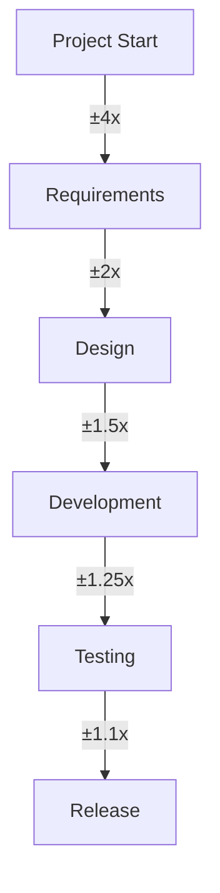

# Estimation Techniques

## Overview

Software estimation is the process of predicting the effort, time, and resources required to complete a project. Accurate estimation is critical for project planning and delivery.

---

## 1. Estimation Approaches

### Story Points

Story points are a relative measure of effort that considers complexity, risk, and uncertainty.

**Characteristics**:
- Relative, not absolute
- Considers complexity, not just time
- Team-specific (different teams have different velocities)
- Used for planning, not commitments

**When to Use**:
- Agile development
- Unknown requirements
- Team-based estimation
- Iterative planning

```markdown
# Story Point Reference

## Point Values
Most teams use the Fibonacci sequence: 1, 2, 3, 5, 8, 13, 21, 40

## Point Interpretation
| Points | Description | Example |
|--------|-------------|---------|
| 1 | Trivial, well-understood | Update text, fix typo |
| 2 | Small, minimal complexity | Add simple validation |
| 3 | Small/Medium, some complexity | Add filter to list |
| 5 | Medium, typical story | Implement search |
| 8 | Medium/Large, significant complexity | Add file upload |
| 13 | Large, high uncertainty | Implement payment |
| 21+ | Too large, must break down | Epic, not a story |

## Velocity Calculation
Velocity = Total Story Points Completed / Number of Sprints

Example:
- Sprint 1: 23 points
- Sprint 2: 27 points
- Sprint 3: 25 points
- Average Velocity: (23 + 27 + 25) / 3 = 25 points
```

### T-Shirt Sizing

T-shirt sizing is a quick, high-level estimation technique for large features or epics.

**Sizes**:
- **XS**: Extra Small (hours)
- **S**: Small (days)
- **M**: Medium (weeks)
- **L**: Large (months)
- **XL**: Extra Large (quarters)

**When to Use**:
- Early project planning
- Portfolio management
- High-level roadmapping
- Stakeholder discussions

```markdown
# T-Shirt Sizing Guide

## Size Definitions

### XS (Extra Small)
- Effort: 1-2 days
- Complexity: Very low
- Risk: Minimal
- Examples:
  - Fix a bug
  - Update a label
  - Add a simple field

### S (Small)
- Effort: 3-5 days
- Complexity: Low
- Risk: Low
- Examples:
  - Add a simple feature
  - Update existing component
  - Add basic validation

### M (Medium)
- Effort: 1-2 weeks
- Complexity: Medium
- Risk: Medium
- Examples:
  - Add a new page
  - Implement a feature
  - Integrate with API

### L (Large)
- Effort: 3-6 weeks
- Complexity: High
- Risk: High
- Examples:
  - Major feature
  - Complex integration
  - Multiple components

### XL (Extra Large)
- Effort: 2-3 months
- Complexity: Very high
- Risk: Very high
- Examples:
  - New product
  - Platform rewrite
  - Multiple features

## Conversion to Story Points
| T-Shirt | Story Points | Days |
|---------|-------------|------|
| XS | 1-2 | 1-2 |
| S | 3-5 | 3-5 |
| M | 8-13 | 5-10 |
| L | 21-40 | 15-30 |
| XL | Epic | 60+ |
```

### Hours/Days

Time-based estimation uses actual hours or days to estimate work.

**When to Use**:
- Fixed-price contracts
- Detailed project planning
- Resource allocation
- External commitments

**Challenges**:
- Doesn't account for uncertainty
- Often inaccurate
- Can lead to pressure
- Different developers have different speeds

```markdown
# Time-Based Estimation

## Estimation Levels

### Rough Order of Magnitude (ROM)
- Accuracy: ±50%
- Used for: Initial estimates, feasibility
- Example: "This will take 2-3 months"

### Budget Estimate
- Accuracy: ±25%
- Used for: Project planning, budgeting
- Example: "This will take 10-12 weeks"

### Definitive Estimate
- Accuracy: ±10%
- Used for: Detailed planning, commitments
- Example: "This will take 8 weeks, 2 days"

## Time Estimation Template

| Task | Optimistic | Most Likely | Pessimistic | Expected |
|------|------------|-------------|-------------|----------|
| Task 1 | 4 hours | 6 hours | 10 hours | 6.3 hours |
| Task 2 | 2 days | 3 days | 5 days | 3.2 days |
| Task 3 | 1 week | 2 weeks | 3 weeks | 2 weeks |

## Expected Calculation (PERT)
Expected = (Optimistic + 4 × Most Likely + Pessimistic) / 6

Example:
Optimistic: 4 hours
Most Likely: 6 hours
Pessimistic: 10 hours
Expected = (4 + 4×6 + 10) / 6 = 38 / 6 = 6.33 hours
```

---

## 2. Planning Poker

Planning poker is a consensus-based estimation technique for agile teams.

### The Process

```markdown
# Planning Poker Guide

## Preparation
- Prepare a list of user stories to estimate
- Each team member gets a deck of cards: 1, 2, 3, 5, 8, 13, 21, 40, ?
- Appoint a moderator (usually Scrum Master)

## Steps

### 1. Story Overview (5 min)
- Product Owner presents the user story
- Team reads acceptance criteria
- Team asks clarifying questions

### 2. Initial Estimates (1 min)
- Each team member selects a card privately
- No discussion allowed during selection
- Cards are revealed simultaneously

### 3. Discussion (2-3 min)
- If estimates are close (within 2 points), use the average
- If estimates differ significantly, discuss:
  - Person with highest estimate explains first
  - Person with lowest estimate explains second
  - Focus on differences in understanding

### 4. Re-estimate (1 min)
- Team selects new cards
- Cards are revealed simultaneously
- Repeat until consensus is reached

### 5. Record (1 min)
- Record the agreed story point
- Move to next story

## Tips for Success
- Timebox discussions (2-3 minutes per story)
- Use "?" if you need more information
- Don't average - aim for consensus
- The Product Owner doesn't estimate
- Consider complexity, risk, and uncertainty

## Common Issues

### Issue: Estimates Keep Diverging
**Solution**:
- Break the story into smaller stories
- Schedule a spike (research) story
- Get more information from stakeholders

### Issue: One Person Dominates
**Solution**:
- Enforce timeboxing
- Have everyone speak before consensus
- Use round-robin discussion

### Issue: Anchoring Bias
**Solution**:
- Reveal cards simultaneously
- Don't discuss before revealing
- Rotate who speaks first
```

### Planning Poker Card Deck

```markdown
# Planning Poker Cards

## Standard Deck
- 1: Trivial task
- 2: Very small task
- 3: Small task
- 5: Medium task
- 8: Medium-large task
- 13: Large task
- 21: Very large task
- 40: Epic (break down)
- ?: Need more information

## Extended Deck (Optional)
- 0: Already done
- ½: Less than 1 point
- ∞: Too complex to estimate

## Card Meanings

### 1 Point
- Simple, well-understood
- No uncertainty
- Can be done in a few hours

### 2 Points
- Small task
- Minimal complexity
- Low uncertainty

### 3 Points
- Small to medium
- Some complexity
- Low to medium uncertainty

### 5 Points
- Medium task
- Typical complexity
- Medium uncertainty

### 8 Points
- Medium to large
- Significant complexity
- High uncertainty

### 13 Points
- Large task
- High complexity
- Very high uncertainty
- Consider breaking down

### 21 Points
- Very large task
- Very high complexity
- Extreme uncertainty
- Must break down

### 40 Points
- Epic, not a story
- Cannot estimate accurately
- Must be broken down

### ?
- Need more information
- Schedule a spike
- Clarify requirements
```

---

## 3. Three-Point Estimation

Three-point estimation (PERT) uses optimistic, most likely, and pessimistic estimates to calculate expected time.

### PERT Formula

```
Expected = (Optimistic + 4 × Most Likely + Pessimistic) / 6
Standard Deviation = (Pessimistic - Optimistic) / 6
```

### Example Calculation

```markdown
# Three-Point Estimation Example

## Task: Implement User Registration

### Estimates
- Optimistic (O): 4 hours
- Most Likely (M): 6 hours
- Pessimistic (P): 10 hours

### Calculations
Expected = (4 + 4×6 + 10) / 6 = 38 / 6 = 6.33 hours
Standard Deviation = (10 - 4) / 6 = 1 hour

### Confidence Intervals
- 68% confidence: 6.33 ± 1 = 5.33 to 7.33 hours
- 95% confidence: 6.33 ± 2 = 4.33 to 8.33 hours
- 99.7% confidence: 6.33 ± 3 = 3.33 to 9.33 hours
```

### Project-Level Estimation

```markdown
# Project PERT Estimation

## Task Breakdown

| Task | Optimistic | Most Likely | Pessimistic | Expected | Std Dev |
|------|------------|-------------|-------------|----------|---------|
| Design | 3 days | 5 days | 8 days | 5.17 | 0.83 |
| Frontend | 5 days | 8 days | 14 days | 8.5 | 1.5 |
| Backend | 4 days | 7 days | 12 days | 7.33 | 1.33 |
| Testing | 2 days | 3 days | 6 days | 3.33 | 0.67 |
| **Total** | | | | **24.33** | **2.28** |

## Project Estimates
- Expected: 24.33 days
- Standard Deviation: 2.28 days
- 68% confidence: 22.05 to 26.61 days
- 95% confidence: 19.77 to 28.89 days
- 99.7% confidence: 17.49 to 31.17 days

## Recommendation
Commit to 28 days (95% confidence)
```

---

## 4. Bottom-Up vs Top-Down

### Bottom-Up Estimation

Break down the project into small tasks and estimate each one.

**When to Use**:
- Detailed planning
- When requirements are clear
- For accurate estimates
- When team is experienced

**Pros**:
- More accurate
- Team buy-in
- Better understanding of work
- Identifies dependencies

**Cons**:
- Time-consuming
- Can miss big picture
- May be optimistic

```markdown
# Bottom-Up Estimation Example

## Project: E-commerce Checkout

### Breakdown
| Task | Estimate |
|------|----------|
| Design checkout flow | 2 days |
| Create checkout page | 3 days |
| Implement payment API | 5 days |
| Add address form | 2 days |
| Implement order summary | 2 days |
| Add coupon code | 2 days |
| Unit tests | 3 days |
| Integration tests | 2 days |
| QA testing | 3 days |
| Bug fixes | 2 days |
| **Total** | **26 days** |

### Analysis
- Total: 26 days
- Add 20% buffer: 31.2 days
- Round up: 32 days (6.4 weeks)
```

### Top-Down Estimation

Estimate the project as a whole based on similar past projects.

**When to Use**:
- Early planning
- When requirements are vague
- For portfolio management
- Quick estimates needed

**Pros**:
- Fast
- Good for high-level planning
- Uses historical data
- Identifies scope

**Cons**:
- Less accurate
- No team buy-in
- May miss details
- Can be optimistic

```markdown
# Top-Down Estimation Example

## Project: E-commerce Checkout

### Historical Data
- Previous checkout: 4 weeks
- Similar features: 3-5 weeks
- Team velocity: 25 points/sprint
- Estimated points: 100 points

### Calculations
- Historical average: 4 weeks
- Points-based: 100 / 25 = 4 sprints = 8 weeks
- Range: 3-5 weeks

### Adjustment Factors
- +1 week: New payment provider
- +0.5 week: New team member
- -0.5 week: Reusing components

### Final Estimate
- Base: 4 weeks
- Adjustments: +1 week
- Total: 5 weeks
- Buffer: +1 week
- Commit: 6 weeks
```

### Hybrid Approach

Combine both methods for better accuracy.

```markdown
# Hybrid Estimation Example

## Step 1: Top-Down Estimate
- Historical: 4 weeks
- Expert judgment: 5 weeks
- Top-down estimate: 4.5 weeks

## Step 2: Bottom-Up Estimate
- Task breakdown: 26 days = 5.2 weeks
- Bottom-up estimate: 5.2 weeks

## Step 3: Compare and Reconcile
- Top-down: 4.5 weeks
- Bottom-up: 5.2 weeks
- Difference: 0.7 weeks

## Step 4: Investigate Difference
- Bottom-up may be optimistic
- Top-down may not account for new features
- Discuss with team

## Step 5: Final Estimate
- Average: (4.5 + 5.2) / 2 = 4.85 weeks
- Buffer: 20% = 1 week
- Final: 6 weeks
```

---

## 5. Historical Data Usage

Using historical data improves estimation accuracy over time.

### Velocity Tracking

```markdown
# Velocity Tracking

## Sprint Velocity Log

| Sprint | Points Planned | Points Completed | Velocity | Notes |
|--------|----------------|------------------|-----------|-------|
| 1 | 30 | 25 | 25 | Team forming |
| 2 | 25 | 28 | 28 | Stable |
| 3 | 28 | 27 | 27 | One sick day |
| 4 | 27 | 30 | 30 | Good momentum |
| 5 | 30 | 26 | 26 | Complex stories |
| 6 | 26 | 28 | 28 | Stable |
| **Average** | | | **27.3** | |

## Velocity Analysis

### Average Velocity
- 6-sprint average: 27.3 points
- Last 3 sprints: 28 points
- Trend: Stable

### Planning Velocity
- Conservative: 25 points (minimum)
- Expected: 27 points (average)
- Optimistic: 30 points (maximum)

### Recommendations
- Plan for 27 points per sprint
- Have buffer stories ready
- Monitor velocity trend
```

### Historical Comparison

```markdown
# Historical Feature Comparison

## Similar Features

| Feature | Previous | Current | Similarity | Estimate |
|---------|----------|---------|------------|----------|
| User registration | 8 points | Similar | 90% | 8 points |
| Search | 13 points | More complex | 70% | 16 points |
| File upload | 5 points | Simpler | 80% | 4 points |
| Payment | 21 points | Different provider | 50% | 21 points |

## Adjustment Factors

### Complexity Adjustment
- More complex: +20-50%
- Less complex: -20-30%

### Team Adjustment
- New team: +30-50%
- Experienced team: -10-20%

### Technology Adjustment
- New technology: +30-50%
- Familiar technology: -10-20%

## Example Calculation
Base estimate: 8 points
Complexity: +20% (more features)
Team: -10% (experienced)
Technology: 0% (same)
Adjusted: 8 × 1.2 × 0.9 = 8.64 ≈ 8 points
```

---

## 6. Velocity Calculation

Velocity is the amount of work a team completes in a sprint.

### Calculating Velocity

```markdown
# Velocity Calculation

## Basic Formula
Velocity = Total Story Points Completed in Sprint

## Example
Sprint 1 completed stories:
- US-001: 5 points
- US-002: 3 points
- US-003: 8 points
- US-004: 5 points
Velocity = 5 + 3 + 8 + 5 = 21 points

## Average Velocity
Average = Sum of Velocities / Number of Sprints

Example:
- Sprint 1: 21 points
- Sprint 2: 25 points
- Sprint 3: 23 points
Average = (21 + 25 + 23) / 3 = 23 points

## Planning Velocity
Use the average of the last 3 sprints for planning.

Example:
- Sprint 4: 24 points
- Sprint 5: 26 points
- Sprint 6: 25 points
Planning velocity = (24 + 26 + 25) / 3 = 25 points
```

### Velocity Stability

```markdown
# Velocity Stability Analysis

## Stability Metrics

### Velocity Range
- Stable: ±10% of average
- Acceptable: ±20% of average
- Unstable: >±20% of average

### Example
Average velocity: 25 points
- Stable range: 22.5 - 27.5 points
- Acceptable range: 20 - 30 points
- Unstable: <20 or >30 points

## Velocity Trend

### Increasing Trend
- Team is improving
- Learning curve
- Better estimation

### Decreasing Trend
- Team is struggling
- Stories are getting harder
- External factors

### Stable Trend
- Team is consistent
- Predictable delivery
- Good for planning

## Actions

### If Unstable
- Investigate causes
- Improve estimation
- Adjust sprint length
- Review story sizes

### If Decreasing
- Check team morale
- Review story complexity
- Address blockers
- Consider team changes
```

---

## 7. Cone of Uncertainty

The cone of uncertainty shows how estimates become more accurate over time.



### Cone of Uncertainty Guide

```markdown
# Cone of Uncertainty

## Uncertainty by Phase

| Phase | Uncertainty Range | Example |
|-------|------------------|---------|
| Inception | ±4x | 10 weeks = 6-14 weeks |
| Requirements | ±2x | 10 weeks = 8-12 weeks |
| Design | ±1.5x | 10 weeks = 8.5-11.5 weeks |
| Development | ±1.25x | 10 weeks = 9-11 weeks |
| Testing | ±1.1x | 10 weeks = 9.5-10.5 weeks |
| Release | ±1x | 10 weeks = 10 weeks |

## Using the Cone

### Early Estimates
- Use wide ranges
- Communicate uncertainty
- Don't commit to exact dates
- Plan for re-estimation

### Progress Updates
- Narrow the range
- Update stakeholders
- Adjust plans
- Re-estimate as needed

### Final Estimates
- Narrowest range
- More confident
- Can commit to dates
- Less buffer needed

## Example

### Project Start
- Estimate: 10 weeks
- Range: 6-14 weeks (±4x)
- Commit: 14 weeks (conservative)

### After Requirements
- Estimate: 10 weeks
- Range: 8-12 weeks (±2x)
- Commit: 12 weeks

### After Design
- Estimate: 10 weeks
- Range: 8.5-11.5 weeks (±1.5x)
- Commit: 11.5 weeks

### During Development
- Estimate: 10 weeks
- Range: 9-11 weeks (±1.25x)
- Commit: 11 weeks

### During Testing
- Estimate: 10 weeks
- Range: 9.5-10.5 weeks (±1.1x)
- Commit: 10.5 weeks

### Release
- Estimate: 10 weeks
- Range: 10 weeks (±1x)
- Actual: 10 weeks
```

---

## 8. Buffer Management

Buffers account for uncertainty and risk in estimates.

### Buffer Types

```markdown
# Buffer Management

## Buffer Types

### Project Buffer
- Added to total project estimate
- Accounts for overall uncertainty
- Usually 10-20% of total

### Sprint Buffer
- Added to sprint capacity
- Accounts for unexpected work
- Usually 10-15% of sprint

### Task Buffer
- Added to individual tasks
- Accounts for task uncertainty
- Usually 10-20% of task

### Risk Buffer
- Added for known risks
- Based on risk assessment
- Varies by risk level

## Buffer Calculation

### Project Buffer Example
Total estimate: 100 hours
Buffer: 20%
Buffer amount: 20 hours
Total with buffer: 120 hours

### Sprint Buffer Example
Velocity: 25 points
Buffer: 15%
Buffer amount: 3.75 points
Planned: 21.25 points

### Risk Buffer Example
Risk: Server migration
Probability: 30%
Impact: 10 hours
Buffer: 3 hours (30% × 10)
```

### Critical Chain Method

```markdown
# Critical Chain Buffer Management

## Concept
- Remove individual task buffers
- Add single project buffer at end
- Add feeding buffers for non-critical paths

## Example

### Without Buffers (Traditional)
| Task | Estimate | Buffer | Total |
|------|----------|--------|-------|
| A | 10 days | 2 days | 12 days |
| B | 8 days | 2 days | 10 days |
| C | 12 days | 3 days | 15 days |
| D | 6 days | 1 day | 7 days |
| **Total** | **36 days** | **8 days** | **44 days** |

### With Critical Chain (CCM)
| Task | Estimate | Buffer | Total |
|------|----------|--------|-------|
| A | 10 days | 0 | 10 days |
| B | 8 days | 0 | 8 days |
| C | 12 days | 0 | 12 days |
| D | 6 days | 0 | 6 days |
| Project Buffer | | 8 days | 8 days |
| **Total** | **36 days** | **8 days** | **44 days** |

## Advantages
- Buffers are visible
- Buffers are used strategically
- Reduces Parkinson's Law
- Improves focus
```

---

## 9. Common Biases

Understanding cognitive biases helps improve estimation accuracy.

### Common Estimation Biases

```markdown
# Estimation Biases

## Optimism Bias
**Description**: Tendency to underestimate effort and overestimate benefits.

**Example**:
- Estimate: 5 days
- Actual: 8 days
- Bias: Underestimated by 37.5%

**Mitigation**:
- Use historical data
- Consider pessimistic scenarios
- Add buffers
- Get multiple estimates

## Planning Fallacy
**Description**: Tendency to underestimate time, costs, and risks.

**Example**:
- Plan: Complete in 2 weeks
- Actual: Takes 4 weeks
- Bias: Underestimated by 100%

**Mitigation**:
- Break down tasks
- Use three-point estimation
- Reference similar past projects
- Plan for contingencies

## Anchoring Bias
**Description**: First estimate influences subsequent estimates.

**Example**:
- First estimate: 5 days
- Second estimate: 5.5 days (influenced by first)
- True estimate: 8 days

**Mitigation**:
- Reveal estimates simultaneously
- Rotate who estimates first
- Use anonymous estimation
- Discuss before revealing

## Recency Bias
**Description**: Recent experiences influence estimates.

**Example**:
- Last task was easy
- Current task estimated as easy
- Current task is actually hard

**Mitigation**:
- Consider full project history
- Use average velocity
- Look at similar features
- Don't rely on recent experience only

## Confirmation Bias
**Description**: Seeking information that confirms existing beliefs.

**Example**:
- Belief: Task is easy
- Only look for evidence it's easy
- Ignore evidence it's hard

**Mitigation**:
- Seek disconfirming evidence
- Ask "what could go wrong?"
- Get diverse perspectives
- Challenge assumptions

## Availability Bias
**Description**: Overestimating likelihood of memorable events.

**Example**:
- Recent failure makes you pessimistic
- Estimate: 10 days
- Actual: 6 days

**Mitigation**:
- Use objective data
- Consider full history
- Don't overreact to outliers
- Use statistical analysis

## Halo Effect
**Description**: Overall impression influences specific estimates.

**Example**:
- Team is great
- All tasks estimated optimistically
- Some tasks are actually hard

**Mitigation**:
- Estimate each task independently
- Consider task-specific factors
- Use objective criteria
- Get multiple perspectives
```

### Bias Mitigation Strategies

```markdown
# Bias Mitigation

## Process-Level Strategies

### Multiple Estimation Methods
- Use at least 2 methods
- Compare results
- Discuss differences
- Use consensus

### Anonymous Estimation
- Planning poker
- Online tools
- No peer pressure
- Independent thinking

### Timeboxing
- Limit estimation time
- Prevent overthinking
- Force quick decisions
- Move to next task

### Reference Class Forecasting
- Find similar past projects
- Use their actuals
- Adjust for differences
- More accurate than intuition

## Team-Level Strategies

### Diverse Perspectives
- Include different roles
- Get junior and senior input
- Consider different viewpoints
- Challenge assumptions

### Devil's Advocate
- Assign someone to challenge
- Question assumptions
- Identify risks
- Consider alternatives

### Post-Mortems
- Review estimates vs. actuals
- Identify biases
- Learn from mistakes
- Improve future estimates

## Individual-Level Strategies

### Pre-Mortem Analysis
- Imagine project failed
- Identify causes
- Adjust estimates
- Plan mitigation

### Checklists
- Use estimation checklist
- Ensure all factors considered
- Reduce forgetting
- Improve consistency

### Calibration Training
- Practice estimating
- Compare to actuals
- Learn patterns
- Improve accuracy
```

---

## 10. Tools and Templates

### Estimation Tools

```markdown
# Estimation Tools

## Planning Poker Tools

### Online Tools
- **PlanningPoker.com**: Free, simple
- **Poker Planner**: Integrations available
- **Miro**: Collaborative boards
- **Mural**: Visual collaboration
- **Parabol**: Agile estimation

### Physical Tools
- Planning poker cards
- Whiteboard
- Sticky notes
- Flip charts

## Spreadsheet Templates

### Velocity Tracker
| Sprint | Planned | Completed | Velocity | Notes |
|--------|---------|------------|-----------|-------|
| 1 | 30 | 25 | 25 | |
| 2 | 25 | 28 | 28 | |
| 3 | 28 | 27 | 27 | |
| **Average** | | | **26.7** | |

### Three-Point Estimation
| Task | Optimistic | Most Likely | Pessimistic | Expected | Std Dev |
|------|------------|-------------|-------------|----------|---------|
| Task 1 | 4 | 6 | 10 | 6.33 | 1 |
| Task 2 | 8 | 12 | 18 | 12.33 | 1.67 |
| **Total** | | | | **18.66** | **1.94** |

## Project Management Tools

### Jira
- Story point fields
- Velocity charts
- Sprint reports
- Estimation features

### Linear
- Story points
- Velocity tracking
- Sprint planning
- Burndown charts

### GitHub Projects
- Custom fields
- Labels for estimation
- Project boards
- Milestones
```

### Estimation Templates

```markdown
# Estimation Template

## Project: [Project Name]
## Date: [Date]
## Estimator: [Name]

## Estimation Method
- [ ] Story Points
- [ ] T-Shirt Sizing
- [ ] Time-Based
- [ ] Three-Point
- [ ] Historical

## Estimates

### Story-Level Estimates
| Story | Points | Hours | Days | Notes |
|-------|--------|-------|------|-------|
| US-001 | 5 | 8 | 1 | |
| US-002 | 3 | 5 | 0.6 | |
| US-003 | 8 | 12 | 1.5 | |

### Summary
- Total Points: [N]
- Total Hours: [N]
- Total Days: [N]
- Team Size: [N]
- Duration: [N] weeks

## Buffer
- Project Buffer: [X]%
- Risk Buffer: [X] days
- Total with Buffer: [N] weeks

## Confidence
- Confidence Level: [Low/Medium/High]
- Range: [X] - [Y] weeks
- Recommended: [X] weeks

## Assumptions
- [Assumption 1]
- [Assumption 2]

## Risks
- [Risk 1]
- [Risk 2]

## Dependencies
- [Dependency 1]
- [Dependency 2]

## Notes
[Any additional context]
```

---

## 11. Communicating Estimates

### Best Practices for Communication

```markdown
# Communicating Estimates

## Principles

### Be Transparent
- Show your work
- Explain assumptions
- Share uncertainty
- Be honest about risks

### Use Ranges
- Don't give single numbers
- Show confidence intervals
- Explain best/worst case
- Set expectations

### Provide Context
- Explain estimation method
- Reference similar projects
- Show historical data
- Justify your numbers

### Update Regularly
- Re-estimate as you learn
- Communicate changes
- Explain reasons
- Adjust plans

## Communication Templates

### Initial Estimate
```
Based on our current understanding, we estimate this project will take 8-12 weeks.

This estimate is based on:
- Similar past projects: 10 weeks
- Team velocity: 25 points/sprint
- Story breakdown: 100 points

We have high uncertainty at this stage (±50% typical for early estimates).
We'll refine this estimate as we gather more requirements.
```

### Updated Estimate
```
After completing requirements, we're updating our estimate to 9-11 weeks.

Changes from initial estimate:
- More complex than expected: +1 week
- Reusable components: -1 week
- Team availability: 0 weeks

Confidence has increased from ±50% to ±20%.
```

### Delay Communication
```
We've identified a delay in the project.

Current status:
- Original estimate: 10 weeks
- Current estimate: 12 weeks
- Delay: 2 weeks

Reasons:
- Integration issues: 1 week
- Additional requirements: 1 week

Mitigation:
- Adding resources
- Reprioritizing features
- Adjusting timeline

New completion date: [Date]
```

## Handling Questions

### "Why is it taking so long?"
- Explain the complexity
- Show the breakdown
- Reference similar projects
- Discuss alternatives

### "Can you do it faster?"
- Explain trade-offs
- Show impact on quality
- Discuss scope reduction
- Provide options

### "How confident are you?"
- Share confidence level
- Show uncertainty range
- Explain risks
- Provide contingency plans

### "What if we add this feature?"
- Estimate the addition
- Show impact on timeline
- Discuss trade-offs
- Provide options
```

---

## 12. Best Practices

### Estimation Best Practices

```markdown
# Estimation Best Practices

## Before Estimating

### 1. Understand the Work
- Read requirements thoroughly
- Ask clarifying questions
- Review acceptance criteria
- Understand dependencies

### 2. Break Down Work
- Split large stories
- Estimate smaller pieces
- Sum up for total
- More accurate overall

### 3. Use Multiple Methods
- Try 2-3 estimation methods
- Compare results
- Discuss differences
- Use consensus

## During Estimating

### 4. Involve the Team
- Get input from implementers
- Include different perspectives
- Discuss as a group
- Reach consensus

### 5. Consider All Factors
- Complexity
- Risk
- Uncertainty
- Dependencies
- Team capacity

### 6. Use Historical Data
- Reference similar features
- Check past velocity
- Learn from mistakes
- Improve accuracy

## After Estimating

### 7. Track Actuals
- Record actual time
- Compare to estimates
- Analyze differences
- Learn from results

### 8. Communicate Clearly
- Show your work
- Explain assumptions
- Provide ranges
- Set expectations

### 9. Update Regularly
- Re-estimate as needed
- Adjust for changes
- Communicate updates
- Refine over time

### 10. Continuous Improvement
- Review estimation accuracy
- Identify biases
- Improve process
- Train the team
```

### Quick Reference

```markdown
# Estimation Quick Reference

## Story Points
- 1: Trivial
- 2: Small
- 3: Small/Medium
- 5: Medium
- 8: Medium/Large
- 13: Large
- 21+: Break down

## PERT Formula
Expected = (Optimistic + 4×Most Likely + Pessimistic) / 6

## Velocity
Average = Sum of last 3 sprint velocities

## Buffer
- Project: 10-20%
- Sprint: 10-15%
- Task: 10-20%

## Cone of Uncertainty
- Start: ±4x
- Requirements: ±2x
- Design: ±1.5x
- Development: ±1.25x
- Testing: ±1.1x
- Release: ±1x
```
