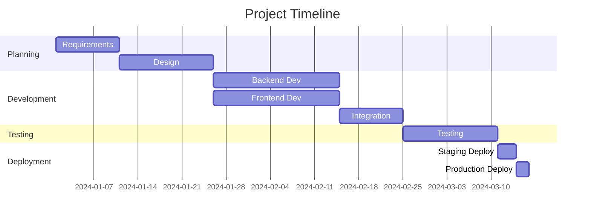

# Project Planning

## Overview

Project planning is the foundation of successful software delivery. This guide covers comprehensive planning methodologies, tools, and templates for software projects.

---

## 1. Project Initiation

### Project Charter Template

```markdown
# Project Charter

## Project Information
- **Project Name**: [Name]
- **Project ID**: [ID]
- **Sponsor**: [Name]
- **Project Manager**: [Name]
- **Start Date**: [Date]
- **Target End Date**: [Date]

## Business Case
[Describe the business problem and opportunity]

## Project Objectives
- [Objective 1]
- [Objective 2]
- [Objective 3]

## Success Criteria
- [ ] [Criterion 1]
- [ ] [Criterion 2]
- [ ] [Criterion 3]

## Key Stakeholders
| Role | Name | Contact | Interest Level |
|------|------|---------|----------------|
| Sponsor | | | High |
| Technical Lead | | | High |
| Business Owner | | | Medium |

## High-Level Scope
[Describe what is in scope and what is out of scope]

## Initial Budget
[Estimated budget allocation]

## Risks and Constraints
[Risks, constraints, and assumptions]

## Approvals
| Role | Name | Signature | Date |
|------|------|-----------|------|
| Sponsor | | | |
| Project Manager | | | |
```

### Stakeholder Analysis

```markdown
# Stakeholder Analysis

## Stakeholder Register
| Stakeholder | Role | Influence | Interest | Communication Needs |
|-------------|------|------------|----------|---------------------|
| [Name] | [Role] | High/Med/Low | High/Med/Low | [Needs] |

## Stakeholder Map
```
High Influence
    │
    │  [Manage Closely]    [Keep Satisfied]
    │  High Interest      Low Interest
    │
─────┼────────────────────────────
    │
    │  [Keep Informed]    [Monitor]
    │  High Interest      Low Interest
    │
Low Influence
```

---

## 2. Scope Definition

### Scope Statement Template

```markdown
# Scope Statement

## Project Description
[Brief description of the project]

## Project Boundaries

### In Scope
- [Feature 1]
- [Feature 2]
- [Integration with X]
- [Platform Y support]

### Out of Scope
- [Feature A - deferred to Phase 2]
- [Platform Z - not supported]
- [Third-party integration B]

## Deliverables
| Deliverable | Description | Due Date | Owner |
|-------------|-------------|----------|-------|
| [Name] | [Description] | [Date] | [Owner] |

## Acceptance Criteria
[Criteria for project acceptance]

## Constraints
- [Technical constraints]
- [Budget constraints]
- [Time constraints]

## Assumptions
- [Assumption 1]
- [Assumption 2]
```

---

## 3. Work Breakdown Structure (WBS)

### WBS Principles

1. **100% Rule**: The WBS includes 100% of the work defined by the project scope
2. **Mutually Exclusive**: No overlap between work elements
3. **Level of Detail**: Break down to manageable work packages (typically 40-80 hours)

### WBS Template

```
Project Name
├── 1.0 Project Management
│   ├── 1.1 Planning
│   ├── 1.2 Monitoring & Control
│   └── 1.3 Reporting
├── 2.0 Requirements
│   ├── 2.1 Elicitation
│   ├── 2.2 Analysis
│   └── 2.3 Documentation
├── 3.0 Design
│   ├── 3.1 Architecture
│   ├── 3.2 UI/UX Design
│   └── 3.3 Database Design
├── 4.0 Development
│   ├── 4.1 Backend
│   ├── 4.2 Frontend
│   └── 4.3 Integration
├── 5.0 Testing
│   ├── 5.1 Unit Testing
│   ├── 5.2 Integration Testing
│   └── 5.3 UAT
└── 6.0 Deployment
    ├── 6.1 Staging
    └── 6.2 Production
```

### Work Package Template

```markdown
# Work Package: [ID] [Name]

## Description
[Detailed description of the work package]

## Deliverables
- [Deliverable 1]
- [Deliverable 2]

## Effort Estimate
- Optimistic: [hours]
- Most Likely: [hours]
- Pessimistic: [hours]
- Expected: [hours]

## Dependencies
- Predecessors: [IDs]
- Successors: [IDs]

## Owner
[Name]

## Acceptance Criteria
- [ ] [Criteria 1]
- [ ] [Criteria 2]
```

---

## 4. Timeline Planning

### Sprint Planning Template

```markdown
# Sprint [Number] Plan

## Sprint Goal
[One-sentence goal for this sprint]

## Sprint Details
- **Sprint Number**: [N]
- **Duration**: [2 weeks]
- **Start Date**: [Date]
- **End Date**: [Date]

## Capacity
| Developer | Hours Available | % Allocation | Hours Allocated |
|-----------|-----------------|--------------|-----------------|
| [Name] | 80 | 80% | 64 |
| [Name] | 80 | 100% | 80 |
| **Total** | **160** | | **144** |

## Sprint Backlog
| Story ID | Story Name | Points | Owner | Status |
|----------|------------|--------|-------|--------|
| US-101 | [Story] | 5 | [Name] | To Do |
| US-102 | [Story] | 3 | [Name] | To Do |

## Velocity Target
- **Previous Velocity**: [points]
- **Target Velocity**: [points]
- **Total Points Planned**: [points]

## Risks and Blockers
- [Risk/Blocker 1]
- [Risk/Blocker 2]
```

### Milestone Planning Template

```markdown
# Project Milestones

## Milestone Timeline

| Milestone | Description | Target Date | Actual Date | Status |
|-----------|-------------|-------------|-------------|--------|
| M1 | Requirements Complete | [Date] | | Planned |
| M2 | Design Complete | [Date] | | Planned |
| M3 | Alpha Release | [Date] | | Planned |
| M4 | Beta Release | [Date] | | Planned |
| M5 | Go Live | [Date] | | Planned |

## Milestone Details

### M1: Requirements Complete
**Description**: All requirements documented and approved
**Deliverables**:
- [ ] Requirements Document
- [ ] User Stories
- [ ] Acceptance Criteria
**Dependencies**: Project kickoff complete
**Owner**: [Name]
```

---

## 5. Resource Allocation

### Resource Planning Template

```markdown
# Resource Plan

## Team Composition

### Development Team
| Role | FTE | Start Date | End Date | Skills Required |
|------|-----|------------|----------|-----------------|
| Senior Developer | 1.0 | [Date] | [Date] | [Skills] |
| Frontend Developer | 0.5 | [Date] | [Date] | [Skills] |
| Backend Developer | 1.0 | [Date] | [Date] | [Skills] |

### Supporting Roles
| Role | % Allocation | Responsibilities |
|------|--------------|------------------|
| Product Owner | 25% | Prioritization, requirements |
| Scrum Master | 25% | Process facilitation |
| QA Engineer | 50% | Testing, quality assurance |

## Resource Utilization

### Resource Loading Chart
```
Week:  1  2  3  4  5  6  7  8  9  10
Dev1:  █  █  █  █  █  █  █  █  █  █
Dev2:  █  █  █  █  █  █  █  █  █  █
Dev3:  █  █  █  █  █  █  █  █  █  █
       Legend: █ = 100% allocation
```

## Resource Risks
| Risk | Impact | Mitigation |
|------|--------|------------|
| Key developer unavailable | High | Cross-training, documentation |
| Resource shortage | Medium | Contractor backup plan |
```

---

## 6. Dependency Mapping

### Dependency Types

| Type | Symbol | Description |
|------|--------|-------------|
| Finish-to-Start (FS) | → | Task A must finish before Task B starts |
| Start-to-Start (SS) | →→ | Task A and B start together |
| Finish-to-Finish (FF) | →→ | Task A and B finish together |
| Start-to-Finish (SF) | → | Task A starts before Task B finishes |

### Dependency Matrix Template

```markdown
# Dependency Matrix

## Task Dependencies

| Task ID | Task Name | Predecessors | Successors | Type | Lag |
|---------|-----------|--------------|------------|------|-----|
| T-001 | Setup Database | - | T-005 | - | - |
| T-002 | API Design | - | T-004, T-006 | - | - |
| T-003 | UI Mockups | - | T-007 | - | - |
| T-004 | API Implementation | T-002 | T-008 | FS | 0 |
| T-005 | Database Migration | T-001 | T-008 | FS | 0 |

## Critical Path Analysis
[Identify tasks on critical path]

## External Dependencies
| Dependency | Source | Impact | Mitigation |
|------------|--------|--------|------------|
| [Name] | [External] | [Impact] | [Mitigation] |
```

---

## 7. Risk Identification

### Risk Register Template

```markdown
# Risk Register

## Risk Assessment Matrix

```
High Impact
    │
    │  [High Priority]    [Medium Priority]
    │  High Probability   Low Probability
    │
─────┼────────────────────────────
    │
    │  [Medium Priority] [Low Priority]
    │  High Probability   Low Probability
    │
Low Impact
```

## Identified Risks

| Risk ID | Risk Description | Category | Probability | Impact | Risk Score | Mitigation Strategy | Owner | Status |
|---------|------------------|----------|-------------|--------|------------|---------------------|-------|--------|
| R-001 | [Description] | Technical | High | High | 15 | [Strategy] | [Name] | Open |
| R-002 | [Description] | Schedule | Medium | High | 10 | [Strategy] | [Name] | Open |

## Risk Response Strategies
- **Avoid**: Eliminate the threat
- **Mitigate**: Reduce probability or impact
- **Transfer**: Shift responsibility (insurance, outsourcing)
- **Accept**: Acknowledge and monitor

## Risk Monitoring
[Schedule for risk review meetings]
```

---

## 8. Milestone Setting

### Milestone Definition Template

```markdown
# Milestone Definition

## Milestone: [Name]

### Description
[Clear description of what the milestone represents]

### Success Criteria
- [ ] [Criterion 1]
- [ ] [Criterion 2]
- [ ] [Criterion 3]

### Deliverables
| Deliverable | Format | Owner | Due Date |
|-------------|--------|-------|----------|
| [Name] | [Format] | [Owner] | [Date] |

### Dependencies
- Internal: [List]
- External: [List]

### Approval Required
| Approver | Role | Approval Criteria |
|----------|------|-------------------|
| [Name] | [Role] | [Criteria] |

### Contingency Plans
[What to do if milestone is at risk]
```

---

## 9. Gantt Charts

### Gantt Chart Template (Mermaid)



### Gantt Chart Best Practices

1. **Level of Detail**: Show major phases, not every task
2. **Dependencies**: Clearly show task relationships
3. **Milestones**: Mark key deliverables with diamonds
4. **Progress**: Update actual vs. planned dates
5. **Critical Path**: Highlight tasks that affect project end date

---

## 10. Critical Path Method

### Critical Path Analysis

```markdown
# Critical Path Analysis

## Network Diagram
[Draw task network with durations]

## Task Durations and Float

| Task | Duration | Early Start | Early Finish | Late Start | Late Finish | Float | Critical? |
|------|----------|-------------|--------------|------------|-------------|-------|-----------|
| A | 5 | 0 | 5 | 0 | 5 | 0 | Yes |
| B | 3 | 0 | 3 | 2 | 5 | 2 | No |
| C | 4 | 5 | 9 | 5 | 9 | 0 | Yes |
| D | 2 | 3 | 5 | 7 | 9 | 4 | No |
| E | 3 | 9 | 12 | 9 | 12 | 0 | Yes |

## Critical Path
A → C → E = 12 days (Project Duration)

## Float Calculation
- **Total Float**: Late Finish - Early Finish
- **Free Float**: Early Start (successor) - Early Finish - 1
- **Critical Tasks**: Zero float

## Implications
- Delay in critical tasks delays entire project
- Resources can be shifted from non-critical to critical tasks
- Focus monitoring on critical path
```

---

## 11. Agile vs Waterfall Planning

### Comparison

| Aspect | Waterfall | Agile |
|--------|-----------|-------|
| Planning | Upfront, detailed | Iterative, adaptive |
| Scope | Fixed, well-defined | Evolving, flexible |
| Timeline | Fixed dates | Timeboxed iterations |
| Requirements | Documented upfront | Emergent, refined |
| Changes | Difficult, costly | Welcomed, expected |
| Risk | Identified early | Managed continuously |
| Delivery | End of project | Incremental releases |

### When to Use Each

**Use Waterfall When:**
- Requirements are well-understood and stable
- Technology is proven and familiar
- Regulatory compliance requires detailed documentation
- Fixed budget and timeline are critical
- Stakeholders prefer traditional approach

**Use Agile When:**
- Requirements are uncertain or evolving
- Innovation and experimentation are needed
- Rapid time-to-market is important
- Stakeholder collaboration is possible
- Team is experienced and self-organizing

### Hybrid Approach

```markdown
# Hybrid Planning Template

## Phase 1: Waterfall (Foundation)
- [ ] Requirements gathering (2 weeks)
- [ ] Architecture design (2 weeks)
- [ ] Infrastructure setup (1 week)

## Phase 2: Agile (Development)
- Sprint 1-4: Core features (8 weeks)
- Sprint 5-6: Enhancements (4 weeks)
- Sprint 7-8: Polish and optimization (4 weeks)

## Phase 3: Waterfall (Deployment)
- [ ] UAT (1 week)
- [ ] Production deployment (1 week)
- [ ] Hypercare (2 weeks)
```

---

## 12. Planning Tools

### Tool Comparison

| Tool | Type | Best For | Cost |
|------|------|----------|------|
| Jira | Agile/Waterfall | Software teams | $7-14/user/mo |
| Asana | General purpose | Cross-functional teams | $10-25/user/mo |
| Monday.com | Visual | Project tracking | $8-16/user/mo |
| Microsoft Project | Traditional | Large enterprises | $10-30/user/mo |
| ClickUp | All-in-one | Growing teams | $7-19/user/mo |
| Linear | Developer-focused | Software teams | $8-12/user/mo |
| GitHub Projects | Developer-focused | Open source/GitHub users | Free |

### Tool Selection Criteria

```markdown
# Planning Tool Selection

## Requirements
- [ ] Supports Agile/Waterfall
- [ ] Integrates with existing tools
- [ ] Mobile app available
- [ ] Customizable workflows
- [ ] Reporting capabilities
- [ ] Budget constraints

## Evaluation Matrix

| Feature | Tool A | Tool B | Tool C | Weight |
|---------|--------|--------|--------|--------|
| Ease of Use | 4 | 5 | 3 | 20% |
| Features | 5 | 4 | 4 | 30% |
| Integration | 3 | 5 | 4 | 20% |
| Cost | 4 | 3 | 5 | 15% |
| Support | 4 | 4 | 3 | 15% |
| **Total** | **4.05** | **4.2** | **3.75** | 100% |

## Recommendation
[Selected tool with justification]
```

---

## 13. Planning Templates

### Project Plan Template

```markdown
# Project Plan: [Project Name]

## Executive Summary
[Brief overview of the project]

## 1. Project Overview
- **Project Name**: [Name]
- **Project Manager**: [Name]
- **Sponsor**: [Name]
- **Start Date**: [Date]
- **End Date**: [Date]
- **Budget**: [Amount]

## 2. Objectives
1. [Objective 1]
2. [Objective 2]
3. [Objective 3]

## 3. Scope
### In Scope
- [Item 1]
- [Item 2]

### Out of Scope
- [Item 1]
- [Item 2]

## 4. Deliverables
| Deliverable | Description | Due Date | Owner |
|-------------|-------------|----------|-------|
| [Name] | [Description] | [Date] | [Owner] |

## 5. Timeline
[Insert Gantt chart or milestone table]

## 6. Resources
| Role | Name | Allocation |
|------|------|------------|
| [Role] | [Name] | [%] |

## 7. Budget
| Category | Budget | Actual | Variance |
|----------|--------|--------|----------|
| Personnel | | | |
| Infrastructure | | | |
| Software | | | |
| **Total** | | | |

## 8. Risks
[Refer to Risk Register]

## 9. Communication Plan
| Stakeholder | Frequency | Method | Content |
|-------------|-----------|--------|---------|
| [Name] | Weekly | Email | Status update |

## 10. Change Management
[Process for handling changes]

## 11. Quality Plan
[Quality standards and procedures]

## 12. Approval
| Role | Name | Signature | Date |
|------|------|-----------|------|
| Sponsor | | | |
| Project Manager | | | |
```

### Sprint Backlog Template

```markdown
# Sprint Backlog - Sprint [N]

## Sprint Goal
[One-sentence goal]

## Stories

### [Story ID]: [Story Name]
**Points**: [N]
**Owner**: [Name]

**Tasks**:
- [ ] [Task 1] - [Owner]
- [ ] [Task 2] - [Owner]

**Acceptance Criteria**:
- [ ] [Criterion 1]
- [ ] [Criterion 2]

---

### [Story ID]: [Story Name]
**Points**: [N]
**Owner**: [Name]

**Tasks**:
- [ ] [Task 1] - [Owner]
- [ ] [Task 2] - [Owner]

**Acceptance Criteria**:
- [ ] [Criterion 1]
- [ ] [Criterion 2]

## Sprint Capacity
- **Team Velocity**: [points]
- **Planned Points**: [points]
- **Remaining Capacity**: [points]

## Impediments
- [Impediment 1]
- [Impediment 2]
```

### Release Plan Template

```markdown
# Release Plan

## Release Information
- **Release Name**: [Name]
- **Release Date**: [Date]
- **Version**: [X.Y.Z]

## Release Goals
1. [Goal 1]
2. [Goal 2]

## Features by Release

### Release 1.0 - [Date]
| Feature | Priority | Status | Owner |
|---------|----------|--------|-------|
| [Feature] | P0 | In Progress | [Name] |

### Release 1.1 - [Date]
| Feature | Priority | Status | Owner |
|---------|----------|--------|-------|
| [Feature] | P1 | Planned | [Name] |

### Release 2.0 - [Date]
| Feature | Priority | Status | Owner |
|---------|----------|--------|-------|
| [Feature] | P0 | Planned | [Name] |

## Dependencies
- [Dependency 1]
- [Dependency 2]

## Risks
- [Risk 1]
- [Risk 2]

## Success Metrics
- [Metric 1]: [Target]
- [Metric 2]: [Target]

## Rollback Plan
[Procedure for rollback if needed]
```

---

## Best Practices

### Planning Best Practices

1. **Involve the Team**: Get input from those who will do the work
2. **Be Realistic**: Avoid optimistic bias in estimates
3. **Plan for Uncertainty**: Include buffers and contingency plans
4. **Iterate and Refine**: Update plans as you learn more
5. **Track Progress**: Monitor actuals vs. planned regularly
6. **Communicate Changes**: Keep stakeholders informed of plan updates
7. **Focus on Value**: Prioritize features that deliver the most value
8. **Balance Flexibility**: Maintain enough structure without being rigid
9. **Learn from Past**: Use historical data to improve future planning
10. **Document Decisions**: Keep a record of planning decisions and rationale

### Common Pitfalls to Avoid

1. **Over-planning**: Spending too much time planning instead of executing
2. **Under-planning**: Not planning enough and missing critical items
3. **Ignoring Risks**: Failing to identify and plan for risks
4. **Fixed Mindset**: Being unwilling to adapt plans as needed
5. **Siloed Planning**: Not involving cross-functional stakeholders
6. **Micromanagement**: Planning at too granular a level
7. **Unrealistic Expectations**: Setting impossible timelines or budgets
8. **Skipping Documentation**: Not documenting decisions and assumptions
9. **Ignoring Dependencies**: Missing critical task relationships
10. **No Contingency**: Not having backup plans for when things go wrong

---

## Quick Reference

### Planning Checklist

```markdown
## Project Planning Checklist

### Initiation
- [ ] Project charter created and approved
- [ ] Stakeholders identified and engaged
- [ ] Business case documented
- [ ] Objectives and success criteria defined

### Scope
- [ ] Scope statement documented
- [ ] In/out of scope clearly defined
- [ ] Deliverables identified
- [ ] Acceptance criteria established

### Work Breakdown
- [ ] WBS created
- [ ] Work packages defined
- [ ] Estimates completed
- [ ] Dependencies mapped

### Schedule
- [ ] Timeline developed
- [ ] Milestones set
- [ ] Critical path identified
- [ ] Resource loading balanced

### Resources
- [ ] Team assembled
- [ ] Roles and responsibilities defined
- [ ] Resource allocation planned
- [ ] Training needs identified

### Risk
- [ ] Risks identified
- [ ] Impact and probability assessed
- [ ] Mitigation strategies defined
- [ ] Risk register created

### Communication
- [ ] Communication plan developed
- [ ] Reporting schedule established
- [ ] Stakeholder preferences documented
- [ ] Tools and processes selected

### Quality
- [ ] Quality standards defined
- [ ] Testing strategy planned
- [ ] Acceptance criteria documented
- [ ] Review checkpoints established
```

### Planning Metrics

| Metric | Description | Target |
|--------|-------------|--------|
| Planning Accuracy | (Actual Duration / Planned Duration) | ±10% |
| Estimation Accuracy | (Actual Effort / Estimated Effort) | ±15% |
| Milestone On-Time | % milestones met on schedule | >90% |
| Schedule Variance | (Earned Value - Planned Value) | ≥0 |
| Cost Variance | (Earned Value - Actual Cost) | ≥0 |
