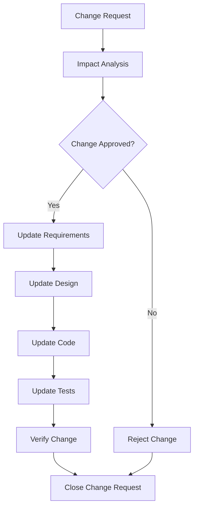

# Requirement Analysis

## Overview

Requirement analysis is the process of defining, documenting, and maintaining requirements throughout a software project. This guide covers techniques, templates, and best practices for effective requirement management.

---

## 1. Types of Requirements

### Functional Requirements

Functional requirements describe what the system must do. They specify behaviors, features, and capabilities.

```markdown
# Functional Requirements Template

## FR-001: User Authentication

**Description**: Users must be able to authenticate using email and password.

**Priority**: P0 (Critical)

**Acceptance Criteria**:
- [ ] User can register with email and password
- [ ] User can login with valid credentials
- [ ] Invalid credentials show appropriate error message
- [ ] Password must be at least 8 characters
- [ ] Password must contain at least one uppercase, one lowercase, and one number
- [ ] Session expires after 30 minutes of inactivity

**Dependencies**: None

**Notes**: 
- Passwords must be hashed using bcrypt
- Implement rate limiting for login attempts
```

### Non-Functional Requirements

Non-functional requirements describe how the system performs its functions. They define quality attributes.

```markdown
# Non-Functional Requirements Template

## NFR-001: Performance

**Category**: Performance

**Requirement**: The system must respond to API requests within 200ms for 95% of requests.

**Priority**: P0 (Critical)

**Measurement**:
- Response time measured at API gateway
- 95th percentile response time < 200ms
- Measured under normal load (1000 concurrent users)

**Acceptance Criteria**:
- [ ] API response time < 200ms for 95% of requests
- [ ] Database query time < 50ms for 95% of queries
- [ ] Page load time < 2s for 95% of page loads

---

## NFR-002: Scalability

**Category**: Scalability

**Requirement**: The system must support horizontal scaling to handle 10,000 concurrent users.

**Priority**: P1 (High)

**Acceptance Criteria**:
- [ ] Stateless application design
- [ ] Database connection pooling configured
- [ ] Auto-scaling policies defined
- [ ] Load balancer configured
- [ ] Caching layer implemented

---

## NFR-003: Security

**Category**: Security

**Requirement**: All API endpoints must be protected against common OWASP vulnerabilities.

**Priority**: P0 (Critical)

**Acceptance Criteria**:
- [ ] SQL injection protection implemented
- [ ] XSS protection implemented
- [ ] CSRF protection implemented
- [ ] Input validation on all endpoints
- [ ] Rate limiting implemented
- [ ] Security headers configured
- [ ] Regular security audits performed

---

## NFR-004: Availability

**Category**: Availability

**Requirement**: System uptime must be 99.9% (8.76 hours downtime per year).

**Priority**: P1 (High)

**Acceptance Criteria**:
- [ ] Multi-region deployment
- [ ] Database replication configured
- [ ] Health checks implemented
- [ ] Automated failover configured
- [ ] Backup and recovery procedures documented
- [ ] Disaster recovery plan tested quarterly

---

## NFR-005: Usability

**Category**: Usability

**Requirement**: New users must be able to complete core tasks without external help.

**Priority**: P2 (Medium)

**Acceptance Criteria**:
- [ ] Onboarding flow implemented
- [ ] Contextual help available
- [ ] Clear error messages
- [ ] Consistent UI patterns
- [ ] Accessibility standards met (WCAG 2.1 AA)
```

### Business Requirements

Business requirements describe the business goals and objectives that the system must support.

```markdown
# Business Requirements Template

## BR-001: Increase Revenue

**Description**: Enable new revenue streams through premium features.

**Business Value**: 
- Estimated additional revenue: $100K/month
- Payback period: 6 months
- Competitive advantage in market

**Success Metrics**:
- 10% of free users convert to premium within 3 months
- Average revenue per user increases by 20%
- Customer retention rate > 90%

**Stakeholders**: 
- Product Manager
- Sales Team
- Finance Team

**Priority**: P0 (Critical)

---

## BR-002: Reduce Support Costs

**Description**: Reduce customer support tickets by implementing self-service features.

**Business Value**:
- Estimated cost savings: $50K/month
- Improved customer satisfaction
- Faster resolution times

**Success Metrics**:
- Support ticket volume reduced by 40%
- First contact resolution rate > 70%
- Customer satisfaction score > 4.5/5

**Stakeholders**:
- Customer Support Team
- Product Manager
- Operations Team

**Priority**: P1 (High)
```

### Technical Requirements

Technical requirements describe the technical constraints and specifications for the system.

```markdown
# Technical Requirements Template

## TR-001: Technology Stack

**Description**: System must use approved technology stack.

**Requirements**:
- **Frontend**: React 18+, TypeScript, Tailwind CSS
- **Backend**: Node.js 18+, Express/Fastify
- **Database**: PostgreSQL 14+
- **Cache**: Redis 7+
- **Message Queue**: RabbitMQ or AWS SQS
- **Hosting**: AWS (us-east-1)

**Constraints**:
- No proprietary libraries without approval
- All dependencies must have active maintenance
- Security patches must be applied within 30 days

---

## TR-002: API Standards

**Description**: All APIs must follow RESTful conventions.

**Requirements**:
- Use appropriate HTTP methods (GET, POST, PUT, DELETE, PATCH)
- Use plural nouns for resource names
- Implement pagination for list endpoints
- Use proper status codes
- Provide consistent error response format
- Implement API versioning

**Example**:
```json
{
  "data": { ... },
  "meta": {
    "page": 1,
    "limit": 20,
    "total": 100
  }
}
```

---

## TR-003: Database Standards

**Description**: Database must follow naming and design standards.

**Requirements**:
- Use snake_case for table and column names
- All tables must have `id`, `created_at`, `updated_at` columns
- Use UUID for primary keys
- Implement foreign key constraints
- Add indexes for frequently queried columns
- Use database migrations for schema changes

---

## TR-004: Logging and Monitoring

**Description**: System must have comprehensive logging and monitoring.

**Requirements**:
- Structured logging (JSON format)
- Log levels: ERROR, WARN, INFO, DEBUG
- Include correlation IDs in all logs
- Centralized log aggregation
- Metrics collection for key operations
- Alerting for critical errors
- Log retention: 90 days

**Required Metrics**:
- Request/response times
- Error rates
- Database query times
- Cache hit rates
- Queue lengths
- Resource utilization
```

---

## 2. Requirement Gathering Techniques

### Interviews

**Purpose**: Gather detailed information from stakeholders through one-on-one conversations.

**When to Use**:
- Complex requirements need deep understanding
- Stakeholder has unique knowledge
- Sensitive topics require privacy
- Need to understand motivations and constraints

**Interview Template**:

```markdown
# Stakeholder Interview

## Interview Information
- **Stakeholder**: [Name, Role]
- **Interviewer**: [Name]
- **Date**: [Date]
- **Duration**: [Time]
- **Location**: [In-person/Video/Phone]

## Preparation
- [ ] Review background materials
- [ ] Prepare interview questions
- [ ] Confirm schedule with stakeholder
- [ ] Set up recording (if approved)

## Interview Questions

### Opening Questions
1. Can you describe your role and responsibilities?
2. What are your goals for this project?
3. What success looks like to you?

### Process Questions
4. Can you walk me through your current workflow?
5. What are the pain points in your current process?
6. What would make your job easier?

### Feature Questions
7. What features are most important to you?
8. What features would you like to see added?
9. Are there any features you don't need?

### Technical Questions
10. What systems do you currently use?
11. What are your technical constraints?
12. What are your security requirements?

### Closing Questions
13. Is there anything else we should know?
14. Who else should we talk to?
15. How would you like to be involved going forward?

## Key Insights
[Document key insights and quotes]

## Action Items
- [ ] [Action item 1]
- [ ] [Action item 2]

## Follow-up
[Schedule follow-up if needed]
```

### Workshops

**Purpose**: Collaborative sessions with multiple stakeholders to gather and refine requirements.

**When to Use**:
- Need input from multiple stakeholders
- Requirements need consensus
- Complex interdependencies exist
- Want to generate creative solutions

**Workshop Template**:

```markdown
# Requirements Workshop

## Workshop Information
- **Topic**: [Topic]
- **Facilitator**: [Name]
- **Date**: [Date]
- **Duration**: [Time]
- **Location**: [Location]

## Objectives
1. [Objective 1]
2. [Objective 2]
3. [Objective 3]

## Participants
| Name | Role | Expectations |
|------|------|--------------|
| [Name] | [Role] | [Expectations] |

## Agenda

### Introduction (15 min)
- Welcome and objectives
- Ground rules
- Introductions

### Current State Review (20 min)
- Review current process
- Identify pain points
- Brainstorm improvements

### Requirements Brainstorming (30 min)
- Individual brainstorming
- Group discussion
- Categorize requirements

### Prioritization (20 min)
- Review requirements
- Prioritize using MoSCoW
- Identify dependencies

### Next Steps (15 min)
- Action items
- Assign owners
- Schedule follow-up

## Materials Needed
- [ ] Whiteboard or flipchart
- [ ] Sticky notes
- [ ] Markers
- [ ] Laptop with projector

## Ground Rules
1. Everyone participates
2. No idea is wrong
3. Respect different opinions
4. Stay focused on objectives
5. Document everything

## Outputs
- [ ] List of requirements
- [ ] Prioritized backlog
- [ ] Action items
- [ ] Follow-up meetings scheduled
```

### Surveys

**Purpose**: Gather quantitative data from a large number of users or stakeholders.

**When to Use**:
- Need input from many people
- Want to quantify preferences
- Geographic distribution makes interviews impractical
- Need baseline metrics

**Survey Template**:

```markdown
# Requirements Survey

## Survey Information
- **Title**: [Title]
- **Target Audience**: [Audience]
- **Launch Date**: [Date]
- **Close Date**: [Date]
- **Expected Responses**: [Number]

## Survey Questions

### Section 1: Demographics
1. What is your role?
   - [ ] Developer
   - [ ] Product Manager
   - [ ] Designer
   - [ ] Other: _______

2. How long have you been with the company?
   - [ ] Less than 1 year
   - [ ] 1-3 years
   - [ ] 3-5 years
   - [ ] More than 5 years

### Section 2: Current Process
3. How satisfied are you with the current process?
   - [ ] Very Dissatisfied
   - [ ] Dissatisfied
   - [ ] Neutral
   - [ ] Satisfied
   - [ ] Very Satisfied

4. What are the biggest challenges with the current process? (Select all that apply)
   - [ ] Time-consuming
   - [ ] Error-prone
   - [ ] Lack of features
   - [ ] Poor user experience
   - [ ] Integration issues
   - [ ] Other: _______

### Section 3: Feature Priorities
5. Please rank the following features from most important (1) to least important (5):
   - [ ] Feature A
   - [ ] Feature B
   - [ ] Feature C
   - [ ] Feature D
   - [ ] Feature E

6. On a scale of 1-10, how important is [specific feature] to you?
   - [ ] 1  [ ] 2  [ ] 3  [ ] 4  [ ] 5
   - [ ] 6  [ ] 7  [ ] 8  [ ] 9  [ ] 10

### Section 4: Open Feedback
7. What would make your job easier?

8. Any other feedback or suggestions?

## Analysis Plan
- [ ] Compile responses
- [ ] Identify trends and patterns
- [ ] Calculate statistics
- [ ] Generate insights report
```

### Prototyping

**Purpose**: Create visual or functional representations to validate requirements with stakeholders.

**When to Use**:
- Requirements are unclear or ambiguous
- Need to demonstrate complex interactions
- Want early feedback on design
- Need to validate user flows

**Prototyping Template**:

```markdown
# Prototype Validation

## Prototype Information
- **Name**: [Name]
- **Type**: [Wireframe/Mockup/Interactive]
- **Tool**: [Figma/Sketch/Code]
- **Version**: [X.X]
- **Date**: [Date]

## Purpose
[What this prototype is designed to validate]

## Features Demonstrated
- [ ] [Feature 1]
- [ ] [Feature 2]
- [ ] [Feature 3]

## Validation Plan

### Reviewers
| Name | Role | Focus Area |
|------|------|------------|
| [Name] | [Role] | [Focus] |

### Feedback Questions
1. Does this meet your needs?
2. What would you change?
3. What's missing?
4. What's confusing?
5. How would you improve this?

### Feedback Collection
[Method for collecting feedback]

## Feedback Summary

### Positive Feedback
[What reviewers liked]

### Constructive Feedback
[Areas for improvement]

### Action Items
- [ ] [Action item 1]
- [ ] [Action item 2]

## Next Steps
[Plan for iterating on prototype]
```

---

## 3. User Stories vs Use Cases

### User Stories

User stories are short, simple descriptions of a feature from the perspective of the user.

**Format**: As a [type of user], I want [some goal] so that [some reason].

```markdown
# User Story Template

## US-001: User Registration

**As a** new user,
**I want** to create an account with my email and password,
**So that** I can access the platform's features.

**Priority**: P0

**Story Points**: 5

**Acceptance Criteria**:
- [ ] User can navigate to registration page
- [ ] User can enter email, password, and confirm password
- [ ] System validates email format
- [ ] System validates password strength
- [ ] System checks if email already exists
- [ ] User receives confirmation email
- [ ] User is logged in after registration
- [ ] User profile is created with default settings

**Definition of Done**:
- [ ] Code reviewed
- [ ] Unit tests written
- [ ] Integration tests passed
- [ ] Documentation updated
- [ ] Deployed to staging
- [ ] QA approved

**Dependencies**: None

**Notes**:
- Password must be hashed using bcrypt
- Email verification required before full access
```

### Use Cases

Use cases are detailed descriptions of system interactions, including all possible scenarios.

```markdown
# Use Case Template

## UC-001: User Registration

### Use Case Information
- **Name**: User Registration
- **ID**: UC-001
- **Actor**: Unauthenticated User
- **Priority**: High
- **Complexity**: Medium

### Description
A new user creates an account on the platform by providing email and password credentials.

### Preconditions
- User has access to the registration page
- User has a valid email address

### Main Flow (Happy Path)
1. User navigates to the registration page
2. User enters email address
3. User enters password
4. User enters password confirmation
5. User clicks "Create Account" button
6. System validates email format
7. System validates password strength
8. System checks if email already exists
9. System creates user account
10. System sends confirmation email
11. System displays success message
12. User is logged in automatically

### Alternative Flows

**Alt Flow 1: Invalid Email Format**
6a. System detects invalid email format
7a. System displays error message: "Please enter a valid email address"
8a. Use case returns to step 2

**Alt Flow 2: Weak Password**
7a. System detects weak password
8a. System displays error message: "Password must contain at least 8 characters, including uppercase, lowercase, and numbers"
9a. Use case returns to step 3

**Alt Flow 3: Password Mismatch**
5a. User enters different passwords in password and confirmation fields
6a. System displays error message: "Passwords do not match"
7a. Use case returns to step 3

**Alt Flow 4: Email Already Exists**
8a. System detects email already registered
9a. System displays error message: "An account with this email already exists. Would you like to log in instead?"
10a. Use case ends

### Postconditions
- User account is created in database
- User is logged in
- Confirmation email is sent
- User profile is initialized with default settings

### Business Rules
1. Password must be at least 8 characters
2. Password must contain at least one uppercase letter
3. Password must contain at least one lowercase letter
4. Password must contain at least one number
5. Email must be in valid format
6. Email must be unique across all users

### Functional Requirements
- FR-001: User Registration
- FR-002: Email Validation
- FR-003: Password Validation

### Non-Functional Requirements
- NFR-001: Performance (registration completes within 2 seconds)
- NFR-003: Security (passwords hashed)

### Notes
- Consider implementing social login options in future
- Consider adding CAPTCHA for spam prevention
```

### Comparison

| Aspect | User Stories | Use Cases |
|--------|--------------|-----------|
| Format | Short, simple narrative | Detailed, structured document |
| Focus | User value and benefit | System interactions and flows |
| Detail Level | High-level, concise | Comprehensive, detailed |
| Use Case | Agile, iterative planning | Traditional, comprehensive analysis |
| Time to Create | Minutes | Hours to days |
| Audience | Development team | All stakeholders |
| Change Management | Easy to modify | More complex to update |
| Best For | Sprint planning, backlog | System documentation, contracts |

---

## 4. Acceptance Criteria

### Acceptance Criteria Template

```markdown
# Acceptance Criteria Template

## Story: [Story Name]
**ID**: [Story ID]
**Points**: [Story Points]

## Acceptance Criteria

### Functional Criteria
- [ ] [Criterion 1]
- [ ] [Criterion 2]
- [ ] [Criterion 3]

### Non-Functional Criteria
- [ ] [Criterion 1]
- [ ] [Criterion 2]

### Edge Cases
- [ ] [Edge case 1]
- [ ] [Edge case 2]

### Error Handling
- [ ] [Error scenario 1]
- [ ] [Error scenario 2]

### Performance
- [ ] [Performance requirement]
- [ ] [Performance requirement]

## Test Cases
| Test Case | Description | Expected Result |
|-----------|-------------|----------------|
| TC-001 | [Description] | [Expected result] |
| TC-002 | [Description] | [Expected result] |

## Definition of Done
- [ ] Code implemented
- [ ] Unit tests written and passing
- [ ] Integration tests written and passing
- [ ] Code reviewed
- [ ] Documentation updated
- [ ] Deployed to staging
- [ ] QA approved
- [ ] Product owner accepted
```

### Acceptance Criteria Examples

```markdown
# Example: Password Reset

## Acceptance Criteria

### User Flow
- [ ] User can request password reset from login page
- [ ] User enters email address
- [ ] System sends reset link to email
- [ ] User clicks reset link within 1 hour
- [ ] User enters new password
- [ ] User confirms new password
- [ ] Password is updated
- [ ] User is redirected to login page

### Validation
- [ ] Email format is validated
- [ ] Email must exist in system
- [ ] Reset link expires after 1 hour
- [ ] Reset link can only be used once
- [ ] New password must meet strength requirements
- [ ] Password and confirmation must match

### Error Handling
- [ ] Invalid email shows "Email not found" message
- [ ] Expired link shows "Link expired" message
- [ ] Used link shows "Link already used" message
- [ ] Weak password shows strength requirements

### Security
- [ ] Reset token is cryptographically secure
- [ ] Rate limiting applied (max 5 requests per hour per email)
- [ ] Old password is invalidated
- [ ] User is logged out of all sessions

### Performance
- [ ] Reset email sent within 5 seconds
- [ ] Password update completes within 2 seconds

---

# Example: Search Functionality

## Acceptance Criteria

### Basic Search
- [ ] User can enter search query in search box
- [ ] Results display within 2 seconds
- [ ] Results are sorted by relevance
- [ ] Pagination shows 20 results per page

### Search Features
- [ ] Search is case-insensitive
- [ ] Partial matches are supported
- [ ] Fuzzy matching for typos
- [ ] Search in multiple fields (title, description, tags)
- [ ] Filters available (category, date, author)

### Empty Results
- [ ] "No results found" message displayed
- [ ] Suggestions for related searches shown
- [ ] Option to broaden search criteria

### Performance
- [ ] Search completes within 2 seconds for 100K records
- [ ] Search completes within 5 seconds for 1M records
- [ ] Caching implemented for common queries

### Analytics
- [ ] Search queries logged
- [ ] Click-through rates tracked
- [ ] Zero-result queries flagged for review
```

---

## 5. MoSCoW Prioritization

MoSCoW is a prioritization technique used to reach a common understanding on the importance of requirements.

```markdown
# MoSCoW Prioritization Template

## MoSCoW Definitions

| Priority | Description | Inclusion |
|----------|-------------|-----------|
| **M** - Must Have | Critical requirements that must be delivered for project success | Definitely included |
| **S** - Should Have | Important requirements but not critical for initial release | Included if time permits |
| **C** - Could Have | Desirable requirements that can be deferred | Nice to have |
| **W** - Won't Have | Requirements agreed to exclude from current scope | Not included |

## Priority Matrix

| Requirement ID | Requirement | Priority | Rationale | Dependencies |
|----------------|-------------|----------|-----------|--------------|
| FR-001 | User Authentication | M | Core functionality required | - |
| FR-002 | User Profile | M | Required for personalization | FR-001 |
| FR-003 | Social Login | S | Improves UX but not critical | FR-001 |
| FR-004 | Dark Mode | C | Nice to have feature | - |
| FR-005 | Multi-language | W | Deferred to Phase 2 | - |

## Priority Distribution
- **Must Have**: [N] requirements
- **Should Have**: [N] requirements
- **Could Have**: [N] requirements
- **Won't Have**: [N] requirements

## Trade-offs
[Document any trade-offs made during prioritization]

## Notes
[Additional context about prioritization decisions]
```

### MoSCoW Workshop Template

```markdown
# MoSCoW Prioritization Workshop

## Workshop Information
- **Date**: [Date]
- **Duration**: [Time]
- **Facilitator**: [Name]
- **Participants**: [List]

## Preparation
- [ ] Gather all requirements
- [ ] Create prioritization cards
- [ ] Set up MoSCoW board
- [ ] Define timebox for each category

## Agenda

### Introduction (10 min)
- Explain MoSCoW method
- Review requirements
- Set ground rules

### Must Have (30 min)
- Identify critical requirements
- Discuss and agree on M items
- Document rationale

### Should Have (20 min)
- Identify important but non-critical items
- Discuss and agree on S items
- Document rationale

### Could Have (15 min)
- Identify desirable items
- Discuss and agree on C items
- Document rationale

### Won't Have (15 min)
- Identify items to exclude
- Discuss and agree on W items
- Document rationale

### Review and Commit (10 min)
- Review final prioritization
- Confirm with stakeholders
- Document decisions

## Outputs
- [ ] Prioritized requirements list
- [ ] Rationale for each priority
- [ ] Agreed scope for current release
```

---

## 6. Requirements Documentation

### Requirements Document Template

```markdown
# Software Requirements Specification (SRS)

## Document Information
- **Project**: [Project Name]
- **Version**: [X.X]
- **Date**: [Date]
- **Author**: [Name]
- **Status**: [Draft/Review/Approved]

## Table of Contents
1. Introduction
2. Overall Description
3. System Features
4. External Interface Requirements
5. System Attributes
6. Other Requirements

---

## 1. Introduction

### 1.1 Purpose
[Purpose of this document]

### 1.2 Document Scope
[What is covered in this document]

### 1.3 Intended Audience
[Who should read this document]

### 1.4 References
- [Reference 1]
- [Reference 2]

---

## 2. Overall Description

### 2.1 Product Perspective
[System context and relationships]

### 2.2 Product Functions
[High-level functions]

### 2.3 User Characteristics
[User types and characteristics]

### 2.4 Constraints
[Technical, business, regulatory constraints]

### 2.5 Assumptions and Dependencies
[Assumptions and dependencies]

---

## 3. System Features

### 3.1 Feature 1: [Feature Name]

#### 3.1.1 Description
[Feature description]

#### 3.1.2 Functional Requirements
- FR-001: [Requirement]
- FR-002: [Requirement]

#### 3.1.3 Use Cases
- UC-001: [Use case]

#### 3.1.4 User Stories
- US-001: [User story]

---

## 4. External Interface Requirements

### 4.1 User Interfaces
[UI requirements]

### 4.2 Hardware Interfaces
[Hardware requirements]

### 4.3 Software Interfaces
[Software interfaces and APIs]

### 4.4 Communication Interfaces
[Communication protocols]

---

## 5. System Attributes

### 5.1 Performance
[Performance requirements]

### 5.2 Reliability
[Reliability requirements]

### 5.3 Availability
[Availability requirements]

### 5.4 Security
[Security requirements]

### 5.5 Maintainability
[Maintainability requirements]

---

## 6. Other Requirements

### 6.1 Compliance
[Regulatory compliance]

### 6.2 Localization
[Language and cultural requirements]

### 6.3 Data Requirements
[Data storage and retention]

---

## Appendix A: Glossary
[Term definitions]

## Appendix B: Acronyms
[Acronym definitions]

## Appendix C: Change Log
| Version | Date | Author | Changes |
|---------|------|--------|---------|
| 1.0 | [Date] | [Name] | Initial version |
```

---

## 7. Traceability Matrix

A requirements traceability matrix (RTM) links requirements throughout the development lifecycle.

```markdown
# Requirements Traceability Matrix

## Matrix Template

| Req ID | Requirement | User Story | Use Case | Test Case | Design Doc | Code Module | Status |
|---------|-------------|------------|----------|-----------|-------------|-------------|--------|
| FR-001 | User Authentication | US-001 | UC-001 | TC-001 | DD-001 | auth.ts | Done |
| FR-002 | User Profile | US-002 | UC-002 | TC-002 | DD-002 | profile.ts | In Progress |
| FR-003 | Search | US-003 | UC-003 | TC-003 | DD-003 | search.ts | Planned |

## Traceability Views

### Forward Traceability (Requirements → Test)
[Verify all requirements have test coverage]

### Backward Traceability (Test → Requirements)
[Verify all tests map to requirements]

### Coverage Analysis
- Total Requirements: [N]
- Requirements with Tests: [N]
- Test Coverage: [X]%

### Gaps
[Identify requirements without coverage]

---

## Change Impact Analysis Template

| Change ID | Description | Affected Requirements | Affected Components | Impact Level | Status |
|-----------|-------------|------------------------|---------------------|--------------|--------|
| CR-001 | [Description] | FR-001, FR-002 | auth.ts, user.ts | High | Approved |
| CR-002 | [Description] | FR-003 | search.ts | Medium | Pending |
```

---

## 8. Validation and Verification

### Validation vs Verification

| Aspect | Validation | Verification |
|--------|------------|--------------|
| Question | "Are we building the right product?" | "Are we building the product right?" |
| Focus | User needs and expectations | Requirements and specifications |
| Timing | Throughout development | Throughout development |
| Methods | Reviews, prototyping, testing | Reviews, inspections, testing |
| Output | Confirmed user needs | Confirmed compliance |

### Validation Techniques

```markdown
# Validation Plan

## Validation Activities

### Requirements Review
- [ ] Stakeholder review meetings
- [ ] Walkthrough sessions
- [ ] Formal inspections

### Prototyping
- [ ] Low-fidelity wireframes
- [ ] High-fidelity mockups
- [ ] Interactive prototypes

### User Testing
- [ ] Usability testing
- [ ] Beta testing
- [ ] A/B testing

### Feedback Collection
- [ ] User surveys
- [ ] Focus groups
- [ ] Interviews

## Validation Checklist
- [ ] Requirements align with business goals
- [ ] Requirements address user needs
- [ ] Requirements are feasible
- [ ] Requirements are testable
- [ ] Stakeholders understand requirements
- [ ] Conflicts are resolved
```

### Verification Techniques

```markdown
# Verification Plan

## Verification Activities

### Reviews
- [ ] Requirements review
- [ ] Design review
- [ ] Code review
- [ ] Test plan review

### Inspections
- [ ] Formal inspections
- [ ] Walkthroughs
- [ ] Technical reviews

### Testing
- [ ] Unit testing
- [ ] Integration testing
- [ ] System testing
- [ ] Acceptance testing

### Analysis
- [ ] Static analysis
- [ ] Dynamic analysis
- [ ] Complexity analysis

## Verification Checklist
- [ ] Requirements are complete
- [ ] Requirements are consistent
- [ ] Requirements are unambiguous
- [ ] Requirements are traceable
- [ ] Design satisfies requirements
- [ ] Code satisfies design
- [ ] Tests cover requirements
```

---

## 9. Change Management

### Change Request Template

```markdown
# Change Request

## Request Information
- **CR ID**: CR-[Number]
- **Date**: [Date]
- **Requested By**: [Name]
- **Priority**: [P0/P1/P2/P3]

## Change Description
[Detailed description of the change]

## Rationale
[Why this change is needed]

## Impact Analysis

### Requirements Impact
- [ ] New requirements: [List]
- [ ] Modified requirements: [List]
- [ ] Removed requirements: [List]

### Design Impact
- [ ] Architecture changes: [Description]
- [ ] Database changes: [Description]
- [ ] API changes: [Description]

### Development Impact
- [ ] Effort estimate: [Hours/Days]
- [ ] Affected modules: [List]
- [ ] Risk assessment: [Low/Medium/High]

### Testing Impact
- [ ] New tests needed: [List]
- [ ] Modified tests: [List]
- [ ] Test effort: [Hours/Days]

### Schedule Impact
- [ ] Schedule delay: [Days/Weeks]
- [ ] Milestone impact: [Description]

### Cost Impact
- [ ] Additional cost: [Amount]
- [ ] Budget impact: [Description]

## Risk Assessment
| Risk | Probability | Impact | Mitigation |
|------|-------------|--------|------------|
| [Risk] | [Low/Med/High] | [Low/Med/High] | [Mitigation] |

## Recommendation
[Recommendation: Approve/Reject/Defer]

## Approval
| Role | Name | Decision | Date | Comments |
|------|------|----------|------|----------|
| Product Owner | | | | |
| Tech Lead | | | | |
| Project Manager | | | | |
```

### Change Control Process



---

## 10. Common Pitfalls

### Pitfalls to Avoid

1. **Vague Requirements**
   - Problem: Ambiguous language leads to different interpretations
   - Solution: Use specific, measurable language
   - Example: "System should be fast" → "System should respond within 200ms"

2. **Gold Plating**
   - Problem: Adding features that weren't requested
   - Solution: Focus on agreed scope
   - Example: Adding animations when not specified

3. **Assuming Instead of Asking**
   - Problem: Making assumptions about requirements
   - Solution: Validate with stakeholders
   - Example: Assuming users want dark mode without asking

4. **Ignoring Non-Functional Requirements**
   - Problem: Focusing only on features
   - Solution: Include NFRs from the start
   - Example: Forgetting security, performance, scalability

5. **Not Prioritizing**
   - Problem: Treating all requirements equally
   - Solution: Use MoSCoW or similar method
   - Example: Trying to deliver everything at once

6. **Poor Documentation**
   - Problem: Incomplete or outdated documentation
   - Solution: Keep docs updated and accessible
   - Example: Missing acceptance criteria

7. **Lack of Traceability**
   - Problem: Can't track requirements through development
   - Solution: Use requirements traceability matrix
   - Example: Don't know which tests cover which requirements

8. **Ignoring Stakeholders**
   - Problem: Not involving key stakeholders
   - Solution: Identify and engage all stakeholders
   - Example: Forgetting operations team requirements

9. **Over-Engineering**
   - Problem: Making requirements too complex
   - Solution: Keep it simple (KISS principle)
   - Example: Defining every possible edge case upfront

10. **No Change Management**
    - Problem: Uncontrolled scope changes
    - Solution: Implement change control process
    - Example: Adding features without impact analysis

---

## 11. Templates

### Quick Reference Templates

```markdown
# Requirement Card Template

## [REQ-ID]: [Requirement Title]

**Type**: [Functional/Non-Functional/Business/Technical]
**Priority**: [P0/P1/P2/P3]
**Status**: [New/Approved/In Progress/Done]

**Description**
[Clear, concise description]

**Acceptance Criteria**
- [ ] [Criterion 1]
- [ ] [Criterion 2]

**Dependencies**
- [Dependency 1]
- [Dependency 2]

**Notes**
[Any additional context]

---

# User Story Card Template

## [US-ID]: [Story Title]

**As a** [user type],
**I want** [action],
**So that** [benefit].

**Priority**: [P0/P1/P2/P3]
**Story Points**: [N]

**Acceptance Criteria**
- [ ] [Criterion 1]
- [ ] [Criterion 2]

**Definition of Done**
- [ ] Code implemented
- [ ] Tests written
- [ ] Code reviewed
- [ ] Deployed

**Dependencies**
- [Dependency 1]

---

# Requirements Review Checklist

### Completeness
- [ ] All requirements documented
- [ ] All stakeholders consulted
- [ ] All constraints identified
- [ ] All assumptions documented

### Quality
- [ ] Requirements are clear
- [ ] Requirements are unambiguous
- [ ] Requirements are testable
- [ ] Requirements are feasible

### Consistency
- [ ] No conflicts between requirements
- [ ] No duplicate requirements
- [ ] Terminology is consistent
- [ ] Format is consistent

### Traceability
- [ ] Each requirement has unique ID
- [ ] Requirements linked to business goals
- [ ] Requirements linked to user stories
- [ ] Requirements linked to tests

### Approval
- [ ] Stakeholders reviewed
- [ ] Changes approved
- [ ] Baseline established
- [ ] Version controlled
```

---

## Best Practices

### Requirements Engineering Best Practices

1. **Start with Why**
   - Understand the business problem first
   - Connect requirements to business goals
   - Know the value each requirement delivers

2. **Involve Stakeholders Early**
   - Identify all stakeholders
   - Engage them throughout the process
   - Get their buy-in and commitment

3. **Keep It Simple**
   - Use clear, simple language
   - Avoid technical jargon
   - Be concise but complete

4. **Make Requirements Testable**
   - Define acceptance criteria
   - Include measurable criteria
   - Ensure each requirement can be verified

5. **Prioritize Ruthlessly**
   - Use MoSCoW or similar method
   - Focus on high-value requirements
   - Defer nice-to-have features

6. **Maintain Traceability**
   - Link requirements to business goals
   - Trace through design, code, and tests
   - Use a requirements traceability matrix

7. **Iterate and Refine**
   - Start with high-level requirements
   - Refine as you learn more
   - Be open to change

8. **Document Decisions**
   - Record why decisions were made
   - Document trade-offs
   - Keep a decision log

9. **Communicate Effectively**
   - Use visual aids when helpful
   - Tailor communication to audience
   - Confirm understanding

10. **Manage Change**
    - Establish change control process
    - Analyze impact of changes
    - Keep stakeholders informed

### Quick Tips

- ✅ Write requirements in user language
- ✅ Use active voice and present tense
- ✅ Include examples for clarity
- ✅ Validate requirements with users
- ✅ Keep requirements visible and accessible
- ❌ Don't use ambiguous words like "should", "may", "might"
- ❌ Don't combine multiple requirements in one statement
- ❌ Don't assume technical solutions
- ❌ Don't forget edge cases
- ❌ Don't ignore non-functional requirements
