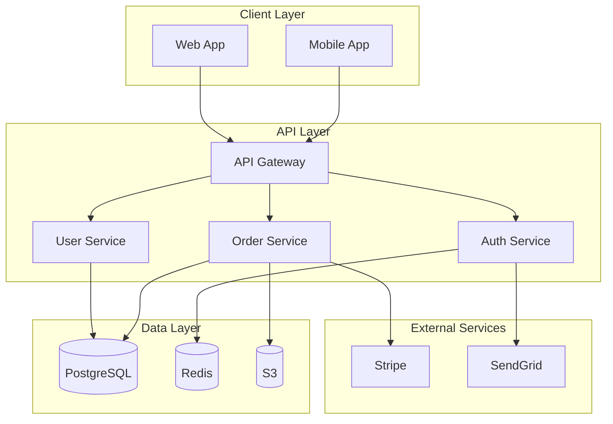
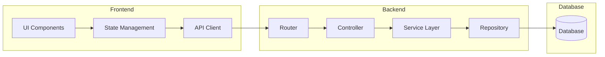
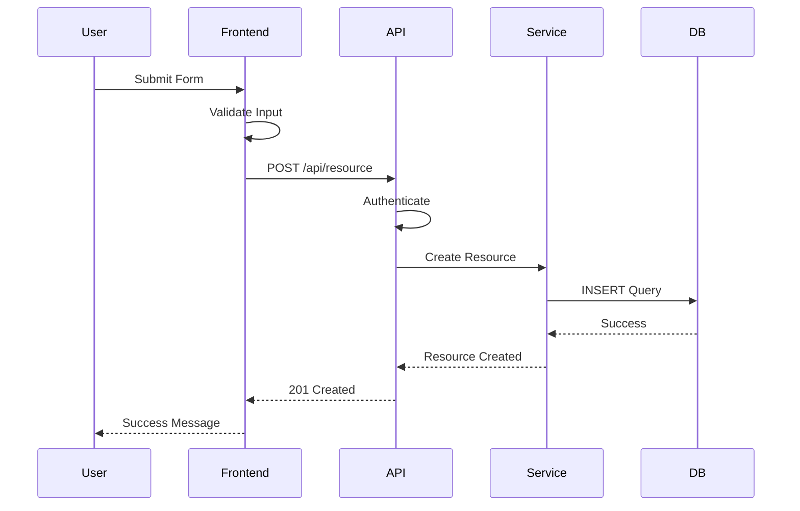

# Technical Specifications

## Overview

Technical specifications (tech specs) are detailed documents that describe how a system or feature will be implemented. They bridge the gap between requirements and code.

---

## 1. Purpose of Technical Specs

### Why Write Technical Specs?

| Benefit | Description |
|---------|-------------|
| **Clarity** | Ensures everyone understands the implementation approach |
| **Alignment** | Aligns team on technical decisions |
| **Review** | Allows for peer review before implementation |
| **Documentation** | Provides permanent record of decisions |
| **Onboarding** | Helps new team members understand the system |
| **Quality** | Reduces bugs and rework |
| **Estimation** | Improves estimation accuracy |
| **Maintenance** | Makes future changes easier |

### When to Write Tech Specs

```markdown
# Tech Spec Decision Matrix

## Write a Tech Spec When:
- [ ] Feature is complex (3+ days of work)
- [ ] Multiple developers are involved
- [ ] Cross-team collaboration is needed
- [ ] Significant architectural changes
- [ ] New technology is being introduced
- [ ] Security or compliance implications
- [ ] Performance requirements are critical
- [ ] Data migration is involved
- [ ] Third-party integrations

## Skip Tech Spec When:
- [ ] Simple bug fix
- [ ] Trivial feature (1 day or less)
- [ ] Urgent hotfix
- [ ] Proof of concept
- [ ] Well-established pattern
```

---

## 2. Structure

### Tech Spec Template

```markdown
# Technical Specification: [Feature/System Name]

## Document Information
- **Project**: [Project Name]
- **Feature**: [Feature Name]
- **Author**: [Name]
- **Date**: [Date]
- **Version**: [X.X]
- **Status**: [Draft/Review/Approved]

---

## Table of Contents
1. Overview
2. Requirements
3. Architecture
4. Data Models
5. API Specifications
6. Security Considerations
7. Performance Requirements
8. Testing Strategy
9. Deployment Plan
10. Risks and Mitigations
11. Open Questions
12. Appendices

---

## 1. Overview

### 1.1 Purpose
[What this spec covers and why it's needed]

### 1.2 Scope
[What's included and what's out of scope]

### 1.3 Stakeholders
| Role | Name | Responsibilities |
|------|------|-------------------|
| Product Owner | | Requirements |
| Tech Lead | | Architecture review |
| Developer | | Implementation |
| QA Engineer | | Testing |

### 1.4 Definitions
[Key terms and acronyms]

---

## 2. Requirements

### 2.1 Functional Requirements
- [FR-001] [Requirement]
- [FR-002] [Requirement]

### 2.2 Non-Functional Requirements
- [NFR-001] [Requirement]
- [NFR-002] [Requirement]

### 2.3 Constraints
- [Constraint 1]
- [Constraint 2]

---

## 3. Architecture

### 3.1 System Architecture
[High-level architecture diagram]

### 3.2 Component Diagram
[Component relationships and interactions]

### 3.3 Data Flow
[How data flows through the system]

### 3.4 Technology Stack
| Component | Technology | Version | Rationale |
|-----------|------------|---------|-----------|
| Frontend | React | 18.2 | Team expertise |
| Backend | Node.js | 18.0 | Team expertise |
| Database | PostgreSQL | 14 | ACID compliance |

---

## 4. Data Models

### 4.1 Entity Relationship Diagram
[ER Diagram]

### 4.2 Database Schema

#### Table: users
| Column | Type | Constraints | Description |
|--------|------|-------------|-------------|
| id | UUID | PK | User ID |
| email | VARCHAR(255) | UNIQUE, NOT NULL | User email |
| password_hash | VARCHAR(255) | NOT NULL | Hashed password |
| created_at | TIMESTAMP | NOT NULL | Creation time |
| updated_at | TIMESTAMP | NOT NULL | Update time |

#### Table: [table_name]
[Additional tables]

### 4.3 Data Migration
[Migration scripts and procedures]

---

## 5. API Specifications

### 5.1 API Overview
[Summary of API endpoints]

### 5.2 Authentication
[Authentication mechanism]

### 5.3 Endpoints

#### POST /api/auth/register
**Description**: Register a new user

**Request Body**:
```json
{
  "email": "user@example.com",
  "password": "SecurePass123"
}
```

**Response** (201 Created):
```json
{
  "data": {
    "id": "uuid",
    "email": "user@example.com"
  }
}
```

**Error Responses**:
- 400 Bad Request: Invalid input
- 409 Conflict: Email already exists

#### [Additional endpoints]

---

## 6. Security Considerations

### 6.1 Authentication
[Authentication approach]

### 6.2 Authorization
[Authorization model]

### 6.3 Data Protection
- Data encryption at rest
- Data encryption in transit
- PII handling

### 6.4 Input Validation
[Validation strategy]

### 6.5 OWASP Compliance
[Security measures against OWASP Top 10]

---

## 7. Performance Requirements

### 7.1 Response Time
- API response: < 200ms (p95)
- Page load: < 2s (p95)

### 7.2 Throughput
- 1000 requests/second

### 7.3 Scalability
- Horizontal scaling supported
- Database read replicas

### 7.4 Caching Strategy
[Cache implementation]

---

## 8. Testing Strategy

### 8.1 Unit Testing
- Framework: Jest
- Coverage target: 80%

### 8.2 Integration Testing
- Framework: Supertest
- Test API endpoints

### 8.3 End-to-End Testing
- Framework: Playwright
- Critical user flows

### 8.4 Performance Testing
- Load testing: k6
- Stress testing: Locust

---

## 9. Deployment Plan

### 9.1 Environment Strategy
- Development: Local
- Staging: AWS
- Production: AWS

### 9.2 CI/CD Pipeline
[Pipeline stages and tools]

### 9.3 Rollback Plan
[Rollback procedure]

### 9.4 Monitoring
[Monitoring and alerting]

---

## 10. Risks and Mitigations

| Risk | Probability | Impact | Mitigation |
|------|-------------|--------|------------|
| [Risk] | [Low/Med/High] | [Low/Med/High] | [Mitigation] |

---

## 11. Open Questions
- [Question 1]
- [Question 2]

---

## 12. Appendices

### 12.1 References
- [Link 1]
- [Link 2]

### 12.2 Change Log
| Version | Date | Author | Changes |
|---------|------|--------|---------|
| 1.0 | [Date] | [Name] | Initial version |

---

## Approval
| Role | Name | Signature | Date |
|------|------|-----------|------|
| Tech Lead | | | |
| Product Owner | | | |
| Security Review | | | |
```

---

## 3. Architecture Diagrams

### System Architecture Diagram (Mermaid)



### Component Diagram (Mermaid)



### Data Flow Diagram (Mermaid)



---

## 4. System Design Documents

### Design Document Template

```markdown
# Design Document: [Feature Name]

## Context
[Background and problem statement]

## Goals
- [Goal 1]
- [Goal 2]

## Non-Goals
[What we're not solving]

## Proposed Solution

### Overview
[High-level solution description]

### Architecture
[Architecture diagram and explanation]

### Data Model
[Data structures and relationships]

### API Design
[API endpoints and contracts]

### Algorithm
[Key algorithms and logic]

## Alternatives Considered

### Option 1: [Name]
**Pros**:
- [Pro 1]
- [Pro 2]

**Cons**:
- [Con 1]
- [Con 2]

### Option 2: [Name]
**Pros**:
- [Pro 1]
- [Pro 2]

**Cons**:
- [Con 1]
- [Con 2]

### Chosen Option: [Name]
**Rationale**:
[Why this option was chosen]

## Implementation Plan

### Phase 1: [Name]
- [ ] [Task 1]
- [ ] [Task 2]

### Phase 2: [Name]
- [ ] [Task 1]
- [ ] [Task 2]

## Testing Strategy
[Test plan]

## Rollout Plan
[Rollout phases and criteria]

## Monitoring
[Metrics and alerts]

## Open Questions
[Unresolved questions]
```

---

## 5. Technical Decisions and Trade-offs

### Architecture Decision Record (ADR) Template

```markdown
# ADR-[Number]: [Decision Title]

## Status
[Proposed/Accepted/Deprecated/Superseded]

## Context
[What is the issue that we're seeing that is motivating this decision or change?]

## Decision
[What is the change that we're proposing and/or doing?]

## Consequences
- [What becomes easier or more difficult to do because of this change?]
- [What are the trade-offs of this decision?]

## Alternatives Considered
- [Alternative 1]: [Why not chosen]
- [Alternative 2]: [Why not chosen]

## Related Decisions
- [ADR-001]: [Related decision]

## References
- [Link 1]
- [Link 2]
```

### Example ADR

```markdown
# ADR-001: Use PostgreSQL as Primary Database

## Status
Accepted

## Context
We need to choose a primary database for our application. The application requires:
- ACID transactions for financial operations
- Complex queries and joins
- Relational data model
- Strong consistency

## Decision
Use PostgreSQL as the primary database.

## Consequences

### Positive
- ACID compliance ensures data integrity
- Rich SQL capabilities for complex queries
- Strong community support and documentation
- Excellent tooling and monitoring
- Supports JSON for semi-structured data

### Negative
- Vertical scaling limitations compared to NoSQL
- More complex schema management
- Higher resource requirements

### Neutral
- Team has PostgreSQL experience
- Requires database administration

## Alternatives Considered

### MySQL
- Similar capabilities to PostgreSQL
- Less advanced features (e.g., JSON support)
- Chose PostgreSQL for more advanced features

### MongoDB
- Better horizontal scaling
- No ACID guarantees (at time of decision)
- Schema-less flexibility not needed
- Chose PostgreSQL for ACID compliance

### DynamoDB
- Excellent scalability
- Limited query capabilities
- High cost for read-heavy workloads
- Chose PostgreSQL for query flexibility

## Related Decisions
- ADR-002: Use Redis for caching

## References
- https://www.postgresql.org/about/
- https://www.postgresql.org/docs/current/
```

### Trade-off Analysis Template

```markdown
# Trade-off Analysis: [Decision]

## Decision Matrix

| Criterion | Option A | Option B | Option C | Weight |
|-----------|----------|----------|----------|--------|
| Performance | 8 | 6 | 9 | 30% |
| Cost | 7 | 9 | 5 | 25% |
| Maintainability | 9 | 7 | 6 | 20% |
| Scalability | 6 | 8 | 9 | 15% |
| Team Expertise | 9 | 7 | 5 | 10% |
| **Weighted Score** | **7.65** | **7.3** | **6.95** | 100% |

## Detailed Analysis

### Option A: [Name]
**Strengths**:
- High performance
- Excellent maintainability
- Strong team expertise

**Weaknesses**:
- Higher cost
- Limited scalability

**Use Case**: [When to use]

### Option B: [Name]
**Strengths**:
- Low cost
- Good scalability
- Decent performance

**Weaknesses**:
- Lower maintainability
- Less team expertise

**Use Case**: [When to use]

### Option C: [Name]
**Strengths**:
- Excellent performance
- Best scalability

**Weaknesses**:
- High cost
- Low maintainability
- No team expertise

**Use Case**: [When to use]

## Recommendation
**Option A** based on weighted score and team expertise.

## Risk Assessment
| Risk | Probability | Impact | Mitigation |
|------|-------------|--------|------------|
| [Risk] | [Low/Med/High] | [Low/Med/High] | [Mitigation] |
```

---

## 6. Database Schema

### Schema Documentation Template

```markdown
# Database Schema: [Database Name]

## Overview
[Database purpose and scope]

## ER Diagram
[Entity Relationship Diagram]

## Tables

### Table: users

**Description**: Stores user account information

**Columns**:
| Column | Type | Constraints | Default | Description |
|--------|------|-------------|---------|-------------|
| id | UUID | PRIMARY KEY | gen_random_uuid() | Unique identifier |
| email | VARCHAR(255) | UNIQUE, NOT NULL | | User email address |
| password_hash | VARCHAR(255) | NOT NULL | | Bcrypt hashed password |
| first_name | VARCHAR(100) | | | User first name |
| last_name | VARCHAR(100) | | | User last name |
| is_active | BOOLEAN | NOT NULL | true | Account status |
| is_verified | BOOLEAN | NOT NULL | false | Email verification status |
| created_at | TIMESTAMP | NOT NULL | CURRENT_TIMESTAMP | Account creation time |
| updated_at | TIMESTAMP | NOT NULL | CURRENT_TIMESTAMP | Last update time |
| last_login_at | TIMESTAMP | | | Last login time |

**Indexes**:
- `idx_users_email` on `email`
- `idx_users_created_at` on `created_at`

**Constraints**:
- `chk_users_email_format`: CHECK (email ~* '^[A-Za-z0-9._%+-]+@[A-Za-z0-9.-]+\.[A-Za-z]{2,}$')

**Triggers**:
- `trigger_users_updated_at`: Updates `updated_at` on row update

### Table: [table_name]
[Additional tables]

## Relationships

### users → orders
- Type: One-to-Many
- Foreign Key: `orders.user_id` → `users.id`
- On Delete: CASCADE

### [Additional relationships]

## Migrations

### Migration: 001_create_users_table.sql
```sql
CREATE TABLE users (
    id UUID PRIMARY KEY DEFAULT gen_random_uuid(),
    email VARCHAR(255) UNIQUE NOT NULL,
    password_hash VARCHAR(255) NOT NULL,
    first_name VARCHAR(100),
    last_name VARCHAR(100),
    is_active BOOLEAN NOT NULL DEFAULT true,
    is_verified BOOLEAN NOT NULL DEFAULT false,
    created_at TIMESTAMP NOT NULL DEFAULT CURRENT_TIMESTAMP,
    updated_at TIMESTAMP NOT NULL DEFAULT CURRENT_TIMESTAMP,
    last_login_at TIMESTAMP
);

CREATE INDEX idx_users_email ON users(email);
CREATE INDEX idx_users_created_at ON users(created_at);

ALTER TABLE users
ADD CONSTRAINT chk_users_email_format
CHECK (email ~* '^[A-Za-z0-9._%+-]+@[A-Za-z0-9.-]+\.[A-Za-z]{2,}$');

CREATE TRIGGER trigger_users_updated_at
BEFORE UPDATE ON users
FOR EACH ROW
EXECUTE FUNCTION update_updated_at_column();
```

### [Additional migrations]

## Data Dictionary

### Column: users.email
- **Type**: VARCHAR(255)
- **Nullable**: No
- **Unique**: Yes
- **Format**: Email address
- **Validation**: RFC 5322 compliant
- **Example**: user@example.com

### [Additional column documentation]
```

---

## 7. API Contracts

### OpenAPI/Swagger Specification

```yaml
openapi: 3.0.3
info:
  title: User Management API
  description: API for managing user accounts
  version: 1.0.0
  contact:
    name: API Support
    email: api@example.com

servers:
  - url: https://api.example.com/v1
    description: Production server
  - url: https://staging-api.example.com/v1
    description: Staging server

tags:
  - name: Authentication
    description: User authentication operations
  - name: Users
    description: User management operations

paths:
  /auth/register:
    post:
      tags:
        - Authentication
      summary: Register a new user
      description: Create a new user account
      operationId: registerUser
      requestBody:
        required: true
        content:
          application/json:
            schema:
              $ref: '#/components/schemas/RegisterRequest'
            examples:
              valid:
                summary: Valid registration
                value:
                  email: user@example.com
                  password: SecurePass123
                  firstName: John
                  lastName: Doe
      responses:
        '201':
          description: User registered successfully
          content:
            application/json:
              schema:
                $ref: '#/components/schemas/UserResponse'
        '400':
          description: Invalid input
          content:
            application/json:
              schema:
                $ref: '#/components/schemas/Error'
        '409':
          description: Email already exists
          content:
            application/json:
              schema:
                $ref: '#/components/schemas/Error'

  /auth/login:
    post:
      tags:
        - Authentication
      summary: Login user
      description: Authenticate user and return token
      operationId: loginUser
      requestBody:
        required: true
        content:
          application/json:
            schema:
              $ref: '#/components/schemas/LoginRequest'
      responses:
        '200':
          description: Login successful
          content:
            application/json:
              schema:
                $ref: '#/components/schemas/LoginResponse'
        '401':
          description: Invalid credentials
          content:
            application/json:
              schema:
                $ref: '#/components/schemas/Error'

  /users/{userId}:
    get:
      tags:
        - Users
      summary: Get user by ID
      description: Retrieve user information
      operationId: getUser
      parameters:
        - name: userId
          in: path
          required: true
          schema:
            type: string
            format: uuid
      responses:
        '200':
          description: User found
          content:
            application/json:
              schema:
                $ref: '#/components/schemas/UserResponse'
        '404':
          description: User not found
          content:
            application/json:
              schema:
                $ref: '#/components/schemas/Error'

components:
  schemas:
    RegisterRequest:
      type: object
      required:
        - email
        - password
      properties:
        email:
          type: string
          format: email
          example: user@example.com
        password:
          type: string
          format: password
          minLength: 8
          example: SecurePass123
        firstName:
          type: string
          maxLength: 100
          example: John
        lastName:
          type: string
          maxLength: 100
          example: Doe

    LoginRequest:
      type: object
      required:
        - email
        - password
      properties:
        email:
          type: string
          format: email
        password:
          type: string
          format: password

    LoginResponse:
      type: object
      properties:
        token:
          type: string
          description: JWT access token
        user:
          $ref: '#/components/schemas/UserResponse'

    UserResponse:
      type: object
      properties:
        id:
          type: string
          format: uuid
        email:
          type: string
          format: email
        firstName:
          type: string
        lastName:
          type: string
        isActive:
          type: boolean
        isVerified:
          type: boolean
        createdAt:
          type: string
          format: date-time

    Error:
      type: object
      properties:
        error:
          type: string
          description: Error message
        code:
          type: string
          description: Error code
        details:
          type: object
          description: Additional error details

  securitySchemes:
    bearerAuth:
      type: http
      scheme: bearer
      bearerFormat: JWT

security:
  - bearerAuth: []
```

---

## 8. Security Requirements

### Security Specification Template

```markdown
# Security Requirements: [Feature/System]

## Authentication

### Authentication Method
- [ ] JWT (JSON Web Tokens)
- [ ] OAuth 2.0
- [ ] Session-based
- [ ] API Keys

### Token Management
- Access token expiration: 15 minutes
- Refresh token expiration: 7 days
- Token storage: HttpOnly cookies

### Password Policy
- Minimum length: 8 characters
- Required: Uppercase, lowercase, number, special character
- Hashing algorithm: bcrypt (cost factor 12)
- Password history: Last 5 passwords not allowed

### Multi-Factor Authentication
- [ ] SMS verification
- [ ] Authenticator app (TOTP)
- [ ] Email verification

---

## Authorization

### Authorization Model
- [ ] Role-Based Access Control (RBAC)
- [ ] Attribute-Based Access Control (ABAC)
- [ ] ACL (Access Control List)

### Roles
| Role | Permissions |
|------|-------------|
| Admin | All permissions |
| User | Read/write own data |
| Guest | Read-only public data |

### Permission Checks
- [ ] API endpoint level
- [ ] Resource level
- [ ] Field level (if needed)

---

## Data Protection

### Encryption at Rest
- Database encryption: AES-256
- File storage encryption: AES-256
- Backup encryption: AES-256

### Encryption in Transit
- TLS 1.3
- HTTPS only
- HSTS enabled

### PII Handling
- Data classification: [Public/Internal/Confidential/Restricted]
- Data retention: [X] years
- Data deletion: Right to be forgotten

---

## Input Validation

### Validation Rules
- [ ] SQL injection protection
- [ ] XSS protection
- [ ] CSRF protection
- [ ] File upload validation
- [ ] Rate limiting

### Input Sanitization
- [ ] HTML sanitization
- [ ] URL sanitization
- [ ] File type validation
- [ ] File size limits

---

## API Security

### API Security Measures
- [ ] Authentication required for all endpoints
- [ ] Rate limiting: [X] requests per minute
- [ ] API key rotation
- [ ] Request signing
- [ ] IP whitelisting (if needed)

### Error Handling
- Generic error messages
- No stack traces in production
- No sensitive data in logs

---

## OWASP Top 10 Compliance

| Risk | Mitigation |
|------|------------|
| A01: Broken Access Control | Role-based authorization |
| A02: Cryptographic Failures | Strong encryption, secure hashing |
| A03: Injection | Parameterized queries, input validation |
| A04: Insecure Design | Security by design principles |
| A05: Security Misconfiguration | Secure defaults, regular audits |
| A06: Vulnerable Components | Dependency scanning, regular updates |
| A07: Auth Failures | MFA, strong password policy |
| A08: Data Integrity Failures | Digital signatures, checksums |
| A09: Logging Failures | Comprehensive logging, monitoring |
| A10: SSRF | Input validation, network segmentation |

---

## Compliance

### Regulatory Compliance
- [ ] GDPR (EU)
- [ ] CCPA (California)
- [ ] HIPAA (Healthcare)
- [ ] PCI DSS (Payments)
- [ ] SOC 2

### Audit Requirements
- Audit log retention: [X] years
- Audit log format: JSON
- Audit log access: Restricted
```

---

## 9. Performance Benchmarks

### Performance Specification Template

```markdown
# Performance Requirements: [Feature/System]

## Response Time Requirements

### API Endpoints
| Endpoint | P50 | P95 | P99 | SLA |
|----------|-----|-----|-----|-----|
| GET /api/users | 50ms | 100ms | 200ms | 99.9% |
| POST /api/users | 100ms | 200ms | 500ms | 99.9% |
| GET /api/orders | 100ms | 200ms | 500ms | 99.5% |

### Page Load Times
| Page | P50 | P95 | P99 | SLA |
|------|-----|-----|-----|-----|
| Homepage | 1s | 2s | 3s | 99% |
| Product page | 1.5s | 2.5s | 4s | 98% |
| Checkout | 1s | 2s | 3s | 99.9% |

---

## Throughput Requirements

### Concurrent Users
- Target: 10,000 concurrent users
- Peak: 20,000 concurrent users

### Requests Per Second
- Average: 1,000 RPS
- Peak: 5,000 RPS

### Database Operations
- Reads: 5,000 ops/sec
- Writes: 1,000 ops/sec

---

## Resource Limits

### CPU
- Target: < 70% utilization
- Alert: > 80% utilization
- Critical: > 90% utilization

### Memory
- Target: < 70% utilization
- Alert: > 85% utilization
- Critical: > 95% utilization

### Disk
- Target: < 70% utilization
- Alert: > 80% utilization
- Critical: > 90% utilization

---

## Caching Strategy

### Cache Levels
1. **Browser Cache**: Static assets (1 hour - 1 year)
2. **CDN Cache**: Static content (1 hour - 1 day)
3. **Application Cache**: API responses (1 minute - 1 hour)
4. **Database Cache**: Query results (1 minute - 1 hour)

### Cache Invalidation
- Time-based expiration
- Event-based invalidation
- Manual invalidation

### Cache Hit Rate Target
- Application cache: > 80%
- Database cache: > 90%

---

## Database Performance

### Query Performance
- Simple queries: < 10ms
- Complex queries: < 100ms
- Aggregations: < 500ms

### Connection Pooling
- Pool size: 20 connections
- Max connections: 100 connections
- Connection timeout: 30s

### Indexing Strategy
- All foreign keys indexed
- Frequently queried columns indexed
- Composite indexes for common query patterns

---

## Scalability Requirements

### Horizontal Scaling
- Stateless application design
- Load balancer configured
- Auto-scaling policies defined

### Vertical Scaling
- Database read replicas
- Database sharding (if needed)
- Caching layer

### Scaling Triggers
- CPU > 70% for 5 minutes
- Memory > 80% for 5 minutes
- Request queue > 1000
```

---

## 10. Testing Strategy

### Test Plan Template

```markdown
# Test Plan: [Feature/System]

## Test Strategy Overview

### Testing Levels
1. **Unit Testing**: Individual components
2. **Integration Testing**: Component interactions
3. **System Testing**: Complete system
4. **End-to-End Testing**: User workflows
5. **Performance Testing**: Load and stress
6. **Security Testing**: Vulnerability scanning

### Test Coverage Targets
- Unit tests: > 80%
- Integration tests: > 70%
- E2E tests: Critical paths only

---

## Unit Testing

### Framework
- JavaScript/TypeScript: Jest
- Python: pytest
- Go: testing package

### Test Structure
```
tests/
  unit/
    auth/
      auth.service.test.ts
      auth.controller.test.ts
    user/
      user.service.test.ts
```

### Example Test
```typescript
describe('AuthService', () => {
  describe('register', () => {
    it('should register a new user', async () => {
      const result = await authService.register({
        email: 'test@example.com',
        password: 'SecurePass123'
      });
      expect(result).toHaveProperty('id');
      expect(result.email).toBe('test@example.com');
    });

    it('should throw error for duplicate email', async () => {
      await expect(
        authService.register({
          email: 'existing@example.com',
          password: 'SecurePass123'
        })
      ).rejects.toThrow('Email already exists');
    });
  });
});
```

---

## Integration Testing

### Framework
- JavaScript/TypeScript: Supertest
- Python: pytest with requests

### Test Scenarios
- API endpoint integration
- Database integration
- Third-party service integration

### Example Test
```typescript
describe('POST /api/auth/register', () => {
  it('should register a new user', async () => {
    const response = await request(app)
      .post('/api/auth/register')
      .send({
        email: 'test@example.com',
        password: 'SecurePass123'
      })
      .expect(201);

    expect(response.body).toHaveProperty('data');
    expect(response.body.data.email).toBe('test@example.com');
  });
});
```

---

## End-to-End Testing

### Framework
- Playwright
- Cypress

### Test Scenarios
- User registration flow
- User login flow
- Checkout process
- Order history

### Example Test
```typescript
test('user can register and login', async ({ page }) => {
  // Register
  await page.goto('/register');
  await page.fill('[name="email"]', 'test@example.com');
  await page.fill('[name="password"]', 'SecurePass123');
  await page.click('button[type="submit"]');
  await expect(page).toHaveURL('/dashboard');

  // Logout
  await page.click('[data-testid="logout"]');
  await expect(page).toHaveURL('/login');

  // Login
  await page.fill('[name="email"]', 'test@example.com');
  await page.fill('[name="password"]', 'SecurePass123');
  await page.click('button[type="submit"]');
  await expect(page).toHaveURL('/dashboard');
});
```

---

## Performance Testing

### Load Testing
- Tool: k6
- Scenario: Normal load (1000 RPS)
- Duration: 30 minutes

### Stress Testing
- Tool: Locust
- Scenario: Peak load (5000 RPS)
- Duration: 10 minutes

### Spike Testing
- Tool: k6
- Scenario: Sudden spike to 10,000 RPS
- Duration: 5 minutes

### Example k6 Script
```javascript
import http from 'k6/http';
import { check, sleep } from 'k6';

export let options = {
  stages: [
    { duration: '2m', target: 1000 },
    { duration: '5m', target: 1000 },
    { duration: '2m', target: 0 },
  ],
};

export default function () {
  let res = http.post('https://api.example.com/v1/auth/login', {
    email: 'test@example.com',
    password: 'SecurePass123',
  });

  check(res, {
    'status was 200': (r) => r.status == 200,
    'response time < 200ms': (r) => r.timings.duration < 200,
  });

  sleep(1);
}
```

---

## Security Testing

### Static Analysis
- Tool: SonarQube, ESLint with security plugins
- Frequency: On every PR

### Dependency Scanning
- Tool: npm audit, Snyk
- Frequency: Daily

### Dynamic Analysis
- Tool: OWASP ZAP
- Frequency: Before major releases

### Penetration Testing
- Tool: Manual testing by security team
- Frequency: Quarterly

---

## Test Data Management

### Test Data Strategy
- Unit tests: Mock data
- Integration tests: Test database
- E2E tests: Seeded test data

### Test Data Cleanup
- Rollback after each test
- Isolated test databases
- Clean up on failure

---

## Test Automation

### CI/CD Integration
```yaml
# .github/workflows/test.yml
name: Tests

on: [push, pull_request]

jobs:
  test:
    runs-on: ubuntu-latest
    steps:
      - uses: actions/checkout@v3
      - uses: actions/setup-node@v3
        with:
          node-version: 18
      - run: npm ci
      - run: npm run test:unit
      - run: npm run test:integration
      - run: npm run test:e2e
```

---

## Test Reporting

### Metrics
- Test coverage percentage
- Pass/fail rate
- Test execution time
- Flaky test rate

### Reporting Tools
- Jest coverage reports
- Allure reports
- TestRail integration
```

---

## 11. Deployment Plan

### Deployment Strategy Template

```markdown
# Deployment Plan: [Feature/System]

## Deployment Strategy
- [ ] Blue-Green Deployment
- [ ] Canary Deployment
- [ ] Rolling Deployment
- [ ] Feature Flags

---

## Environments

### Development
- **Purpose**: Local development
- **Infrastructure**: Local/Docker
- **Data**: Mock data
- **Access**: Developers only

### Staging
- **Purpose**: Pre-production testing
- **Infrastructure**: Cloud (AWS)
- **Data**: Anonymized production data
- **Access**: Internal team

### Production
- **Purpose**: Live environment
- **Infrastructure**: Cloud (AWS)
- **Data**: Real user data
- **Access**: Restricted

---

## Deployment Pipeline

### Stages
```
1. Code → 2. Build → 3. Test → 4. Staging → 5. Production
```

### CI/CD Pipeline
```yaml
# .github/workflows/deploy.yml
name: Deploy

on:
  push:
    branches: [main]

jobs:
  deploy:
    runs-on: ubuntu-latest
    steps:
      - uses: actions/checkout@v3

      # Build
      - name: Build
        run: npm run build

      # Test
      - name: Test
        run: npm run test

      # Deploy to Staging
      - name: Deploy to Staging
        if: github.ref == 'refs/heads/develop'
        run: npm run deploy:staging

      # Deploy to Production
      - name: Deploy to Production
        if: github.ref == 'refs/heads/main'
        run: npm run deploy:production
```

---

## Deployment Checklist

### Pre-Deployment
- [ ] All tests passing
- [ ] Code reviewed and approved
- [ ] Security scan passed
- [ ] Performance tests passed
- [ ] Documentation updated
- [ ] Migration scripts tested
- [ ] Rollback plan prepared
- [ ] Stakeholders notified

### Deployment
- [ ] Database migrations applied
- [ ] Application deployed
- [ ] Health checks passing
- [ ] Smoke tests passed
- [ ] Monitoring enabled

### Post-Deployment
- [ ] Verify functionality
- [ ] Check error logs
- [ ] Monitor performance
- [ ] User acceptance testing
- [ ] Team notified
- [ ] Document any issues

---

## Rollback Plan

### Rollback Triggers
- Error rate > 5%
- Response time > 5s
- Critical functionality broken
- Data corruption detected

### Rollback Procedure
1. Stop traffic to new version
2. Revert database migrations
3. Deploy previous version
4. Verify health checks
5. Monitor for issues

### Rollback Commands
```bash
# Stop traffic
kubectl rollout undo deployment/app

# Revert database
npm run migrate:down

# Deploy previous version
git checkout <previous-tag>
npm run deploy:production
```

---

## Monitoring and Alerting

### Metrics to Monitor
- Request rate
- Error rate
- Response time (p50, p95, p99)
- CPU, memory, disk usage
- Database connections
- Cache hit rate

### Alerts
- Critical: PagerDuty (immediate)
- High: Slack (5 minutes)
- Medium: Email (hourly)
- Low: Daily digest

### Monitoring Tools
- Application: New Relic / Datadog
- Logs: ELK Stack / CloudWatch
- Uptime: Pingdom / UptimeRobot
```

---

## 12. Templates

### Quick Reference Template

```markdown
# Tech Spec: [Feature Name]

## Overview
[Purpose and scope]

## Requirements
- [FR-001] [Requirement]
- [NFR-001] [Requirement]

## Architecture
[Architecture diagram]

## API
[API endpoints]

## Database
[Schema changes]

## Security
[Security considerations]

## Testing
[Test plan]

## Deployment
[Deployment plan]

## Open Questions
[Unresolved items]
```

---

## Best Practices

### Writing Good Tech Specs

1. **Start with Why**
   - Explain the problem being solved
   - Connect to business goals
   - Understand the context

2. **Be Specific**
   - Use concrete examples
   - Define clear boundaries
   - Avoid vague language

3. **Include Diagrams**
   - Visual aids help understanding
   - Architecture diagrams
   - Data flow diagrams
   - Sequence diagrams

4. **Consider Alternatives**
   - Document options considered
   - Explain trade-offs
   - Justify decisions

5. **Think About Edge Cases**
   - What could go wrong?
   - How to handle errors?
   - What about performance?

6. **Make It Testable**
   - Define acceptance criteria
   - Specify test scenarios
   - Set performance targets

7. **Keep It Living**
   - Update as you learn
   - Document decisions
   - Maintain version history

### Common Mistakes to Avoid

- ❌ Writing too much detail
- ❌ Including implementation code
- ❌ Skipping edge cases
- ❌ Not considering performance
- ❌ Forgetting security
- ❌ No diagrams
- ❌ Vague requirements
- ❌ Not updating after changes
- ❌ No rollback plan
- ❌ Ignoring monitoring

### Quick Tips

- ✅ Use diagrams for clarity
- ✅ Include code snippets for APIs
- ✅ Document trade-offs
- ✅ Consider performance early
- ✅ Plan for monitoring
- ✅ Have a rollback plan
- ✅ Keep it concise
- ✅ Review with the team
- ✅ Update as needed
- ✅ Reference related specs
