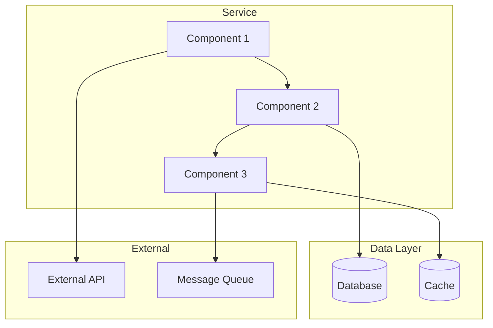
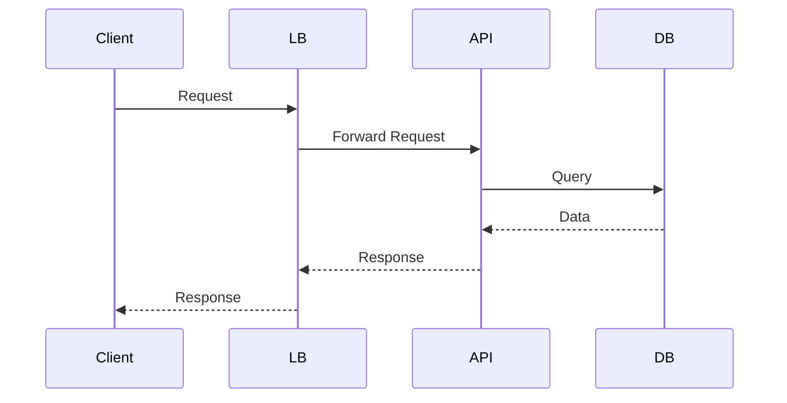

# Operational Runbooks

## Overview

Runbooks provide step-by-step procedures for operating and troubleshooting systems.

---

## 1. Runbook Purpose

### Why Runbooks Matter

```markdown
# Runbook Purpose

## Benefits

### 1. Operational Excellence
- Standardized procedures
- Consistent operations
- Reduced errors
- Improved reliability

### 2. Knowledge Management
- Preserves institutional knowledge
- Onboards new team members
- Reduces dependency on individuals
- Enables knowledge sharing

### 3. Incident Response
- Faster resolution
- Reduced MTTR (Mean Time To Resolution)
- Clear communication
- Better coordination

### 4. Compliance and Auditing
- Documented procedures
- Audit trails
- Regulatory compliance
- Process improvement

## Consequences of Poor Runbooks

### 1. Operational Issues
- Inconsistent procedures
- Human errors
- Longer resolution times
- Increased downtime

### 2. Knowledge Loss
- When team members leave
- Over time
- During incidents
- Under pressure

### 3. Increased Costs
- More incidents
- Longer resolution times
- Higher support costs
- Lost revenue

### 4. Team Stress
- Uncertainty during incidents
- Lack of confidence
- Burnout
- Turnover
```

---

## 2. Runbook Structure

### Standard Runbook Structure

```markdown
# [Service Name] Runbook

## Service Overview
- Service description
- Purpose and scope
- Criticality level
- Dependencies

## Architecture
- System architecture
- Components and their roles
- Data flow
- Integration points

## Deployment
- Deployment process
- Deployment environments
- Rollback procedures
- Deployment verification

## Monitoring
- Key metrics
- Alert thresholds
- Monitoring dashboards
- Log sources

## Alerts
- Alert definitions
- Severity levels
- Notification channels
- Escalation paths

## Troubleshooting
- Common issues
- Diagnostic steps
- Resolution procedures
- Known workarounds

## Emergency Procedures
- Critical incidents
- Emergency contacts
- Escalation procedures
- Communication templates

## Maintenance
- Maintenance procedures
- Backup and restore
- Health checks
- Performance tuning

## Tools and Access
- Required tools
- Access requirements
- Command references
- Useful scripts

## Contacts
- On-call rotation
- Subject matter experts
- Escalation contacts
- Support channels
```

---

## 3. Service Overview

### Service Overview Template

```markdown
# Service Overview

## Service Name
[Service Name]

## Description
[Brief description of what the service does and its purpose]

## Criticality
- **Level**: [Critical | High | Medium | Low]
- **SLA**: [Service Level Agreement details]
- **RTO**: [Recovery Time Objective]
- **RPO**: [Recovery Point Objective]

## Purpose and Scope
- **Primary Purpose**: [Main function]
- **Key Features**: [List of key features]
- **Target Users**: [Who uses this service]
- **Service Boundaries**: [What's in scope and what's not]

## Dependencies

### Upstream Dependencies
- [Dependency 1] - [Purpose]
- [Dependency 2] - [Purpose]
- [Dependency 3] - [Purpose]

### Downstream Dependencies
- [Dependency 1] - [Purpose]
- [Dependency 2] - [Purpose]
- [Dependency 3] - [Purpose]

## Technology Stack
- **Language**: [Programming language]
- **Framework**: [Framework name]
- **Database**: [Database type and version]
- **Infrastructure**: [Cloud provider, hosting]
- **Other**: [Other relevant technologies]

## Key Metrics
- **Throughput**: [Requests per second]
- **Latency**: [P50, P95, P99]
- **Error Rate**: [Target error rate]
- **Availability**: [Target uptime percentage]

## Known Limitations
- [Limitation 1]
- [Limitation 2]
- [Limitation 3]
```

---

## 4. Architecture

### Architecture Documentation

```markdown
# Architecture

## System Architecture

### High-Level Architecture


## Components

### Component 1: [Component Name]
- **Purpose**: [What it does]
- **Technology**: [Technology stack]
- **Dependencies**: [What it depends on]
- **Interfaces**: [APIs, protocols]
- **Scaling**: [Horizontal/Vertical, limits]

### Component 2: [Component Name]
- **Purpose**: [What it does]
- **Technology**: [Technology stack]
- **Dependencies**: [What it depends on]
- **Interfaces**: [APIs, protocols]
- **Scaling**: [Horizontal/Vertical, limits]

### Component 3: [Component Name]
- **Purpose**: [What it does]
- **Technology**: [Technology stack]
- **Dependencies**: [What it depends on]
- **Interfaces**: [APIs, protocols]
- **Scaling**: [Horizontal/Vertical, limits]

## Data Flow

### Request Flow
1. Client → Load Balancer
2. Load Balancer → API Gateway
3. API Gateway → Service
4. Service → Database
5. Database → Service
6. Service → Client

### Data Flow Diagram


## Integration Points

### External Integrations
- [Integration 1]: [Description, API docs link]
- [Integration 2]: [Description, API docs link]
- [Integration 3]: [Description, API docs link]

### Internal Integrations
- [Integration 1]: [Description, API docs link]
- [Integration 2]: [Description, API docs link]
- [Integration 3]: [Description, API docs link]
```

---

## 5. Deployment

### Deployment Procedures

```markdown
# Deployment

## Deployment Process

### Prerequisites
- [ ] Access to deployment environment
- [ ] Valid deployment credentials
- [ ] Deployment tools installed
- [ ] Database migrations prepared
- [ ] Feature flags configured
- [ ] Monitoring configured

### Deployment Steps

#### 1. Pre-Deployment Checks
```bash
# Run health checks
curl https://api.example.com/health

# Check database connectivity
./scripts/check-db.sh

# Verify configuration
./scripts/verify-config.sh
```

#### 2. Build and Test
```bash
# Build application
npm run build

# Run tests
npm test

# Run integration tests
npm run test:integration
```

#### 3. Deploy
```bash
# Deploy to staging
./scripts/deploy.sh staging

# Verify staging deployment
./scripts/verify.sh staging

# Deploy to production
./scripts/deploy.sh production
```

#### 4. Post-Deployment Verification
```bash
# Run smoke tests
./scripts/smoke-tests.sh

# Check metrics
./scripts/check-metrics.sh

# Verify logs
./scripts/check-logs.sh
```

## Rollback Procedures

### When to Rollback
- Deployment fails
- Critical errors detected
- Performance degradation
- Data corruption

### Rollback Steps
```bash
# Stop current deployment
./scripts/stop.sh

# Rollback to previous version
./scripts/rollback.sh

# Verify rollback
./scripts/verify.sh

# Start services
./scripts/start.sh
```

## Deployment Environments

### Development
- **URL**: https://dev.example.com
- **Database**: dev-db.example.com
- **Purpose**: Development and testing
- **Data**: Test data, can be reset

### Staging
- **URL**: https://staging.example.com
- **Database**: staging-db.example.com
- **Purpose**: Pre-production testing
- **Data**: Production-like data

### Production
- **URL**: https://example.com
- **Database**: prod-db.example.com
- **Purpose**: Live production
- **Data**: Real user data

## Deployment Verification

### Health Check Endpoint
```bash
# Health check
curl https://api.example.com/health

# Expected response
{
  "status": "healthy",
  "version": "1.0.0",
  "timestamp": "2024-01-15T10:00:00Z"
}
```

### Smoke Tests
```bash
# Run smoke tests
npm run smoke-tests

# Expected output
✓ API is responding
✓ Database is accessible
✓ Cache is working
✓ External integrations are functional
```
```

---

## 6. Monitoring

### Monitoring Setup

```markdown
# Monitoring

## Key Metrics

### Application Metrics
- **Request Rate**: Requests per second
- **Response Time**: P50, P95, P99 latency
- **Error Rate**: Percentage of failed requests
- **Throughput**: Requests handled per second

### System Metrics
- **CPU Usage**: Percentage of CPU utilization
- **Memory Usage**: Percentage of memory utilization
- **Disk Usage**: Percentage of disk utilization
- **Network I/O**: Network traffic in/out

### Business Metrics
- **Active Users**: Number of active users
- **Transaction Volume**: Number of transactions
- **Conversion Rate**: Percentage of conversions
- **Revenue**: Revenue generated

## Alert Thresholds

### Warning Thresholds
- CPU > 70%
- Memory > 80%
- Error rate > 1%
- Response time P95 > 500ms

### Critical Thresholds
- CPU > 90%
- Memory > 95%
- Error rate > 5%
- Response time P95 > 2000ms

## Monitoring Dashboards

### Main Dashboard
- **URL**: https://grafana.example.com/d/main
- **Metrics**: All key metrics
- **Refresh**: 30 seconds

### Error Dashboard
- **URL**: https://grafana.example.com/d/errors
- **Metrics**: Error rates, error types
- **Refresh**: 10 seconds

### Performance Dashboard
- **URL**: https://grafana.example.com/d/performance
- **Metrics**: Response times, throughput
- **Refresh**: 30 seconds

## Log Sources

### Application Logs
- **Location**: /var/log/app/
- **Format**: JSON
- **Retention**: 30 days
- **Access**: SSH to server

### Access Logs
- **Location**: /var/log/nginx/access.log
- **Format**: Combined
- **Retention**: 90 days
- **Access**: SSH to server

### Error Logs
- **Location**: /var/log/app/error.log
- **Format**: JSON
- **Retention**: 90 days
- **Access**: SSH to server

## Monitoring Tools

### Application Monitoring
- **Tool**: [APM tool name]
- **URL**: [Dashboard URL]
- **Access**: [Access requirements]

### Infrastructure Monitoring
- **Tool**: [Infrastructure tool name]
- **URL**: [Dashboard URL]
- **Access**: [Access requirements]

### Log Aggregation
- **Tool**: [Log aggregation tool name]
- **URL**: [Dashboard URL]
- **Access**: [Access requirements]
```

---

## 7. Alerts

### Alert Configuration

```markdown
# Alerts

## Alert Definitions

### Alert 1: High CPU Usage
- **Name**: High CPU Usage
- **Condition**: CPU > 90% for 5 minutes
- **Severity**: Critical
- **Notification**: PagerDuty, Slack
- **Escalation**: 15 minutes

### Alert 2: High Error Rate
- **Name**: High Error Rate
- **Condition**: Error rate > 5% for 5 minutes
- **Severity**: Critical
- **Notification**: PagerDuty, Slack
- **Escalation**: 10 minutes

### Alert 3: High Memory Usage
- **Name**: High Memory Usage
- **Condition**: Memory > 95% for 5 minutes
- **Severity**: Warning
- **Notification**: Slack
- **Escalation**: 30 minutes

### Alert 4: Slow Response Time
- **Name**: Slow Response Time
- **Condition**: P95 > 2000ms for 5 minutes
- **Severity**: Warning
- **Notification**: Slack
- **Escalation**: 30 minutes

## Severity Levels

### Critical
- **Definition**: Service is down or severely degraded
- **Response Time**: < 15 minutes
- **Notification**: PagerDuty, Slack, Email
- **Escalation**: 15 minutes

### High
- **Definition**: Service is degraded but functional
- **Response Time**: < 30 minutes
- **Notification**: Slack, Email
- **Escalation**: 30 minutes

### Medium
- **Definition**: Potential issue detected
- **Response Time**: < 1 hour
- **Notification**: Slack
- **Escalation**: 1 hour

### Low
- **Definition**: Informational alert
- **Response Time**: < 4 hours
- **Notification**: Email
- **Escalation**: None

## Notification Channels

### PagerDuty
- **Service**: [Service name]
- **Escalation Policy**: [Policy name]
- **On-Call Schedule**: [Schedule name]

### Slack
- **Channel**: #alerts-[service-name]
- **Webhook**: [Webhook URL]

### Email
- **Recipients**: [Email list]
- **Subject**: [Alert prefix]

## Escalation Paths

### Level 1: On-Call Engineer
- **Response Time**: 15 minutes
- **Contact**: [Contact method]
- **Capabilities**: Full access

### Level 2: Team Lead
- **Response Time**: 30 minutes
- **Contact**: [Contact method]
- **Capabilities**: Full access

### Level 3: Engineering Manager
- **Response Time**: 1 hour
- **Contact**: [Contact method]
- **Capabilities**: Full access

### Level 4: VP of Engineering
- **Response Time**: 2 hours
- **Contact**: [Contact method]
- **Capabilities**: Full access
```

---

## 8. Troubleshooting

### Troubleshooting Procedures

```markdown
# Troubleshooting

## Common Issues

### Issue 1: Service Not Responding

**Symptoms**
- 503 Service Unavailable errors
- Connection timeouts
- Health check failing

**Diagnostic Steps**
```bash
# Check if service is running
systemctl status [service-name]

# Check logs
tail -f /var/log/app/error.log

# Check CPU and memory
top

# Check network connectivity
ping [service-hostname]
```

**Resolution Steps**
```bash
# Restart service
systemctl restart [service-name]

# Verify service is running
systemctl status [service-name]

# Check health endpoint
curl https://api.example.com/health
```

**If Issue Persists**
1. Check recent deployments
2. Review recent code changes
3. Check database connectivity
4. Check external dependencies
5. Escalate to team lead

### Issue 2: High Error Rate

**Symptoms**
- Increased error rate in monitoring
- User complaints
- Error logs increasing

**Diagnostic Steps**
```bash
# Check error logs
tail -f /var/log/app/error.log

# Check error rate in monitoring
# Visit monitoring dashboard

# Check recent deployments
git log --oneline -10

# Check database status
./scripts/check-db.sh
```

**Resolution Steps**
```bash
# If recent deployment, rollback
./scripts/rollback.sh

# If database issue, restart database
systemctl restart postgresql

# If external dependency issue, check status
curl https://external-api.com/health
```

**If Issue Persists**
1. Check external dependencies
2. Review recent code changes
3. Check for configuration changes
4. Escalate to team lead

### Issue 3: Slow Response Time

**Symptoms**
- Increased response times
- User complaints
- Performance degradation

**Diagnostic Steps**
```bash
# Check CPU and memory
top

# Check database queries
./scripts/check-db-queries.sh

# Check network latency
ping [database-hostname]

# Check disk I/O
iostat -x 1
```

**Resolution Steps**
```bash
# Restart service
systemctl restart [service-name]

# Clear cache
./scripts/clear-cache.sh

# If database issue, optimize queries
./scripts/optimize-db.sh
```

**If Issue Persists**
1. Check for resource contention
2. Review recent code changes
3. Check for external factors
4. Escalate to team lead

### Issue 4: Database Connection Issues

**Symptoms**
- Database connection errors
- Slow queries
- Timeouts

**Diagnostic Steps**
```bash
# Check database status
systemctl status postgresql

# Check database logs
tail -f /var/log/postgresql/postgresql.log

# Check database connections
psql -c "SELECT count(*) FROM pg_stat_activity;"

# Test database connectivity
psql -h [hostname] -U [username] -d [database]
```

**Resolution Steps**
```bash
# Restart database
systemctl restart postgresql

# Check connection pool
./scripts/check-connection-pool.sh

# If connection limit reached, increase max_connections
```

**If Issue Persists**
1. Check database configuration
2. Review recent schema changes
3. Check for long-running queries
4. Escalate to DBA
```

---

## 9. Emergency Procedures

### Emergency Response

```markdown
# Emergency Procedures

## Critical Incident Response

### Step 1: Acknowledge Alert
- [ ] Acknowledge in monitoring system
- [ ] Update incident status
- [ ] Notify team

### Step 2: Assess Impact
- [ ] Determine scope of issue
- [ ] Identify affected users
- [ ] Estimate business impact

### Step 3: Initial Mitigation
- [ ] Implement quick fix if possible
- [ ] Disable affected features
- [ ] Route traffic to healthy instances

### Step 4: Root Cause Analysis
- [ ] Review logs
- [ ] Check metrics
- [ ] Identify root cause

### Step 5: Permanent Fix
- [ ] Implement fix
- [ ] Test fix
- [ ] Deploy fix

### Step 6: Verification
- [ ] Verify issue is resolved
- [ ] Monitor for recurrence
- [ ] Document incident

## Emergency Contacts

### On-Call Engineer
- **Name**: [Name]
- **Phone**: [Phone number]
- **Email**: [Email]
- **Slack**: [@username]

### Team Lead
- **Name**: [Name]
- **Phone**: [Phone number]
- **Email**: [Email]
- **Slack**: [@username]

### Engineering Manager
- **Name**: [Name]
- **Phone**: [Phone number]
- **Email**: [Email]
- **Slack**: [@username]

### VP of Engineering
- **Name**: [Name]
- **Phone**: [Phone number]
- **Email**: [Email]
- **Slack**: [@username]

## Communication Templates

### Incident Announcement
```
🚨 INCIDENT ANNOUNCEMENT 🚨

Service: [Service Name]
Severity: [Critical/High/Medium/Low]
Status: [Investigating/Identified/Monitoring/Resolved]
Started: [Timestamp]

Description:
[Brief description of the issue]

Impact:
[Description of impact]

Next Update: [Time]
```

### Incident Update
```
📊 INCIDENT UPDATE 📊

Service: [Service Name]
Status: [Investigating/Identified/Monitoring/Resolved]

Update:
[Description of update]

Next Update: [Time]
```

### Incident Resolution
```
✅ INCIDENT RESOLVED ✅

Service: [Service Name]
Duration: [Duration]
Root Cause: [Root cause]
Resolution: [Resolution applied]

Post-Incident Review:
[Date and time of post-incident review]
```

## Escalation Procedures

### When to Escalate
- Issue not resolved in [X] minutes
- Severity level increases
- Multiple services affected
- Business impact critical

### Escalation Process
1. Notify next level in escalation path
2. Provide incident summary
3. Hand off incident ownership
4. Update incident status
```

---

## 10. Disaster Recovery

### Disaster Recovery Plan

```markdown
# Disaster Recovery

## Recovery Objectives

### Recovery Time Objective (RTO)
- **Critical Services**: 4 hours
- **Important Services**: 8 hours
- **Non-Critical Services**: 24 hours

### Recovery Point Objective (RPO)
- **Critical Services**: 15 minutes
- **Important Services**: 1 hour
- **Non-Critical Services**: 24 hours

## Backup Strategy

### Database Backups
- **Frequency**: Every 15 minutes
- **Retention**: 30 days
- **Location**: [Backup location]
- **Type**: Incremental + Full daily

### Application Backups
- **Frequency**: Daily
- **Retention**: 90 days
- **Location**: [Backup location]
- **Type**: Full

### Configuration Backups
- **Frequency**: On change
- **Retention**: 365 days
- **Location**: [Backup location]
- **Type**: Version control

## Recovery Procedures

### Database Recovery
```bash
# Stop application
systemctl stop [service-name]

# Restore from backup
pg_restore -d [database] [backup-file]

# Verify data
psql -d [database] -c "SELECT COUNT(*) FROM [table];"

# Start application
systemctl start [service-name]

# Verify application
curl https://api.example.com/health
```

### Application Recovery
```bash
# Restore application backup
./scripts/restore-app.sh [backup-id]

# Verify configuration
./scripts/verify-config.sh

# Start services
systemctl start [service-name]

# Verify health
curl https://api.example.com/health
```

## Failover Procedures

### Primary to Secondary
```bash
# Promote secondary to primary
./scripts/promote-secondary.sh

# Update DNS
./scripts/update-dns.sh

# Verify failover
curl https://api.example.com/health
```

### Secondary to Primary
```bash
# Restore primary
./scripts/restore-primary.sh

# Update DNS
./scripts/update-dns.sh

# Verify restoration
curl https://api.example.com/health
```

## Testing

### Backup Testing
- **Frequency**: Monthly
- **Scope**: Random backup
- **Verification**: Data integrity
- **Documentation**: Test results

### Recovery Testing
- **Frequency**: Quarterly
- **Scope**: Full recovery drill
- **Verification**: Service functionality
- **Documentation**: Test results

### Failover Testing
- **Frequency**: Semi-annually
- **Scope**: Full failover
- **Verification**: Service continuity
- **Documentation**: Test results
```

---

## 11. Maintenance Procedures

### Maintenance Tasks

```markdown
# Maintenance

## Routine Maintenance

### Daily Tasks
- [ ] Review logs for errors
- [ ] Check disk space
- [ ] Verify backup completion
- [ ] Review monitoring alerts

### Weekly Tasks
- [ ] Review performance metrics
- [ ] Check for security updates
- [ ] Review system logs
- [ ] Clean up temporary files

### Monthly Tasks
- [ ] Review and rotate logs
- [ ] Update documentation
- [ ] Review capacity planning
- [ ] Test backup restoration

### Quarterly Tasks
- [ ] Review and update runbooks
- [ ] Conduct disaster recovery test
- [ ] Review security posture
- [ ] Update software versions

## Backup and Restore

### Backup Procedures
```bash
# Database backup
pg_dump -U [username] -d [database] > [backup-file].sql

# Application backup
tar -czf [backup-file].tar.gz /var/www/app

# Configuration backup
cp /etc/app/config.yaml /backups/config-$(date +%Y%m%d).yaml
```

### Restore Procedures
```bash
# Database restore
psql -U [username] -d [database] < [backup-file].sql

# Application restore
tar -xzf [backup-file].tar.gz -C /var/www/

# Configuration restore
cp /backups/config-[date].yaml /etc/app/config.yaml
```

## Health Checks

### Application Health Check
```bash
# Run health check
curl https://api.example.com/health

# Expected response
{
  "status": "healthy",
  "version": "1.0.0",
  "timestamp": "2024-01-15T10:00:00Z"
}
```

### Database Health Check
```bash
# Check database status
systemctl status postgresql

# Check database connections
psql -c "SELECT count(*) FROM pg_stat_activity;"

# Check database size
psql -c "SELECT pg_size_pretty(pg_database_size('[database]'));"
```

### System Health Check
```bash
# Check CPU
top -bn1 | grep "Cpu(s)"

# Check memory
free -h

# Check disk
df -h

# Check network
ping -c 4 [hostname]
```

## Performance Tuning

### Database Tuning
```bash
# Analyze query performance
./scripts/analyze-queries.sh

# Update statistics
psql -c "ANALYZE;"

# Reindex if needed
psql -c "REINDEX DATABASE [database];"
```

### Application Tuning
```bash
# Review and update configuration
vim /etc/app/config.yaml

# Restart service
systemctl restart [service-name]

# Monitor performance
./scripts/monitor-performance.sh
```

### System Tuning
```bash
# Update system parameters
vim /etc/sysctl.conf

# Apply changes
sysctl -p

# Reboot if needed
reboot
```
```

---

## 12. Tools and Access

### Required Tools

```markdown
# Tools and Access

## Required Tools

### Command Line Tools
- **SSH**: For server access
- **curl**: For API testing
- **jq**: For JSON parsing
- **psql**: For database access

### Monitoring Tools
- **Grafana**: For dashboards
- **Prometheus**: For metrics
- **Kibana**: For log analysis

### Development Tools
- **Git**: For version control
- **Docker**: For container management
- **Kubernetes**: For orchestration

## Access Requirements

### Server Access
- **SSH Key**: Required for SSH access
- **VPN**: Required for remote access
- **MFA**: Required for authentication

### Database Access
- **Username**: [Database username]
- **Password**: [Password manager reference]
- **Connection String**: [Connection string]

### API Access
- **API Key**: [API key reference]
- **Authentication**: OAuth token
- **Base URL**: https://api.example.com

## Command References

### Service Management
```bash
# Start service
systemctl start [service-name]

# Stop service
systemctl stop [service-name]

# Restart service
systemctl restart [service-name]

# Check status
systemctl status [service-name]

# View logs
journalctl -u [service-name] -f
```

### Database Commands
```bash
# Connect to database
psql -h [hostname] -U [username] -d [database]

# Run query
psql -c "SELECT * FROM [table] LIMIT 10;"

# Import data
psql -d [database] < [file].sql

# Export data
pg_dump -U [username] -d [database] > [file].sql
```

### Monitoring Commands
```bash
# Check CPU
top

# Check memory
free -h

# Check disk
df -h

# Check processes
ps aux
```

## Useful Scripts

### Health Check Script
```bash
#!/bin/bash
# health-check.sh

echo "Checking service health..."

# Check service status
systemctl is-active --quiet [service-name]
if [ $? -eq 0 ]; then
    echo "✓ Service is running"
else
    echo "✗ Service is not running"
    exit 1
fi

# Check health endpoint
curl -f https://api.example.com/health
if [ $? -eq 0 ]; then
    echo "✓ Health check passed"
else
    echo "✗ Health check failed"
    exit 1
fi

echo "All checks passed!"
```

### Backup Script
```bash
#!/bin/bash
# backup.sh

DATE=$(date +%Y%m%d_%H%M%S)
BACKUP_DIR="/backups"

# Database backup
pg_dump -U [username] -d [database] > $BACKUP_DIR/db_$DATE.sql

# Application backup
tar -czf $BACKUP_DIR/app_$DATE.tar.gz /var/www/app

echo "Backup completed: $DATE"
```

### Restore Script
```bash
#!/bin/bash
# restore.sh

BACKUP_FILE=$1

if [ -z "$BACKUP_FILE" ]; then
    echo "Usage: $0 <backup-file>"
    exit 1
fi

# Restore database
psql -U [username] -d [database] < $BACKUP_FILE

echo "Restore completed"
```
```

---

## 13. Contacts

### Contact Information

```markdown
# Contacts

## On-Call Rotation

### Current On-Call
- **Name**: [Name]
- **Phone**: [Phone number]
- **Email**: [Email]
- **Slack**: [@username]
- **Time Zone**: [Time zone]

### Upcoming Schedule
| Date | Name | Phone | Slack |
|------|------|-------|-------|
| [Date] | [Name] | [Phone] | [@username] |
| [Date] | [Name] | [Phone] | [@username] |
| [Date] | [Name] | [Phone] | [@username] |

## Subject Matter Experts

### Database
- **Name**: [Name]
- **Email**: [Email]
- **Slack**: [@username]
- **Expertise**: Database administration, optimization

### Security
- **Name**: [Name]
- **Email**: [Email]
- **Slack**: [@username]
- **Expertise**: Security, compliance

### Infrastructure
- **Name**: [Name]
- **Email**: [Email]
- **Slack**: [@username]
- **Expertise**: Infrastructure, networking

## Escalation Contacts

### Team Lead
- **Name**: [Name]
- **Phone**: [Phone number]
- **Email**: [Email]
- **Slack**: [@username]

### Engineering Manager
- **Name**: [Name]
- **Phone**: [Phone number]
- **Email**: [Email]
- **Slack**: [@username]

### VP of Engineering
- **Name**: [Name]
- **Phone**: [Phone number]
- **Email**: [Email]
- **Slack**: [@username]

## Support Channels

### Internal Support
- **Slack Channel**: #support-[service-name]
- **Email**: support@example.com
- **Ticket System**: https://support.example.com

### External Support
- **Vendor**: [Vendor name]
- **Support Email**: [Email]
- **Support Phone**: [Phone]
- **Support Portal**: [URL]

### Emergency Contacts
- **IT Security**: [Phone]
- **Data Center**: [Phone]
- **Cloud Provider**: [Phone]
```

---

## 14. Testing Runbooks

### Runbook Testing Checklist

```markdown
# Testing Runbooks

## Testing Checklist

### Accuracy Testing
- [ ] All commands work as documented
- [ ] All links are valid
- [ ] All contact information is current
- [ ] All procedures are complete

### Completeness Testing
- [ ] All scenarios are covered
- [ ] All edge cases are addressed
- [ ] All dependencies are documented
- [ ] All tools are listed

### Usability Testing
- [ ] Procedures are clear and concise
- [ ] Steps are in logical order
- [ ] Examples are helpful
- [ ] Troubleshooting is comprehensive

### Emergency Testing
- [ ] Emergency procedures work
- [ ] Escalation paths are clear
- [ ] Contact information is accurate
- [ ] Communication templates are usable

## Testing Schedule

### Regular Testing
- **Frequency**: Quarterly
- **Scope**: All procedures
- **Participants**: On-call team
- **Documentation**: Test results

### Emergency Testing
- **Frequency**: Semi-annually
- **Scope**: Emergency procedures
- **Participants**: All stakeholders
- **Documentation**: Test results and improvements

## Test Documentation

### Test Report Template
```markdown
# Runbook Test Report

**Date**: [Date]
**Tester**: [Name]
**Runbook**: [Runbook Name]

## Test Results

### Accuracy
- [ ] Commands tested
- [ ] Links verified
- [ ] Contacts validated

### Completeness
- [ ] Scenarios covered
- [ ] Edge cases addressed
- [ ] Dependencies documented

### Usability
- [ ] Procedures clear
- [ ] Steps logical
- [ ] Examples helpful

### Emergency
- [ ] Procedures work
- [ ] Escalation clear
- [ ] Contacts accurate

## Issues Found

1. [Issue description]
2. [Issue description]
3. [Issue description]

## Recommendations

1. [Recommendation]
2. [Recommendation]
3. [Recommendation]

## Next Review Date

[Date]
```
```

---

## 15. Templates

### Runbook Templates

```markdown
# Runbook Template

# [Service Name] Runbook

## Service Overview
[Fill in service overview]

## Architecture
[Fill in architecture details]

## Deployment
[Fill in deployment procedures]

## Monitoring
[Fill in monitoring details]

## Alerts
[Fill in alert configuration]

## Troubleshooting
[Fill in troubleshooting procedures]

## Emergency Procedures
[Fill in emergency procedures]

## Disaster Recovery
[Fill in disaster recovery plan]

## Maintenance
[Fill in maintenance procedures]

## Tools and Access
[Fill in tools and access details]

## Contacts
[Fill in contact information]

## Version History
| Version | Date | Author | Changes |
|---------|------|---------|---------|
| 1.0 | [Date] | [Name] | Initial version |
| 1.1 | [Date] | [Name] | [Changes] |
```
```

---

## 16. Best Practices

### Runbook Best Practices

```markdown
# Best Practices

## 1. Keep Current
- Update regularly
- Review quarterly
- Test procedures
- Archive old versions

## 2. Be Clear
- Use simple language
- Avoid jargon
- Provide context
- Explain decisions

## 3. Be Complete
- Cover all scenarios
- Include edge cases
- Document dependencies
- Provide examples

## 4. Be Accessible
- Use standard formats
- Support search
- Provide navigation
- Include glossary

## 5. Be Practical
- Focus on what works
- Provide real solutions
- Include workarounds
- Share lessons learned

## 6. Be Collaborative
- Get peer reviews
- Share knowledge
- Use version control
- Build consensus

## 7. Be Tested
- Test all procedures
- Verify all commands
- Check all links
- Validate all contacts

## 8. Be Useful
- Focus on audience
- Answer questions
- Solve problems
- Enable decisions
```
