# System Architecture Documentation

> **Current Level:** Expert (Enterprise Scale)
> **Domain:** Documentation / Architecture

---

## Overview

System architecture documentation describes structure, behavior, and design of software systems. Effective architecture documentation uses diagrams, decision records, and clear explanations to help teams understand system design, make informed decisions, and onboard new members.

---

## 1. Executive Summary & Strategic Necessity

* **Context:** ในปี 2025-2026 System Architecture Documentation ด้วย Best Practices ช่วย Architecture ที่มีอัตโนมาติการทำงานอัตโนมาติ (Architecture Excellence) ใน Enterprise Scale

* **Business Impact:** System Architecture Documentation ช่วยลด Downtime ของระบบ Architecture ผ่านการตอบคำถามอัตโนมาติการเขียนเอกสาร (Reduce onboarding time), ลดต้นทุนการจัดการทีม (Increase architectural understanding), เพิ่มอัตรากำไร Gross Margin ผ่านการทำงานอัตโนมาติ (Faster decision making), และปรับประสบทการทำงาน (Consistent architecture)

* **Product Thinking:** System Architecture Documentation ช่วยแก้ปัญหา (Pain Point) ความต้องการมีการเขียนเอกสารที่ชัดเจน (Architects need clear documentation) ผ่านการทำงานอัตโนมาติ (Standardized documentation)

---

## 2. Technical Deep Dive (The "How-to")

* **Core Logic:** System Architecture Documentation ใช้ Best Practices ช่วย Architecture ทำงานอัตโนมาติ:
  1. **C4 Model**: กำหนด C4 Model (Context Diagram, Container Diagram, Component Diagram, Code Diagram)
  2. **Architecture Decision Records (ADRs)**: สร้าง ADRs สำหรับการบันทึก architectural decisions (Context, Decision, Consequences, Alternatives)
  3. **Data Flow Diagrams**: จัดการ Data Flow Diagrams สำหรับการแสดง data flow (Flow diagrams, Sequence diagrams)
  4. **Entity-Relationship Diagrams**: สร้าง Entity-Relationship Diagrams สำหรับการแสดง database schema (ERD templates, Complex ERD)
  5. **Infrastructure Diagrams**: สร้าง Infrastructure Diagrams สำหรับการแสดง infrastructure (Infrastructure templates, Microservices architecture)
  6. **Documentation as Code**: สร้าง Documentation as Code สำหรับ AI Agents (Version control, Automation, Integration)

* **Architecture Diagram Requirements:** แผนผังระบบ System Architecture Documentation ต้องมีองค์ประกอบ:
  1. **Architecture Repository**: Architecture Repository สำหรับการจัดเก็บ architecture docs (Git repository, Documentation platform)
  2. **Diagram Generator**: Diagram Generator สำหรับการสร้าง diagrams (Mermaid, PlantUML, Draw.io)
  3. **ADR Management System**: ADR Management System สำหรับการจัดการ ADRs (Version control, Review process, Status tracking)
  4. **Documentation as Code Pipeline**: Documentation as Code Pipeline สำหรับการ deploy architecture docs (CI/CD pipeline, Automated deployment)
  5. **Architecture Search**: Architecture Search สำหรับการค้นหา architecture docs (Full-text search, Tag-based search, Category-based search)
  6. **Architecture Analytics**: Architecture Analytics สำหรับการวิเคราะห์ architecture doc usage (Usage metrics, Search analytics, Feedback collection)
  7. **Observability**: Logging, Monitoring, Tracing สำหรับการ debug และปรับสิทท

* **Implementation Workflow:** ขั้นตอนการนำ System Architecture Documentation ไปใช้งานจริง:
  1. **Planning Phase**: กำหนด Requirement และเลือก Architecture Platform ที่เหมาะสม
  2. **Architecture Repository Setup**: ตั้งค่า Architecture Repository สำหรับการจัดเก็บ architecture docs
  3. **Diagram Generator Setup**: ตั้งค่า Diagram Generator สำหรับการสร้าง diagrams
  4. **ADR Management System Setup**: ตั้งค่า ADR Management System สำหรับการจัดการ ADRs
  5. **Documentation as Code Pipeline Setup**: ตั้งค่า Documentation as Code Pipeline สำหรับการ deploy architecture docs
  6. **Testing Phase**: Unit test, Integration test, E2E test ด้วยจริง Scenario
  7. **Deployment**: Deploy ด้วย CI/CD pipeline, Set up Monitoring
  8. **Optimization**: Optimize architecture search, Add diagram templates, Improve UX
  9. **Maintenance**: Monitor architecture doc usage, Update architecture content, Handle edge cases

---

## 3. Tooling & Tech Stack

* **Enterprise Tools:** เครื่องมือระดับอุตสาหกรรมที่เลือกใช้สำหรับ System Architecture Documentation ใน Enterprise Scale:
  1. **Mermaid**: Text-based diagram tool สำหรับ architecture diagrams
  2. **PlantUML**: Text-based diagram tool สำหรับ UML diagrams
  3. **Draw.io**: Drag-and-drop diagram tool สำหรับ complex diagrams
  4. **Lucidchart**: Cloud-based diagram tool สำหรับ team collaboration
  5. **Excalidraw**: Hand-drawn style diagram tool สำหรับ quick sketches
  6. **MkDocs**: Static site generator สำหรับ architecture documentation
  7. **Docusaurus**: React-based documentation platform สำหรับ architecture docs
  8. **Sphinx**: Python-based documentation tool สำหรับ architecture docs
  9. **Hugo**: Fast static site generator สำหรับ architecture docs
  10. **Git**: Version control system สำหรับ architecture doc versioning

* **Configuration Essentials:** การตั้งค่าสำคัญสำหรับให้ระบบเสถียร System Architecture Documentation:
  1. **Diagram Templates**: ตั้งค่า Diagram Templates (C4 templates, ADR templates, ERD templates)
  2. **ADR Management**: ตั้งค่า ADR Management (Version control, Review process, Status tracking)
  3. **Documentation as Code**: ตั้งค่า Documentation as Code (Version control, Automation, Integration)
  4. **Architecture Search**: ตั้งค่า Architecture Search (Full-text search, Tag-based search, Category-based search)
  5. **Monitoring**: ตั้งค่า Monitoring สำหรับ tracking architecture doc usage (Usage metrics, Search analytics, Feedback collection)
  6. **Secret Management**: Use Environment variables หรือ Secret Manager (AWS Secrets Manager, HashiCorp Vault)
  7. **Rate Limiting**: Per-user และ Per-IP rate limits สำหรับป้องกัน Abuse (100-1000 requests/hour)
  8. **Logging Level**: INFO สำหรับ Production, DEBUG สำหรับ Development
  9. **Observability**: Track success rate, architecture doc usage, search accuracy ต่อเป้าหลาย
  10. **Documentation**: Maintain Architecture Platform documentation สำหรับ team reference

---

## 4. Standards, Compliance & Security

* **International Standards:** มาตรฐานที่เกี่ยวข้อง:
  1. **ISO/IEC 42010**: Systems and Software Architecture - สำหรับ Architecture Documentation
  2. **ISO/IEC 27001**: Information Security Management - สำหรับการจัดการ Secrets และ Access Control
  3. **ISO/IEC 27017**: Code of Practice for Information Security Controls - สำหรับ Secure Architecture
  4. **GDPR**: General Data Protection Regulation - สำหรับการจัดการ Personal Data และ User Consent
  5. **SOC 2 Type II**: Security Controls - สำหรับการ Audit และ Compliance

* **Security Protocol:** กลไกการป้องกัน System Architecture Documentation:
  1. **Input Validation**: Validate และ Sanitize ทุก Input ก่อน processing (Prevent XSS, SQL injection)
  2. **Output Sanitization**: Filter sensitive information จาก architecture docs (API keys, Secrets, Passwords)
  3. **Access Control**: RBAC (Role-Based Access Control) สำหรับ architecture doc access - บาง docs internal only
  4. **Audit Trail**: Log ทุก architecture doc access ด้วย Timestamp, User ID, และ Doc accessed (สำหรับ Forensics และ Compliance)
  5. **Rate Limiting**: Per-user และ Per-IP rate limits สำหรับป้องกัน Abuse (100-1000 requests/hour)
  6. **Secure Communication**: TLS 1.3 สำหรับ HTTPS access
  7. **Secret Management**: Use Environment variables หรือ Secret Manager (AWS Secrets Manager, HashiCorp Vault)
  8. **Content Security**: CSP headers สำหรับ preventing XSS attacks
  9. **Authentication**: Implement authentication สำหรับ internal architecture docs (SSO, OAuth)
  10. **Data Encryption**: Encrypt sensitive data ที่ rest ใน Database (AES-256 หรือ Customer-managed keys)

* **Explainability:** (สำหรับ Architecture Docs) ความสามารถในการอธิบายผลลัพธ์ผ่านเทคนิค:
  1. **Clear Structure**: เก็บ architecture doc structure สำหรับ easy understanding
  2. **Detailed Diagrams**: Provide detailed diagrams สำหรับ complex systems
  3. **Decision Context**: Include decision context สำหรับ ADRs
  4. **Reference Links**: Link to external documentation สำหรับ complex topics
  5. **Examples**: Provide examples สำหร diagram patterns

---

## 5. Unit Economics & Performance Metrics (KPIs)

* **Cost Calculation:** สูตรการคำนวณต้นทุกต่อหน่วย System Architecture Documentation:
  1. **Platform Cost** = Platform subscription × Cost per user/month
     - Confluence: $5-15/user/month
     - Notion: $8-15/user/month
     - GitBook: $8-20/user/month
  2. **Storage Cost** = Architecture doc storage × Cost per GB/month
     - GitHub Pages: Free
     - GitLab Pages: Free
     - S3: $0.023/GB/month
  3. **Diagram Tool Cost** = Diagram tool subscription × Cost per user/month
     - Lucidchart: $7.95-27/user/month
     - Draw.io: Free
  4. **Monitoring Cost** = Monitoring platform subscription × Cost per month
     - Grafana Cloud: $50-500/month
     - Datadog: $15-23/host/month
  5. **Total Monthly Cost** = Platform Cost + Storage Cost + Diagram Tool Cost + Monitoring Cost
  6. **Infrastructure Costs** = Compute ($0/month for static sites) + Storage ($0/month for static sites) + Monitoring ($50-500/month)

* **Key Performance Indicators:** ตัวชี้วัดความสำเร็จทางเทคนิค:
  1. **Architecture Doc Coverage**: เปอร์เซ็นต์ของ services ที่มี architecture docs (Target: >80%)
  2. **Architecture Doc Quality Score**: คะแนน architecture doc quality จาก automated checks (Target: >4.0)
  3. **Diagram Accuracy**: เปอร์เซ็นต์ของ diagrams ที่มี accurate representation (Target: >95%)
  4. **ADR Completeness**: เปอร์เซ็นต์ของ ADRs ที่มี complete information (Target: >90%)
  5. **Architect Satisfaction Score**: 1-5 rating จาก Architect feedback (Target: >4.0)
  6. **Error Rate**: อัตราการ Error (Target: <1%)
  7. **Onboarding Time**: เวลาการ onboarding architects (Target: <1 week)
  8. **Decision Making Time**: เวลาการ decision making ด้วย good architecture docs (Target: <1 day)
  9. **Search Accuracy**: เปอร์เซ็นต์ของ search results ที่ relevant (Target: >90%)
  10. **Knowledge Transfer**: เปอร์เซ็นต์ของ knowledge transfer (Target: >80%)

---

## 6. Strategic Recommendations (CTO Insights)

* **Phase Rollout:** คำแนะนำในการทยอยเริ่มใช้งาน System Architecture Documentation เพื่อลดความเสี่ยง:
  1. **Phase 1: MVP (1-2 เดือน)**: Deploy Simple System Architecture Documentation ด้วย Basic Diagrams และ Manual ADRs สำหรับ Internal team ก่อนเปิดให้ Public
     - **Goal**: Validate System Architecture Documentation architecture และ gather feedback
     - **Success Criteria**: >80% architecture doc coverage, <30s search time
     - **Risk Mitigation**: Internal-only access, Manual review ก่อน Public
  2. **Phase 2: Beta (2-3 เดือน)**: Expand ด้วย C4 Model และ ADR Management System สำหรับ Selected customers
     - **Goal**: Test scalability และ Architecture Doc reliability
     - **Success Criteria**: >90% architecture doc coverage, <15s search time
     - **Risk Mitigation**: Canary deployment, Feature flags, Gradual rollout
  3. **Phase 3: GA (3-6 เดือน)**: Full rollout ด้วย Advanced features (Documentation as Code, Architecture Search, Architecture Analytics)
     - **Goal**: Enterprise-grade architecture doc quality และ Performance
     - **Success Criteria**: >95% architecture doc coverage, <10s search time, 99.9% uptime
     - **Risk Mitigation**: Load testing, Disaster recovery, Blue-green deployment

* **Pitfalls to Avoid:** ข้อควรระวังที่มักจะผิดพลาดในระดับ Enterprise Scale:
  1. **Over-engineering**: สร้าง System Architecture Documentation ที่ซ้อนเกินไป (Too many diagrams, Complex templates) → เริ่มจาก Simple และ iterate
  2. **No Diagram Templates**: ไม่มี Diagram Templates ทำให้ consistency ลด → Implement Diagram Templates สำหรับ common patterns
  3. **Outdated Diagrams**: Diagrams ไม่ sync กับ systems → Implement automated diagram quality checks
  4. **Missing ADRs**: ไม่มี ADRs ทำให้ decisions ไม่ documented → Implement ADR Management System
  5. **No Documentation as Code**: ไม่มี Documentation as Code ทำให้ docs outdated → Implement Documentation as Code Pipeline
  6. **No Agent-Friendly Docs**: ไม่มี Agent-Friendly Docs ทำให้ AI Agents สับสนใจ → Implement Agent-Friendly doc guidelines
  7. **Poor Search**: Search ไม่ดีทำให้ architects หา docs ไม่ได้ → Implement advanced search (Algolia, Elasticsearch)
  8. **No Architecture Analytics**: ไม่มี Architecture Analytics ทำให้ไม่รู้ doc usage → Implement architecture analytics
  9. **No Architecture Documentation**: ไม่มี Architecture Documentation ทำให้ team reference → Maintain Architecture Platform documentation
  10. **Single Point of Failure**: ไม่มี Redundancy หรือ Fallback → Deploy multiple instances ด้วย CDN

---

## Core Concepts

### 1. Architecture Documentation Importance

### Why Document Architecture

```markdown
# Architecture Documentation Importance

## Benefits

### 1. Knowledge Sharing
- Onboards new developers
- Reduces knowledge silos
- Preserves institutional knowledge
- Enables team collaboration

### 2. Decision Making
- Provides context for decisions
- Documents trade-offs
- Supports future changes
- Enables informed choices

### 3. Maintenance
- Guides system evolution
- Supports debugging
- Facilitates refactoring
- Reduces technical debt

### 4. Communication
- Aligns stakeholders
- Bridges technical gaps
- Supports discussions
- Enables reviews

## Consequences of Poor Documentation

### 1. Knowledge Loss
- When developers leave
- Over time
- During transitions
- Under pressure

### 2. Misunderstandings
- Different interpretations
- Incorrect assumptions
- Misaligned expectations
- Communication gaps

### 3. Increased Costs
- Longer onboarding
- More mistakes
- Slower development
- Higher maintenance

### 4. Technical Debt
- Poor decisions
- Inconsistent patterns
- Difficult maintenance
- System degradation
```

---

## 2. C4 Model

### C4 Model Overview

```markdown
# C4 Model

The C4 model provides a standard approach for software architecture documentation.

## C4 Model Levels

### Level 1: Context Diagram
- Shows system in its environment
- Identifies users and external systems
- Defines system boundaries
- Shows high-level relationships

### Level 2: Container Diagram
- Shows applications and data stores
- Defines major components
- Shows communication paths
- Identifies technologies

### Level 3: Component Diagram
- Shows internal structure
- Defines components and interfaces
- Shows data flow
- Identifies dependencies

### Level 4: Code Diagram
- Shows class or function structure
- Defines implementation details
- Shows relationships
- Identifies patterns
```

### Context Diagram

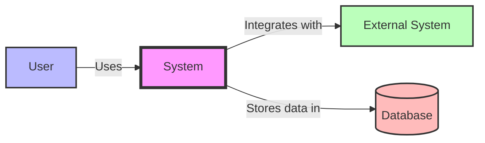

### Container Diagram

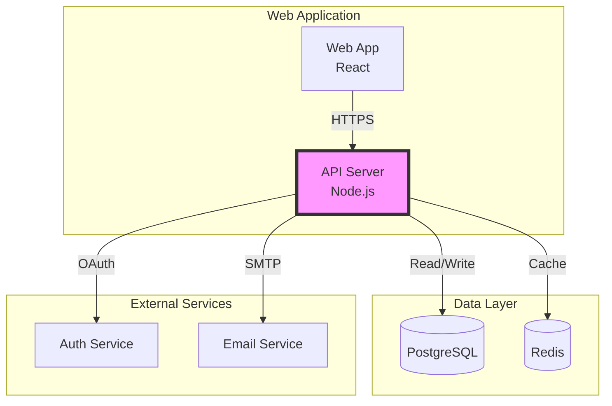

### Component Diagram

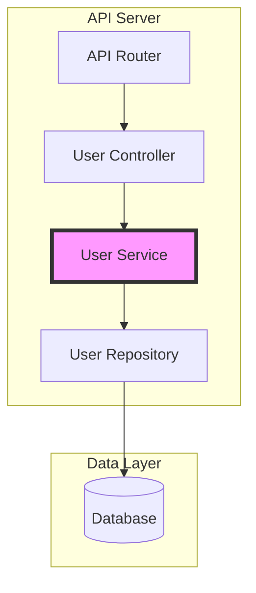

### Code Diagram

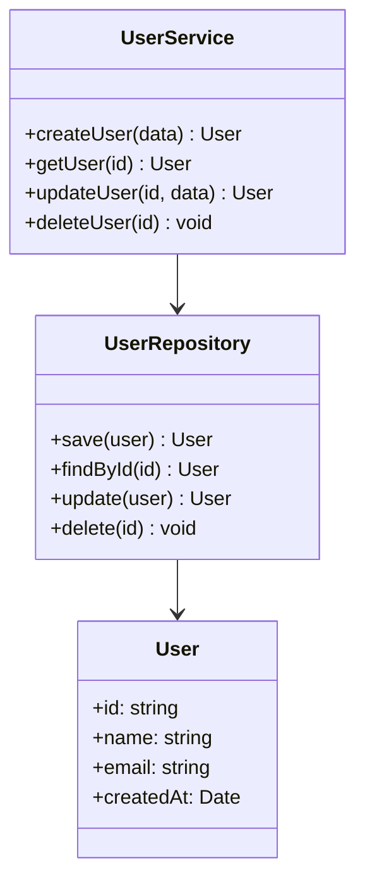

---

## 3. Architecture Decision Records (ADRs)

### ADR Template

```markdown
# ADR Template

## ADR: [Number] - [Title]

### Status
[Proposed | Accepted | Deprecated | Superseded]

### Context
[What is the issue that we're seeing that is motivating this decision or change?]

### Decision
[What is the change that we're proposing and/or doing?]

### Consequences
[What becomes easier or more difficult to do because of this change?]

### Alternatives Considered
[What other approaches did we consider and why did we reject them?]

### Related Decisions
[Links to related ADRs]

### References
[Links to relevant resources]
```

### ADR Example

```markdown
# ADR: 001 - Use PostgreSQL as Primary Database

## Status
Accepted

## Context
We need a relational database for our application that supports:
- ACID transactions
- Complex queries
- JSON data types
- Full-text search
- High availability

We evaluated several database options including MySQL, PostgreSQL, and MongoDB.

## Decision
We will use PostgreSQL as our primary database because it:
- Has excellent ACID compliance
- Supports advanced features like JSONB and full-text search
- Has a strong open-source community
- Provides excellent performance and reliability
- Offers robust replication and high availability options

## Consequences

### Positive
- Strong data integrity with ACID compliance
- Flexible schema with JSONB support
- Built-in full-text search
- Excellent community and documentation
- Proven reliability at scale

### Negative
- Steeper learning curve than some alternatives
- Requires more resources than lightweight databases
- Vertical scaling limitations (though mitigated by replication)

## Alternatives Considered

### MySQL
- **Rejected**: Less flexible schema, weaker JSON support

### MongoDB
- **Rejected**: No ACID transactions at time of decision

## Related Decisions
- ADR-002: Database Replication Strategy
- ADR-003: Backup and Recovery Plan

## References
- [PostgreSQL Documentation](https://www.postgresql.org/docs/)
- [ACID Properties](https://en.wikipedia.org/wiki/ACID)
```

---

## 4. Data Flow Diagrams

### Data Flow Diagram Template

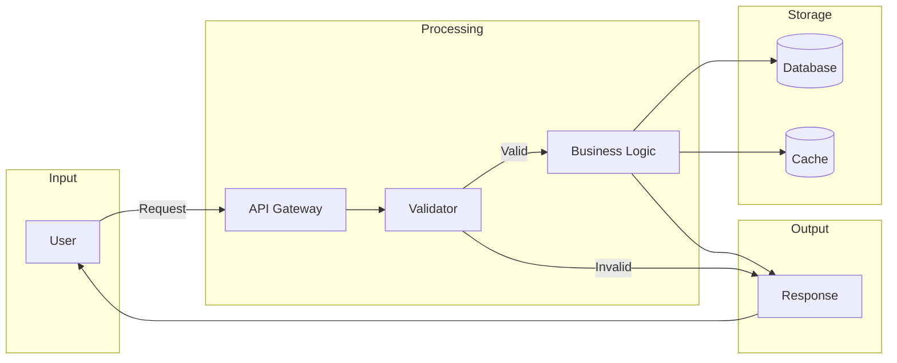

### Complex Data Flow

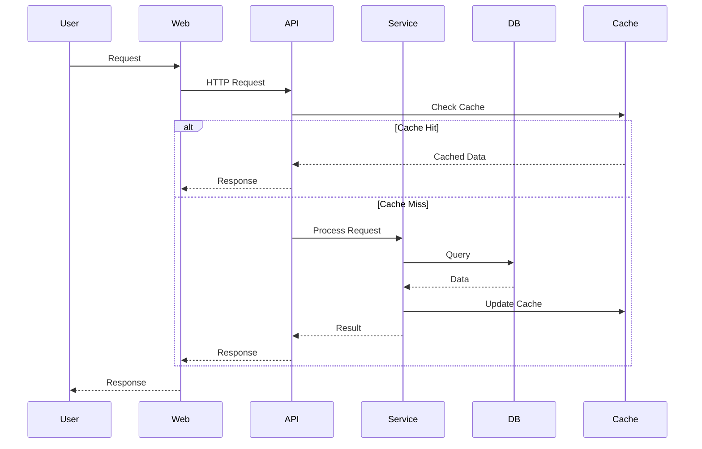

---

## 5. Sequence Diagrams

### Sequence Diagram Template

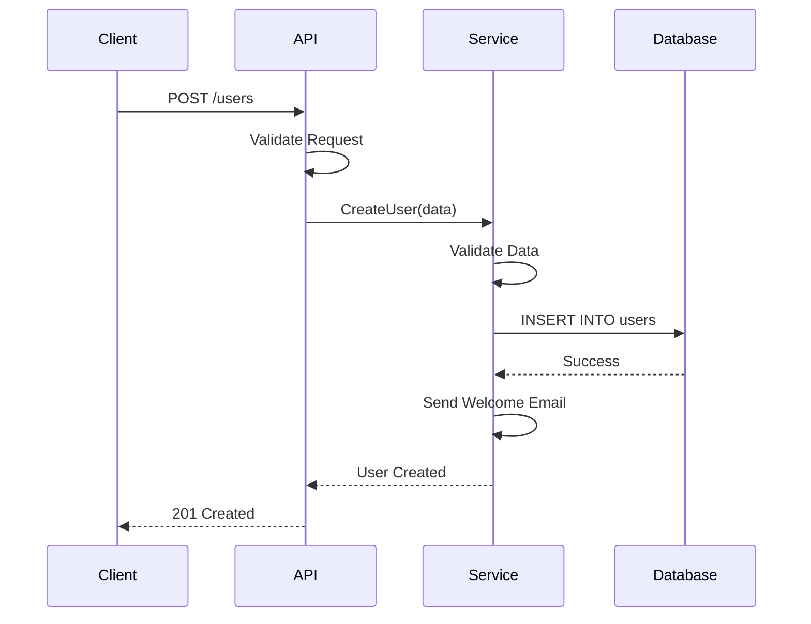

### Authentication Flow

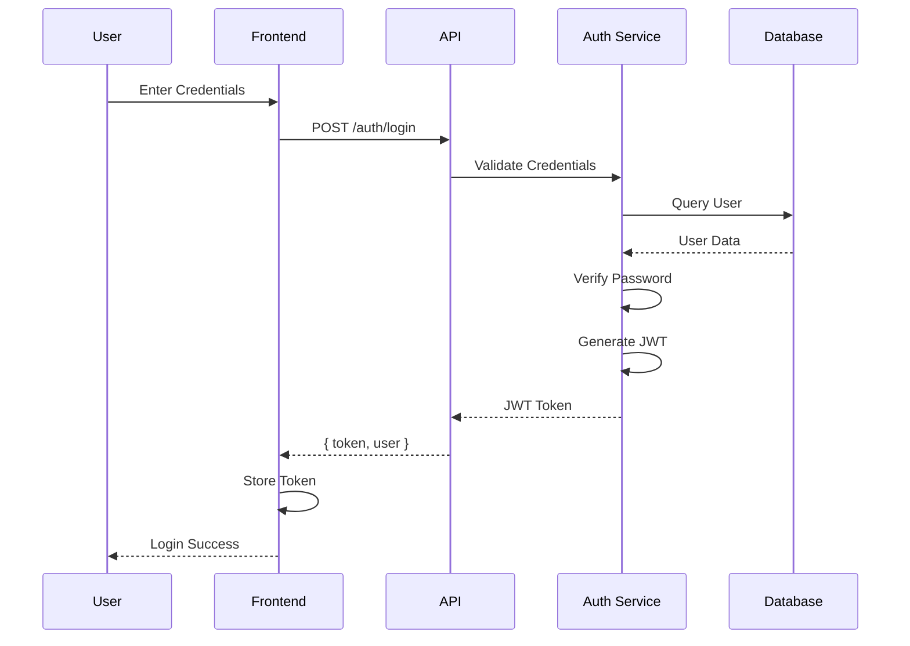

---

## 6. Entity-Relationship Diagrams

### ERD Template

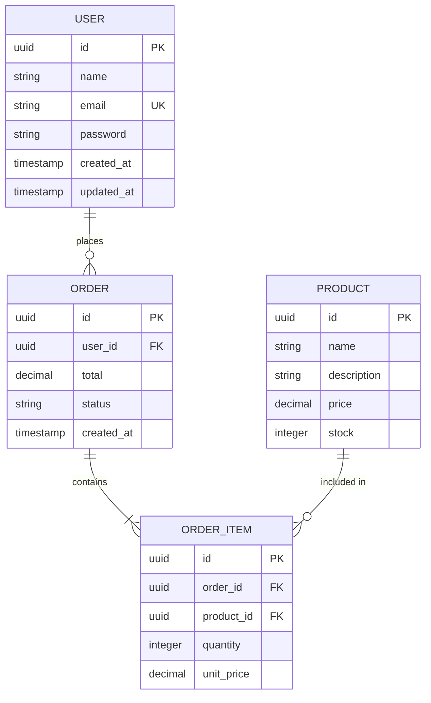

### Complex ERD

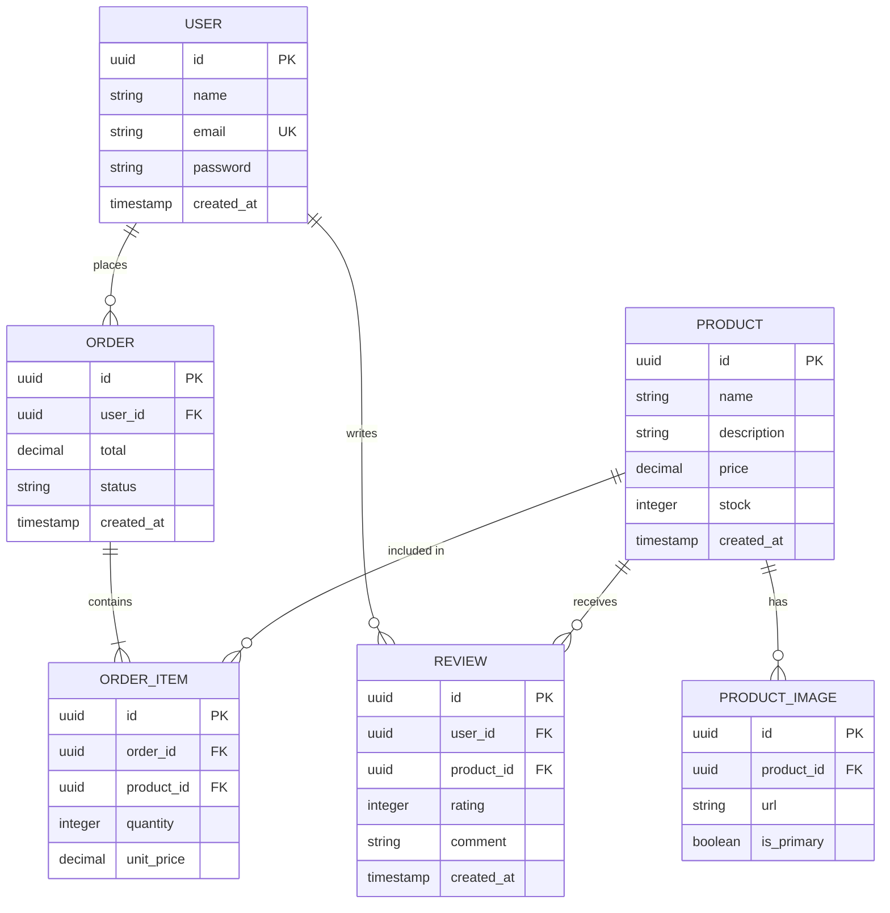

---

## 7. Infrastructure Diagrams

### Infrastructure Diagram Template

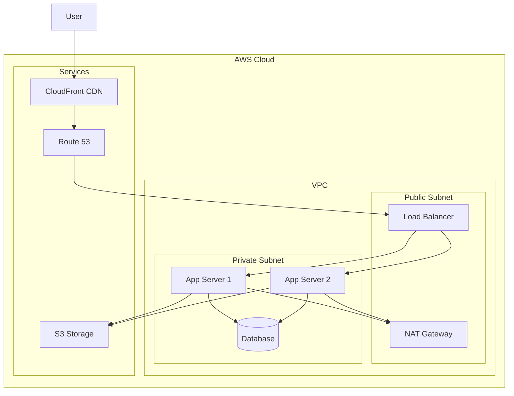

### Microservices Architecture

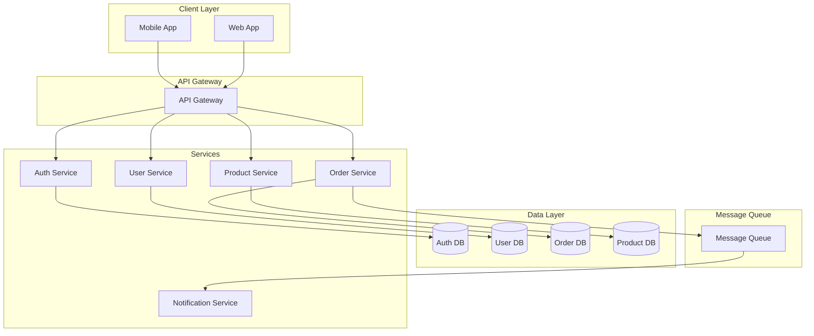

---

## 8. Tools

### Diagram Tools

```markdown
# Diagram Tools

## 1. Mermaid

### Features
- Text-based diagrams
- Version control friendly
- Integrates with Markdown
- Free and open source

### Best For
- Documentation
- Git repositories
- Quick diagrams

### Example
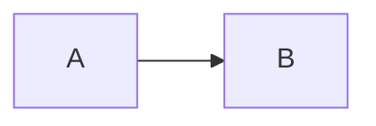

## 2. Draw.io

### Features
- Drag and drop
- Many templates
- Export options
- Free

### Best For
- Complex diagrams
- Visual editing
- Presentations

## 3. PlantUML

### Features
- Text-based
- Many diagram types
- Integrates with tools
- Free

### Best For
- Developers
- Documentation
- UML diagrams

## 4. Lucidchart

### Features
- Collaboration
- Templates
- Integrations
- Cloud-based

### Best For
- Teams
- Enterprise
- Complex diagrams

## 5. Excalidraw

### Features
- Hand-drawn style
- Real-time collaboration
- Free
- Simple

### Best For
- Quick sketches
- Team collaboration
- Brainstorming
```

---

## 9. Documentation as Code

### Principles

```markdown
# Documentation as Code

## Principles

### 1. Version Control
- Store docs in git
- Track changes
- Collaborate with PRs
- Review like code

### 2. Automation
- Auto-generate docs
- Test docs
- Deploy automatically
- Monitor quality

### 3. Integration
- Docs with code
- Single source of truth
- Consistent updates
- Easy maintenance

## Tools

### 1. MkDocs
- Static site generator
- Markdown support
- Themeable
- Plugins

### 2. Docusaurus
- React-based
- MDX support
- Versioning
- Search

### 3. Sphinx
- Python-based
- ReStructuredText
- Extensible
- Professional

### 4. Hugo
- Fast
- Flexible
- Themes
- Shortcodes

## Workflow

### 1. Create
- Write in Markdown
- Use diagrams as code
- Include code examples
- Add metadata

### 2. Review
- Pull request
- Peer review
- Automated checks
- Approval

### 3. Deploy
- CI/CD pipeline
- Automatic deployment
- Version control
- Rollback support
```

---

## 10. Best Practices

### Architecture Documentation Best Practices

```markdown
# Best Practices

## 1. Start Early
- Document as you design
- Keep docs in sync
- Update regularly
- Plan for maintenance

## 2. Be Clear
- Use simple language
- Avoid jargon
- Provide context
- Explain decisions

## 3. Be Visual
- Use diagrams
- Show relationships
- Highlight important parts
- Use consistent style

## 4. Be Complete
- Cover all levels
- Include decisions
- Document trade-offs
- Provide examples

## 5. Be Accessible
- Use standard formats
- Support search
- Provide navigation
- Include glossary

## 6. Be Maintained
- Update regularly
- Track changes
- Review periodically
- Archive old versions

## 7. Be Collaborative
- Get peer reviews
- Share knowledge
- Use version control
- Build consensus

## 8. Be Useful
- Focus on audience
- Answer questions
- Solve problems
- Enable decisions
```

---

## Quick Reference

### Diagram Quick Reference

```markdown
# Diagram Quick Reference

## Mermaid Syntax

### Flowchart
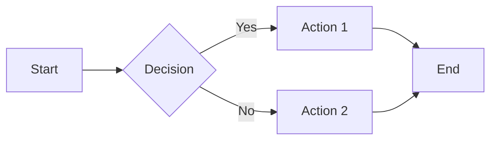

### Sequence Diagram
```mermaid
sequenceDiagram
    A->>B: Message
    B-->>A: Response
```

### Class Diagram
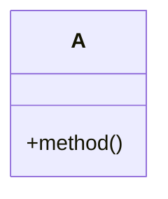

### ER Diagram
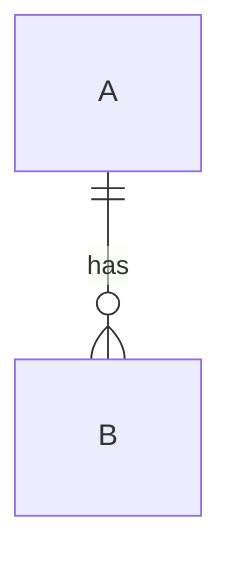

### State Diagram
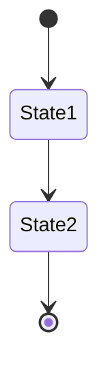
```

### ADR Quick Template

```markdown
# ADR: [Number] - [Title]

## Status
[Accepted | Proposed | Deprecated]

## Context
[Problem statement]

## Decision
[Solution]

## Consequences
[Impact analysis]

## Alternatives
[Other options considered]
```

---

## Quick Start

### Basic Architecture Document

```markdown
# System Architecture: [System Name]

## Overview
[2-3 sentences describing system]

## System Context
[High-level view of system and its environment]

## Containers
[Main applications/services]

## Components
[Key components within containers]

## Deployment
[How system is deployed]

## Technology Stack
- Frontend: React, TypeScript
- Backend: Node.js, Express
- Database: PostgreSQL
- Infrastructure: AWS, Docker
```

### C4 Diagram (Mermaid)

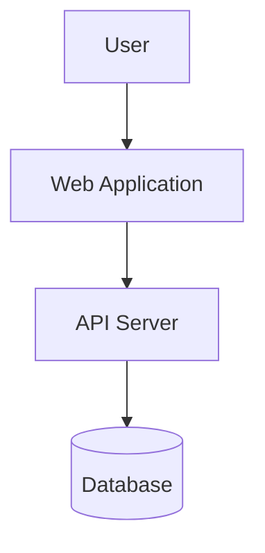

---

## Production Checklist

- [ ] **System Context**: Document system boundaries and external dependencies
- [ ] **Architecture Diagrams**: Include C4 diagrams (Context, Container, Component, Code)
- [ ] **Decision Records**: Maintain ADRs for major decisions
- [ ] **Data Flow**: Document data flow through system
- [ ] **Technology Stack**: List all technologies and versions
- [ ] **Deployment**: Document deployment architecture
- [ ] **Scalability**: Document scaling strategies
- [ ] **Security**: Document security architecture
- [ ] **Monitoring**: Document observability setup
- [ ] **Updates**: Keep documentation current with system changes
- [ ] **Accessibility**: Make documentation accessible to team
- [ ] **Version Control**: Version architecture docs with code

---

## Anti-patterns

### ❌ Don't: Outdated Diagrams

```markdown
# ❌ Bad - Old architecture
## Architecture
[Diagram from 2 years ago that doesn't match current system]
```

```markdown
# ✅ Good - Current architecture
## Architecture (Updated: 2024-01-15)
[Current architecture diagram]
[Last reviewed: 2024-01-15]
```

### ❌ Don't: No Decision Context

```markdown
# ❌ Bad - Decision without context
## Decision: Use PostgreSQL
[No explanation why]
```

```markdown
# ✅ Good - ADR format
# ADR-001: Use PostgreSQL

## Status
Accepted

## Context
We need a relational database that supports ACID transactions
and complex queries for our financial data.

## Decision
Use PostgreSQL as primary database.

## Consequences
- Strong consistency guarantees
- Excellent query performance
- Requires database expertise
```

### ❌ Don't: Too Much Detail

```markdown
# ❌ Bad - Overwhelming detail
## Component: UserService
[500 lines of implementation details]
```

```markdown
# ✅ Good - Appropriate level
## Component: UserService
**Purpose:** Handles user authentication and profile management
**Interfaces:** 
- authenticate(credentials)
- getUserProfile(userId)
**Dependencies:** Database, AuthService
```

---

## Integration Points

- **Technical Writing** (`21-documentation/technical-writing/`) - Clear documentation
- **Decision Records** (`00-meta-skills/decision-records/`) - ADR format
- **Runbooks** (`21-documentation/runbooks/`) - Operational procedures

---

## Further Reading

- [C4 Model](https://c4model.com/)
- [Architecture Decision Records](https://adr.github.io/)
- [Mermaid Diagrams](https://mermaid.js.org/)
