# System Architecture Documentation

## Overview

System architecture documentation describes the structure, behavior, and design of software systems.

---

## 1. Architecture Documentation Importance

### Why Document Architecture

```markdown
# Architecture Documentation Importance

## Benefits

### 1. Knowledge Sharing
- Onboards new developers
- Reduces knowledge silos
- Preserves institutional knowledge
- Enables team collaboration

### 2. Decision Making
- Provides context for decisions
- Documents trade-offs
- Supports future changes
- Enables informed choices

### 3. Maintenance
- Guides system evolution
- Supports debugging
- Facilitates refactoring
- Reduces technical debt

### 4. Communication
- Aligns stakeholders
- Bridges technical gaps
- Supports discussions
- Enables reviews

## Consequences of Poor Documentation

### 1. Knowledge Loss
- When developers leave
- Over time
- During transitions
- Under pressure

### 2. Misunderstandings
- Different interpretations
- Incorrect assumptions
- Misaligned expectations
- Communication gaps

### 3. Increased Costs
- Longer onboarding
- More mistakes
- Slower development
- Higher maintenance

### 4. Technical Debt
- Poor decisions
- Inconsistent patterns
- Difficult maintenance
- System degradation
```

---

## 2. C4 Model

### C4 Model Overview

```markdown
# C4 Model

The C4 model provides a standard approach for software architecture documentation.

## C4 Model Levels

### Level 1: Context Diagram
- Shows system in its environment
- Identifies users and external systems
- Defines system boundaries
- Shows high-level relationships

### Level 2: Container Diagram
- Shows applications and data stores
- Defines major components
- Shows communication paths
- Identifies technologies

### Level 3: Component Diagram
- Shows internal structure
- Defines components and interfaces
- Shows data flow
- Identifies dependencies

### Level 4: Code Diagram
- Shows class or function structure
- Defines implementation details
- Shows relationships
- Identifies patterns
```

### Context Diagram

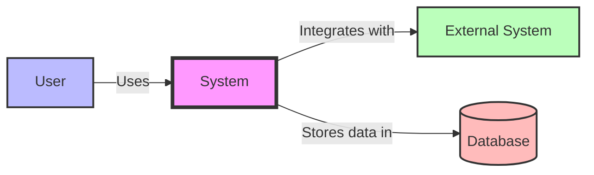

### Container Diagram

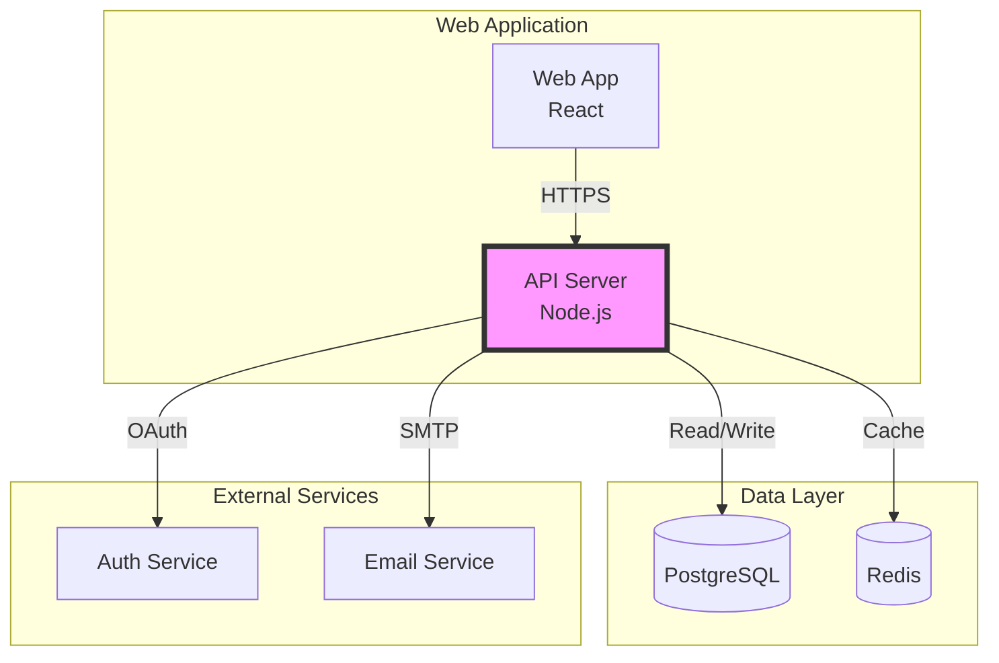

### Component Diagram

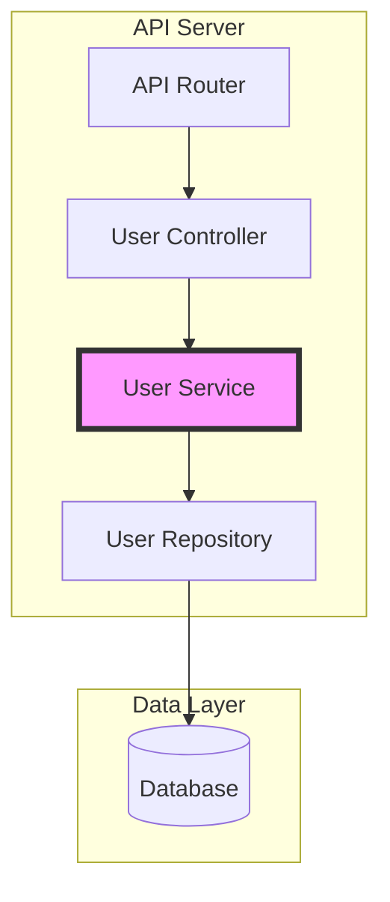

### Code Diagram

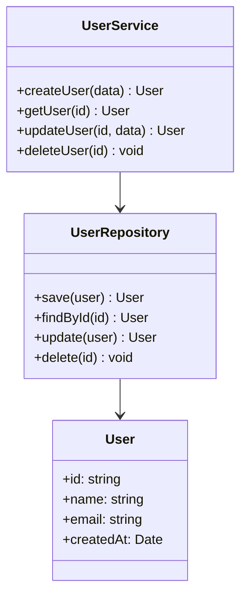

---

## 3. Architecture Decision Records (ADRs)

### ADR Template

```markdown
# ADR Template

## ADR: [Number] - [Title]

### Status
[Proposed | Accepted | Deprecated | Superseded]

### Context
[What is the issue that we're seeing that is motivating this decision or change?]

### Decision
[What is the change that we're proposing and/or doing?]

### Consequences
[What becomes easier or more difficult to do because of this change?]

### Alternatives Considered
[What other approaches did we consider and why did we reject them?]

### Related Decisions
[Links to related ADRs]

### References
[Links to relevant resources]
```

### ADR Example

```markdown
# ADR: 001 - Use PostgreSQL as Primary Database

## Status
Accepted

## Context
We need a relational database for our application that supports:
- ACID transactions
- Complex queries
- JSON data types
- Full-text search
- High availability

We evaluated several database options including MySQL, PostgreSQL, and MongoDB.

## Decision
We will use PostgreSQL as our primary database because it:
- Has excellent ACID compliance
- Supports advanced features like JSONB and full-text search
- Has a strong open-source community
- Provides excellent performance and reliability
- Offers robust replication and high availability options

## Consequences

### Positive
- Strong data integrity with ACID compliance
- Flexible schema with JSONB support
- Built-in full-text search
- Excellent community and documentation
- Proven reliability at scale

### Negative
- Steeper learning curve than some alternatives
- Requires more resources than lightweight databases
- Vertical scaling limitations (though mitigated by replication)

## Alternatives Considered

### MySQL
- **Rejected**: Less flexible schema, weaker JSON support

### MongoDB
- **Rejected**: No ACID transactions at the time of decision

## Related Decisions
- ADR-002: Database Replication Strategy
- ADR-003: Backup and Recovery Plan

## References
- [PostgreSQL Documentation](https://www.postgresql.org/docs/)
- [ACID Properties](https://en.wikipedia.org/wiki/ACID)
```

---

## 4. Data Flow Diagrams

### Data Flow Diagram Template

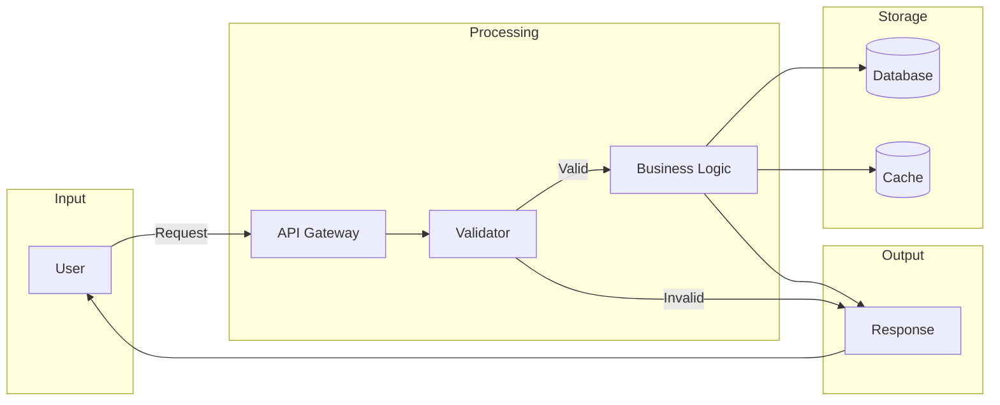

### Complex Data Flow

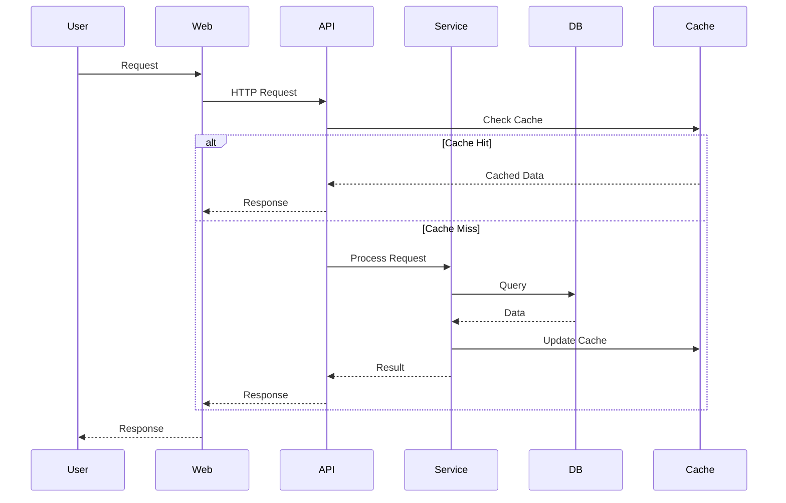

---

## 5. Sequence Diagrams

### Sequence Diagram Template

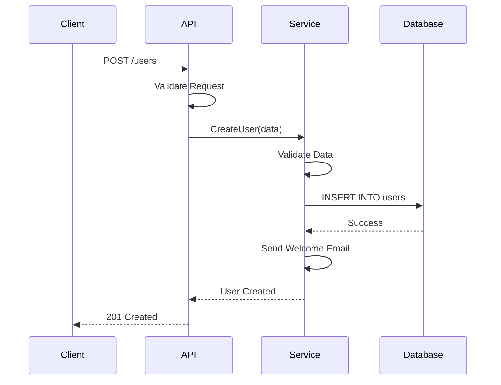

### Authentication Flow

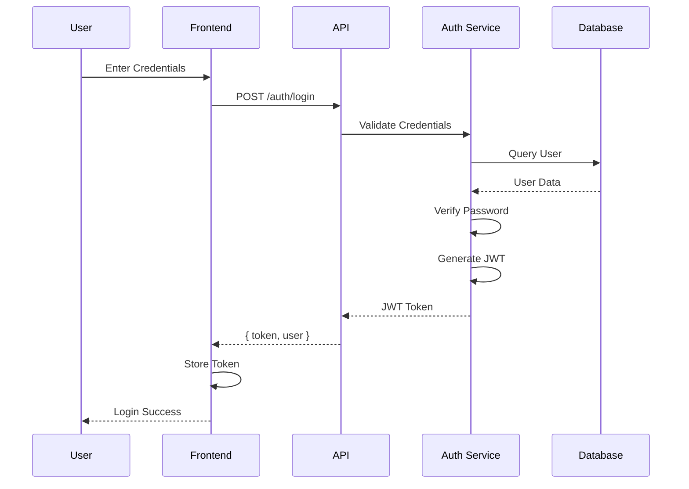

---

## 6. Entity-Relationship Diagrams

### ERD Template

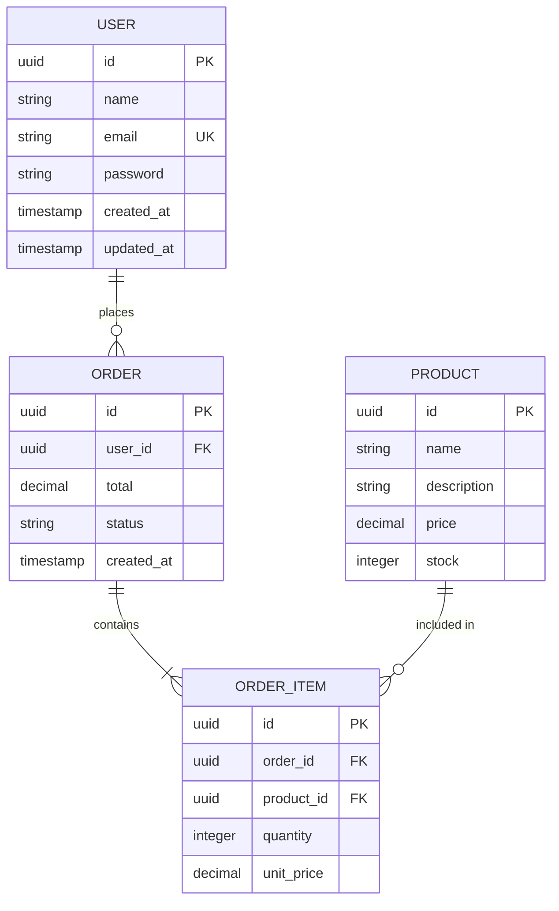

### Complex ERD

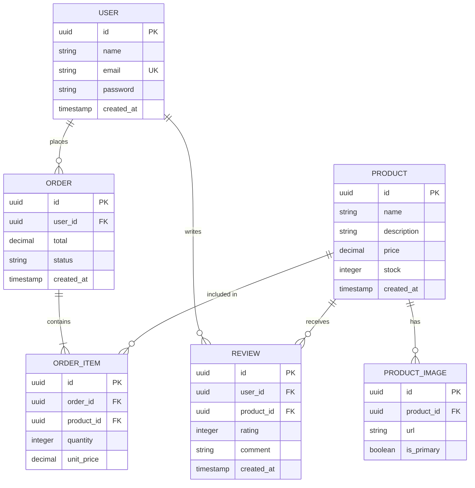

---

## 7. Infrastructure Diagrams

### Infrastructure Diagram Template

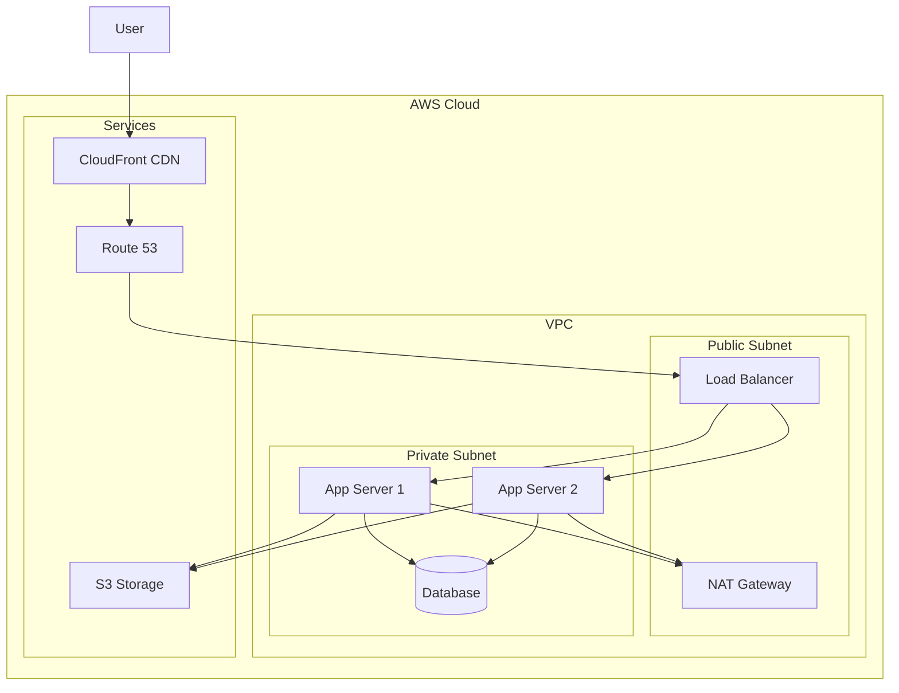

### Microservices Architecture

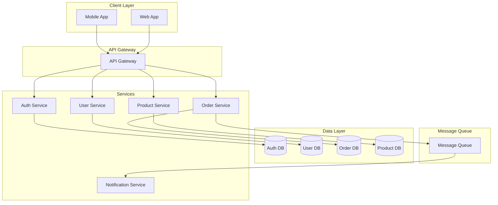

---

## 8. Tools

### Diagram Tools

```markdown
# Diagram Tools

## 1. Mermaid

### Features
- Text-based diagrams
- Version control friendly
- Integrates with Markdown
- Free and open source

### Best For
- Documentation
- Git repositories
- Quick diagrams

### Example
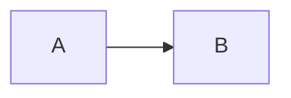

## 2. Draw.io

### Features
- Drag and drop
- Many templates
- Export options
- Free

### Best For
- Complex diagrams
- Visual editing
- Presentations

## 3. PlantUML

### Features
- Text-based
- Many diagram types
- Integrates with tools
- Free

### Best For
- Developers
- Documentation
- UML diagrams

## 4. Lucidchart

### Features
- Collaboration
- Templates
- Integrations
- Cloud-based

### Best For
- Teams
- Enterprise
- Complex diagrams

## 5. Excalidraw

### Features
- Hand-drawn style
- Real-time collaboration
- Free
- Simple

### Best For
- Quick sketches
- Team collaboration
- Brainstorming
```

---

## 9. Documentation as Code

### Principles

```markdown
# Documentation as Code

## Principles

### 1. Version Control
- Store docs in git
- Track changes
- Collaborate with PRs
- Review like code

### 2. Automation
- Auto-generate docs
- Test docs
- Deploy automatically
- Monitor quality

### 3. Integration
- Docs with code
- Single source of truth
- Consistent updates
- Easy maintenance

## Tools

### 1. MkDocs
- Static site generator
- Markdown support
- Themeable
- Plugins

### 2. Docusaurus
- React-based
- MDX support
- Versioning
- Search

### 3. Sphinx
- Python-based
- ReStructuredText
- Extensible
- Professional

### 4. Hugo
- Fast
- Flexible
- Themes
- Shortcodes

## Workflow

### 1. Create
- Write in Markdown
- Use diagrams as code
- Include code examples
- Add metadata

### 2. Review
- Pull request
- Peer review
- Automated checks
- Approval

### 3. Deploy
- CI/CD pipeline
- Automatic deployment
- Version control
- Rollback support
```

---

## 10. Best Practices

### Architecture Documentation Best Practices

```markdown
# Best Practices

## 1. Start Early
- Document as you design
- Keep docs in sync
- Update regularly
- Plan for maintenance

## 2. Be Clear
- Use simple language
- Avoid jargon
- Provide context
- Explain decisions

## 3. Be Visual
- Use diagrams
- Show relationships
- Highlight important parts
- Use consistent style

## 4. Be Complete
- Cover all levels
- Include decisions
- Document trade-offs
- Provide examples

## 5. Be Accessible
- Use standard formats
- Support search
- Provide navigation
- Include glossary

## 6. Be Maintained
- Update regularly
- Track changes
- Review periodically
- Archive old versions

## 7. Be Collaborative
- Get peer reviews
- Share knowledge
- Use version control
- Build consensus

## 8. Be Useful
- Focus on audience
- Answer questions
- Solve problems
- Enable decisions
```

---

## Quick Reference

### Diagram Quick Reference

```markdown
# Diagram Quick Reference

## Mermaid Syntax

### Flowchart
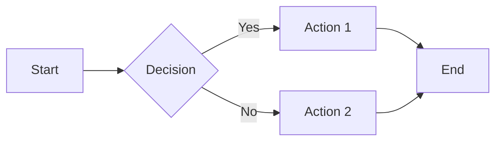

### Sequence Diagram
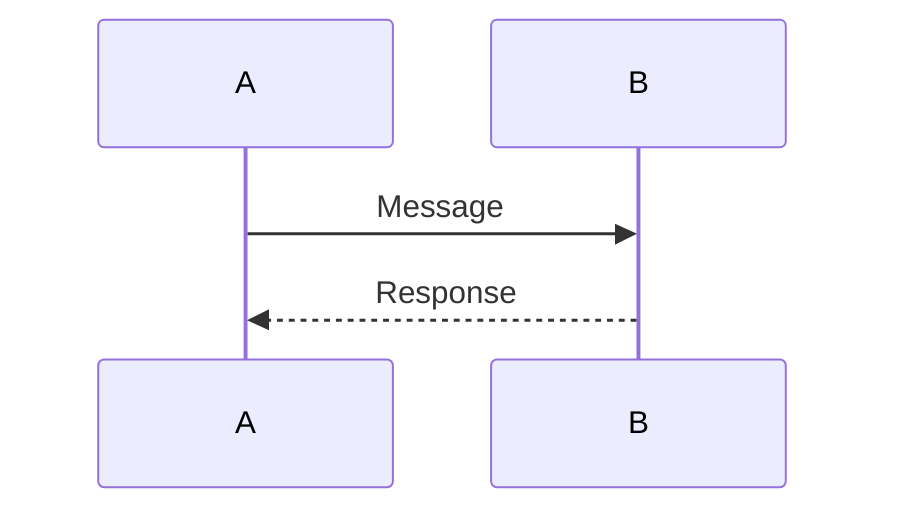

### Class Diagram
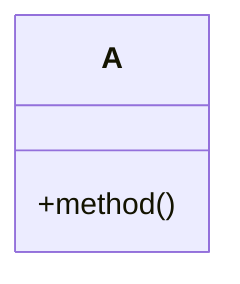

### ER Diagram
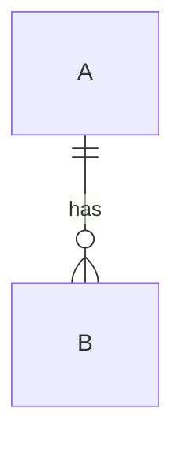

### State Diagram
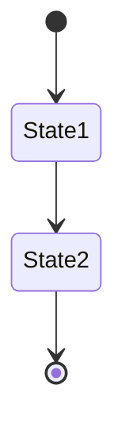
```

### ADR Quick Template

```markdown
# ADR: [Number] - [Title]

## Status
[Accepted | Proposed | Deprecated]

## Context
[Problem statement]

## Decision
[Solution]

## Consequences
[Impact analysis]

## Alternatives
[Other options considered]
```
