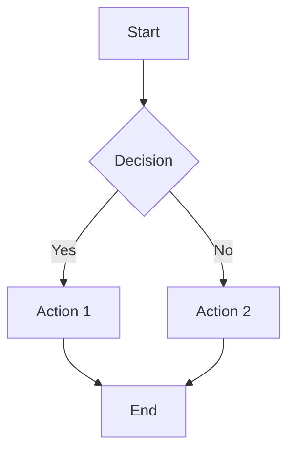

# Technical Writing

## Overview

Technical writing is the art of communicating complex technical information clearly and effectively to a specific audience.

---

## 1. Technical Writing Principles

### Core Principles

```markdown
# Technical Writing Principles

## 1. Clarity
- Use simple, direct language
- Avoid jargon unless necessary
- Explain technical terms
- Use active voice
- Be precise and specific

## 2. Conciseness
- Remove unnecessary words
- Get to the point quickly
- Use short sentences
- Avoid redundancy
- Eliminate filler words

## 3. Accuracy
- Verify all information
- Use correct terminology
- Test all examples
- Cite sources properly
- Update regularly

## 4. Completeness
- Cover all necessary information
- Include edge cases
- Provide examples
- Link to related content
- Address common questions

## 5. Consistency
- Use consistent terminology
- Follow style guide
- Maintain consistent formatting
- Use consistent voice
- Keep structure uniform

## 6. Organization
- Use clear headings
- Group related information
- Use logical flow
- Include table of contents
- Use cross-references

## 7. Accessibility
- Use clear language
- Provide alt text for images
- Use semantic HTML
- Support screen readers
- Follow WCAG guidelines

## 8. Visual Aids
- Use diagrams where helpful
- Include screenshots
- Use tables for data
- Highlight key information
- Use code blocks for code

## 9. User-Centric
- Write for your audience
- Address user goals
- Solve user problems
- Provide practical examples
- Include troubleshooting

## 10. Maintainability
- Use version control
- Create templates
- Document updates
- Review regularly
- Plan for obsolescence
```

---

## 2. Audience Analysis

### Audience Types

```markdown
# Audience Types

## 1. Novice Users
- **Characteristics**: New to the topic, need guidance
- **Needs**: Step-by-step instructions, simple language
- **Approach**: Start with basics, provide examples
- **Avoid**: Technical jargon, assumptions

## 2. Intermediate Users
- **Characteristics**: Some knowledge, need reference
- **Needs**: Quick reference, best practices
- **Approach**: Provide context, explain concepts
- **Avoid**: Over-explaining basics

## 3. Expert Users
- **Characteristics**: Deep knowledge, need details
- **Needs**: Technical details, edge cases
- **Approach**: Provide depth, cover advanced topics
- **Avoid**: Oversimplification

## 4. Developers
- **Characteristics**: Technical background, code-focused
- **Needs**: API docs, code examples, technical specs
- **Approach**: Provide code, explain architecture
- **Avoid**: Business language, marketing speak

## 5. Decision Makers
- **Characteristics**: Business-focused, need overview
- **Needs**: High-level overview, benefits, costs
- **Approach**: Focus on value, ROI
- **Avoid**: Technical details, code

## 6. Operators/Administrators
- **Characteristics**: Maintain systems, need procedures
- **Needs**: Procedures, troubleshooting, runbooks
- **Approach**: Provide clear steps, error handling
- **Avoid**: Theory, background
```

### Audience Analysis Template

```markdown
# Audience Analysis Template

## Document Title: [Document Name]

## Primary Audience
- **Role**: [Developer, Admin, End User, etc.]
- **Experience Level**: [Beginner, Intermediate, Expert]
- **Technical Knowledge**: [Low, Medium, High]
- **Goals**: [What they want to achieve]
- **Pain Points**: [Common problems they face]

## Secondary Audience
- **Role**: [Other relevant roles]
- **Experience Level**: [Beginner, Intermediate, Expert]
- **Technical Knowledge**: [Low, Medium, High]
- **Goals**: [What they want to achieve]
- **Pain Points**: [Common problems they face]

## Assumptions
- [ ] Readers understand [concept]
- [ ] Readers have access to [resource]
- [ ] Readers are familiar with [technology]
- [ ] Readers have [prerequisite knowledge]

## Constraints
- [ ] Document length limit
- [ ] Technical complexity limit
- [ ] Time constraints for readers
- [ ] Platform/format constraints

## Success Criteria
- [ ] Readers can [complete task]
- [ ] Readers understand [concept]
- [ ] Document reduces support tickets by [X]%
- [ ] Readers rate document [X]/5
```

---

## 3. Document Structure

### Standard Structure

```markdown
# Document Structure Template

## 1. Title Page
- Document title
- Version number
- Last updated date
- Author/Contributors
- Document classification

## 2. Table of Contents
- All major headings
- Page numbers or links
- Subheadings (optional)

## 3. Introduction
- Purpose of document
- Scope and limitations
- Target audience
- Prerequisites
- Related documents

## 4. Main Content
- Organized by topic
- Logical flow
- Clear headings
- Examples and diagrams

## 5. Appendices
- Reference material
- Glossary
- Code samples
- Additional resources

## 6. Index
- Alphabetical list of terms
- Page numbers or links
- Cross-references

## 7. Revision History
- Version numbers
- Change descriptions
- Dates
- Authors
```

### Section Structure

```markdown
# Section Structure Template

## Heading
[Brief introduction to the section]

### Subheading
[Content with examples]

#### Sub-subheading
[More specific content]

> **Note**: Important information

> **Warning**: Cautionary information

> **Tip**: Helpful suggestions

## Code Example

```language
// Code here
```

## Summary
[Brief recap of key points]

## Next Steps
[What to do next]
```

---

## 4. Writing Style

### Style Guidelines

```markdown
# Writing Style Guidelines

## Voice and Tone

### Active Voice
**Good**: The system processes the request.
**Bad**: The request is processed by the system.

### Present Tense
**Good**: Click the button to submit.
**Bad**: Click the button to have submitted.

### Simple Language
**Good**: Use this method to create a user.
**Bad**: Utilize this methodology for user creation.

## Sentence Structure

### Short Sentences
- Aim for 15-20 words
- One idea per sentence
- Clear subject-verb-object

### Parallel Structure
**Good**: Create, read, update, and delete users.
**Bad**: Create, reading, update, and deleting users.

## Word Choice

### Avoid Jargon
**Good**: Use the search feature to find users.
**Bad**: Utilize the search functionality for user discovery.

### Be Specific
**Good**: Click the Save button to save your changes.
**Bad**: Click the button to save.

### Use Familiar Words
**Good**: Start the application.
**Bad**: Initiate the application.

## Formatting

### Use Headings
- H1: Document title
- H2: Main sections
- H3: Subsections
- H4: Details

### Use Lists
- Bullet lists for items
- Numbered lists for steps
- Description lists for terms

### Use Emphasis
- **Bold** for important terms
- *Italic* for emphasis
- `Code` for technical terms
- > Blockquotes for notes

## Consistency

### Terminology
- Use the same term for the same concept
- Define acronyms on first use
- Create a glossary for technical terms

### Formatting
- Use consistent heading levels
- Use consistent list styles
- Use consistent code block formatting
```

---

## 5. Code Documentation

### Inline Documentation

```python
# Function Documentation (Python)
def create_user(name: str, email: str, age: int = None) -> User:
    """
    Create a new user in the system.

    Args:
        name: The user's full name. Must be at least 2 characters.
        email: The user's email address. Must be a valid email format.
        age: Optional user age. Must be a positive integer if provided.

    Returns:
        User: The created user object with a unique ID.

    Raises:
        ValueError: If name is too short or email is invalid.
        DuplicateUserError: If a user with this email already exists.

    Example:
        >>> user = create_user("John Doe", "john@example.com", 30)
        >>> print(user.id)
        12345

    Note:
        This function automatically sends a welcome email to the new user.
    """
    # Validate input
    if len(name) < 2:
        raise ValueError("Name must be at least 2 characters")

    if not is_valid_email(email):
        raise ValueError("Invalid email format")

    if age is not None and age <= 0:
        raise ValueError("Age must be a positive integer")

    # Check for duplicates
    if user_exists(email):
        raise DuplicateUserError(f"User with email {email} already exists")

    # Create user
    user = User(name=name, email=email, age=age)
    user.save()

    # Send welcome email
    send_welcome_email(user)

    return user
```

```typescript
// Function Documentation (TypeScript)
/**
 * Creates a new user in the system.
 *
 * @param name - The user's full name. Must be at least 2 characters.
 * @param email - The user's email address. Must be a valid email format.
 * @param age - Optional user age. Must be a positive integer if provided.
 * @returns The created user object with a unique ID.
 *
 * @throws {ValidationError} If name is too short or email is invalid.
 * @throws {DuplicateUserError} If a user with this email already exists.
 *
 * @example
 * ```typescript
 * const user = await createUser("John Doe", "john@example.com", 30);
 * console.log(user.id); // 12345
 * ```
 *
 * @remarks
 * This function automatically sends a welcome email to the new user.
 *
 * @see {@link sendWelcomeEmail} for email sending logic
 * @see {@link User} for user object structure
 */
export async function createUser(
  name: string,
  email: string,
  age?: number
): Promise<User> {
  // Validate input
  if (name.length < 2) {
    throw new ValidationError("Name must be at least 2 characters");
  }

  if (!isValidEmail(email)) {
    throw new ValidationError("Invalid email format");
  }

  if (age !== undefined && age <= 0) {
    throw new ValidationError("Age must be a positive integer");
  }

  // Check for duplicates
  if (await userExists(email)) {
    throw new DuplicateUserError(`User with email ${email} already exists`);
  }

  // Create user
  const user = new User({ name, email, age });
  await user.save();

  // Send welcome email
  await sendWelcomeEmail(user);

  return user;
}
```

### Class Documentation

```python
# Class Documentation (Python)
class UserService:
    """
    Manages user-related operations in the system.

    This service provides methods for creating, retrieving, updating,
    and deleting users, as well as managing user authentication and
    authorization.

    Attributes:
        db (Database): The database connection for user storage.
        cache (Cache): The cache for frequently accessed users.
        logger (Logger): Logger for service operations.

    Example:
        >>> service = UserService(db, cache)
        >>> user = service.create_user("John", "john@example.com")
        >>> print(user.name)
        John

    Note:
        This service is thread-safe and can be used in concurrent
        environments.

    See Also:
        - User: User model class
        - AuthService: For authentication operations
    """

    def __init__(self, db: Database, cache: Cache):
        """Initialize the UserService.

        Args:
            db: Database connection for user storage.
            cache: Cache for frequently accessed users.
        """
        self.db = db
        self.cache = cache
        self.logger = logging.getLogger(__name__)

    def create_user(self, name: str, email: str) -> User:
        """Create a new user.

        Args:
            name: User's full name.
            email: User's email address.

        Returns:
            The created user object.

        Raises:
            ValidationError: If validation fails.
            DuplicateUserError: If user already exists.
        """
        # Implementation
        pass
```

---

## 6. Screenshots and Diagrams

### Screenshot Guidelines

```markdown
# Screenshot Guidelines

## When to Use Screenshots
- Show UI elements
- Demonstrate workflows
- Highlight specific features
- Provide visual context

## Screenshot Best Practices

### 1. Relevance
- Only include relevant parts
- Crop unnecessary elements
- Focus on the feature being documented

### 2. Clarity
- Use high resolution
- Ensure text is readable
- Avoid blurry images

### 3. Consistency
- Use consistent sizing
- Use consistent styling
- Use consistent annotations

### 4. Accessibility
- Provide alt text
- Describe visual content
- Use descriptive filenames

### 5. Annotations
- Highlight key elements
- Add numbered callouts
- Use clear labels
- Keep annotations minimal

## Screenshot Template

```markdown
## [Feature Name] Screenshot

![Screenshot of [feature]](path/to/screenshot.png)

**Figure 1**: [Brief description of what the screenshot shows]

### Key Elements
1. [Element 1]: Description
2. [Element 2]: Description
3. [Element 3]: Description
```
```

### Diagram Guidelines

```markdown
# Diagram Guidelines

## When to Use Diagrams
- Show system architecture
- Explain data flow
- Illustrate processes
- Map relationships

## Diagram Types

### 1. Flowcharts
- Show process flows
- Decision points
- Sequential steps

### 2. Architecture Diagrams
- System components
- Data flow
- Dependencies

### 3. Sequence Diagrams
- Interaction sequences
- Message flow
- Timing

### 4. Entity-Relationship Diagrams
- Data models
- Relationships
- Attributes

### 5. State Diagrams
- State transitions
- Events
- Conditions

## Diagram Best Practices

### 1. Clarity
- Keep it simple
- Use consistent symbols
- Label all elements
- Use color meaningfully

### 2. Accuracy
- Verify all connections
- Check for completeness
- Ensure correct relationships
- Test with real data

### 3. Accessibility
- Provide text descriptions
- Use high contrast
- Support screen readers
- Include alt text

### 4. Maintainability
- Use diagram tools
- Version control diagrams
- Document changes
- Keep diagrams updated

## Diagram Template (Mermaid)


```

---

## 7. Examples and Tutorials

### Example Guidelines

```markdown
# Example Guidelines

## Example Structure

### 1. Context
- Brief description of what the example shows
- Prerequisites for running the example
- Expected outcome

### 2. Code
- Complete, runnable code
- Comments for complex sections
- Error handling where appropriate

### 3. Explanation
- Step-by-step breakdown
- Key concepts explained
- Common pitfalls highlighted

### 4. Output
- Expected output shown
- Variations explained
- Error cases covered

## Example Template

```markdown
## Example: [Example Title]

### Description
[Brief description of what this example demonstrates]

### Prerequisites
- [Prerequisite 1]
- [Prerequisite 2]

### Code

```python
# Complete, runnable code
def example():
    # Your code here
    pass

if __name__ == "__main__":
    example()
```

### Explanation
1. [Step 1]: Explanation
2. [Step 2]: Explanation
3. [Step 3]: Explanation

### Output
```
Expected output here
```

### Notes
> **Note**: Any important notes or warnings

### See Also
- [Related topic 1](link)
- [Related topic 2](link)
```
```

### Tutorial Guidelines

```markdown
# Tutorial Guidelines

## Tutorial Structure

### 1. Introduction
- What you'll learn
- What you'll build
- Prerequisites
- Estimated time

### 2. Setup
- Environment setup
- Dependencies
- Configuration

### 3. Steps
- Numbered steps
- Clear instructions
- Code examples
- Explanations

### 4. Testing
- How to verify
- Expected results
- Troubleshooting

### 5. Conclusion
- What you learned
- Next steps
- Further resources

## Tutorial Template

```markdown
# Tutorial: [Tutorial Title]

## What You'll Learn
- [Learning objective 1]
- [Learning objective 2]
- [Learning objective 3]

## What You'll Build
[Brief description of the project]

## Prerequisites
- [Prerequisite 1]
- [Prerequisite 2]
- [Prerequisite 3]

## Estimated Time
[X] minutes

## Step 1: [Step Title]

[Instructions and code]

## Step 2: [Step Title]

[Instructions and code]

## Step 3: [Step Title]

[Instructions and code]

## Testing Your Implementation

[How to verify it works]

## Conclusion

[Summary and next steps]

## Further Reading
- [Resource 1](link)
- [Resource 2](link)
```
```

---

## 8. Version Control for Docs

### Git Best Practices

```markdown
# Version Control for Documentation

## Git Workflow

### 1. Branching Strategy
- `main`: Production-ready docs
- `develop`: Integration branch
- `feature/*`: New features
- `fix/*`: Bug fixes
- `docs/*`: Documentation updates

### 2. Commit Messages
- Use conventional commits
- Be descriptive
- Reference issues
- Keep messages short

### Commit Message Format
```
type(scope): subject

body

footer
```

### Types
- `docs`: Documentation changes
- `feat`: New features
- `fix`: Bug fixes
- `refactor`: Code refactoring
- `style`: Style changes
- `test`: Test updates
- `chore`: Maintenance

### Example Commits
```
docs(api): add authentication endpoint documentation

- Add request/response examples
- Include error codes
- Add curl examples

Closes #123
```

```
docs(user-guide): update installation instructions

- Add Windows support
- Update version numbers
- Fix broken links

Fixes #456
```

## Documentation Versioning

### 1. Semantic Versioning
- MAJOR: Breaking changes
- MINOR: New features
- PATCH: Bug fixes

### 2. Version Tags
- Tag releases with version numbers
- Create release notes
- Maintain multiple versions

### 3. Version Selector
- Allow users to select version
- Show latest by default
- Link to older versions

## Documentation as Code

### 1. Markdown
- Use markdown for content
- Keep in git repository
- Use pull requests for changes
- Review documentation like code

### 2. CI/CD
- Build docs on commit
- Test links
- Validate markdown
- Deploy automatically

### 3. Automated Checks
- Spell checking
- Link checking
- Linting
- Style checking
```

---

## 9. Style Guides

### Common Style Guides

```markdown
# Style Guides

## 1. Google Developer Documentation Style Guide
- Clear and concise
- Active voice
- Present tense
- Simple language
- Consistent terminology

## 2. Microsoft Writing Style Guide
- User-focused
- Task-oriented
- Clear instructions
- Consistent formatting
- Accessible language

## 3. Mozilla Developer Network (MDN)
- Technical accuracy
- Code examples
- Browser compatibility
- Clear explanations
- Cross-references

## 4. Diátaxis Framework
- Tutorials: Learning-oriented
- How-to Guides: Problem-oriented
- Explanation: Understanding-oriented
- Reference: Information-oriented

## Creating Your Style Guide

### 1. Voice and Tone
- Define personality
- Set formality level
- Specify language preferences

### 2. Formatting
- Heading hierarchy
- List styles
- Code formatting
- Image guidelines

### 3. Terminology
- Product name usage
- Acronym definitions
- Capitalization rules
- Spelling conventions

### 4. Grammar and Mechanics
- Punctuation rules
- Capitalization rules
- Number formatting
- Date/time formatting
```

### Custom Style Guide Template

```markdown
# [Project Name] Documentation Style Guide

## 1. Voice and Tone
- [ ] Use active voice
- [ ] Use present tense
- [ ] Use simple language
- [ ] Be direct and concise
- [ ] Use inclusive language

## 2. Formatting
- [ ] Use H1 for document title only
- [ ] Use H2 for main sections
- [ ] Use H3 for subsections
- [ ] Use H4 for details
- [ ] Use bullet lists for items
- [ ] Use numbered lists for steps

## 3. Code
- [ ] Use language-specific syntax highlighting
- [ ] Include comments in code
- [ ] Show complete, runnable examples
- [ ] Use consistent indentation
- [ ] Include output where helpful

## 4. Images and Diagrams
- [ ] Use PNG or SVG format
- [ ] Include alt text
- [ ] Crop to relevant content
- [ ] Use consistent sizing
- [ ] Annotate when necessary

## 5. Links
- [ ] Use descriptive link text
- [ ] Check all links regularly
- [ ] Use relative links for internal content
- [ ] Open external links in new tabs
- [ ] Include link previews where helpful

## 6. Terminology
- [ ] Define acronyms on first use
- [ ] Use consistent terminology
- [ ] Capitalize product names correctly
- [ ] Use lowercase for generic terms

## 7. Grammar and Mechanics
- [ ] Use Oxford comma
- [ ] Use en-dash for ranges
- [ ] Use em-dash for breaks
- [ ] Spell out numbers under 10
- [ ] Use numerals for 10 and above

## 8. Accessibility
- [ ] Use semantic HTML
- [ ] Include alt text for images
- [ ] Use proper heading hierarchy
- [ ] Ensure color contrast
- [ ] Test with screen readers
```

---

## 10. Tools

### Documentation Tools

```markdown
# Documentation Tools

## 1. Markdown Editors

### VS Code
- **Features**: Syntax highlighting, preview, extensions
- **Best For**: Developers, technical writers
- **Extensions**: Markdown All in One, Markdown PDF

### Typora
- **Features**: WYSIWYG, clean interface
- **Best For**: Writers, bloggers
- **Platforms**: Windows, Mac, Linux

### Obsidian
- **Features**: Knowledge base, linking
- **Best For**: Personal notes, research
- **Platforms**: Windows, Mac, Linux, iOS, Android

## 2. Documentation Platforms

### Docusaurus
- **Features**: Static site, React-based, easy customization
- **Best For**: Open source projects, technical docs
- **Hosting**: GitHub Pages, Netlify, Vercel

### GitBook
- **Features**: Collaborative, easy to use
- **Best For**: Teams, product documentation
- **Hosting**: GitBook platform

### Notion
- **Features**: All-in-one workspace, flexible
- **Best For**: Teams, knowledge bases
- **Hosting**: Notion platform

### Confluence
- **Features**: Enterprise features, integrations
- **Best For**: Large organizations
- **Hosting**: Atlassian cloud or self-hosted

## 3. Diagram Tools

### Mermaid
- **Features**: Text-based diagrams, version control
- **Best For**: Developers, technical docs
- **Format**: Markdown

### Draw.io
- **Features**: Free, easy to use
- **Best For**: General diagrams
- **Platforms**: Web, desktop

### Lucidchart
- **Features**: Collaboration, templates
- **Best For**: Teams, complex diagrams
- **Platforms**: Web, desktop

## 4. API Documentation

### Swagger/OpenAPI
- **Features**: Standard format, interactive docs
- **Best For**: REST APIs
- **Tools**: Swagger UI, Redoc, Stoplight

### Postman
- **Features**: Testing, documentation
- **Best For**: API development
- **Platforms**: Web, desktop

## 5. Testing Tools

### Link Checker
- **Features**: Find broken links
- **Best For**: Link validation
- **CLI**: `markdown-link-check`

### Lighthouse
- **Features**: Performance, accessibility
- **Best For**: Web docs
- **Browser**: Chrome

## 6. Spell Checkers

### Code Spell Checker
- **Features**: VS Code extension
- **Best For**: Code and docs
- **Platform**: VS Code

### Grammarly
- **Features**: Grammar, style checking
- **Best For**: General writing
- **Platforms**: Web, desktop, browser
```

---

## 11. Review Process

### Review Checklist

```markdown
# Documentation Review Checklist

## Content Review
- [ ] Content is accurate
- [ ] Content is complete
- [ ] Content is up-to-date
- [ ] Examples are tested
- [ ] Links work correctly
- [ ] Code runs without errors
- [ ] Screenshots are current
- [ ] Diagrams are accurate

## Style Review
- [ ] Follows style guide
- [ ] Uses consistent terminology
- [ ] Uses active voice
- [ ] Uses present tense
- [ ] Uses simple language
- [ ] Has proper formatting
- [ ] Has correct grammar
- [ ] Has correct spelling

## Structure Review
- [ ] Has clear headings
- [ ] Has logical flow
- [ ] Has proper hierarchy
- [ ] Has table of contents
- [ ] Has cross-references
- [ ] Has proper sections

## Accessibility Review
- [ ] Has alt text for images
- [ ] Uses semantic HTML
- [ ] Has proper heading levels
- [ ] Has sufficient color contrast
- [ ] Works with screen readers
- [ ] Has keyboard navigation

## Technical Review
- [ ] Technical accuracy verified
- [ ] Code examples work
- [ ] API documentation correct
- [ ] Commands work as shown
- [ ] Configuration is accurate

## User Testing
- [ ] Tested by target audience
- [ ] Feedback incorporated
- [ ] Issues addressed
- [ ] Improvements made

## Final Approval
- [ ] All reviewers approved
- [ ] Changes incorporated
- [ ] Ready for publication
- [ ] Version tagged
```

### Review Process

```markdown
# Documentation Review Process

## 1. Self-Review
- Writer reviews own work
- Uses checklist
- Makes initial corrections

## 2. Peer Review
- Another writer reviews
- Provides feedback
- Suggests improvements

## 3. Technical Review
- Subject matter expert reviews
- Verifies technical accuracy
- Confirms code works

## 4. User Review
- Target audience tests
- Provides feedback
- Reports issues

## 5. Final Review
- All feedback incorporated
- Final checklist completed
- Approval for publication

## Review Tools

### GitHub Pull Requests
- Track changes
- Discuss comments
- Approve changes

### Google Docs Comments
- Inline comments
- Suggestion mode
- Real-time collaboration

### Content Review Tools
- Grammar checking
- Style checking
- Link validation
```

---

## 12. Best Practices

### Technical Writing Best Practices

```markdown
# Technical Writing Best Practices

## 1. Planning
- Define audience first
- Outline content
- Plan structure
- Set goals

## 2. Writing
- Write in plain language
- Use active voice
- Keep it concise
- Be specific

## 3. Organizing
- Use clear headings
- Group related content
- Use lists where appropriate
- Provide navigation

## 4. Illustrating
- Use examples
- Include diagrams
- Add screenshots
- Show code

## 5. Reviewing
- Proofread carefully
- Get peer reviews
- Test examples
- Check links

## 6. Maintaining
- Update regularly
- Track changes
- Version control
- Archive old content

## 7. Publishing
- Choose right platform
- Optimize for search
- Ensure accessibility
- Test on devices

## 8. Measuring
- Track analytics
- Gather feedback
- Monitor issues
- Improve continuously

## 9. Collaborating
- Use version control
- Document decisions
- Share knowledge
- Train team

## 10. Learning
- Study good examples
- Read style guides
- Take courses
- Practice regularly
```

---

## Quick Reference

### Quick Tips

```markdown
# Quick Writing Tips

## Do's
- ✓ Use active voice
- ✓ Keep sentences short
- ✓ Use simple words
- ✓ Provide examples
- ✓ Test your code
- ✓ Check your links
- ✓ Get feedback
- ✓ Update regularly

## Don'ts
- ✗ Use passive voice
- ✗ Write long sentences
- ✗ Use jargon
- ✗ Skip examples
- ✗ Assume knowledge
- ✗ Ignore feedback
- ✗ Let docs get stale
- ✗ Copy without attribution
```

### Common Mistakes

```markdown
# Common Mistakes to Avoid

## 1. Assuming Knowledge
- **Mistake**: Assuming readers know what you know
- **Fix**: Explain concepts, provide context

## 2. Using Jargon
- **Mistake**: Using technical terms without explanation
- **Fix**: Define terms, use plain language

## 3. Being Too Wordy
- **Mistake**: Writing long, complex sentences
- **Fix**: Keep it simple and concise

## 4. Skipping Examples
- **Mistake**: Not providing practical examples
- **Fix**: Include code examples and use cases

## 5. Not Testing
- **Mistake**: Not testing code examples
- **Fix**: Test all examples before publishing

## 6. Broken Links
- **Mistake**: Links that don't work
- **Fix**: Check links regularly, use link checkers

## 7. Inconsistent Terminology
- **Mistake**: Using different terms for same concept
- **Fix**: Create and follow a glossary

## 8. Poor Structure
- **Mistake**: Content without clear organization
- **Fix**: Use headings, lists, and logical flow
```
