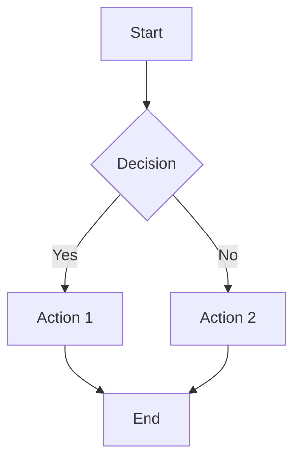

# Technical Writing

> **Current Level:** Expert (Enterprise Scale)
> **Domain:** Documentation / Communication

---

## Overview

Technical writing is art of communicating complex technical information clearly and effectively to a specific audience. Effective technical writing uses structured formats, clear language, proper grammar, and appropriate detail levels to help readers understand and use technical information.

---

## 1. Executive Summary & Strategic Necessity

* **Context:** ในปี 2025-2026 Technical Writing ด้วย Best Practices ช่วย Documentation ที่มีอัตโนมาติการทำงานอัตโนมาติ (Documentation Excellence) ใน Enterprise Scale

* **Business Impact:** Technical Writing ช่วยลด Downtime ของระบบ Documentation ผ่านการตอบคำถามอัตโนมาติการเขียนเอกสาร (Reduce onboarding time), ลดต้นทุนการจัดการทีม (Increase documentation quality), เพิ่มอัตรากำไร Gross Margin ผ่านการทำงานอัตโนมาติ (Faster knowledge transfer), และปรับประสบทการทำงาน (Consistent documentation)

* **Product Thinking:** Technical Writing ช่วยแก้ปัญหา (Pain Point) ความต้องการมีการเขียนเอกสารที่ชัดเจน (Teams need clear documentation) ผ่านการทำงานอัตโนมาติ (Standardized documentation)

---

## 2. Technical Deep Dive (The "How-to")

* **Core Logic:** Technical Writing ใช้ Best Practices ช่วย Documentation ทำงานอัตโนมาติ:
  1. **Writing Principles**: กำหนด Writing Principles (Clarity, Conciseness, Accuracy, Completeness, Consistency)
  2. **Audience Analysis**: สร้าง Audience Analysis สำหรับการเข้าใจ target audience (Audience types, Audience analysis template)
  3. **Document Structure**: จัดการ Document Structure สำหรับการจัดรูปแบบ documents (Standard structure, Section structure)
  4. **Writing Style**: สร้าง Writing Style สำหรับการเขียนด้วย style ที่ดี (Voice and tone, Sentence structure, Word choice)
  5. **Code Documentation**: สร้าง Code Documentation สำหรับการเขียน code comments (Inline documentation, Class documentation)
  6. **Documentation as Code**: สร้าง Documentation as Code สำหรับ AI Agents (Version control, Automation, Integration)

* **Architecture Diagram Requirements:** แผนผังระบบ Technical Writing ต้องมีองค์ประกอบ:
  1. **Documentation Repository**: Documentation Repository สำหรับการจัดเก็บ docs (Git repository, Documentation platform)
  2. **Documentation Generator**: Documentation Generator สำหรับการสร้าง docs (MkDocs, Docusaurus, Sphinx)
  3. **Documentation Templates**: Documentation Templates สำหรับการเขียน docs (Document templates, Section templates)
  4. **Documentation Review System**: Documentation Review System สำหรับการ review docs (Peer review, Technical review, User testing)
  5. **Documentation as Code Pipeline**: Documentation as Code Pipeline สำหรับการ deploy docs (CI/CD pipeline, Automated deployment)
  6. **Documentation Search**: Documentation Search สำหรับการค้นหา docs (Full-text search, Tag-based search, Category-based search)
  7. **Observability**: Logging, Monitoring, Tracing สำหรับการ debug และปรับสิทท

* **Implementation Workflow:** ขั้นตอนการนำ Technical Writing ไปใช้งานจริง:
  1. **Planning Phase**: กำหนด Requirement และเลือก Documentation Platform ที่เหมาะสม
  2. **Documentation Repository Setup**: ตั้งค่า Documentation Repository สำหรับการจัดเก็บ docs
  3. **Documentation Generator Setup**: ตั้งค่า Documentation Generator สำหรับการสร้าง docs
  4. **Documentation Templates Creation**: สร้าง Documentation Templates สำหรับการเขียน docs
  5. **Documentation Review System Setup**: ตั้งค่า Documentation Review System สำหรับการ review docs
  6. **Documentation as Code Pipeline Setup**: ตั้งค่า Documentation as Code Pipeline สำหรับการ deploy docs
  7. **Testing Phase**: Unit test, Integration test, E2E test ด้วยจริง Scenario
  8. **Deployment**: Deploy ด้วย CI/CD pipeline, Set up Monitoring
  9. **Optimization**: Optimize documentation search, Add documentation templates, Improve UX
  10. **Maintenance**: Monitor documentation usage, Update documentation content, Handle edge cases

---

## 3. Tooling & Tech Stack

* **Enterprise Tools:** เครื่องมือระดับอุตสาหกรรมที่เลือกใช้สำหรับ Technical Writing ใน Enterprise Scale:
  1. **MkDocs**: Static site generator สำหรับ documentation
  2. **Docusaurus**: React-based documentation platform สำหรับ docs
  3. **Sphinx**: Python-based documentation tool สำหรับ docs
  4. **Hugo**: Fast static site generator สำหรับ docs
  5. **VS Code**: Markdown editor สำหรับ writing
  6. **Typora**: WYSIWYG markdown editor สำหรับ writing
  7. **Obsidian**: Knowledge base tool สำหรับ writing
  8. **Mermaid**: Text-based diagram tool สำหรับ diagrams
  9. **Draw.io**: Drag-and-drop diagram tool สำหรับ diagrams
  10. **Git**: Version control system สำหรับ doc versioning

* **Configuration Essentials:** การตั้งค่าสำคัญสำหรับให้ระบบเสถียร Technical Writing:
  1. **Documentation Templates**: ตั้งค่า Documentation Templates (Document templates, Section templates)
  2. **Writing Style Guide**: ตั้งค่า Writing Style Guide (Voice and tone, Sentence structure, Word choice)
  3. **Documentation Review**: ตั้งค่า Documentation Review (Peer review, Technical review, User testing)
  4. **Documentation as Code**: ตั้งค่า Documentation as Code (Version control, Automation, Integration)
  5. **Documentation Search**: ตั้งค่า Documentation Search (Full-text search, Tag-based search, Category-based search)
  6. **Monitoring**: ตั้งค่า Monitoring สำหรับ tracking documentation usage (Usage metrics, Search analytics, Feedback collection)
  7. **Secret Management**: Use Environment variables หรือ Secret Manager (AWS Secrets Manager, HashiCorp Vault)
  8. **Rate Limiting**: Per-user และ Per-IP rate limits สำหรับป้องกัน Abuse (100-1000 requests/hour)
  9. **Logging Level**: INFO สำหรับ Production, DEBUG สำหรับ Development
  10. **Observability**: Track success rate, documentation usage, search accuracy ต่อเป้าหลาย

---

## 4. Standards, Compliance & Security

* **International Standards:** มาตรฐานที่เกี่ยวข้อง:
  1. **ISO/IEC 27001**: Information Security Management - สำหรับการจัดการ Secrets และ Access Control
  2. **ISO/IEC 27017**: Code of Practice for Information Security Controls - สำหรับ Secure Documentation
  3. **WCAG 2.1**: Web Content Accessibility Guidelines - สำหรับ Accessibility
  4. **GDPR**: General Data Protection Regulation - สำหรับการจัดการ Personal Data และ User Consent
  5. **SOC 2 Type II**: Security Controls - สำหรับการ Audit และ Compliance

* **Security Protocol:** กลไกการป้องกัน Technical Writing:
  1. **Input Validation**: Validate และ Sanitize ทุก Input ก่อน processing (Prevent XSS, SQL injection)
  2. **Output Sanitization**: Filter sensitive information จาก documentation (API keys, Secrets, Passwords)
  3. **Access Control**: RBAC (Role-Based Access Control) สำหรับ documentation access - บาง docs internal only
  4. **Audit Trail**: Log ทุก documentation access ด้วย Timestamp, User ID, และ Doc accessed (สำหรับ Forensics และ Compliance)
  5. **Rate Limiting**: Per-user และ Per-IP rate limits สำหรับป้องกัน Abuse (100-1000 requests/hour)
  6. **Secure Communication**: TLS 1.3 สำหรับ HTTPS access
  7. **Secret Management**: Use Environment variables หรือ Secret Manager (AWS Secrets Manager, HashiCorp Vault)
  8. **Content Security**: CSP headers สำหรับ preventing XSS attacks
  9. **Authentication**: Implement authentication สำหรับ internal documentation (SSO, OAuth)
  10. **Data Encryption**: Encrypt sensitive data ที่ rest ใน Database (AES-256 หรือ Customer-managed keys)

* **Explainability:** (สำหรับ Documentation) ความสามารถในการอธิบายผลลัพธ์ผ่านเทคนิค:
  1. **Clear Structure**: เก็บ documentation structure สำหรับ easy understanding
  2. **Detailed Examples**: Provide detailed examples สำหรับ complex topics
  3. **Context Information**: Include context information สำหรับ understanding concepts
  4. **Reference Links**: Link to external documentation สำหรับ complex topics
  5. **Glossary**: Provide glossary สำหรับ technical terms

---

## 5. Unit Economics & Performance Metrics (KPIs)

* **Cost Calculation:** สูตรการคำนวณต้นทุกต่อหน่วย Technical Writing:
  1. **Platform Cost** = Platform subscription × Cost per user/month
     - Confluence: $5-15/user/month
     - Notion: $8-15/user/month
     - GitBook: $8-20/user/month
  2. **Storage Cost** = Documentation storage × Cost per GB/month
     - GitHub Pages: Free
     - GitLab Pages: Free
     - S3: $0.023/GB/month
  3. **Editor Cost** = Editor subscription × Cost per user/month
     - VS Code: Free
     - Typora: $15 one-time
  4. **Monitoring Cost** = Monitoring platform subscription × Cost per month
     - Grafana Cloud: $50-500/month
     - Datadog: $15-23/host/month
  5. **Total Monthly Cost** = Platform Cost + Storage Cost + Editor Cost + Monitoring Cost
  6. **Infrastructure Costs** = Compute ($0/month for static sites) + Storage ($0/month for static sites) + Monitoring ($50-500/month)

* **Key Performance Indicators:** ตัวชี้วัดความสำเร็จทางเทคนิค:
  1. **Documentation Coverage**: เปอร์เซ็นต์ของ features ที่มี documentation (Target: >80%)
  2. **Documentation Quality Score**: คะแนน documentation quality จาก automated checks (Target: >4.0)
  3. **Documentation Accuracy**: เปอร์เซ็นต์ของ documentation ที่มี accurate information (Target: >95%)
  4. **Documentation Completeness**: เปอร์เซ็นต์ของ documentation ที่มี complete information (Target: >90%)
  5. **User Satisfaction Score**: 1-5 rating จาก User feedback (Target: >4.0)
  6. **Error Rate**: อัตราการ Error (Target: <1%)
  7. **Onboarding Time**: เวลาการ onboarding new team members (Target: <1 week)
  8. **Knowledge Transfer**: เวลาการ knowledge transfer ด้วย good documentation (Target: <1 day)
  9. **Search Accuracy**: เปอร์เซ็นต์ของ search results ที่ relevant (Target: >90%)
  10. **Support Ticket Reduction**: เปอร์เซ็นต์ของ support tickets ที่ลดลง (Target: >50%)

---

## 6. Strategic Recommendations (CTO Insights)

* **Phase Rollout:** คำแนะนำในการทยอยเริ่มใช้งาน Technical Writing เพื่อลดความเสี่ยง:
  1. **Phase 1: MVP (1-2 เดือน)**: Deploy Simple Technical Writing ด้วย Basic Templates และ Manual review สำหรับ Internal team ก่อนเปิดให้ Public
     - **Goal**: Validate Technical Writing architecture และ gather feedback
     - **Success Criteria**: >80% documentation coverage, <30s search time
     - **Risk Mitigation**: Internal-only access, Manual review ก่อน Public
  2. **Phase 2: Beta (2-3 เดือน)**: Expand ด้วย Writing Style Guide และ Documentation Review System สำหรับ Selected customers
     - **Goal**: Test scalability และ Documentation reliability
     - **Success Criteria**: >90% documentation coverage, <15s search time
     - **Risk Mitigation**: Canary deployment, Feature flags, Gradual rollout
  3. **Phase 3: GA (3-6 เดือน)**: Full rollout ด้วย Advanced features (Documentation as Code, Documentation Search, Documentation Analytics)
     - **Goal**: Enterprise-grade documentation quality และ Performance
     - **Success Criteria**: >95% documentation coverage, <10s search time, 99.9% uptime
     - **Risk Mitigation**: Load testing, Disaster recovery, Blue-green deployment

* **Pitfalls to Avoid:** ข้อควรระวังที่มักจะผิดพลาดในระดับ Enterprise Scale:
  1. **Over-engineering**: สร้าง Technical Writing ที่ซ้อนเกินไป (Too many templates, Complex style guides) → เริ่มจาก Simple และ iterate
  2. **No Documentation Templates**: ไม่มี Documentation Templates ทำให้ consistency ลด → Implement Documentation Templates สำหรับ common patterns
  3. **Outdated Documentation**: Documentation ไม่ sync กับ code → Implement automated documentation quality checks
  4. **Missing Writing Style Guide**: ไม่มี Writing Style Guide ทำให้ writers สับสนใจ → Implement Writing Style Guide
  5. **No Documentation Review**: ไม่มี Documentation Review ทำให้ quality ลด → Implement Documentation Review System
  6. **No Documentation as Code**: ไม่มี Documentation as Code ทำให้ docs outdated → Implement Documentation as Code Pipeline
  7. **No Agent-Friendly Docs**: ไม่มี Agent-Friendly Docs ทำให้ AI Agents สับสนใจ → Implement Agent-Friendly doc guidelines
  8. **Poor Search**: Search ไม่ดีทำให้ users หา docs ไม่ได้ → Implement advanced search (Algolia, Elasticsearch)
  9. **No Documentation Analytics**: ไม่มี Documentation Analytics ทำให้ไม่รู้ doc usage → Implement documentation analytics
  10. **No Documentation Standards**: ไม่มี Documentation Standards ทำให้ team reference → Maintain Documentation Platform documentation

---

## Core Concepts

### 1. Technical Writing Principles

### Core Principles

```markdown
# Technical Writing Principles

## 1. Clarity
- Use simple, direct language
- Avoid jargon unless necessary
- Explain technical terms
- Use active voice
- Be precise and specific

## 2. Conciseness
- Remove unnecessary words
- Get to point quickly
- Use short sentences
- Avoid redundancy
- Eliminate filler words

## 3. Accuracy
- Verify all information
- Use correct terminology
- Test all examples
- Cite sources properly
- Update regularly

## 4. Completeness
- Cover all necessary information
- Include edge cases
- Provide examples
- Link to related content
- Address common questions

## 5. Consistency
- Use consistent terminology
- Follow style guide
- Maintain consistent formatting
- Use consistent voice
- Keep structure uniform

## 6. Organization
- Use clear headings
- Group related information
- Use logical flow
- Include table of contents
- Use cross-references

## 7. Accessibility
- Use clear language
- Provide alt text for images
- Use semantic HTML
- Support screen readers
- Follow WCAG guidelines

## 8. Visual Aids
- Use diagrams where helpful
- Include screenshots
- Use tables for data
- Highlight key information
- Use code blocks for code

## 9. User-Centric
- Write for your audience
- Address user goals
- Solve user problems
- Provide practical examples
- Include troubleshooting

## 10. Maintainability
- Use version control
- Create templates
- Document updates
- Review regularly
- Plan for obsolescence
```

---

## 2. Audience Analysis

### Audience Types

```markdown
# Audience Types

## 1. Novice Users
- **Characteristics**: New to topic, need guidance
- **Needs**: Step-by-step instructions, simple language
- **Approach**: Start with basics, provide examples
- **Avoid**: Technical jargon, assumptions

## 2. Intermediate Users
- **Characteristics**: Some knowledge, need reference
- **Needs**: Quick reference, best practices
- **Approach**: Provide context, explain concepts
- **Avoid**: Over-explaining basics

## 3. Expert Users
- **Characteristics**: Deep knowledge, need details
- **Needs**: Technical details, edge cases
- **Approach**: Provide depth, cover advanced topics
- **Avoid**: Oversimplification

## 4. Developers
- **Characteristics**: Technical background, code-focused
- **Needs**: API docs, code examples, technical specs
- **Approach**: Provide code, explain architecture
- **Avoid**: Business language, marketing speak

## 5. Decision Makers
- **Characteristics**: Business-focused, need overview
- **Needs**: High-level overview, benefits, costs
- **Approach**: Focus on value, ROI
- **Avoid**: Technical details, code

## 6. Operators/Administrators
- **Characteristics**: Maintain systems, need procedures
- **Needs**: Procedures, troubleshooting, runbooks
- **Approach**: Provide clear steps, error handling
- **Avoid**: Theory, background
```

### Audience Analysis Template

```markdown
# Audience Analysis Template

## Document Title: [Document Name]

## Primary Audience
- **Role**: [Developer, Admin, End User, etc.]
- **Experience Level**: [Beginner, Intermediate, Expert]
- **Technical Knowledge**: [Low, Medium, High]
- **Goals**: [What they want to achieve]
- **Pain Points**: [Common problems they face]

## Secondary Audience
- **Role**: [Other relevant roles]
- **Experience Level**: [Beginner, Intermediate, Expert]
- **Technical Knowledge**: [Low, Medium, High]
- **Goals**: [What they want to achieve]
- **Pain Points**: [Common problems they face]

## Assumptions
- [ ] Readers understand [concept]
- [ ] Readers have access to [resource]
- [ ] Readers are familiar with [technology]
- [ ] Readers have [prerequisite knowledge]

## Constraints
- [ ] Document length limit
- [ ] Technical complexity limit
- [ ] Time constraints for readers
- [ ] Platform/format constraints

## Success Criteria
- [ ] Readers can [complete task]
- [ ] Readers understand [concept]
- [ ] Document reduces support tickets by [X]%
- [ ] Readers rate document [X]/5
```

---

## 3. Document Structure

### Standard Structure

```markdown
# Document Structure Template

## 1. Title Page
- Document title
- Version number
- Last updated date
- Author/Contributors
- Document classification

## 2. Table of Contents
- All major headings
- Page numbers or links
- Subheadings (optional)

## 3. Introduction
- Purpose of document
- Scope and limitations
- Target audience
- Prerequisites
- Related documents

## 4. Main Content
- Organized by topic
- Logical flow
- Clear headings
- Examples and diagrams

## 5. Appendices
- Reference material
- Glossary
- Code samples
- Additional resources

## 6. Index
- Alphabetical list of terms
- Page numbers or links
- Cross-references

## 7. Revision History
- Version numbers
- Change descriptions
- Dates
- Authors
```

### Section Structure

```markdown
# Section Structure Template

## Heading
[Brief introduction to section]

### Subheading
[Content with examples]

#### Sub-subheading
[More specific content]

> **Note**: Important information

> **Warning**: Cautionary information

> **Tip**: Helpful suggestions

## Code Example

```language
// Code here
```

## Summary
[Brief recap of key points]

## Next Steps
[What to do next]
```

---

## 4. Writing Style

### Style Guidelines

```markdown
# Writing Style Guidelines

## Voice and Tone

### Active Voice
**Good**: The system processes the request.
**Bad**: The request is processed by the system.

### Present Tense
**Good**: Click the button to submit.
**Bad**: Click the button to have submitted.

### Simple Language
**Good**: Use this method to create a user.
**Bad**: Utilize this methodology for user creation.

## Sentence Structure

### Short Sentences
- Aim for 15-20 words
- One idea per sentence
- Clear subject-verb-object

### Parallel Structure
**Good**: Create, read, update, and delete users.
**Bad**: Create, reading, update, and deleting users.

## Word Choice

### Avoid Jargon
**Good**: Use the search feature to find users.
**Bad**: Utilize the search functionality for user discovery.

### Be Specific
**Good**: Click the Save button to save your changes.
**Bad**: Click the button to save.

### Use Familiar Words
**Good**: Start the application.
**Bad**: Initiate the application.

## Formatting

### Use Headings
- H1: Document title
- H2: Main sections
- H3: Subsections
- H4: Details

### Use Lists
- Bullet lists for items
- Numbered lists for steps
- Description lists for terms

### Use Emphasis
- **Bold** for important terms
- *Italic* for emphasis
- `Code` for technical terms
- > Blockquotes for notes

## Consistency

### Terminology
- Use the same term for the same concept
- Define acronyms on first use
- Create a glossary for technical terms

### Formatting
- Use consistent heading levels
- Use consistent list styles
- Use consistent code block formatting
```

---

## 5. Code Documentation

### Inline Documentation

```python
# Function Documentation (Python)
def create_user(name: str, email: str, age: int = None) -> User:
    """
    Create a new user in the system.

    Args:
        name: The user's full name. Must be at least 2 characters.
        email: The user's email address. Must be a valid email format.
        age: Optional user age. Must be a positive integer if provided.

    Returns:
        User: The created user object with a unique ID.

    Raises:
        ValueError: If name is too short or email is invalid.
        DuplicateUserError: If a user with this email already exists.

    Example:
        >>> user = create_user("John Doe", "john@example.com", 30)
        >>> print(user.id)
        12345

    Note:
        This function automatically sends a welcome email to the new user.
    """
    # Validate input
    if len(name) < 2:
        raise ValueError("Name must be at least 2 characters")

    if not is_valid_email(email):
        raise ValueError("Invalid email format")

    if age is not None and age <= 0:
        raise ValueError("Age must be a positive integer")

    # Check for duplicates
    if user_exists(email):
        raise DuplicateUserError(f"User with email {email} already exists")

    # Create user
    user = User(name=name, email=email, age=age)
    user.save()

    # Send welcome email
    send_welcome_email(user)

    return user
```

```typescript
// Function Documentation (TypeScript)
/**
 * Creates a new user in the system.
 *
 * @param name - The user's full name. Must be at least 2 characters.
 * @param email - The user's email address. Must be a valid email format.
 * @param age - Optional user age. Must be a positive integer if provided.
 * @returns The created user object with a unique ID.
 *
 * @throws {ValidationError} If name is too short or email is invalid.
 * @throws {DuplicateUserError} If a user with this email already exists.
 *
 * @example
 * ```typescript
 * const user = await createUser("John Doe", "john@example.com", 30);
 * console.log(user.id); // 12345
 * ```
 *
 * @remarks
 * This function automatically sends a welcome email to the new user.
 *
 * @see {@link sendWelcomeEmail} for email sending logic
 * @see {@link User} for user object structure
 */
export async function createUser(
  name: string,
  email: string,
  age?: number
): Promise<User> {
  // Validate input
  if (name.length < 2) {
    throw new ValidationError("Name must be at least 2 characters");
  }

  if (!isValidEmail(email)) {
    throw new ValidationError("Invalid email format");
  }

  if (age !== undefined && age <= 0) {
    throw new ValidationError("Age must be a positive integer");
  }

  // Check for duplicates
  if (await userExists(email)) {
    throw new DuplicateUserError(`User with email ${email} already exists`);
  }

  // Create user
  const user = new User({ name, email, age });
  await user.save();

  // Send welcome email
  await sendWelcomeEmail(user);

  return user;
}
```

### Class Documentation

```python
# Class Documentation (Python)
class UserService:
    """
    Manages user-related operations in the system.

    This service provides methods for creating, retrieving, updating,
    and deleting users, as well as managing user authentication and
    authorization.

    Attributes:
        db (Database): The database connection for user storage.
        cache (Cache): The cache for frequently accessed users.
        logger (Logger): Logger for service operations.

    Example:
        >>> service = UserService(db, cache)
        >>> user = service.create_user("John", "john@example.com")
        >>> print(user.name)
        John

    Note:
        This service is thread-safe and can be used in concurrent
        environments.

    See Also:
        - User: User model class
        - AuthService: For authentication operations
    """

    def __init__(self, db: Database, cache: Cache):
        """Initialize the UserService.

        Args:
            db: Database connection for user storage.
            cache: Cache for frequently accessed users.
        """
        self.db = db
        self.cache = cache
        self.logger = logging.getLogger(__name__)

    def create_user(self, name: str, email: str) -> User:
        """Create a new user.

        Args:
            name: User's full name.
            email: User's email address.

        Returns:
            The created user object.

        Raises:
            ValidationError: If validation fails.
            DuplicateUserError: If user already exists.
        """
        # Implementation
        pass
```

---

## 6. Screenshots and Diagrams

### Screenshot Guidelines

```markdown
# Screenshot Guidelines

## When to Use Screenshots
- Show UI elements
- Demonstrate workflows
- Highlight specific features
- Provide visual context

## Screenshot Best Practices

### 1. Relevance
- Only include relevant parts
- Crop unnecessary elements
- Focus on feature being documented

### 2. Clarity
- Use high resolution
- Ensure text is readable
- Avoid blurry images

### 3. Consistency
- Use consistent sizing
- Use consistent styling
- Use consistent annotations

### 4. Accessibility
- Provide alt text
- Describe visual content
- Use descriptive filenames

### 5. Annotations
- Highlight key elements
- Add numbered callouts
- Use clear labels
- Keep annotations minimal

## Screenshot Template

```markdown
## [Feature Name] Screenshot

![Screenshot of [feature]](path/to/screenshot.png)

**Figure 1**: [Brief description of what screenshot shows]

### Key Elements
1. [Element 1]: Description
2. [Element 2]: Description
3. [Element 3]: Description
```
```

### Diagram Guidelines

```markdown
# Diagram Guidelines

## When to Use Diagrams
- Show system architecture
- Explain data flow
- Illustrate processes
- Map relationships

## Diagram Types

### 1. Flowcharts
- Show process flows
- Decision points
- Sequential steps

### 2. Architecture Diagrams
- System components
- Data flow
- Dependencies

### 3. Sequence Diagrams
- Interaction sequences
- Message flow
- Timing

### 4. Entity-Relationship Diagrams
- Data models
- Relationships
- Attributes

### 5. State Diagrams
- State transitions
- Events
- Conditions

## Diagram Best Practices

### 1. Clarity
- Keep it simple
- Use consistent symbols
- Label all elements
- Use color meaningfully

### 2. Accuracy
- Verify all connections
- Check for completeness
- Ensure correct relationships
- Test with real data

### 3. Accessibility
- Provide text descriptions
- Use high contrast
- Support screen readers
- Include alt text

### 4. Maintainability
- Use diagram tools
- Version control diagrams
- Document changes
- Keep diagrams updated

## Diagram Template (Mermaid)


```

---

## 7. Examples and Tutorials

### Example Guidelines

```markdown
# Example Guidelines

## Example Structure

### 1. Context
- Brief description of what example shows
- Prerequisites for running example
- Expected outcome

### 2. Code
- Complete, runnable code
- Comments for complex sections
- Error handling where appropriate

### 3. Explanation
- Step-by-step breakdown
- Key concepts explained
- Common pitfalls highlighted

### 4. Output
- Expected output shown
- Variations explained
- Error cases covered

## Example Template

```markdown
## Example: [Example Title]

### Description
[Brief description of what this example demonstrates]

### Prerequisites
- [Prerequisite 1]
- [Prerequisite 2]

### Code

```python
# Complete, runnable code
def example():
    # Your code here
    pass

if __name__ == "__main__":
    example()
```

### Explanation
1. [Step 1]: Explanation
2. [Step 2]: Explanation
3. [Step 3]: Explanation

### Output
```
Expected output here
```

### Notes
> **Note**: Any important notes or warnings

### See Also
- [Related topic 1](link)
- [Related topic 2](link)
```
```

### Tutorial Guidelines

```markdown
# Tutorial Guidelines

## Tutorial Structure

### 1. Introduction
- What you'll learn
- What you'll build
- Prerequisites
- Estimated time

### 2. Setup
- Environment setup
- Dependencies
- Configuration

### 3. Steps
- Numbered steps
- Clear instructions
- Code examples
- Explanations

### 4. Testing
- How to verify
- Expected results
- Troubleshooting

### 5. Conclusion
- What you learned
- Next steps
- Further resources

## Tutorial Template

```markdown
# Tutorial: [Tutorial Title]

## What You'll Learn
- [Learning objective 1]
- [Learning objective 2]
- [Learning objective 3]

## What You'll Build
[Brief description of project]

## Prerequisites
- [Prerequisite 1]
- [Prerequisite 2]
- [Prerequisite 3]

## Estimated Time
[X] minutes

## Step 1: [Step Title]

[Instructions and code]

## Step 2: [Step Title]

[Instructions and code]

## Step 3: [Step Title]

[Instructions and code]

## Testing Your Implementation

[How to verify it works]

## Conclusion

[Summary and next steps]

## Further Reading
- [Resource 1](link)
- [Resource 2](link)
```
```

---

## 8. Version Control for Docs

### Git Best Practices

```markdown
# Version Control for Documentation

## Git Workflow

### 1. Branching Strategy
- `main`: Production-ready docs
- `develop`: Integration branch
- `feature/*`: New features
- `fix/*`: Bug fixes
- `docs/*`: Documentation updates

### 2. Commit Messages
- Use conventional commits
- Be descriptive
- Reference issues
- Keep messages short

### Commit Message Format
```
type(scope): subject

body

footer
```

### Types
- `docs`: Documentation changes
- `feat`: New features
- `fix`: Bug fixes
- `refactor`: Code refactoring
- `style`: Style changes
- `test`: Test updates
- `chore`: Maintenance

### Example Commits
```
docs(api): add authentication endpoint documentation

- Add request/response examples
- Include error codes
- Add curl examples

Closes #123
```

```
docs(user-guide): update installation instructions

- Add Windows support
- Update version numbers
- Fix broken links

Fixes #456
```

## Documentation Versioning

### 1. Semantic Versioning
- MAJOR: Breaking changes
- MINOR: New features
- PATCH: Bug fixes

### 2. Version Tags
- Tag releases with version numbers
- Create release notes
- Maintain multiple versions

### 3. Version Selector
- Allow users to select version
- Show latest by default
- Link to older versions

## Documentation as Code

### 1. Markdown
- Use markdown for content
- Keep in git repository
- Use pull requests for changes
- Review documentation like code

### 2. CI/CD
- Build docs on commit
- Test links
- Validate markdown
- Deploy automatically

### 3. Automated Checks
- Spell checking
- Link checking
- Linting
- Style checking
```

---

## 9. Style Guides

### Common Style Guides

```markdown
# Style Guides

## 1. Google Developer Documentation Style Guide
- Clear and concise
- Active voice
- Present tense
- Simple language
- Consistent terminology

## 2. Microsoft Writing Style Guide
- User-focused
- Task-oriented
- Clear instructions
- Consistent formatting
- Accessible language

## 3. Mozilla Developer Network (MDN)
- Technical accuracy
- Code examples
- Browser compatibility
- Clear explanations
- Cross-references

## 4. Diátaxis Framework
- Tutorials: Learning-oriented
- How-to Guides: Problem-oriented
- Explanation: Understanding-oriented
- Reference: Information-oriented

## Creating Your Style Guide

### 1. Voice and Tone
- Define personality
- Set formality level
- Specify language preferences

### 2. Formatting
- Heading hierarchy
- List styles
- Code formatting
- Image guidelines

### 3. Terminology
- Product name usage
- Acronym definitions
- Capitalization rules
- Spelling conventions

### 4. Grammar and Mechanics
- Punctuation rules
- Capitalization rules
- Number formatting
- Date/time formatting
```

### Custom Style Guide Template

```markdown
# [Project Name] Documentation Style Guide

## 1. Voice and Tone
- [ ] Use active voice
- [ ] Use present tense
- [ ] Use simple language
- [ ] Be direct and concise
- [ ] Use inclusive language

## 2. Formatting
- [ ] Use H1 for document title only
- [ ] Use H2 for main sections
- [ ] Use H3 for subsections
- [ ] Use H4 for details
- [ ] Use bullet lists for items
- [ ] Use numbered lists for steps

## 3. Code
- [ ] Use language-specific syntax highlighting
- [ ] Include comments in code
- [ ] Show complete, runnable examples
- [ ] Use consistent indentation
- [ ] Include output where helpful

## 4. Images and Diagrams
- [ ] Use PNG or SVG format
- [ ] Include alt text
- [ ] Crop to relevant content
- [ ] Use consistent sizing
- [ ] Annotate when necessary

## 5. Links
- [ ] Use descriptive link text
- [ ] Check all links regularly
- [ ] Use relative links for internal content
- [ ] Open external links in new tabs
- [ ] Include link previews where helpful

## 6. Terminology
- [ ] Define acronyms on first use
- [ ] Use consistent terminology
- [ ] Capitalize product names correctly
- [ ] Use lowercase for generic terms

## 7. Grammar and Mechanics
- [ ] Use Oxford comma
- [ ] Use en-dash for ranges
- [ ] Use em-dash for breaks
- [ ] Spell out numbers under 10
- [ ] Use numerals for 10 and above

## 8. Accessibility
- [ ] Use semantic HTML
- [ ] Include alt text for images
- [ ] Use proper heading hierarchy
- [ ] Ensure color contrast
- [ ] Test with screen readers
```

---

## 10. Tools

### Documentation Tools

```markdown
# Documentation Tools

## 1. Markdown Editors

### VS Code
- **Features**: Syntax highlighting, preview, extensions
- **Best For**: Developers, technical writers
- **Extensions**: Markdown All in One, Markdown PDF

### Typora
- **Features**: WYSIWYG, clean interface
- **Best For**: Writers, bloggers
- **Platforms**: Windows, Mac, Linux

### Obsidian
- **Features**: Knowledge base, linking
- **Best For**: Personal notes, research
- **Platforms**: Windows, Mac, Linux, iOS, Android

## 2. Documentation Platforms

### Docusaurus
- **Features**: Static site, React-based, easy customization
- **Best For**: Open source projects, technical docs
- **Hosting**: GitHub Pages, Netlify, Vercel

### GitBook
- **Features**: Collaborative, easy to use
- **Best For**: Teams, product documentation
- **Hosting**: GitBook platform

### Notion
- **Features**: All-in-one workspace, flexible
- **Best For**: Teams, knowledge bases
- **Hosting**: Notion platform

### Confluence
- **Features**: Enterprise features, integrations
- **Best For**: Large organizations
- **Hosting**: Atlassian cloud or self-hosted

## 3. Diagram Tools

### Mermaid
- **Features**: Text-based diagrams, version control
- **Best For**: Developers, technical docs
- **Format**: Markdown

### Draw.io
- **Features**: Free, easy to use
- **Best For**: General diagrams
- **Platforms**: Web, desktop

### Lucidchart
- **Features**: Collaboration, templates
- **Best For**: Teams, complex diagrams
- **Platforms**: Web, desktop

## 4. API Documentation

### Swagger/OpenAPI
- **Features**: Standard format, interactive docs
- **Best For**: REST APIs
- **Tools**: Swagger UI, Redoc, Stoplight

### Postman
- **Features**: Testing, documentation
- **Best For**: API development
- **Platforms**: Web, desktop

## 5. Testing Tools

### Link Checker
- **Features**: Find broken links
- **Best For**: Link validation
- **CLI**: `markdown-link-check`

### Lighthouse
- **Features**: Performance, accessibility
- **Best For**: Web docs
- **Browser**: Chrome

## 6. Spell Checkers

### Code Spell Checker
- **Features**: VS Code extension
- **Best For**: Code and docs
- **Platform**: VS Code

### Grammarly
- **Features**: Grammar, style checking
- **Best For**: General writing
- **Platforms**: Web, desktop, browser
```

---

## 11. Review Process

### Review Checklist

```markdown
# Documentation Review Checklist

## Content Review
- [ ] Content is accurate
- [ ] Content is complete
- [ ] Content is up-to-date
- [ ] Examples are tested
- [ ] Links work correctly
- [ ] Code runs without errors
- [ ] Screenshots are current
- [ ] Diagrams are accurate

## Style Review
- [ ] Follows style guide
- [ ] Uses consistent terminology
- [ ] Uses active voice
- [ ] Uses present tense
- [ ] Uses simple language
- [ ] Has proper formatting
- [ ] Has correct grammar
- [ ] Has correct spelling

## Structure Review
- [ ] Has clear headings
- [ ] Has logical flow
- [ ] Has proper hierarchy
- [ ] Has table of contents
- [ ] Has cross-references
- [ ] Has proper sections

## Accessibility Review
- [ ] Has alt text for images
- [ ] Uses semantic HTML
- [ ] Has proper heading levels
- [ ] Has sufficient color contrast
- [ ] Works with screen readers
- [ ] Has keyboard navigation

## Technical Review
- [ ] Technical accuracy verified
- [ ] Code examples work
- [ ] API documentation correct
- [ ] Commands work as shown
- [ ] Configuration is accurate

## User Testing
- [ ] Tested by target audience
- [ ] Feedback incorporated
- [ ] Issues addressed
- [ ] Improvements made

## Final Approval
- [ ] All reviewers approved
- [ ] Changes incorporated
- [ ] Ready for publication
- [ ] Version tagged
```

### Review Process

```markdown
# Documentation Review Process

## 1. Self-Review
- Writer reviews own work
- Uses checklist
- Makes initial corrections

## 2. Peer Review
- Another writer reviews
- Provides feedback
- Suggests improvements

## 3. Technical Review
- Subject matter expert reviews
- Verifies technical accuracy
- Confirms code works

## 4. User Review
- Target audience tests
- Provides feedback
- Reports issues

## 5. Final Review
- All feedback incorporated
- Final checklist completed
- Approval for publication

## Review Tools

### GitHub Pull Requests
- Track changes
- Discuss comments
- Approve changes

### Google Docs Comments
- Inline comments
- Suggestion mode
- Real-time collaboration

### Content Review Tools
- Grammar checking
- Style checking
- Link validation
```

---

## 12. Best Practices

### Technical Writing Best Practices

```markdown
# Technical Writing Best Practices

## 1. Planning
- Define audience first
- Outline content
- Plan structure
- Set goals

## 2. Writing
- Write in plain language
- Use active voice
- Keep it concise
- Be specific

## 3. Organizing
- Use clear headings
- Group related content
- Use lists where appropriate
- Provide navigation

## 4. Illustrating
- Use examples
- Include diagrams
- Add screenshots
- Show code

## 5. Reviewing
- Proofread carefully
- Get peer reviews
- Test examples
- Check links

## 6. Maintaining
- Update regularly
- Track changes
- Version control
- Archive old content

## 7. Publishing
- Choose right platform
- Optimize for search
- Ensure accessibility
- Test on devices

## 8. Measuring
- Track analytics
- Gather feedback
- Monitor issues
- Improve continuously

## 9. Collaborating
- Use version control
- Document decisions
- Share knowledge
- Train team

## 10. Learning
- Study good examples
- Read style guides
- Take courses
- Practice regularly
```

---

## Quick Reference

### Quick Tips

```markdown
# Quick Writing Tips

## Do's
- ✓ Use active voice
- ✓ Keep sentences short
- ✓ Use simple words
- ✓ Provide examples
- ✓ Test your code
- ✓ Check your links
- ✓ Get feedback
- ✓ Update regularly

## Don'ts
- ✗ Use passive voice
- ✗ Write long sentences
- ✗ Use jargon
- ✗ Skip examples
- ✗ Assume knowledge
- ✗ Ignore feedback
- ✗ Let docs get stale
- ✗ Copy without attribution
```

### Common Mistakes

```markdown
# Common Mistakes to Avoid

## 1. Assuming Knowledge
- **Mistake**: Assuming readers know what you know
- **Fix**: Explain concepts, provide context

## 2. Using Jargon
- **Mistake**: Using technical terms without explanation
- **Fix**: Define terms, use plain language

## 3. Being Too Wordy
- **Mistake**: Writing long, complex sentences
- **Fix**: Keep it simple and concise

## 4. Skipping Examples
- **Mistake**: Not providing practical examples
- **Fix**: Include code examples and use cases

## 5. Not Testing
- **Mistake**: Not testing code examples
- **Fix**: Test all examples before publishing

## 6. Broken Links
- **Mistake**: Links that don't work
- **Fix**: Check links regularly, use link checkers

## 7. Inconsistent Terminology
- **Mistake**: Using different terms for same concept
- **Fix**: Create and follow a glossary

## 8. Poor Structure
- **Mistake**: Content without clear organization
- **Fix**: Use headings, lists, and logical flow
```

---

## Quick Start

### Basic Technical Writing Template

```markdown
# [Title]

## Overview
[2-3 sentences explaining what this is and why it matters]

## Prerequisites
- [ ] Requirement 1
- [ ] Requirement 2

## Step-by-Step Guide

### Step 1: [Action]
[Clear instructions]

```code
example code
```

### Step 2: [Action]
[Clear instructions]

## Troubleshooting

### Problem: [Issue]
**Solution:** [Fix]

## Related Resources
- [Link 1]
- [Link 2]
```

### Writing Checklist

- [ ] Clear title and overview
- [ ] Prerequisites listed
- [ ] Step-by-step instructions
- [ ] Code examples tested
- [ ] Screenshots where helpful
- [ ] Troubleshooting section
- [ ] Related resources
```

---

## Production Checklist

- [ ] **Audience Analysis**: Understand target audience and their needs
- [ ] **Structure**: Use clear headings, sections, and hierarchy
- [ ] **Language**: Use simple, direct language; avoid jargon
- [ ] **Examples**: Include working code examples and use cases
- [ ] **Testing**: Test all code examples before publishing
- [ ] **Screenshots**: Add screenshots for visual clarity
- [ ] **Links**: Verify all links work and are up-to-date
- [ ] **Review**: Have technical and editorial reviews
- [ ] **Updates**: Keep documentation current with code changes
- [ ] **Feedback**: Provide way for readers to give feedback
- [ ] **Search**: Make documentation searchable
- [ ] **Formatting**: Use consistent formatting and style

---

## Anti-patterns

### ❌ Don't: Use Jargon Without Explanation

```markdown
# ❌ Bad - Unclear jargon
The API uses OAuth 2.0 for authentication. Configure the JWT token.
```

```markdown
# ✅ Good - Explain technical terms
The API uses OAuth 2.0 (an authentication standard) for authentication. 
Configure the JWT (JSON Web Token) token, which is a secure way to 
represent claims between parties.
```

### ❌ Don't: Long Paragraphs

```markdown
# ❌ Bad - Wall of text
This is a very long paragraph that explains everything in one go without breaks making it hard to read and understand what the key points are because everything is mixed together in a single block of text that requires the reader to parse through everything to find the important information.
```

```markdown
# ✅ Good - Short paragraphs with breaks
This is a clear explanation.

Key points are separated.

Each paragraph has one main idea.
```

### ❌ Don't: Untested Code Examples

```python
# ❌ Bad - Code might not work
def process_data(data):
    result = data.process()  # Might fail
    return result
```

```python
# ✅ Good - Tested code
def process_data(data: Dict) -> Dict:
    """
    Process input data.
    
    Args:
        data: Dictionary with required keys
        
    Returns:
        Processed data dictionary
    """
    if not data:
        raise ValueError("Data cannot be empty")
    result = data_processor.process(data)
    return result
```

### ❌ Don't: Missing Context

```markdown
# ❌ Bad - No context
Run the command: `npm install`
```

```markdown
# ✅ Good - With context
Install dependencies before running the application:

```bash
npm install
```

This installs all packages listed in `package.json`.
```

---

## Integration Points

- **API Documentation** (`21-documentation/api-documentation/`) - API docs structure
- **Code Commentary** (`21-documentation/code-commentary-standards/`) - Code documentation
- **User Guides** (`21-documentation/user-guides/`) - End-user documentation

---

## Further Reading

- [Google Technical Writing](https://developers.google.com/tech-writing)
- [Write the Docs](https://www.writethedocs.org/)
- [Technical Writing Handbook](https://www.ietf.org/rfc/rfc7322.html)
