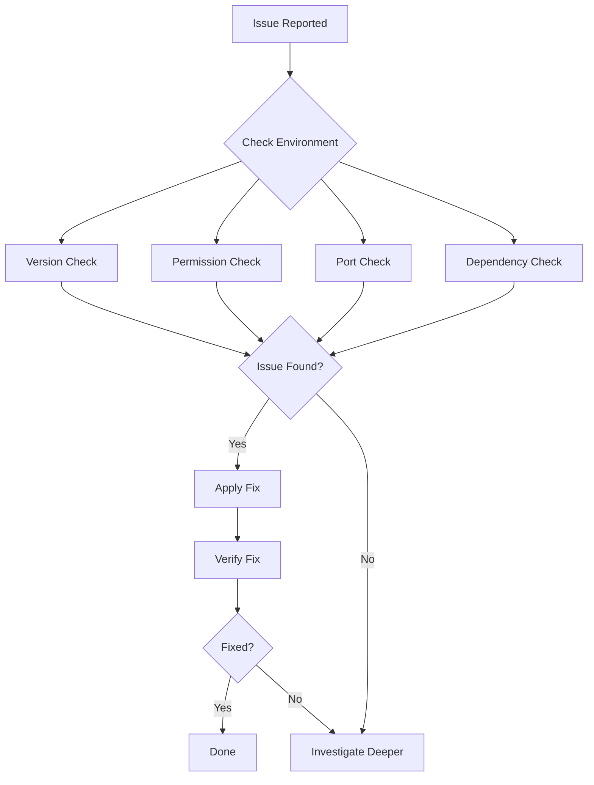

# Environment Diagnosis & Repair

## Overview

Environment diagnosis is the systematic process of identifying and resolving issues in development environments before they block productivity. This skill provides checklists, automated scripts, and repair protocols for common environment problems including version mismatches, permission issues, port conflicts, and dependency conflicts.

**When to use this skill:** When experiencing environment issues, when setting up a new development environment, or when encountering "it works on my machine" problems.

## Table of Contents

1. [Diagnosis Protocol](#diagnosis-protocol)
2. [Version Checking](#version-checking)
3. [Permission Diagnosis](#permission-diagnosis)
4. [Port Conflict Resolution](#port-conflict-resolution)
5. [Dependency Issues](#dependency-issues)
6. [Automated Repair Scripts](#automated-repair-scripts)
7. [Quick Reference](#quick-reference)

---

## Diagnosis Protocol

### The Check-First Approach

Always verify your environment before attempting to fix issues. The "Check-First" principle ensures you're solving the right problem.



### Diagnosis Checklist

```markdown
## Environment Diagnosis Checklist

### Version Compatibility
- [ ] Node.js version matches project requirement
- [ ] Python version matches project requirement
- [ ] Docker version is compatible
- [ ] Package manager (npm/yarn/pnpm) is correct
- [ ] Build tools (webpack/vite/next) are compatible

### Permissions
- [ ] Write access to project directory
- [ ] Execute permission for scripts
- [ ] Read access to configuration files
- [ ] Network access for external dependencies

### Ports
- [ ] Required ports are not in use
- [ ] Firewall allows required ports
- [ ] No zombie processes blocking ports
- [ ] Port configuration matches environment

### Dependencies
- [ ] `node_modules` is up to date
- [ ] `venv`/`virtualenv` is activated
- [ ] Global packages are compatible
- [ ] No conflicting global installations

### Configuration
- [ ] Environment variables are set
- [ ] Configuration files exist and are valid
- [ ] Secrets are accessible
- [ ] Paths are correctly configured
```

---

## Version Checking

### Node.js Version Check

**Problem:** Node.js version doesn't match project requirements.

**Diagnosis:**
```bash
# Check current Node version
node --version

# Check project requirement
cat package.json | grep '"engines"'
cat .nvmrc

# Compare versions
nvm list
```

**Fix:**
```bash
# Install required Node version
nvm install 18.17.0

# Use required version
nvm use 18.17.0

# Set as default
nvm alias default 18.17.0

# Verify
node --version
```

### Python Version Check

**Problem:** Python version doesn't match project requirements.

**Diagnosis:**
```bash
# Check current Python version
python --version
python3 --version

# Check project requirement
cat requirements.txt | grep python
cat pyproject.toml | grep python
cat .python-version

# List available versions
pyenv versions
```

**Fix:**
```bash
# Install required Python version
pyenv install 3.11.4

# Set local version
pyenv local 3.11.4

# Verify
python --version
```

### Docker Version Check

**Problem:** Docker version incompatible with project.

**Diagnosis:**
```bash
# Check Docker version
docker --version
docker-compose --version

# Check project requirement
cat docker-compose.yml | grep version
cat Dockerfile | grep FROM
```

**Fix:**
```bash
# Update Docker (Ubuntu/Debian)
sudo apt-get update
sudo apt-get install docker-ce docker-ce-cli

# Update Docker (macOS)
brew upgrade docker
brew upgrade docker-compose

# Verify
docker --version
```

### Package Manager Version Check

**Problem:** Package manager version causing issues.

**Diagnosis:**
```bash
# Check npm version
npm --version

# Check yarn version
yarn --version

# Check pnpm version
pnpm --version
```

**Fix:**
```bash
# Update npm
npm install -g npm@latest

# Update yarn
npm install -g yarn@latest

# Update pnpm
npm install -g pnpm@latest
```

---

## Permission Diagnosis

### Directory Write Permissions

**Problem:** Cannot write to project directory.

**Diagnosis:**
```bash
# Check directory permissions
ls -la

# Check ownership
stat -c '%U:%G:%a' .

# Try writing a test file
touch test.txt
```

**Fix:**
```bash
# Take ownership (Linux/macOS)
sudo chown -R $USER:$USER .

# Fix permissions
chmod -R u+rw,g+rw .

# Fix specific directory
chmod 755 directory_name

# Verify
ls -la
```

### Script Execution Permissions

**Problem:** Cannot execute scripts.

**Diagnosis:**
```bash
# Check script permissions
ls -la script.sh

# Try executing
./script.sh
```

**Fix:**
```bash
# Make executable
chmod +x script.sh

# Verify
ls -la script.sh
```

### Global Package Installation

**Problem:** Cannot install global packages.

**Diagnosis:**
```bash
# Try installing global package
npm install -g package-name

# Check npm global directory
npm config get prefix
```

**Fix:**
```bash
# Fix npm global directory permissions
mkdir -p ~/.npm-global
npm config set prefix '~/.npm-global'

# Add to PATH (add to ~/.bashrc or ~/.zshrc)
export PATH=~/.npm-global/bin:$PATH

# Source and verify
source ~/.bashrc
npm list -g --depth=0
```

---

## Port Conflict Resolution

### Identifying Port Conflicts

**Problem:** Service cannot start because port is in use.

**Diagnosis:**
```bash
# Check what's using a port (Linux/macOS)
lsof -i :3000
netstat -an | grep 3000

# Check what's using a port (Windows PowerShell)
netstat -ano | findstr :3000

# Check Docker port mapping
docker ps
```

### Killing Zombie Processes

**Fix:**
```bash
# Kill process on specific port
lsof -ti :3000 | xargs kill -9

# Kill process by name
pkill -f node
pkill -f python

# Kill specific PID
kill -9 12345

# Verify port is free
lsof -i :3000
```

### Docker Port Conflicts

**Problem:** Docker container port conflicts with host.

**Diagnosis:**
```bash
# Check Docker port mappings
docker ps --format "table {{.Names}}\t{{.Ports}}"

# Check host ports
netstat -tuln | grep LISTEN
```

**Fix:**
```bash
# Stop conflicting container
docker stop container_name

# Use different port mapping
docker run -p 3001:3000 image_name

# Map to random host port
docker run -p 3000 image_name

# Verify
docker ps
```

### Port Configuration

**Problem:** Application configured for wrong port.

**Diagnosis:**
```bash
# Check application config
cat .env | grep PORT
cat config.json | grep port
cat docker-compose.yml | grep ports
```

**Fix:**
```bash
# Update .env file
echo "PORT=3001" >> .env

# Update config file
sed -i 's/3000/3001/g' config.json

# Restart application
npm run dev
```

---

## Dependency Issues

### Node.js Dependency Conflicts

**Problem:** `node_modules` conflicts or corruption.

**Diagnosis:**
```bash
# Check for conflicts
npm ls

# Check for security issues
npm audit

# Check for outdated packages
npm outdated
```

**Fix:**
```bash
# Clean install
rm -rf node_modules package-lock.json
npm install

# Force clean install
npm ci

# Update dependencies
npm update

# Fix specific package
npm install package-name@latest
```

### Python Dependency Conflicts

**Problem:** Virtual environment conflicts or package issues.

**Diagnosis:**
```bash
# Check active virtual environment
which python
pip list

# Check for conflicts
pip check

# Check for security issues
pip-audit
```

**Fix:**
```bash
# Recreate virtual environment
rm -rf venv
python -m venv venv

# Activate virtual environment
source venv/bin/activate

# Reinstall dependencies
pip install -r requirements.txt

# Fix specific package
pip install --upgrade package-name
```

### Global Package Conflicts

**Problem:** Global package conflicts with local project.

**Diagnosis:**
```bash
# List global packages
npm list -g --depth=0
pip list

# Check for conflicts
npm ls --global
```

**Fix:**
```bash
# Uninstall conflicting global package
npm uninstall -g package-name

# Use npx to run without global install
npx package-name

# Use local package
./node_modules/.bin/package-name
```

---

## Automated Repair Scripts

### Environment Repair Script

```bash
#!/bin/bash
# scripts/repair-env.sh - Automated environment repair

set -e

echo "=== Environment Repair Script ==="

# Check Node.js
echo "Checking Node.js version..."
REQUIRED_NODE="18.17.0"
CURRENT_NODE=$(node --version)
if ! command -v nvm &> /dev/null; then
    echo "⚠️  nvm not found. Please install nvm."
else
    nvm install $REQUIRED_NODE
    nvm use $REQUIRED_NODE
    echo "✅ Node.js updated to $REQUIRED_NODE"
fi

# Check Python
echo "Checking Python version..."
REQUIRED_PYTHON="3.11.4"
if command -v pyenv &> /dev/null; then
    pyenv install $REQUIRED_PYTHON
    pyenv local $REQUIRED_PYTHON
    echo "✅ Python updated to $REQUIRED_PYTHON"
else
    echo "⚠️  pyenv not found. Please install pyenv."
fi

# Fix permissions
echo "Fixing permissions..."
chmod -R u+rw .
echo "✅ Permissions fixed"

# Kill zombie processes on common ports
echo "Killing zombie processes..."
for port in 3000 3001 5000 5001 8080; do
    if lsof -Pi :$port -sTCP:LISTEN -t >/dev/null ; then
        lsof -ti :$port | xargs kill -9
        echo "✅ Killed process on port $port"
    fi
done

# Clean node_modules
echo "Cleaning node_modules..."
rm -rf node_modules package-lock.json
npm install
echo "✅ Dependencies reinstalled"

echo "=== Repair Complete ==="
```

### Port Cleanup Script

```bash
#!/bin/bash
# scripts/cleanup-ports.sh - Kill processes on specified ports

PORTS=${1:-"3000 3001 5000 5001 8080"}

echo "Cleaning up ports: $PORTS"

for port in $PORTS; do
    if lsof -Pi :$port -sTCP:LISTEN -t >/dev/null 2>&1; then
        echo "Port $port is in use:"
        lsof -Pi :$port -sTCP:LISTEN -t
        read -p "Kill process on port $port? (y/n) " -n 1 -r
        if [[ $REPLY =~ ^[Yy]$ ]]; then
            lsof -ti :$port | xargs kill -9
            echo "✅ Killed process on port $port"
        fi
    else
        echo "✅ Port $port is free"
    fi
done
```

### Dependency Repair Script

```bash
#!/bin/bash
# scripts/repair-deps.sh - Fix dependency issues

PROJECT_TYPE=$1

if [ "$PROJECT_TYPE" = "node" ]; then
    echo "Repairing Node.js dependencies..."
    rm -rf node_modules package-lock.json
    npm install
    echo "✅ Node.js dependencies repaired"

elif [ "$PROJECT_TYPE" = "python" ]; then
    echo "Repairing Python dependencies..."
    rm -rf venv
    python -m venv venv
    source venv/bin/activate
    pip install -r requirements.txt
    echo "✅ Python dependencies repaired"

else
    echo "Usage: ./repair-deps.sh [node|python]"
    exit 1
fi
```

---

## Quick Reference

### Common Environment Issues

| Issue | Diagnosis | Fix |
|--------|-----------|-----|
| Node version mismatch | `node --version` vs `package.json` | `nvm install <version>` |
| Python version mismatch | `python --version` vs `requirements.txt` | `pyenv install <version>` |
| Port in use | `lsof -i :<port>` | `lsof -ti :<port> \| xargs kill -9` |
| Permission denied | `ls -la` shows wrong owner | `chown -R $USER:$USER .` |
| Dependency conflict | `npm ls` shows errors | `rm -rf node_modules && npm install` |
| Docker build fails | `docker --version` too old | Update Docker |
| Global package conflict | `npm list -g` shows conflict | `npm uninstall -g <package>` |

### Diagnostic Commands

```bash
# Node.js
node --version
npm --version
nvm list

# Python
python --version
pip list
pyenv versions

# Docker
docker --version
docker ps
docker-compose ps

# Ports
lsof -i :3000
netstat -tuln | grep LISTEN

# Permissions
ls -la
stat -c '%U:%G:%a' .

# Dependencies
npm ls
npm outdated
npm audit
pip list
pip check
```

### Repair Commands

```bash
# Node.js
nvm install <version>
nvm use <version>
npm install
npm ci

# Python
pyenv install <version>
pyenv local <version>
python -m venv venv
source venv/bin/activate
pip install -r requirements.txt

# Docker
docker-compose down
docker-compose up --build

# Ports
lsof -ti :<port> | xargs kill -9
pkill -f <process-name>

# Permissions
chmod +x <script>
chmod -R u+rw .
chown -R $USER:$USER .

# Dependencies
rm -rf node_modules package-lock.json
npm install
rm -rf venv
python -m venv venv
```

---

## Common Pitfalls

1. **Not checking versions first** - Always verify versions before attempting fixes
2. **Forgetting to restart services** - After fixes, restart affected services
3. **Ignoring permission issues** - Fix permissions early to avoid cascading errors
4. **Killing wrong processes** - Verify the process before killing
5. **Not using version managers** - Use nvm, pyenv, etc. for easy version switching
6. **Mixing global and local packages** - Prefer local packages to avoid conflicts
7. **Not cleaning up properly** - Remove temporary files and processes after fixes
8. **Skipping verification** - Always verify the fix worked before moving on

## Additional Resources

- [Node Version Manager (nvm)](https://github.com/nvm-sh/nvm)
- [Python Version Manager (pyenv)](https://github.com/pyenv/pyenv)
- [Docker Troubleshooting](https://docs.docker.com/engine/troubleshooting/)
- [Linux Permissions Guide](https://linuxjourney.com/lesson/file-permissions)
