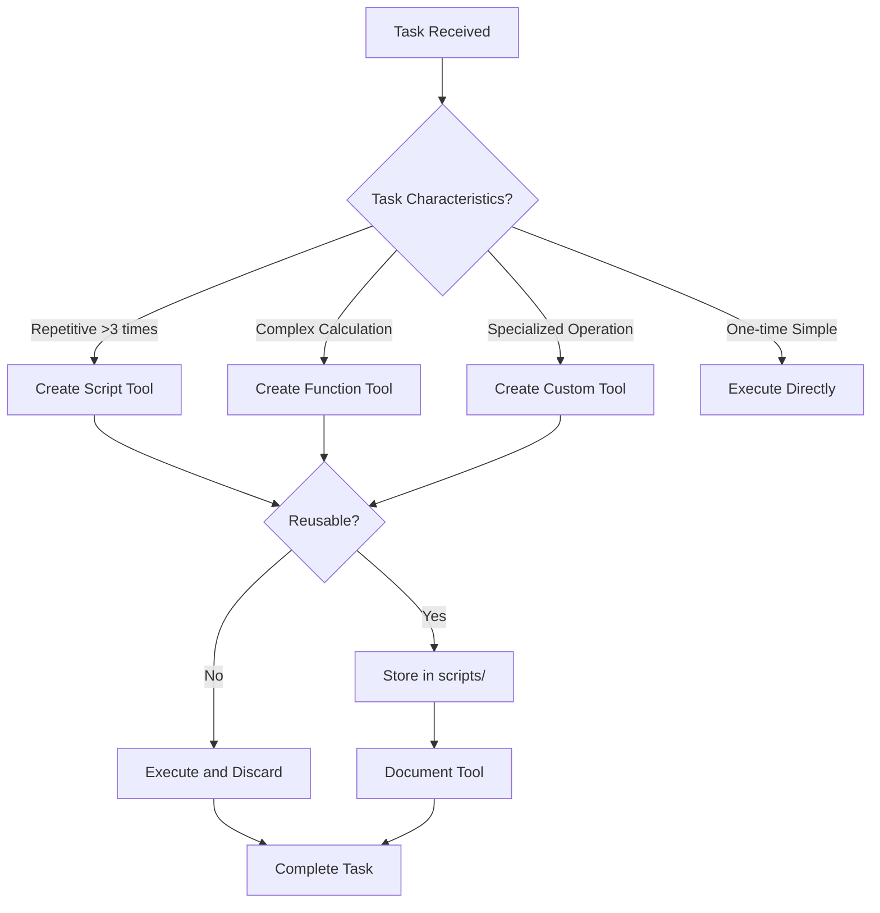

# MCP Tool Creation Patterns

## Overview

MCP (Model Context Protocol) Tool Creation Patterns teach agents how to build new tools and scripts for themselves. When a task requires repetitive operations, complex calculations, or specialized functionality, the agent should create a tool rather than repeatedly performing the same actions. This skill provides patterns for creating, organizing, and managing custom tools.

**When to use this skill:** When encountering repetitive tasks, complex calculations, or when existing tools don't meet specific requirements.

## Table of Contents

1. [Tool Creation Decision Tree](#tool-creation-decision-tree)
2. [Tool Types](#tool-types)
3. [Tool Design Patterns](#tool-design-patterns)
4. [Tool Implementation](#tool-implementation)
5. [Tool Organization](#tool-organization)
6. [Quick Reference](#quick-reference)

---

## Tool Creation Decision Tree

### When to Create a Tool



### Decision Criteria

| Criteria | Create Tool | Execute Directly |
|----------|--------------|------------------|
| **Repetitive** (>3 times) | ✅ Yes | ❌ No |
| **Complex calculation** | ✅ Yes | ❌ No |
| **Specialized operation** | ✅ Yes | ❌ No |
| **One-time simple task** | ❌ No | ✅ Yes |
| **Time to create < time saved** | ✅ Yes | ❌ No |

### Tool Creation Thresholds

```markdown
## Tool Creation Thresholds

### Script Tools
- **Threshold:** Task requires >3 repetitions
- **Examples:** File operations, batch processing, repetitive API calls
- **Storage:** `scripts/` directory if reusable

### Function Tools
- **Threshold:** Complex calculation or logic
- **Examples:** Data transformations, validations, formatting
- **Storage:** In codebase as utility functions

### Custom Tools
- **Threshold:** Specialized operation not available
- **Examples:** Domain-specific operations, custom integrations
- **Storage:** As MCP tool or standalone script
```

---

## Tool Types

### 1. Script Tools

**Purpose:** Automate repetitive file operations, batch processing, or command sequences.

**When to use:**
- Performing the same operation multiple times
- Need to chain multiple commands
- Require error handling across multiple steps

**Example:**
```bash
#!/bin/bash
# scripts/batch-process-files.sh - Process multiple files

set -e

INPUT_DIR="$1"
OUTPUT_DIR="$2"

if [ -z "$INPUT_DIR" ] || [ -z "$OUTPUT_DIR" ]; then
    echo "Usage: $0 <input-dir> <output-dir>"
    exit 1
fi

echo "Processing files from $INPUT_DIR to $OUTPUT_DIR..."

for file in "$INPUT_DIR"/*.json; do
    echo "Processing $file..."
    
    # Process file
    node -e "
        const fs = require('fs');
        const data = JSON.parse(fs.readFileSync('$file', 'utf8'));
        // Transform data
        const transformed = transformData(data);
        fs.writeFileSync('$OUTPUT_DIR/$(basename $file)', JSON.stringify(transformed, null, 2));
    "
    
    echo "✅ Processed $file"
done

echo "All files processed successfully!"
```

### 2. Function Tools

**Purpose:** Reusable logic that can be called from multiple places.

**When to use:**
- Complex calculations
- Data transformations
- Validation logic

**Example:**
```javascript
// utils/data-transformer.js - Data transformation utilities

/**
 * Transforms raw data into standardized format
 * @param {Object} rawData - Raw input data
 * @returns {Object} Transformed data
 */
function transformData(rawData) {
    return {
        id: rawData.id,
        name: normalizeName(rawData.name),
        email: validateEmail(rawData.email) ? rawData.email : null,
        createdAt: parseDate(rawData.created_at),
        metadata: extractMetadata(rawData)
    };
}

/**
 * Normalizes name to title case
 */
function normalizeName(name) {
    return name
        .toLowerCase()
        .split(' ')
        .map(word => word.charAt(0).toUpperCase() + word.slice(1))
        .join(' ');
}

/**
 * Validates email format
 */
function validateEmail(email) {
    const emailRegex = /^[^\s@]+@[^\s@]+\.[^\s@]+$/;
    return emailRegex.test(email);
}

/**
 * Parses date string to Date object
 */
function parseDate(dateString) {
    return new Date(dateString);
}

/**
 * Extracts metadata from raw data
 */
function extractMetadata(rawData) {
    return {
        source: rawData.source || 'unknown',
        version: rawData.version || '1.0',
        tags: rawData.tags || []
    };
}

module.exports = {
    transformData,
    normalizeName,
    validateEmail,
    parseDate,
    extractMetadata
};
```

### 3. MCP Tools

**Purpose:** Custom tools that extend the agent's capabilities via MCP protocol.

**When to use:**
- Need to expose functionality to multiple agents
- Require persistent state
- Need to integrate with external systems

**Example:**
```typescript
// tools/custom-data-processor.ts - MCP tool definition

import { Tool } from '@modelcontextprotocol/sdk';

interface ProcessDataInput {
    data: any;
    options?: {
        format?: 'json' | 'csv' | 'xml';
        validate?: boolean;
    };
}

interface ProcessDataOutput {
    result: any;
    errors?: string[];
    stats: {
        processed: number;
        failed: number;
    };
}

export const processDataTool: Tool<ProcessDataInput, ProcessDataOutput> = {
    name: 'process_data',
    description: 'Processes and transforms data according to specified format',
    inputSchema: {
        type: 'object',
        properties: {
            data: { type: 'any', description: 'Data to process' },
            options: {
                type: 'object',
                properties: {
                    format: {
                        type: 'string',
                        enum: ['json', 'csv', 'xml'],
                        default: 'json'
                    },
                    validate: {
                        type: 'boolean',
                        default: true
                    }
                }
            }
        },
        required: ['data']
    },
    async execute(input: ProcessDataInput): Promise<ProcessDataOutput> {
        const { data, options = {} } = input;
        const { format = 'json', validate = true } = options;

        const errors: string[] = [];
        let processed = 0;
        let failed = 0;

        try {
            // Validate data if requested
            if (validate) {
                const validationErrors = this.validateData(data);
                if (validationErrors.length > 0) {
                    errors.push(...validationErrors);
                    failed++;
                    return {
                        result: null,
                        errors,
                        stats: { processed, failed }
                    };
                }
            }

            // Transform based on format
            const result = this.transformData(data, format);
            processed++;

            return {
                result,
                errors: errors.length > 0 ? errors : undefined,
                stats: { processed, failed }
            };
        } catch (error) {
            failed++;
            errors.push(error.message);
            return {
                result: null,
                errors,
                stats: { processed, failed }
            };
        }
    },

    validateData(data: any): string[] {
        const errors: string[] = [];
        // Add validation logic
        return errors;
    },

    transformData(data: any, format: string): any {
        // Add transformation logic
        return data;
    }
};
```

---

## Tool Design Patterns

### Pattern 1: Single Responsibility

Each tool should do one thing well.

**Bad Example:**
```javascript
// Tool does too many things
function processUserAndSendEmailAndCreateReport(user) {
    const processed = processUser(user);
    sendEmail(user);
    createReport(user);
    return processed;
}
```

**Good Example:**
```javascript
// Separate tools for each responsibility
function processUser(user) {
    // Process user data
    return processedUser;
}

function sendEmail(user) {
    // Send email
}

function createReport(user) {
    // Create report
}
```

### Pattern 2: Input Validation

Always validate inputs before processing.

**Example:**
```javascript
function validateToolInput(input, schema) {
    const errors = [];

    // Check required fields
    for (const field of schema.required) {
        if (!(field in input)) {
            errors.push(`Missing required field: ${field}`);
        }
    }

    // Check types
    for (const [field, type] of Object.entries(schema.types)) {
        if (field in input && typeof input[field] !== type) {
            errors.push(`Field ${field} must be ${type}`);
        }
    }

    // Check constraints
    for (const [field, constraint] of Object.entries(schema.constraints)) {
        if (field in input && !constraint.check(input[field])) {
            errors.push(`Field ${field}: ${constraint.message}`);
        }
    }

    return {
        valid: errors.length === 0,
        errors
    };
}

// Usage
const input = { name: 'John', age: 30 };
const schema = {
    required: ['name', 'age'],
    types: { name: 'string', age: 'number' },
    constraints: {
        age: {
            check: (val) => val >= 18 && val <= 120,
            message: 'must be between 18 and 120'
        }
    }
};

const validation = validateToolInput(input, schema);
if (!validation.valid) {
    throw new Error(`Invalid input: ${validation.errors.join(', ')}`);
}
```

### Pattern 3: Error Handling

Tools should handle errors gracefully and provide meaningful feedback.

**Example:**
```javascript
async function executeTool(input) {
    try {
        // Validate input
        const validation = validateInput(input);
        if (!validation.valid) {
            return {
                success: false,
                error: 'Invalid input',
                details: validation.errors
            };
        }

        // Execute tool logic
        const result = await processInput(input);

        return {
            success: true,
            result
        };
    } catch (error) {
        // Log error for debugging
        console.error('Tool execution failed:', error);

        // Return structured error response
        return {
            success: false,
            error: error.message,
            code: error.code || 'UNKNOWN_ERROR',
            stack: process.env.NODE_ENV === 'development' ? error.stack : undefined
        };
    }
}
```

### Pattern 4: Progress Reporting

For long-running tools, report progress.

**Example:**
```javascript
function createProgressReporter(totalSteps) {
    let currentStep = 0;

    return {
        report(step, message) {
            currentStep++;
            const progress = (currentStep / totalSteps) * 100;
            console.log(`[${progress.toFixed(1)}%] ${message}`);
        },
        complete(message) {
            console.log(`[100%] ${message}`);
        }
    };
}

// Usage
async function processLargeDataset(data) {
    const reporter = createProgressReporter(data.length);
    
    for (let i = 0; i < data.length; i++) {
        await processData(data[i]);
        reporter.report(i + 1, `Processing item ${i + 1}`);
    }
    
    reporter.complete('All items processed');
}
```

---

## Tool Implementation

### Step 1: Identify the Need

**Questions to ask:**
1. What is the repetitive task?
2. How many times will it be repeated?
3. What is the complexity of the task?
4. Is there an existing tool that can do this?
5. Would creating a tool save time?

### Step 2: Design the Tool

**Design Checklist:**
```markdown
## Tool Design Checklist

### Purpose
- [ ] Clear purpose statement
- [ ] Input/output defined
- [ ] Use cases identified

### Interface
- [ ] Input schema defined
- [ ] Output schema defined
- [ ] Error handling specified

### Implementation
- [ ] Algorithm/ logic defined
- [ ] Dependencies identified
- [ ] Performance considered

### Documentation
- [ ] Usage examples provided
- [ ] Edge cases documented
- [ ] Error messages defined
```

### Step 3: Implement the Tool

**Implementation Template:**
```javascript
// tools/tool-name.js

/**
 * Tool description
 * 
 * @param {Object} input - Input description
 * @returns {Promise<Object>} Output description
 */

// Dependencies
const fs = require('fs');
const path = require('path');

// Configuration
const CONFIG = {
    // Tool configuration
};

/**
 * Main tool function
 */
async function execute(input) {
    // 1. Validate input
    const validation = validateInput(input);
    if (!validation.valid) {
        throw new Error(`Invalid input: ${validation.errors.join(', ')}`);
    }

    // 2. Process input
    const result = await processInput(input);

    // 3. Return result
    return {
        success: true,
        result
    };
}

/**
 * Input validation
 */
function validateInput(input) {
    const errors = [];
    // Validation logic
    return {
        valid: errors.length === 0,
        errors
    };
}

/**
 * Main processing logic
 */
async function processInput(input) {
    // Processing logic
    return result;
}

// Export
module.exports = {
    name: 'tool-name',
    description: 'Tool description',
    execute
};
```

### Step 4: Test the Tool

**Test Template:**
```javascript
// tools/tool-name.test.js

const { execute } = require('./tool-name');

describe('tool-name', () => {
    it('should process valid input', async () => {
        const input = { /* valid input */ };
        const result = await execute(input);
        
        expect(result.success).toBe(true);
        expect(result.result).toBeDefined();
    });

    it('should reject invalid input', async () => {
        const input = { /* invalid input */ };
        
        await expect(execute(input)).rejects.toThrow();
    });

    it('should handle edge cases', async () => {
        const input = { /* edge case input */ };
        const result = await execute(input);
        
        expect(result.success).toBe(true);
    });
});
```

### Step 5: Document the Tool

**Documentation Template:**
```markdown
# Tool Name

## Description
Brief description of what the tool does.

## Usage

### Basic Usage
\`\`\`bash
node tools/tool-name.js --input <value> --output <file>
\`\`\`

### Examples

### Example 1: Basic Usage
\`\`\`bash
node tools/tool-name.js --input data.json --output result.json
\`\`\`

### Example 2: With Options
\`\`\`bash
node tools/tool-name.js --input data.json --output result.json --format json --validate
\`\`\`

## Input Parameters

| Parameter | Type | Required | Description | Default |
|-----------|------|-----------|-------------|---------|
| input | string | Yes | Input file or data |
| output | string | Yes | Output file path |
| format | string | No | Output format (json/csv/xml) | json |
| validate | boolean | No | Validate input before processing | true |

## Output

The tool outputs a JSON object with the following structure:

\`\`\`json
{
    "success": true,
    "result": { /* processed data */ },
    "errors": [],
    "stats": {
        "processed": 100,
        "failed": 0
    }
}
\`\`\`

## Error Handling

The tool returns specific error codes:

| Code | Description | Resolution |
|------|-------------|------------|
| INVALID_INPUT | Input validation failed | Check input format |
| FILE_NOT_FOUND | Input file not found | Verify file path |
| PERMISSION_DENIED | Insufficient permissions | Check file permissions |
| PROCESSING_ERROR | Processing failed | Check logs for details |

## Dependencies

- Node.js >= 14.0.0
- fs (built-in)
- path (built-in)
```

---

## Tool Organization

### Directory Structure

```
project/
├── tools/
│   ├── scripts/
│   │   ├── batch-process.sh
│   │   ├── cleanup.sh
│   │   └── deploy.sh
│   ├── functions/
│   │   ├── data-transformer.js
│   │   ├── validator.js
│   │   └── formatter.js
│   ├── mcp/
│   │   ├── custom-tool.ts
│   │   └── another-tool.ts
│   └── README.md
├── utils/
│   └── helpers.js
└── package.json
```

### Naming Conventions

**Scripts:**
- Use kebab-case: `batch-process-files.sh`
- Descriptive: `cleanup-temp-files.sh`
- Action-oriented: `deploy-to-production.sh`

**Functions:**
- Use camelCase: `transformData()`
- Verb-noun: `validateEmail()`
- Clear purpose: `calculateTotal()`

**MCP Tools:**
- Use kebab-case for tool name: `process-data`
- PascalCase for file: `ProcessDataTool.ts`
- Descriptive: `custom-data-processor`

### Documentation

**tools/README.md:**
```markdown
# Tools Directory

This directory contains custom tools and scripts for the agent.

## Available Tools

### Scripts
- `batch-process.sh` - Batch process files
- `cleanup.sh` - Clean temporary files
- `deploy.sh` - Deploy to production

### Functions
- `data-transformer.js` - Data transformation utilities
- `validator.js` - Input validation functions
- `formatter.js` - Output formatting functions

### MCP Tools
- `custom-tool.ts` - Custom MCP tool
- `another-tool.ts` - Another MCP tool

## Usage

See individual tool directories for detailed usage instructions.
```

---

## Quick Reference

### Tool Creation Decision Matrix

| Situation | Action |
|------------|--------|
| Repetitive task (>3 times) | Create script tool |
| Complex calculation | Create function tool |
| Specialized operation | Create MCP tool |
| One-time simple task | Execute directly |

### Tool Implementation Checklist

```markdown
## Tool Implementation Checklist

### Design
- [ ] Purpose clearly defined
- [ ] Input/output specified
- [ ] Use cases identified

### Implementation
- [ ] Input validation added
- [ ] Error handling implemented
- [ ] Progress reporting (if long-running)

### Testing
- [ ] Unit tests written
- [ ] Edge cases tested
- [ ] Error conditions tested

### Documentation
- [ ] Usage examples provided
- [ ] Parameters documented
- [ ] Error codes documented

### Organization
- [ ] Proper directory placement
- [ ] Naming conventions followed
- [ ] README updated
```

### Common Tool Patterns

| Pattern | Description | When to Use |
|---------|-------------|--------------|
| **Batch Processing** | Process multiple items | Multiple files/records |
| **Data Transformation** | Convert data formats | Format changes needed |
| **Validation** | Check input validity | User input, API calls |
| **Calculation** | Perform computations | Financial, scientific data |
| **Integration** | Connect to external systems | API integrations |

---

## Common Pitfalls

1. **Over-engineering** - Don't create tools for simple one-time tasks
2. **Under-documenting** - Always document tool usage and parameters
3. **Ignoring error handling** - Handle all error conditions gracefully
4. **Not testing** - Test tools before using them in production
5. **Poor naming** - Use clear, descriptive names
6. **Tight coupling** - Keep tools independent and reusable
7. **No validation** - Always validate inputs before processing
8. **Hardcoding** - Use configuration instead of hardcoded values

## Additional Resources

- [MCP Documentation](https://modelcontextprotocol.io/)
- [Node.js Best Practices](https://nodejs.org/en/docs/guides/)
- [Bash Scripting Guide](https://www.gnu.org/software/bash/manual/)
- [TypeScript Handbook](https://www.typescriptlang.org/docs/)
