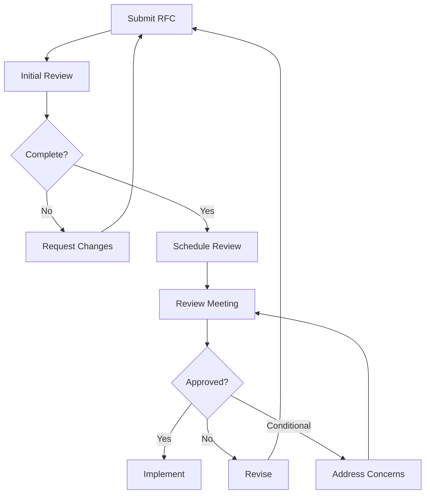

# Architecture Review

## Overview

Architecture Review is a formal process where proposed architectural changes are evaluated by peers and stakeholders before implementation. It catches design flaws early when they're cheap to fix.

**Core Principle**: "Review architecture before writing code. Catching design flaws early saves months of rework."

---

## 1. When to Conduct Architecture Review

### Required Reviews
- New system or major component
- Significant technology change
- Cross-team integration
- Security-sensitive features
- Performance-critical paths
- Data model changes
- API design

### Optional Reviews
- Minor feature additions
- Bug fixes
- Refactoring (unless major)

---

## 2. Architecture Review Board (ARB)

### Composition
```markdown
## Architecture Review Board

**Core Members** (always present):
- Principal Engineer (chair)
- Tech Lead from affected team
- Security Engineer
- Platform Engineer

**Optional Members** (as needed):
- Product Manager (for business context)
- DBA (for database changes)
- DevOps Engineer (for infrastructure)
- External Architect (for major decisions)

**Quorum**: Minimum 3 core members
```

---

## 3. Architecture Review Process



---

## 4. Request for Comments (RFC) Template

```markdown
# RFC-042: Migrate to Event-Driven Architecture

## Metadata
- **Author**: @alice
- **Status**: Under Review
- **Created**: 2024-01-15
- **Review Date**: 2024-01-22

## Summary
Migrate order processing from synchronous API calls to event-driven architecture using Kafka.

## Problem Statement
Current synchronous architecture causes:
- Tight coupling between services
- Cascading failures when services are down
- Difficulty scaling individual components
- Long request timeouts (>5s)

## Proposed Solution

### Architecture Diagram
```
┌─────────────┐     ┌─────────────┐     ┌─────────────┐
│   Orders    │────▶│    Kafka    │────▶│  Inventory  │
│   Service   │     │   (Events)  │     │   Service   │
└─────────────┘     └─────────────┘     └─────────────┘
                           │
                           ▼
                    ┌─────────────┐
                    │  Shipping   │
                    │   Service   │
                    └─────────────┘
```

### Key Components
1. **Event Bus**: Kafka cluster (3 brokers)
2. **Event Schema**: Avro schemas in Schema Registry
3. **Event Types**: 
   - `order.created`
   - `order.paid`
   - `order.shipped`

### Implementation Plan
- **Phase 1** (2 weeks): Setup Kafka cluster
- **Phase 2** (3 weeks): Migrate order creation
- **Phase 3** (2 weeks): Migrate payment processing
- **Phase 4** (1 week): Decommission old sync APIs

## Alternatives Considered

### Alternative 1: Keep Synchronous
**Pros**: Simpler, no new infrastructure
**Cons**: Doesn't solve coupling/scaling issues
**Why rejected**: Doesn't address core problems

### Alternative 2: Use RabbitMQ
**Pros**: Simpler than Kafka
**Cons**: Lower throughput, less ecosystem
**Why rejected**: Need Kafka's throughput for future scale

## Trade-offs

### Pros
- ✅ Loose coupling between services
- ✅ Better fault tolerance
- ✅ Easier to scale
- ✅ Event sourcing enables audit trail

### Cons
- ❌ Increased complexity (new infrastructure)
- ❌ Eventual consistency (not immediate)
- ❌ Debugging distributed events harder
- ❌ Team needs to learn Kafka

## Risks & Mitigations

| Risk | Likelihood | Impact | Mitigation |
|------|------------|--------|------------|
| Kafka cluster failure | Low | High | Multi-AZ deployment, monitoring |
| Event ordering issues | Medium | Medium | Use partition keys correctly |
| Schema evolution breaks consumers | Medium | High | Use Schema Registry, versioning |
| Team learning curve | High | Medium | Training, documentation, pair programming |

## Performance Impact
- **Current**: 200ms average latency (synchronous)
- **Expected**: 50ms publish + eventual processing
- **Throughput**: 10K events/sec (vs 1K requests/sec currently)

## Security Considerations
- Kafka ACLs for topic access control
- TLS encryption for data in transit
- Event payload encryption for sensitive data

## Operational Impact
- **New Infrastructure**: Kafka cluster (3 brokers, 3 Zookeeper)
- **Monitoring**: Kafka metrics, consumer lag
- **Cost**: ~$500/month for managed Kafka

## Success Metrics
- Order processing latency < 100ms (p95)
- Zero data loss
- 99.9% event delivery success
- Service independence (can deploy without coordination)

## Open Questions
1. How to handle failed event processing? (DLQ strategy)
2. Should we use exactly-once semantics? (adds complexity)
3. Event retention period? (Propose 7 days)

## Appendix
- [Kafka Setup Guide](link)
- [Event Schema Definitions](link)
- [POC Results](link)
```

---

## 5. Review Meeting Agenda

```markdown
## Architecture Review Meeting Agenda (60 min)

**Attendees**: ARB members + RFC author

### 1. Introduction (5 min)
- Author presents problem and solution summary
- Q&A on context

### 2. Deep Dive (25 min)
- Architecture walkthrough
- Trade-offs discussion
- Alternatives review

### 3. Concerns & Questions (20 min)
- Security review
- Performance review
- Operational review
- Cost review

### 4. Decision (10 min)
- Vote: Approve / Conditional Approve / Reject
- Document action items
- Set follow-up date (if conditional)

### Decision Criteria
- ✅ Solves the stated problem
- ✅ Trade-offs acceptable
- ✅ Risks identified and mitigated
- ✅ Implementation plan realistic
- ✅ Team has capacity
```

---

## 6. Review Checklist

```markdown
## Architecture Review Checklist

### Functional Requirements
- [ ] Solves the stated problem
- [ ] Meets performance requirements
- [ ] Handles edge cases
- [ ] Scalable to expected load

### Non-Functional Requirements
- [ ] Security reviewed
- [ ] Monitoring plan defined
- [ ] Disaster recovery plan
- [ ] Cost analyzed

### Design Quality
- [ ] Follows company standards
- [ ] Appropriate complexity (not over-engineered)
- [ ] Clear interfaces/contracts
- [ ] Testable design

### Implementation
- [ ] Realistic timeline
- [ ] Team has necessary skills
- [ ] Dependencies identified
- [ ] Rollback plan exists

### Documentation
- [ ] Architecture diagrams clear
- [ ] Trade-offs documented
- [ ] Risks identified
- [ ] ADR will be created
```

---

## 7. Review Outcomes

### Approved
```markdown
**Status**: ✅ Approved

**Decision**: Proceed with implementation as proposed.

**Action Items**: None

**Next Steps**:
1. Create ADR-042
2. Begin Phase 1 implementation
3. Update in 2 weeks
```

### Conditional Approval
```markdown
**Status**: ⚠️ Conditionally Approved

**Decision**: Approved with following conditions:

**Required Changes**:
1. Add DLQ (Dead Letter Queue) strategy
2. Define event retention policy
3. Create runbook for Kafka failures

**Action Items**:
- @alice: Update RFC with DLQ strategy by Jan 20
- @bob: Review security implications of event encryption

**Next Review**: Jan 25 (conditional approval review)
```

### Rejected
```markdown
**Status**: ❌ Rejected

**Reason**: Complexity doesn't justify benefits for current scale.

**Recommendation**: 
Start with async job queue (Sidekiq/Bull) instead of full Kafka.
Revisit when we reach 10K orders/day.

**Next Steps**:
- Author to create new RFC for job queue approach
```

---

## 8. Lightweight Review (for smaller changes)

```markdown
## Lightweight Architecture Review

**For**: Minor architectural changes

**Process**:
1. Author creates brief design doc (1-2 pages)
2. Share in #architecture Slack channel
3. Async review (48 hours)
4. If no objections, approved
5. If concerns, schedule meeting

**Example**:
> **Proposal**: Add Redis cache for product catalog
> **Rationale**: Reduce DB load, improve latency
> **Impact**: Low (isolated change)
> **Cost**: $50/month
> 
> Any concerns? Will implement Friday if no objections.
```

---

## 9. Post-Review Follow-up

```markdown
## Post-Review Actions

### Immediately After Review
- [ ] Update RFC with decision
- [ ] Create ADR if approved
- [ ] Schedule follow-up (if conditional)
- [ ] Communicate decision to stakeholders

### During Implementation
- [ ] Weekly updates to ARB
- [ ] Flag deviations from approved design
- [ ] Document lessons learned

### After Implementation
- [ ] Retrospective on architecture decision
- [ ] Update RFC with actual vs planned
- [ ] Share learnings with team
```

---

## 10. Architecture Review Metrics

```typescript
interface ReviewMetrics {
  totalReviews: number;
  approvalRate: number;
  avgReviewTime: number;  // days from submission to decision
  conditionalApprovals: number;
  rejections: number;
  majorIssuesFound: number;  // issues caught before implementation
}

// Track effectiveness
function calculateReviewROI() {
  const issuesCaughtInReview = 15;
  const avgCostToFixInProduction = 40;  // hours
  const avgCostOfReview = 4;  // hours
  
  const saved = issuesCaughtInReview * avgCostToFixInProduction;
  const spent = totalReviews * avgCostOfReview;
  
  return {
    hoursSaved: saved - spent,
    roi: (saved / spent) * 100  // percentage
  };
}
```

---

## 11. Architecture Review Checklist

- [ ] **Process Defined**: Review process documented?
- [ ] **ARB Established**: Review board members identified?
- [ ] **RFC Template**: Template available for proposals?
- [ ] **Review Criteria**: Clear approval criteria?
- [ ] **Meeting Cadence**: Regular review meetings scheduled?
- [ ] **Lightweight Path**: Fast track for minor changes?
- [ ] **Follow-up Process**: Post-review tracking in place?
- [ ] **Metrics**: Tracking review effectiveness?

---

## Related Skills
* `59-architecture-decision/adr-templates`
* `59-architecture-decision/tech-stack-selection`
* `59-architecture-decision/tradeoff-analysis`
* `00-meta-skills/decision-making`
