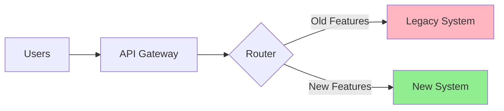

# Migration Planning

## Overview

Migration Planning is the process of moving from one system, technology, or architecture to another with minimal disruption. Poor planning leads to downtime, data loss, and failed migrations.

**Core Principle**: "Migrate incrementally. Test thoroughly. Have a rollback plan."

---

## 1. Types of Migrations

| Migration Type | Example | Complexity | Risk |
|----------------|---------|------------|------|
| **Database Migration** | MySQL → PostgreSQL | High | High |
| **Platform Migration** | On-prem → AWS | Very High | Very High |
| **Framework Migration** | AngularJS → React | High | Medium |
| **Architecture Migration** | Monolith → Microservices | Very High | Very High |
| **Data Migration** | Legacy DB → New schema | Medium | High |
| **Language Migration** | Python 2 → Python 3 | Medium | Medium |

---

## 2. Migration Planning Framework

### Phase 1: Assessment (Week 1-2)
```markdown
## Assessment Checklist

### Current State Analysis
- [ ] Document current architecture
- [ ] Identify all dependencies
- [ ] Measure current performance baselines
- [ ] List all integrations
- [ ] Audit data volume and complexity

### Target State Definition
- [ ] Define success criteria
- [ ] Set performance targets
- [ ] Identify new capabilities needed
- [ ] Document constraints (budget, timeline)

### Risk Assessment
- [ ] Identify potential failure points
- [ ] Estimate downtime requirements
- [ ] Assess data loss risks
- [ ] Evaluate team readiness
```

### Phase 2: Strategy (Week 3-4)
```markdown
## Migration Strategy Options

### Big Bang Migration
**Approach**: Switch everything at once
**Pros**: Fast, clean cut
**Cons**: High risk, requires downtime
**Use when**: Small system, can afford downtime

### Strangler Fig Pattern
**Approach**: Gradually replace old system
**Pros**: Low risk, incremental
**Cons**: Slower, systems run in parallel
**Use when**: Large system, zero downtime required

### Parallel Run
**Approach**: Run both systems simultaneously
**Pros**: Can compare results, safe
**Cons**: Expensive, complex
**Use when**: Critical system, need validation
```

### Phase 3: Execution (Weeks 5-N)
```markdown
## Execution Plan

1. **Setup Target Environment**
2. **Migrate Data (initial sync)**
3. **Migrate Application Logic**
4. **Test Thoroughly**
5. **Cutover**
6. **Monitor & Validate**
7. **Decommission Old System**
```

---

## 3. Strangler Fig Pattern (Recommended)



### Implementation
```typescript
// API Gateway routes traffic based on feature
app.use((req, res, next) => {
  const migratedRoutes = [
    '/api/users',
    '/api/products'
  ];
  
  if (migratedRoutes.some(route => req.path.startsWith(route))) {
    // Route to new system
    proxy.web(req, res, { target: 'http://new-system:3000' });
  } else {
    // Route to legacy system
    proxy.web(req, res, { target: 'http://legacy-system:8080' });
  }
});
```

---

## 4. Database Migration Plan

### Example: PostgreSQL to MongoDB Migration

```markdown
## Database Migration Plan

### Phase 1: Dual Write (Week 1-2)
```typescript
async function createUser(userData: UserData) {
  // Write to both databases
  const pgUser = await postgres.users.create(userData);
  const mongoUser = await mongo.users.insertOne({
    ...userData,
    _id: pgUser.id
  });
  
  return pgUser;  // Still return from primary (PostgreSQL)
}
```

### Phase 2: Data Sync (Week 3)
```bash
# Backfill existing data
node scripts/migrate-users.js

# Verify data integrity
node scripts/verify-migration.js
```

### Phase 3: Dual Read (Week 4)
```typescript
async function getUser(id: string) {
  // Read from both, compare
  const [pgUser, mongoUser] = await Promise.all([
    postgres.users.findById(id),
    mongo.users.findOne({ _id: id })
  ]);
  
  if (!isEqual(pgUser, mongoUser)) {
    logger.error('Data mismatch', { pgUser, mongoUser });
  }
  
  return pgUser;  // Still return from primary
}
```

### Phase 4: Switch Primary (Week 5)
```typescript
async function getUser(id: string) {
  return await mongo.users.findOne({ _id: id });  // MongoDB is now primary
}
```

### Phase 5: Remove Old Database (Week 6)
```typescript
async function getUser(id: string) {
  return await mongo.users.findOne({ _id: id });
  // PostgreSQL code removed
}
```

---

## 5. Zero-Downtime Migration

### Blue-Green Deployment
```markdown
## Blue-Green Migration

**Setup**:
- Blue: Current production system
- Green: New system (ready but not live)

**Process**:
1. Deploy Green environment
2. Sync data from Blue to Green
3. Test Green thoroughly
4. Switch traffic: Blue → Green
5. Monitor Green
6. Keep Blue as rollback (24-48 hours)
7. Decommission Blue

**Rollback**: Switch traffic back to Blue
```

### Canary Migration
```markdown
## Canary Migration

**Process**:
1. Route 5% of traffic to new system
2. Monitor metrics (errors, latency)
3. If stable, increase to 25%
4. If stable, increase to 50%
5. If stable, increase to 100%
6. Decommission old system

**Rollback**: Reduce traffic percentage or revert to 0%
```

---

## 6. Data Migration Script

```typescript
// scripts/migrate-users.ts

import { oldDB } from './old-database';
import { newDB } from './new-database';

interface MigrationProgress {
  total: number;
  migrated: number;
  failed: number;
  errors: Array<{ id: string; error: string }>;
}

async function migrateUsers() {
  const progress: MigrationProgress = {
    total: 0,
    migrated: 0,
    failed: 0,
    errors: []
  };
  
  // Get total count
  progress.total = await oldDB.users.count();
  console.log(`Migrating ${progress.total} users...`);
  
  // Batch processing (1000 at a time)
  const batchSize = 1000;
  let offset = 0;
  
  while (offset < progress.total) {
    const users = await oldDB.users.findMany({
      skip: offset,
      take: batchSize
    });
    
    for (const user of users) {
      try {
        // Transform data
        const transformedUser = transformUser(user);
        
        // Validate
        validateUser(transformedUser);
        
        // Insert to new DB
        await newDB.users.upsert({
          where: { id: user.id },
          create: transformedUser,
          update: transformedUser
        });
        
        progress.migrated++;
      } catch (error) {
        progress.failed++;
        progress.errors.push({
          id: user.id,
          error: error.message
        });
      }
    }
    
    offset += batchSize;
    
    // Progress update
    console.log(`Progress: ${progress.migrated}/${progress.total} (${progress.failed} failed)`);
  }
  
  // Summary
  console.log('Migration complete:', progress);
  
  // Save error log
  if (progress.errors.length > 0) {
    await fs.writeFile('migration-errors.json', JSON.stringify(progress.errors, null, 2));
  }
  
  return progress;
}

function transformUser(oldUser: OldUser): NewUser {
  return {
    id: oldUser.user_id,
    email: oldUser.email_address,
    name: `${oldUser.first_name} ${oldUser.last_name}`,
    createdAt: new Date(oldUser.created_timestamp)
  };
}
```

---

## 7. Migration Testing Strategy

```markdown
## Testing Checklist

### Pre-Migration Testing
- [ ] Test migration scripts on copy of production data
- [ ] Verify data transformation logic
- [ ] Test rollback procedure
- [ ] Load test new system
- [ ] Security audit

### During Migration Testing
- [ ] Smoke tests (basic functionality)
- [ ] Data integrity checks
- [ ] Performance benchmarks
- [ ] Integration tests
- [ ] User acceptance testing (UAT)

### Post-Migration Testing
- [ ] Full regression testing
- [ ] Data validation (row counts, checksums)
- [ ] Performance monitoring
- [ ] Error rate monitoring
- [ ] User feedback collection
```

---

## 8. Rollback Plan

```markdown
## Rollback Procedure

### Triggers for Rollback
- Error rate > 5%
- Latency > 2x baseline
- Data loss detected
- Critical functionality broken
- User complaints > threshold

### Rollback Steps
1. **Stop new traffic** to new system
2. **Route all traffic** back to old system
3. **Verify** old system is healthy
4. **Communicate** rollback to team
5. **Investigate** root cause
6. **Fix issues** before retry

### Rollback Time
- **Target**: < 5 minutes
- **Practice**: Run rollback drills
```

---

## 9. Communication Plan

```markdown
## Migration Communication Template

### Pre-Migration (1 week before)
**To**: All users
**Subject**: Upcoming System Migration - [Date]

We're upgrading to [new system] on [date] at [time].

**What to expect**:
- [Expected downtime / No downtime]
- [New features]
- [Changes to workflows]

**What you need to do**:
- [Action items for users]

### During Migration
**To**: Internal team
**Channel**: #migration-status

**Updates every 30 minutes**:
- Current phase
- Progress percentage
- Issues encountered
- ETA

### Post-Migration
**To**: All users
**Subject**: Migration Complete

Migration successful! New system is live.

**What's new**:
- [Feature 1]
- [Feature 2]

**Known issues**:
- [Issue 1] - Fix ETA: [date]

**Support**: [contact info]
```

---

## 10. Migration Runbook

```markdown
# Migration Runbook: PostgreSQL → MongoDB

## Pre-Migration (Day -7 to -1)
- [ ] Freeze schema changes
- [ ] Backup production database
- [ ] Test migration on staging
- [ ] Prepare rollback scripts
- [ ] Brief team on procedure

## Migration Day

### T-60min: Preparation
- [ ] Announce migration start
- [ ] Enable maintenance mode (if needed)
- [ ] Take final backup
- [ ] Verify rollback plan ready

### T-0: Start Migration
- [ ] Start dual-write mode
- [ ] Begin data sync
- [ ] Monitor sync progress

### T+30min: Validation
- [ ] Verify row counts match
- [ ] Run data integrity checks
- [ ] Test critical user flows

### T+60min: Cutover
- [ ] Switch reads to new database
- [ ] Monitor error rates
- [ ] Check performance metrics

### T+90min: Stabilization
- [ ] Disable dual-write
- [ ] Remove old database connections
- [ ] Announce completion

## Post-Migration (Day +1 to +7)
- [ ] Monitor metrics daily
- [ ] Collect user feedback
- [ ] Fix any issues
- [ ] Schedule old DB decommission
```

---

## 11. Migration Metrics

```typescript
interface MigrationMetrics {
  // Data metrics
  totalRecords: number;
  migratedRecords: number;
  failedRecords: number;
  dataIntegrityScore: number;  // percentage
  
  // Performance metrics
  migrationDuration: number;  // hours
  downtimeActual: number;  // minutes
  downtimePlanned: number;  // minutes
  
  // Quality metrics
  errorRate: number;  // percentage
  rollbacksRequired: number;
  criticalIssues: number;
  
  // Business metrics
  userImpact: number;  // users affected
  revenueImpact: number;  // dollars lost
}

function calculateMigrationSuccess(metrics: MigrationMetrics): boolean {
  return (
    metrics.dataIntegrityScore > 99.9 &&
    metrics.errorRate < 0.1 &&
    metrics.rollbacksRequired === 0 &&
    metrics.downtimeActual <= metrics.downtimePlanned
  );
}
```

---

## 12. Migration Planning Checklist

- [ ] **Assessment Complete**: Current and target states documented?
- [ ] **Strategy Chosen**: Big bang, strangler fig, or parallel run?
- [ ] **Data Plan**: Migration scripts written and tested?
- [ ] **Testing Plan**: Comprehensive testing strategy defined?
- [ ] **Rollback Plan**: Rollback procedure documented and tested?
- [ ] **Communication Plan**: Stakeholders informed?
- [ ] **Runbook Created**: Step-by-step migration guide?
- [ ] **Monitoring**: Metrics and alerts configured?
- [ ] **Team Training**: Team knows their roles?
- [ ] **Backup**: Full backup before migration?

---

## Related Skills
* `59-architecture-decision/adr-templates`
* `59-architecture-decision/architecture-review`
* `40-system-resilience/disaster-recovery`
* `43-data-reliability/data-validation-rules`
