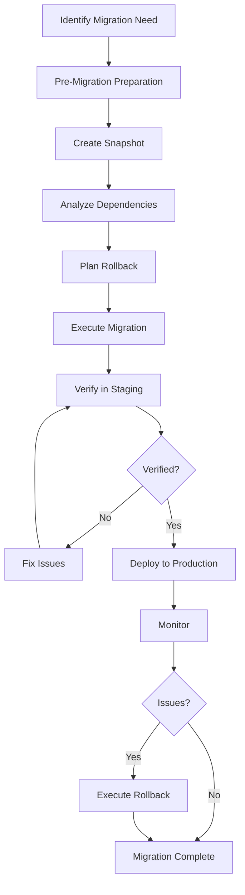

# Legacy Migration Playbook

## Overview

Legacy migration is the process of upgrading libraries, frameworks, or systems while maintaining functionality and minimizing risk. This playbook provides safe migration strategies including snapshot testing, dependency analysis, rollback planning, and verification steps to ensure smooth transitions.

**When to use this skill:** When upgrading libraries, frameworks, or migrating to new versions of existing systems.

## Table of Contents

1. [Migration Protocol](#migration-protocol)
2. [Pre-Migration Preparation](#pre-migration-preparation)
3. [Snapshot Testing](#snapshot-testing)
4. [Dependency Tree Analysis](#dependency-tree-analysis)
5. [Migration Execution](#migration-execution)
6. [Rollback Planning](#rollback-planning)
7. [Verification Steps](#verification-steps)
8. [Common Migration Patterns](#common-migration-patterns)
9. [Quick Reference](#quick-reference)

---

## Migration Protocol

### The Safe Migration Flow



### Migration Decision Tree

| Situation | Strategy | Risk Level |
|-----------|----------|------------|
| **Minor version bump** | Direct upgrade | Low |
| **Major version bump** | Parallel migration | Medium |
| **Breaking changes** | Strangler Fig pattern | High |
| **Deprecated features** | Sunset migration | Medium |
| **Critical path** | Canary deployment | High |

---

## Pre-Migration Preparation

### Migration Checklist

```markdown
## Pre-Migration Checklist

### Planning
- [ ] Migration scope defined
- [ ] Target version identified
- [ ] Breaking changes documented
- [ ] Migration timeline established
- [ ] Stakeholders notified

### Environment
- [ ] Development environment ready
- [ ] Staging environment ready
- [ ] Production backup scheduled
- [ ] Rollback plan documented

### Resources
- [ ] Team members assigned
- [ ] Documentation reviewed
- [ ] Migration tools prepared
- [ ] Support resources available

### Testing
- [ ] Test cases identified
- [ ] Regression tests prepared
- [ ] Performance baselines recorded
- [ ] Monitoring configured
```

### Breaking Change Analysis

**Identify breaking changes before migration:**

```javascript
// Example: Analyzing library upgrade
const breakingChanges = {
    // API changes
    removedMethods: ['oldMethod', 'deprecatedFunction'],
    renamedMethods: {
        'oldName': 'newName'
    },
    signatureChanges: {
        'method1': 'parameters changed from (a, b) to (options)'
    },

    // Behavior changes
    asyncChanges: {
        'method2': 'now returns Promise instead of callback'
    },
    defaultChanges: {
        'config': 'default value changed from true to false'
    },

    // Deprecations
    deprecatedFeatures: ['featureX', 'optionY']
};

console.log('Breaking Changes:', breakingChanges);
```

### Migration Scope Definition

```markdown
## Migration Scope

### What's Migrating
- **Library/Framework:** [Name]
- **From Version:** [X.Y.Z]
- **To Version:** [A.B.C]
- **Breaking Changes:** [List]

### What's Affected
- **Modules:** [List of affected modules]
- **Features:** [List of affected features]
- **Integrations:** [List of affected integrations]

### What's NOT Migrating
- **Unaffected Modules:** [List]
- **Optional Features:** [List]
- **Third-party Code:** [List]

### Success Criteria
- [ ] All tests pass
- [ ] No regressions
- [ ] Performance within baseline
- [ ] No critical errors
```

---

## Snapshot Testing

### Creating a Baseline

**Purpose:** Capture current system state before making changes.

```bash
#!/bin/bash
# scripts/create-snapshot.sh - Create system snapshot

SNAPSHOT_DIR="snapshots/$(date +%Y%m%d_%H%M%S)"
mkdir -p "$SNAPSHOT_DIR"

echo "Creating snapshot in $SNAPSHOT_DIR..."

# Capture package versions
npm list --depth=0 > "$SNAPSHOT_DIR/npm-packages.txt"
pip list > "$SNAPSHOT_DIR/python-packages.txt"

# Capture configuration
cp -r .env "$SNAPSHOT_DIR/"
cp package.json "$SNAPSHOT_DIR/"
cp requirements.txt "$SNAPSHOT_DIR/" 2>/dev/null || true

# Capture database schema
if [ -f "schema.sql" ]; then
    cp schema.sql "$SNAPSHOT_DIR/"
fi

# Run tests and capture results
npm test 2>&1 | tee "$SNAPSHOT_DIR/test-results-before.txt"

# Capture performance baseline
npm run benchmark 2>&1 | tee "$SNAPSHOT_DIR/performance-baseline.txt"

echo "Snapshot created: $SNAPSHOT_DIR"
```

### Snapshot Verification

**Verify snapshot was created successfully:**

```bash
# Check snapshot contents
ls -lh snapshots/$(date +%Y%m%d_%H%M%S)

# Verify critical files
for file in npm-packages.txt package.json .env; do
    if [ ! -f "snapshots/$(date +%Y%m%d_%H%M%S)/$file" ]; then
        echo "❌ Missing critical file: $file"
        exit 1
    fi
done

echo "✅ Snapshot verified"
```

### Baseline Test Suite

**Run full test suite before migration:**

```bash
#!/bin/bash
# scripts/run-baseline-tests.sh

echo "Running baseline tests..."

# Run all tests
npm test -- --coverage

# Capture results
mkdir -p baseline-results
cp coverage/coverage-final.json baseline-results/

# Run performance tests
npm run benchmark

# Capture performance
cp benchmark-results.json baseline-results/

echo "✅ Baseline tests complete"
```

---

## Dependency Tree Analysis

### Analyzing Impact

**Purpose:** Understand which dependencies will be affected by migration.

```javascript
// scripts/analyze-dependencies.js - Dependency impact analysis

const { execSync } = require('child_process');

function analyzeDependencies() {
    // Get current dependencies
    const currentDeps = JSON.parse(execSync('npm ls --json', { encoding: 'utf-8' }));

    // Get target version dependencies
    const targetDeps = JSON.parse(execSync('npm view package-name@version --json', { encoding: 'utf-8' }));

    // Compare dependencies
    const analysis = {
        current: currentDeps.dependencies,
        target: targetDeps.dependencies,
        changes: compareDependencies(currentDeps.dependencies, targetDeps.dependencies),
        impact: assessImpact(currentDeps.dependencies, targetDeps.dependencies)
    };

    return analysis;
}

function compareDependencies(current, target) {
    const changes = {
        added: [],
        removed: [],
        updated: []
    };

    // Check for added dependencies
    for (const dep in target) {
        if (!(dep in current)) {
            changes.added.push(dep);
        }
    }

    // Check for removed dependencies
    for (const dep in current) {
        if (!(dep in target)) {
            changes.removed.push(dep);
        }
    }

    // Check for updated dependencies
    for (const dep in target) {
        if (dep in current && current[dep] !== target[dep]) {
            changes.updated.push({
                name: dep,
                from: current[dep],
                to: target[dep]
            });
        }
    }

    return changes;
}

function assessImpact(current, target) {
    const impact = {
        high: [],
        medium: [],
        low: []
    };

    // Assess impact of each change
    for (const change of Object.keys(target)) {
        if (change in current && current[change] !== target[change]) {
            // Major version bump = high impact
            const [currentMajor, targetMajor] = [current[change], target[change]].map(v => parseInt(v.split('.')[0]));
            
            if (targetMajor > currentMajor) {
                impact.high.push(change);
            } else if (targetMajor === currentMajor) {
                impact.medium.push(change);
            } else {
                impact.low.push(change);
            }
        }
    }

    return impact;
}

const analysis = analyzeDependencies();
console.log('Dependency Analysis:', JSON.stringify(analysis, null, 2));
```

### Dependency Conflict Detection

**Check for conflicts before migration:**

```bash
#!/bin/bash
# scripts/check-dependency-conflicts.sh

echo "Checking for dependency conflicts..."

# Check for peer dependency conflicts
npm ls

# Check for circular dependencies
npm ls --json | jq '.dependencies | to_entries | map(select(.value.dependencies | contains(.key)) | .key)'

# Check for incompatible versions
npm outdated

echo "✅ Dependency check complete"
```

---

## Migration Execution

### Step-by-Step Migration

**Phase 1: Development Migration**

```markdown
## Phase 1: Development Migration

### 1.1 Update Dependencies
\`\`\`bash
npm install package-name@new-version
\`\`\`

### 1.2 Update Code
- Update import statements
- Replace deprecated APIs
- Update method signatures
- Handle breaking changes

### 1.3 Run Tests
\`\`\`bash
npm test
\`\`\`

### 1.4 Fix Issues
- Address test failures
- Update documentation
- Commit changes

### 1.5 Verification
- [ ] All tests pass
- [ ] No warnings
- [ ] Code compiles
- [ ] Linting passes
```

**Phase 2: Staging Migration**

```markdown
## Phase 2: Staging Migration

### 2.1 Deploy to Staging
\`\`\`bash
npm run deploy:staging
\`\`\`

### 2.2 Run Full Test Suite
\`\`\`bash
npm test -- --coverage
\`\`\`

### 2.3 Integration Testing
- Test all integrations
- Verify API compatibility
- Check data migrations

### 2.4 Performance Testing
- Run performance benchmarks
- Compare to baseline
- Verify no regression

### 2.4 Verification
- [ ] All tests pass
- [ ] Performance within 10% of baseline
- [ ] No critical errors
- [ ] Stakeholder approval
```

**Phase 3: Production Migration**

```markdown
## Phase 3: Production Migration

### 3.1 Schedule Migration
- Choose low-traffic period
- Notify all stakeholders
- Prepare rollback plan

### 3.2 Pre-Migration Checks
- Verify rollback plan is ready
- Confirm monitoring is active
- Verify backup is current

### 3.3 Execute Migration
\`\`\`bash
npm run deploy:production
\`\`\`

### 3.4 Immediate Verification
- Check health endpoints
- Verify key functionality
- Monitor error rates

### 3.5 Post-Migration Monitoring
- Monitor for 1 hour
- Check performance metrics
- Review error logs

### 3.6 Verification
- [ ] Health checks pass
- [ ] Error rates normal
- [ ] Performance acceptable
- [ ] No critical issues
```

### Migration Script Template

```bash
#!/bin/bash
# scripts/migrate.sh - Automated migration script

set -e

# Configuration
PACKAGE_NAME="package-name"
NEW_VERSION="new-version"
OLD_VERSION=$(npm view $PACKAGE_NAME version)

echo "=== Migration Script ==="
echo "Migrating $PACKAGE_NAME from $OLD_VERSION to $NEW_VERSION"

# Pre-migration checks
echo "Running pre-migration checks..."
./scripts/create-snapshot.sh
./scripts/analyze-dependencies.js

# Backup current state
echo "Creating backup..."
cp -r node_modules node_modules.backup
cp package.json package.json.backup

# Update dependencies
echo "Updating dependencies..."
npm install $PACKAGE_NAME@$NEW_VERSION

# Update code if needed
echo "Updating code..."
# Add code transformation commands here

# Run tests
echo "Running tests..."
npm test

if [ $? -ne 0 ]; then
    echo "❌ Tests failed. Rolling back..."
    ./scripts/rollback.sh
    exit 1
fi

echo "✅ Migration complete"
```

---

## Rollback Planning

### Rollback Strategy

**Always have a rollback plan before migrating to production.**

```markdown
## Rollback Plan

### Rollback Triggers
- [ ] Critical errors (>5% error rate)
- [ ] Performance degradation (>50% slower)
- [ ] Data corruption
- [ ] Security vulnerability
- [ ] Stakeholder request

### Rollback Steps
1. Stop new version deployment
2. Restore previous version
3. Restore database from backup
4. Restart services
5. Verify functionality
6. Notify stakeholders

### Rollback Time Estimate
- **Detection:** 5 minutes
- **Decision:** 10 minutes
- **Execution:** 15 minutes
- **Verification:** 10 minutes
- **Total:** 40 minutes

### Rollback Verification
- [ ] All services running
- [ ] Health checks pass
- [ ] Error rates normal
- [ ] Performance restored
```

### Rollback Script

```bash
#!/bin/bash
# scripts/rollback.sh - Automated rollback

set -e

echo "=== Rollback Script ==="

# Stop current version
echo "Stopping current version..."
npm run stop

# Restore previous version
echo "Restoring previous version..."
if [ -f "package.json.backup" ]; then
    mv package.json.backup package.json
fi

if [ -d "node_modules.backup" ]; then
    rm -rf node_modules
    mv node_modules.backup node_modules
fi

# Reinstall dependencies
echo "Reinstalling dependencies..."
npm install

# Restore database if needed
if [ -f "snapshots/latest/schema.sql" ]; then
    echo "Restoring database..."
    mysql -u user -p database < snapshots/latest/schema.sql
fi

# Restart services
echo "Restarting services..."
npm run start

# Verify
echo "Verifying rollback..."
sleep 5
npm run health-check

if [ $? -eq 0 ]; then
    echo "✅ Rollback successful"
else
    echo "❌ Rollback failed. Manual intervention required."
    exit 1
fi
```

---

## Verification Steps

### Post-Migration Verification

```markdown
## Post-Migration Verification Checklist

### Functional Verification
- [ ] All core features work
- [ ] No broken integrations
- [ ] Data integrity maintained
- [ ] User workflows unaffected

### Performance Verification
- [ ] Response times within baseline
- [ ] Throughput maintained
- [ ] No memory leaks
- [ ] CPU usage normal

### Security Verification
- [ ] Authentication works
- [ ] Authorization maintained
- [ ] No new vulnerabilities
- [ ] Secrets properly configured

### Monitoring Verification
- [ ] Error rates normal
- [ ] No critical alerts
- [ ] Metrics within thresholds
- [ ] Logs clean
```

### Automated Verification Script

```bash
#!/bin/bash
# scripts/verify-migration.sh - Post-migration verification

echo "=== Migration Verification ==="

# Health check
echo "Checking health..."
HEALTH_STATUS=$(curl -s -o /dev/null -w "%{http_code}" http://localhost:3000/health)

if [ "$HEALTH_STATUS" -ne "200" ]; then
    echo "❌ Health check failed"
    exit 1
fi

echo "✅ Health check passed"

# Run tests
echo "Running tests..."
npm test

if [ $? -ne 0 ]; then
    echo "❌ Tests failed"
    exit 1
fi

echo "✅ Tests passed"

# Performance check
echo "Checking performance..."
PERFORMANCE=$(npm run benchmark | grep "avg" | awk '{print $2}')

BASELINE=$(cat baseline-results/performance-baseline.txt | grep "avg" | awk '{print $2}')

# Allow 10% degradation
THRESHOLD=$(echo "$BASELINE * 1.1" | bc)

if (( $(echo "$PERFORMANCE > $THRESHOLD" | bc -l) )); then
    echo "⚠️  Performance degraded: $PERFORMANCE vs baseline $BASELINE"
else
    echo "✅ Performance acceptable"
fi

echo "=== Verification Complete ==="
```

---

## Common Migration Patterns

### Pattern 1: Direct Upgrade

**Use when:** Minor version bump with no breaking changes.

```bash
# Simple version upgrade
npm install package@latest
npm test
npm run deploy
```

### Pattern 2: Parallel Migration

**Use when:** Major version bump with some breaking changes.

```javascript
// Run both old and new versions side by side
const oldVersion = require('package-name');
const newVersion = require('package-name-new');

// Feature flag to switch between versions
const useNewVersion = process.env.USE_NEW_VERSION === 'true';

const api = useNewVersion ? newVersion : oldVersion;

// Gradually migrate traffic
if (useNewVersion) {
    // Use new version
} else {
    // Use old version
}
```

### Pattern 3: Strangler Fig

**Use when:** Complete rewrite or major framework change.

```javascript
// Gradually replace old system with new system
class LegacyService {
    process(data) {
        // Old implementation
    }
}

class NewService {
    process(data) {
        // New implementation
    }
}

class ServiceFacade {
    constructor(legacy, modern) {
        this.legacy = legacy;
        this.modern = modern;
        this.useModern = false;
    }

    process(data) {
        if (this.useModern) {
            return this.modern.process(data);
        }
        return this.legacy.process(data);
    }

    migrateToModern() {
        this.useModern = true;
    }
}

// Start with legacy, gradually migrate to modern
const facade = new ServiceFacade(new LegacyService(), new NewService());
```

### Pattern 4: Sunset Migration

**Use when:** Deprecating features or removing legacy code.

```javascript
// Mark features as deprecated
function oldFeature() {
    console.warn('DEPRECATED: oldFeature is deprecated and will be removed in v2.0');
    // Old implementation
}

function newFeature() {
    // New implementation
}

// Gradually remove old code
if (process.env.ENABLE_NEW_FEATURE === 'true') {
    newFeature();
} else {
    oldFeature();
}
```

---

## Quick Reference

### Migration Checklist

```markdown
## Complete Migration Checklist

### Pre-Migration
- [ ] Migration scope defined
- [ ] Breaking changes documented
- [ ] Snapshot created
- [ ] Dependencies analyzed
- [ ] Rollback plan ready
- [ ] Tests passing on baseline

### During Migration
- [ ] Development migration complete
- [ ] Staging migration verified
- [ ] Performance tested
- [ ] Stakeholder approval received
- [ ] Production deployment scheduled

### Post-Migration
- [ ] Health checks passing
- [ ] Tests passing
- [ ] Performance acceptable
- [ ] No critical errors
- [ ] Monitoring stable
- [ ] Documentation updated
```

### Common Migration Commands

```bash
# Version checks
npm view package version
npm outdated
npm ls

# Dependency management
npm install package@version
npm update package
npm uninstall package

# Testing
npm test
npm run test:watch
npm run test:coverage

# Deployment
npm run deploy:staging
npm run deploy:production
npm run rollback
```

### Rollback Commands

```bash
# Quick rollback
git revert HEAD
npm install
npm run deploy

# Restore from backup
cp package.json.backup package.json
npm install
npm run start

# Database rollback
mysql -u user -p database < backup.sql
pg_restore -d database -f backup.dump
```

---

## Common Pitfalls

1. **Skipping snapshot** - Always create baseline before migration
2. **Not testing in staging** - Never migrate directly to production
3. **No rollback plan** - Always know how to undo changes
4. **Ignoring breaking changes** - Document and address all breaking changes
5. **Insufficient monitoring** - Monitor closely after migration
6. **Not notifying stakeholders** - Keep everyone informed of changes
7. **Rushing migration** - Take time to test thoroughly
8. **Forgetting documentation** - Update docs with new patterns

## Additional Resources

- [Semantic Versioning](https://semver.org/)
- [npm Docs](https://docs.npmjs.com/)
- [Migration Strategies](https://martinfowler.com/bliki/StranglerFigApplication)
- [Database Migration Guide](https://www.postgresql.org/docs/current/migration/)
