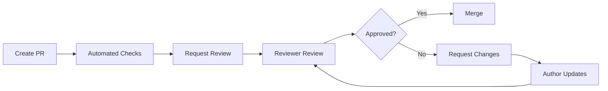

# GitHub Code Review

## Overview

GitHub code review practices cover the systematic process of reviewing pull requests to ensure code quality, maintainability, and adherence to team standards. This skill covers review workflows, best practices, automation, and tools for effective code reviews using GitHub's built-in features and integrations.

**When to use this skill:** When conducting or participating in code reviews on GitHub repositories.

## Table of Contents

1. [Review Workflow](#review-workflow)
2. [Review Best Practices](#review-best-practices)
3. [Review Automation](#review-automation)
4. [Code Review Checklist](#code-review-checklist)
5. [Common Review Scenarios](#common-review-scenarios)
6. [Quick Reference](#quick-reference)

---

## Review Workflow

### Standard Review Process



### Review Request Assignment

```bash
# Request specific reviewers
gh pr create --reviewer @username1,@username2

# Request review from team
gh pr create --team-reviewers @team-name

# Request code owner review (CODEOWNERS file)
gh pr create --reviewer codeowners
```

### Review States

| State | Description | Action Required |
|--------|-------------|----------------|
| **Draft** | Work in progress, not ready for review | Mark as ready when complete |
| **Changes Requested** | Reviewer requested changes | Make updates and push |
| **Approved** | Reviewer approved the PR | Ready to merge |
| **Commented** | Reviewer left comments | Address or respond |

---

## Review Best Practices

### Pre-Review Preparation

**Before Requesting Review:**
- Ensure all CI checks pass
- Write clear, descriptive commit messages
- Keep PR size manageable (< 400 lines of code)
- Self-review your changes first
- Add description with context and testing notes

### Effective Review Comments

**Do:**
```markdown
✅ "Consider extracting this logic to a separate function for reusability"
✅ "This approach might cause performance issues with large datasets. Have you tested with >10K records?"
✅ "Great solution! One suggestion: could we add error handling for edge cases?"
```

**Don't:**
```markdown
❌ "This is wrong" (without explanation)
❌ "Rewrite this" (without guidance)
❌ Personal attacks or sarcasm
❌ Nitpicking formatting issues (use linters instead)
```

### Review Response Etiquette

| Situation | Recommended Response |
|-----------|-------------------|
| **Agreed feedback** | "Good catch, updated in commit abc123" |
| **Disagreed feedback** | Explain reasoning, provide examples, ask for clarification |
| **Unclear feedback** | "Could you elaborate on this concern? I'm not sure I understand the issue" |
| **Outdated comment** | Mark as resolved with context |

---

## Review Automation

### GitHub Actions for Code Review

```yaml
# .github/workflows/code-review.yml
name: Code Review Automation

on:
  pull_request:
    types: [opened, synchronize, reopened]

jobs:
  automated-review:
    runs-on: ubuntu-latest
    steps:
      - uses: actions/checkout@v3

      - name: Run linter
        run: |
          npm run lint

      - name: Check PR size
        uses: kodiakh/pr-size-action@v1
        with:
          size_threshold: 400

      - name: Request review from CODEOWNERS
        uses: actions/github-script@v6
        with:
          script: |
            const files = await github.rest.pulls.listFiles({
              owner: context.repo.owner,
              repo: context.repo.repo,
              pull_number: context.payload.pull_request.number
            });
            // Request review based on file changes
```

### CODEOWNERS File

```
# .github/CODEOWNERS
# Format: file-pattern @reviewer

# Global owner
* @tech-lead

# Specific directories
/api/ @api-team @backend-lead
/frontend/ @frontend-team @frontend-lead
/docs/ @documentation-team

# File patterns
*.md @documentation-team
*.sql @database-team
```

### Review Bots and Tools

| Tool | Purpose | Setup |
|-------|---------|--------|
| **Dependabot** | Automated dependency updates | `.github/dependabot.yml` |
| **Renovate** | Alternative dependency updates | `renovate.json` |
| **SonarCloud** | Code quality analysis | GitHub App integration |
| **Codecov** | Code coverage tracking | GitHub App integration |
| **Danger** | Automated review rules | `.dangerfile` |

---

## Code Review Checklist

### Before Requesting Review

```markdown
## Pre-Review Checklist

- [ ] All automated tests pass
- [ ] Manual testing completed
- [ ] Code follows style guide
- [ ] Self-review performed
- [ ] PR description is clear and complete
- [ ] Related issues are linked
- [ ] Breaking changes are documented
- [ ] Dependencies are updated
- [ ] No console.log or debug code
- [ ] Environment variables are documented
```

### During Review

```markdown
## Review Checklist

### Functionality
- [ ] Code implements requirements correctly
- [ ] Edge cases are handled
- [ ] Error handling is appropriate
- [ ] Performance is acceptable

### Code Quality
- [ ] Code is readable and maintainable
- [ ] Naming conventions are followed
- [ ] DRY principle is followed
- [ ] Functions have single responsibility

### Security
- [ ] No hardcoded credentials
- [ ] Input validation is present
- [ ] SQL injection protection
- [ ] XSS prevention for web apps
- [ ] Authorization checks are correct

### Testing
- [ ] Unit tests cover new code
- [ ] Integration tests are updated
- [ ] Tests are meaningful and readable
```

### Before Merging

```markdown
## Merge Checklist

- [ ] All reviewers approved
- [ ] All CI checks pass
- [ ] Conversation is resolved
- [ ] No outstanding change requests
- [ ] PR is up to date with main branch
- [ ] Merge commit message is appropriate
```

---

## Common Review Scenarios

### Large PRs (> 1000 lines)

**Strategy:**
1. Request author to split into smaller PRs
2. Review in chunks by file or module
3. Focus on architectural changes first
4. Use inline comments for specific issues

```bash
# Suggest splitting large PR
gh pr comment "This PR is quite large. Consider splitting into:
1. Core logic changes
2. UI updates
3. Tests and docs"
```

### Urgent Hotfix PRs

**Strategy:**
1. Expedite review process
2. Focus on correctness and safety
3. Skip non-critical style issues
4. Add follow-up issue for cleanup

```bash
# Mark PR as urgent
gh pr edit --add-label "urgent,hotfix"
gh pr edit --add-reviewer @oncall
```

### Breaking Changes

**Requirements:**
- Clear documentation in PR description
- Migration guide if needed
- All affected teams notified
- Version bump if applicable
- Changelog entry

```markdown
## Breaking Changes

### API Changes
- Endpoint `/api/v1/users` renamed to `/api/v1/accounts`
- Response format changed for `GET /api/v1/orders`

### Migration Guide
```bash
# Update API calls
sed -i 's|/api/v1/users|/api/v1/accounts|g' app.js
```
```

---

## Quick Reference

### GitHub CLI Commands

```bash
# Create PR with reviewers
gh pr create --title "Feature: Add user authentication" \
  --body "Implements #123" \
  --reviewer @team-lead \
  --label enhancement

# View PR status
gh pr view 123

# Add reviewer to existing PR
gh pr edit 123 --add-reviewer @username

# Approve PR
gh pr review 123 --approve

# Request changes
gh pr review 123 --request-changes

# Comment on PR
gh pr comment 123 --body "Looks good, just one suggestion..."

# Merge PR
gh pr merge 123 --squash --delete-branch

# List open PRs
gh pr list --state open --limit 20
```

### Review Keyboard Shortcuts

| Key | Action |
|-----|--------|
| `c` | Comment on line |
| `s` | Start review |
| `e` | Edit comment |
| `r` | Reply to comment |
| `Enter` | Submit review |
| `Esc` | Cancel review |

### PR Labels

| Label | Usage |
|-------|--------|
| `ready for review` | PR is ready for review |
| `needs work` | PR needs changes before merge |
| `wip` | Work in progress |
| `breaking change` | Contains breaking changes |
| `documentation` | Documentation updates only |
| `dependencies` | Dependency updates |
| `bug` | Bug fix |
| `enhancement` | New feature |
| `refactor` | Code refactoring |
| `tests` | Test updates |

### Review Metrics to Track

| Metric | Target | How to Measure |
|--------|--------|----------------|
| **Review turnaround time** | < 24 hours | Time from request to first review |
| **Merge time** | < 48 hours | Time from request to merge |
| **PR size** | < 400 lines | Lines changed per PR |
| **Review coverage** | 100% | All PRs reviewed before merge |
| **Rejection rate** | < 10% | PRs requiring changes |

---

## Common Pitfalls

1. **Reviewing too late** - Request reviews early, even for draft PRs
2. **Nitpicking** - Focus on important issues, let linters handle style
3. **Being rude** - Keep feedback constructive and respectful
4. **Ignoring context** - Understand why changes were made
5. **Blocking on minor issues** - Mark as "approved with suggestions" for non-critical issues
6. **Not self-reviewing** - Always review your own code before requesting others
7. **Large PRs** - Keep PRs small and focused for faster reviews
8. **No context** - Provide clear PR descriptions with testing notes

## Additional Resources

- [GitHub Code Review Documentation](https://docs.github.com/en/pull-requests/collaborating-with-pull-requests/reviewing-changes-in-pull-requests)
- [Effective Code Review Guide](https://google.github.io/eng-practices/review/developer/reviews.html)
- [CODEOWNERS Documentation](https://docs.github.com/en/repositories/managing-your-repositorys-settings-and-features/customizing-your-repository/about-code-owners)
