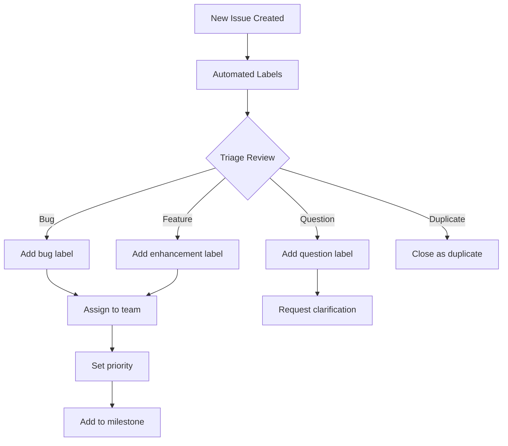

# GitHub Issue Triage

## Overview

GitHub issue triage is the systematic process of organizing, prioritizing, and routing incoming issues to ensure they are addressed efficiently. This skill covers triage workflows, labeling strategies, automation, and best practices for managing issue backlogs using GitHub's features and integrations.

**When to use this skill:** When managing incoming issues in GitHub repositories and ensuring they reach the right maintainers.

## Table of Contents

1. [Triage Workflow](#triage-workflow)
2. [Issue Categorization](#issue-categorization)
3. [Labeling Strategy](#labeling-strategy)
4. [Triage Automation](#triage-automation)
5. [Triage Checklist](#triage-checklist)
6. [Quick Reference](#quick-reference)

---

## Triage Workflow

### Standard Triage Process



### Triage Responsibilities

| Role | Responsibilities |
|-------|----------------|
| **Triage Team** | Initial categorization, labeling, routing |
| **Maintainer** | Assignment, priority setting, scheduling |
| **Contributor** | Issue creation, providing details, responding to questions |

### Triage Frequency

| Repository Size | Triage Frequency |
|----------------|------------------|
| **Small** (< 100 issues/week) | Daily |
| **Medium** (100-500 issues/week) | Twice daily |
| **Large** (> 500 issues/week) | Continuous with rotation |

---

## Issue Categorization

### Issue Types

| Type | Description | Template |
|-------|-------------|-----------|
| **Bug** | Unexpected behavior or error | Bug Report |
| **Enhancement** | New feature or improvement | Feature Request |
| **Question** | User question or support | Support Request |
| **Documentation** | Docs issue or improvement | Documentation |
| **Performance** | Performance-related issue | Performance |
| **Security** | Security vulnerability | Security Report |

### Issue Quality Checklist

```markdown
## Issue Quality Criteria

- [ ] Clear, descriptive title
- [ ] Detailed description of problem/request
- [ ] Steps to reproduce (for bugs)
- [ ] Expected vs actual behavior (for bugs)
- [ ] Environment details (OS, version, etc.)
- [ ] Relevant logs or screenshots attached
- [ ] Reproduction repository (if applicable)
- [ ] Related issues referenced
- [ ] Appropriate labels applied
- [ ] Assignee or team identified
```

### Duplicate Detection

```bash
# Search for duplicates before closing
gh issue list --search "error message" --state all

# Comment when marking as duplicate
gh issue comment 123 --body "Closing as duplicate of #45. Please continue discussion there."

# Close as duplicate
gh issue close 123 --comment "Closing as duplicate of #45" --duplicate
```

---

## Labeling Strategy

### Standard Label Schema

```yaml
# .github/labels.yml
labels:
  # Type labels
  - name: "type: bug"
    color: "d73a4a"
    description: "Something isn't working"
  - name: "type: enhancement"
    color: "a2eeef"
    description: "New feature or request"
  - name: "type: documentation"
    color: "0075ca"
    description: "Improvements or additions to documentation"
  - name: "type: question"
    color: "fbca04"
    description: "Question from user"

  # Priority labels
  - name: "priority: critical"
    color: "b60205"
    description: "Critical issue, fix immediately"
  - name: "priority: high"
    color: "e99695"
    description: "High priority"
  - name: "priority: medium"
    color: "fbca04"
    description: "Medium priority"
  - name: "priority: low"
    color: "c2e0c6"
    description: "Low priority"

  # Status labels
  - name: "status: needs-triage"
    color: "bfd4f2"
    description: "Needs triage"
  - name: "status: in-progress"
    color: "0e8a16"
    description: "Currently being worked on"
  - name: "status: blocked"
    color: "5319e7"
    description: "Blocked by another issue"
  - name: "status: wontfix"
    color: "ffffff"
    description: "Will not be fixed"

  # Component labels
  - name: "component: api"
    color: "006b75"
    description: "API related"
  - name: "component: ui"
    color: "006b75"
    description: "UI related"
  - name: "component: database"
    color: "006b75"
    description: "Database related"
```

### Label Priority Matrix

| Priority | Response Time | Resolution Time |
|----------|----------------|----------------|
| **Critical** | < 4 hours | < 24 hours |
| **High** | < 24 hours | < 3 days |
| **Medium** | < 3 days | < 1 week |
| **Low** | < 1 week | < 1 month |

### Label Automation Rules

```yaml
# .github/labeler.yml
labels:
  - name: "area: api"
    files:
      - "src/api/**"
  - name: "area: frontend"
    files:
      - "src/frontend/**"
  - name: "area: database"
    files:
      - "migrations/**"
      - "models/**"
  - name: "type: tests"
    files:
      - "**/*test*"
      - "**/*spec*"
```

---

## Triage Automation

### GitHub Actions for Triage

```yaml
# .github/workflows/triage.yml
name: Issue Triage

on:
  issues:
    types: [opened, reopened, labeled]

jobs:
  auto-assign:
    runs-on: ubuntu-latest
    steps:
      - name: Auto-assign based on labels
        uses: actions/github-script@v6
        with:
          script: |
            const labels = context.payload.issue.labels.map(l => l.name);
            if (labels.includes('component: api')) {
              await github.rest.issues.addAssignees({
                owner: context.repo.owner,
                repo: context.repo.repo,
                issue_number: context.issue.number,
                assignees: ['api-team']
              });
            }

  add-needs-info-label:
    runs-on: ubuntu-latest
    if: github.event.action == 'opened'
    steps:
      - name: Check issue quality
        uses: actions/github-script@v6
        with:
          script: |
            const body = context.payload.issue.body;
            const hasSteps = body.includes('Steps to reproduce');
            const hasEnvironment = body.includes('Environment');
            if (!hasSteps || !hasEnvironment) {
              await github.rest.issues.addLabels({
                owner: context.repo.owner,
                repo: context.repo.repo,
                issue_number: context.issue.number,
                labels: ['status: needs-info']
              });
            }
```

### Issue Templates

```markdown
# .github/ISSUE_TEMPLATE/bug_report.md
---
name: Bug report
about: Create a report to help us improve
title: '[BUG] '
labels: 'type: bug, status: needs-triage'
assignees: ''
---

## Describe the bug
A clear and concise description of what the bug is.

## To Reproduce
Steps to reproduce the behavior:
1. Go to '...'
2. Click on '....'
3. Scroll down to '....'
4. See error

## Expected behavior
A clear and concise description of what you expected to happen.

## Screenshots
If applicable, add screenshots to help explain your problem.

## Environment
 - OS: [e.g. iOS]
 - Browser: [e.g. chrome, safari]
 - Version: [e.g. 22]
```

### Auto-Response Bot

```yaml
# .github/workflows/auto-response.yml
name: Auto Response

on:
  issues:
    types: [opened]

jobs:
  auto-respond:
    runs-on: ubuntu-latest
    steps:
      - name: Add welcome comment
        uses: actions/github-script@v6
        with:
          script: |
            await github.rest.issues.createComment({
              owner: context.repo.owner,
              repo: context.repo.repo,
              issue_number: context.issue.number,
              body: `Thanks for opening this issue! Our team will review it shortly.
              Please check our [contributing guidelines](CONTRIBUTING.md) for more information.`
            });
```

---

## Triage Checklist

### Initial Triage

```markdown
## New Issue Triage

- [ ] Issue has clear, descriptive title
- [ ] Issue has sufficient details
- [ ] Issue type identified (bug/enhancement/question)
- [ ] Appropriate labels applied
- [ ] Duplicate search performed
- [ ] Assignee or team identified
- [ ] Priority level set
- [ ] Milestone assigned (if applicable)
- [ ] Related issues linked
- [ ] Welcome comment added (if needed)
```

### Weekly Triage Review

```markdown
## Weekly Triage Checklist

- [ ] Review all `status: needs-triage` issues
- [ ] Update stale issues
- [ ] Close resolved issues
- [ ] Re-prioritize based on team capacity
- [ ] Review and update milestones
- [ ] Identify and block spam
- [ ] Review unassigned issues
- [ ] Update project board
```

---

## Quick Reference

### GitHub CLI Commands

```bash
# List issues needing triage
gh issue list --label "status: needs-triage"

# Add labels to issue
gh issue edit 123 --add-label "priority: high,component: api"

# Assign issue
gh issue edit 123 --assignee @username

# Close issue
gh issue close 123 --comment "Fixed in version 2.0.0"

# Reopen issue
gh issue reopen 123

# Create issue from template
gh issue create --template bug_report.md

# Search for duplicates
gh issue search "error message in:title"

# View issue details
gh issue view 123

# Transfer issue to another repo
gh issue transfer 123 new-owner/new-repo
```

### Issue Filters

| Filter | Command |
|---------|----------|
| **Needs triage** | `label:status:needs-triage` |
| **Bugs only** | `label:type:bug` |
| **High priority** | `label:priority:high` |
| **Unassigned** | `no:assignee` |
| **Stale issues** | `updated:<30days ago` |
| **My issues** | `assignee:@me` |
| **Team issues** | `assignee:@team-name` |

### Triage Metrics

| Metric | Target | How to Track |
|--------|--------|--------------|
| **Time to triage** | < 24 hours | Time from creation to first label |
| **Time to assign** | < 48 hours | Time from creation to assignment |
| **Time to response** | < 72 hours | Time from creation to first comment |
| **Stale issues** | < 5% | Issues inactive > 30 days |
| **Duplicate rate** | < 10% | Issues closed as duplicates |

### Issue Status Transitions

```
opened → needs-triage → in-progress → done
opened → needs-info → in-progress → done
opened → wontfix → closed
opened → duplicate → closed
opened → blocked → in-progress → done
```

---

## Common Pitfalls

1. **Not labeling consistently** - Use automation to ensure consistent labeling
2. **Closing without explanation** - Always explain why an issue is closed
3. **Ignoring stale issues** - Regularly review and update old issues
4. **Over-labeling** - Keep labels simple and meaningful
5. **Not responding to questions** - Engage with users asking questions
6. **Setting unrealistic priorities** - Be realistic about team capacity
7. **Not using templates** - Templates improve issue quality
8. **Forgetting duplicates** - Search before creating new issues

## Additional Resources

- [GitHub Issue Management](https://docs.github.com/en/issues/tracking-your-work-with-issues/about-issues)
- [GitHub Labels Documentation](https://docs.github.com/en/issues/using-labels-and-milestones-to-track-work/managing-labels)
- [Issue Templates Guide](https://docs.github.com/en/communities/using-templates-to-encourage-useful-issues-and-pull-requests/syntax-for-issue-forms)
