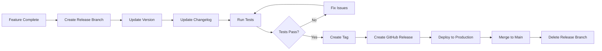

# GitHub Release Management

## Overview

Release management covers the process of creating, versioning, and distributing software releases using GitHub's release features. This skill includes semantic versioning, changelog management, release automation, and best practices for delivering stable releases to users.

**When to use this skill:** When creating and managing software releases on GitHub repositories.

## Table of Contents

1. [Release Workflow](#release-workflow)
2. [Semantic Versioning](#semantic-versioning)
3. [Changelog Management](#changelog-management)
4. [Release Automation](#release-automation)
5. [Release Checklist](#release-checklist)
6. [Quick Reference](#quick-reference)

---

## Release Workflow

### Release Process Flow



### Release Types

| Type | Description | Example Version |
|------|-------------|-----------------|
| **Major** | Incompatible API changes | 1.0.0 → 2.0.0 |
| **Minor** | Backwards-compatible features | 1.0.0 → 1.1.0 |
| **Patch** | Backwards-compatible bug fixes | 1.0.0 → 1.0.1 |
| **Pre-release** | Alpha, beta, RC versions | 1.0.0-alpha.1 |

### Release Branching Strategy

```bash
# Git flow style
git checkout -b release/v2.0.0
git checkout -b hotfix/v2.0.1

# Trunk-based development
git checkout main
git tag v2.0.0
git push origin v2.0.0

# Feature flag releases
# Deploy features behind flags
# Enable flags in release
```

---

## Semantic Versioning

### SemVer Format

```
MAJOR.MINOR.PATCH-PRERELEASE+BUILD

Examples:
1.0.0              # First stable release
2.1.3              # Patch release
3.0.0-beta.1        # Beta release
1.2.0+20130313144700 # With build metadata
```

### Version Bump Rules

| Change Type | Version Increment | Example |
|-------------|------------------|----------|
| **Breaking change** | MAJOR | 1.0.0 → 2.0.0 |
| **New feature** | MINOR | 1.0.0 → 1.1.0 |
| **Bug fix** | PATCH | 1.0.0 → 1.0.1 |
| **Pre-release** | Add suffix | 1.0.0 → 1.0.0-alpha.1 |

### Automated Version Bumping

```yaml
# .github/workflows/version-bump.yml
name: Bump Version

on:
  pull_request:
    types: [closed]
    branches: [main]

jobs:
  bump:
    runs-on: ubuntu-latest
    steps:
      - uses: actions/checkout@v3

      - name: Bump version
        uses: phips28/gh-action-bump-version@master
        env:
          GITHUB_TOKEN: ${{ secrets.GITHUB_TOKEN }}
        with:
          target-branch: main
          commit-message: 'Bump version to {{version}}'
          major-wording: 'BREAKING CHANGE:'
          minor-wording: 'feat:'
          patch-wording: 'fix:'
```

---

## Changelog Management

### Changelog Format

```markdown
# CHANGELOG.md

## [Unreleased]

### Added
- New user authentication system
- OAuth2 integration with Google

### Changed
- Updated API response format
- Improved database query performance

### Deprecated
- Old authentication endpoint will be removed in v3.0

### Removed
- Removed legacy user management module

### Fixed
- Fixed login timeout issue
- Fixed memory leak in background jobs

### Security
- Added rate limiting to prevent DoS attacks

## [2.0.0] - 2024-01-15

### Added
- Complete rewrite of payment system
- Support for multiple payment gateways

### Breaking
- Payment API endpoints changed (see migration guide)

## [1.5.0] - 2024-01-01

### Added
- User profile management
- Email notifications
```

### Conventional Commits

| Type | Description | Changelog Section |
|------|-------------|------------------|
| `feat:` | New feature | Added |
| `fix:` | Bug fix | Fixed |
| `perf:` | Performance improvement | Changed |
| `docs:` | Documentation changes | Changed |
| `style:` | Code style changes | Changed |
| `refactor:` | Code refactoring | Changed |
| `test:` | Test changes | Changed |
| `build:` | Build system changes | Changed |
| `ci:` | CI changes | Changed |
| `chore:` | Maintenance tasks | Changed |
| `revert:` | Revert previous commit | Fixed |

### Automated Changelog

```yaml
# .github/workflows/changelog.yml
name: Update Changelog

on:
  push:
    tags:
      - 'v*'

jobs:
  changelog:
    runs-on: ubuntu-latest
    steps:
      - uses: actions/checkout@v3
        with:
          fetch-depth: 0

      - name: Generate changelog
        uses: butlerlogic/action-autotag@stable
        with:
          GITHUB_TOKEN: ${{ secrets.GITHUB_TOKEN }}
          tag_prefix: "v"
```

---

## Release Automation

### GitHub Actions for Releases

```yaml
# .github/workflows/release.yml
name: Create Release

on:
  push:
    tags:
      - 'v*'

jobs:
  release:
    runs-on: ubuntu-latest
    steps:
      - uses: actions/checkout@v3

      - name: Build artifacts
        run: |
          npm ci
          npm run build
          zip -r release.zip dist/

      - name: Create Release
        uses: softprops/action-gh-release@v1
        with:
          files: release.zip
          generate_release_notes: true
          draft: false
          prerelease: ${{ contains(github.ref, 'alpha') || contains(github.ref, 'beta') }}
        env:
          GITHUB_TOKEN: ${{ secrets.GITHUB_TOKEN }}
```

### Release Notes Generation

```yaml
# .github/workflows/release-notes.yml
name: Generate Release Notes

on:
  release:
    types: [created]

jobs:
  notes:
    runs-on: ubuntu-latest
    steps:
      - name: Generate notes
        uses: actions/github-script@v6
        with:
          script: |
            const release = context.payload.release;
            const notes = `## What's New

            ### Features
            - Feature 1
            - Feature 2

            ### Bug Fixes
            - Bug fix 1
            - Bug fix 2

            ### Breaking Changes
            - Breaking change 1

            See [full changelog](CHANGELOG.md) for details.`;

            await github.rest.repos.updateRelease({
              owner: context.repo.owner,
              repo: context.repo.repo,
              release_id: release.id,
              body: notes
            });
```

### Asset Management

```bash
# Upload assets to release
gh release create v2.0.0 \
  --title "Version 2.0.0" \
  --notes "Release notes here" \
  ./dist/app.zip \
  ./dist/app.dmg \
  ./docs/manual.pdf

# List release assets
gh release view v2.0.0 --json assets

# Delete release asset
gh api \
  --method DELETE \
  -H "Accept: application/vnd.github.v3+json" \
  /repos/:owner/:repo/releases/assets/:asset_id
```

---

## Release Checklist

### Pre-Release

```markdown
## Pre-Release Checklist

### Testing
- [ ] All automated tests pass
- [ ] Manual QA completed
- [ ] Performance testing passed
- [ ] Security audit completed
- [ ] Integration testing passed

### Documentation
- [ ] Changelog updated
- [ ] Release notes written
- [ ] API documentation updated
- [ ] User guide updated
- [ ] Migration guide created (if needed)

### Code Quality
- [ ] Code review completed
- [ ] All PRs merged
- [ ] No outstanding issues
- [ ] Dependencies updated
- [ ] Version numbers updated

### Preparation
- [ ] Release branch created
- [ ] Version number bumped
- [ ] Tag created
- [ ] Assets built and tested
- [ ] Deployment plan ready
```

### During Release

```markdown
## Release Checklist

### Actions
- [ ] GitHub release created
- [ ] Assets uploaded
- [ ] Release notes published
- [ ] Announcement email sent
- [ ] Blog post published
- [ ] Social media announcement

### Verification
- [ ] Download links work
- [ ] Installation instructions verified
- [ ] Quick start guide tested
- [ ] Known issues documented
- [ ] Support team notified
```

### Post-Release

```markdown
## Post-Release Checklist

### Monitoring
- [ ] Error rates monitored
- [ ] Performance metrics checked
- [ ] User feedback collected
- [ ] Support tickets reviewed
- [ ] Analytics verified

### Cleanup
- [ ] Release branch deleted
- [ ] Hotfix branches cleaned
- [ ] Temporary files removed
- [ ] Test data cleared
- [ ] Documentation finalized

### Follow-up
- [ ] Release retrospective held
- [ ] Lessons learned documented
- [ ] Next release planned
- [ ] Backlog updated
- [ ] Team debrief completed
```

---

## Quick Reference

### GitHub CLI Commands

```bash
# Create release
gh release create v2.0.0 \
  --title "Version 2.0.0" \
  --notes "Release notes here"

# Create release with assets
gh release create v2.0.0 \
  --title "Version 2.0.0" \
  --notes "Release notes here" \
  ./dist/app.zip

# Create pre-release
gh release create v2.0.0-beta.1 \
  --title "Beta 2.0.0" \
  --notes "Beta release notes" \
  --prerelease

# List releases
gh release list

# View release details
gh release view v2.0.0

# Delete release
gh release delete v2.0.0

# Edit release
gh release edit v2.0.0 --notes "Updated notes"

# Download release asset
gh release download v2.0.0 -D ./downloads
```

### Version Bump Commands

```bash
# Using npm version
npm version major    # 1.0.0 → 2.0.0
npm version minor    # 1.0.0 → 1.1.0
npm version patch    # 1.0.0 → 1.0.1

# Using semantic-release
npx semantic-release

# Using standard-version
npx standard-version
```

### Release Labels

| Label | Usage |
|-------|--------|
| `release: major` | Major version release |
| `release: minor` | Minor version release |
| `release: patch` | Patch version release |
| `release: beta` | Beta release |
| `release: rc` | Release candidate |
| `release: stable` | Stable release |

### Release Metrics

| Metric | Target | How to Track |
|--------|--------|----------------|
| **Release frequency** | Weekly/Monthly | Time between releases |
| **Release success rate** | > 95% | Successful releases / total |
| **Time to deploy** | < 1 hour | From release to deployment |
| **Bug reports** | < 10 per release | Post-release bug count |
| **User adoption** | > 80% | Users on latest version |

---

## Common Pitfalls

1. **Skipping changelog** - Always document changes for users
2. **Not testing releases** - Thoroughly test before releasing
3. **Breaking changes without notice** - Document breaking changes clearly
4. **Version confusion** - Use semantic versioning consistently
5. **Missing assets** - Ensure all required files are included
6. **No rollback plan** - Always have a rollback strategy
7. **Poor release notes** - Write clear, user-focused notes
8. **Not monitoring** - Monitor releases for issues

## Additional Resources

- [GitHub Releases Documentation](https://docs.github.com/en/repositories/releasing-projects-on-github/managing-releases-in-a-repository)
- [Semantic Versioning](https://semver.org/)
- [Conventional Commits](https://www.conventionalcommits.org/)
- [Keep a Changelog](https://keepachangelog.com/)
