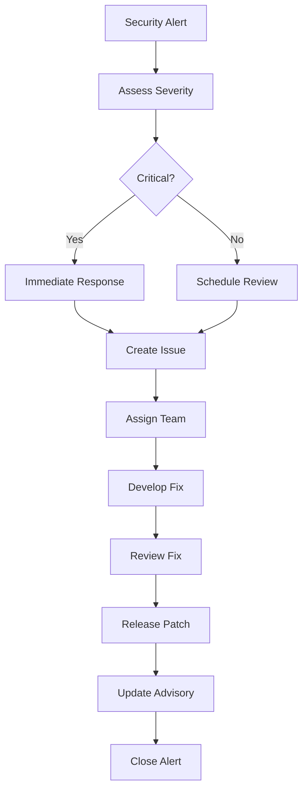
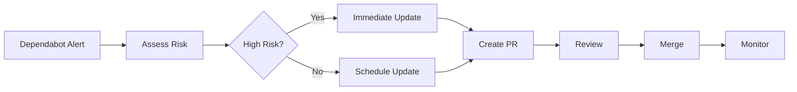

# GitHub Security Triage

## Overview

Security triage covers the process of identifying, assessing, and responding to security vulnerabilities and alerts in GitHub repositories. This skill includes vulnerability management, security alerts, dependency scanning, and incident response workflows.

**When to use this skill:** When handling security alerts, vulnerabilities, or security-related issues in GitHub repositories.

## Table of Contents

1. [Security Alert Workflow](#security-alert-workflow)
2. [Vulnerability Management](#vulnerability-management)
3. [Dependency Security](#dependency-security)
4. [Security Incident Response](#security-incident-response)
5. [Security Triage Checklist](#security-triage-checklist)
6. [Quick Reference](#quick-reference)

---

## Security Alert Workflow

### Alert Processing Flow



### Alert Types

| Alert Type | Source | Response Time |
|-------------|---------|--------------|
| **Code Scanning** | GitHub Advanced Security | < 24 hours |
| **Dependency Scanning** | Dependabot | < 48 hours |
| **Secret Scanning** | Secret Scanner | < 4 hours |
| **Advisory Database** | GitHub Advisory DB | < 72 hours |
| **External Report** | Security Email | < 4 hours |

### Severity Levels

| Severity | Definition | Response SLA |
|----------|-------------|--------------|
| **Critical** | Exploitable, no workaround | < 4 hours |
| **High** | Exploitable, has workaround | < 24 hours |
| **Medium** | Not easily exploitable | < 72 hours |
| **Low** | Minor security issue | < 1 week |

---

## Vulnerability Management

### Code Scanning Alerts

```yaml
# .github/workflows/code-scanning.yml
name: Code Scanning

on:
  push:
    branches: [main]
  pull_request:
    branches: [main]

jobs:
  analyze:
    runs-on: ubuntu-latest
    steps:
      - uses: actions/checkout@v3

      - name: Initialize CodeQL
        uses: github/codeql-action/init@v2
        with:
          languages: javascript, python

      - name: Autobuild
        uses: github/codeql-action/autobuild@v2

      - name: Perform CodeQL Analysis
        uses: github/codeql-action/analyze@v2
        with:
          category: "/language:javascript"
```

### Vulnerability Response

```markdown
## Vulnerability Response Template

### Assessment
- [ ] Vulnerability confirmed
- [ ] Impact assessed
- [ ] Exploitability determined
- [ ] Severity assigned

### Fix Development
- [ ] Fix developed
- [ ] Fix tested
- [ ] Regression testing done
- [ ] Security review completed

### Release
- [ ] Patch released
- [ ] Advisory published
- [ ] Users notified
- [ ] Documentation updated
```

### Advisory Documentation

```markdown
## Security Advisory

### Summary
Brief description of the vulnerability.

### Affected Versions
- 1.0.0 - 1.2.0

### Vulnerability Details
- CVSS Score: 7.5 (High)
- CWE: CWE-79
- Attack Vector: Network

### Patches
Upgrade to version 1.2.1 or later.

### Workarounds
Disable affected feature until patched.

### References
- CVE-2024-12345
- GHSA-abc123
```

---

## Dependency Security

### Dependabot Configuration

```yaml
# .github/dependabot.yml
version: 2
updates:
  - package-ecosystem: "npm"
    directory: "/"
    schedule:
      interval: "weekly"
    open-pull-requests-limit: 10
    reviewers:
      - "@security-team"
    labels:
      - "dependencies"
      - "security"
    commit-message:
      prefix: "chore"
      prefix-development: "chore"
      include: "scope"
```

### Security Update Workflow



### Dependency Audit

```bash
# Check for vulnerabilities
npm audit
npm audit fix

# Python dependencies
pip-audit

# Ruby dependencies
bundle audit

# GitHub Dependabot
gh api repos/:owner/:repo/dependabot/alerts

# View security advisories
gh api advisories --query package-name
```

---

## Security Incident Response

### Incident Classification

| Type | Response | Timeline |
|------|----------|-----------|
| **Active Exploit** | Emergency | Immediate |
| **Public Disclosure** | Urgent | < 24 hours |
| **Internal Discovery** | Normal | < 72 hours |
| **Third-Party Report** | Normal | < 72 hours |

### Response Steps

```markdown
## Security Incident Response

### 1. Containment (0-4 hours)
- [ ] Identify affected systems
- [ ] Implement temporary fixes
- [ ] Block exploit vectors
- [ ] Notify stakeholders

### 2. Investigation (4-24 hours)
- [ ] Root cause analysis
- [ ] Impact assessment
- [ ] Determine scope
- [ ] Document findings

### 3. Remediation (24-72 hours)
- [ ] Develop permanent fix
- [ ] Test fix thoroughly
- [ ] Security review
- [ ] Prepare release

### 4. Recovery (72-168 hours)
- [ ] Deploy fix
- [ ] Monitor for issues
- [ ] Update documentation
- [ ] Close incident
```

### Communication Plan

```markdown
## Security Communication

### Internal Communication
- [ ] Security team notified
- [ ] Engineering team notified
- [ ] Management notified
- [ ] Legal team notified (if needed)

### External Communication
- [ ] Advisory published
- [ ] Users notified
- [ ] Customers informed
- [ ] Public statement (if needed)

### Channels
- Email: security@example.com
- GitHub Security Advisory
- Security Blog
- Social Media (if needed)
```

---

## Security Triage Checklist

### Alert Assessment

```markdown
## Security Alert Assessment

### Initial Review
- [ ] Alert reviewed
- [ ] Severity determined
- [ ] Impact assessed
- [ ] Exploitability evaluated
- [ ] Workarounds identified

### Validation
- [ ] Vulnerability confirmed
- [ ] Affected code identified
- [ ] Reproduction steps documented
- [ ] Proof of concept created

### Classification
- [ ] Alert type classified
- [ ] CVE assigned (if applicable)
- [ ] GHSA assigned
- [ ] Response SLA determined
- [ ] Team assigned
```

### Fix Development

```markdown
## Security Fix Development

### Development
- [ ] Fix implemented
- [ ] Code reviewed
- [ ] Security tested
- [ ] Regression tested
- [ ] Documentation updated

### Testing
- [ ] Unit tests added
- [ ] Security tests added
- [ ] Integration tested
- [ ] Penetration tested
- [ ] Performance validated

### Release
- [ ] Version bumped
- [ ] Changelog updated
- [ ] Advisory published
- [ ] Release created
- [ ] Users notified
```

---

## Quick Reference

### GitHub CLI Commands

```bash
# View security alerts
gh api repos/:owner/:repo/code-scanning/alerts

# View dependency alerts
gh api repos/:owner/:repo/dependabot/alerts

# View secret scanning alerts
gh api repos/:owner/:repo/secret-scanning/alerts

# Create security advisory
gh api repos/:owner/:repo/security-advisories \
  --method POST \
  -f summary="Vulnerability description" \
  -f severity="high"

# Update security advisory
gh api repos/:owner/:repo/security-advisories/:ghsa_id \
  --method PATCH \
  -f state="published"

# View advisories
gh api advisories --query package-name
```

### Security Labels

| Label | Usage |
|-------|--------|
| `security` | Security-related issue |
| `vulnerability` | Vulnerability report |
| `critical` | Critical severity |
| `high` | High severity |
| `medium` | Medium severity |
| `low` | Low severity |
| `cve` | CVE assigned |
| `ghsa` | GitHub Security Advisory |

### Response Time SLAs

| Severity | Acknowledge | Fix | Release |
|----------|-------------|-----|--------|
| **Critical** | 1 hour | 8 hours | 24 hours |
| **High** | 4 hours | 24 hours | 72 hours |
| **Medium** | 24 hours | 72 hours | 1 week |
| **Low** | 72 hours | 1 week | 2 weeks |

---

## Common Pitfalls

1. **Ignoring alerts** - Always respond to security alerts promptly
2. **Underestimating severity** - Assess impact carefully
3. **No testing** - Thoroughly test security fixes
4. **Poor communication** - Keep stakeholders informed
5. **Not documenting** - Document all security incidents
6. **Skipping review** - Security fixes need extra review
7. **No monitoring** - Monitor after security releases
8. **Delayed disclosure** - Follow responsible disclosure

## Additional Resources

- [GitHub Security Documentation](https://docs.github.com/en/code-security/securing-your-repository)
- [Code Scanning](https://docs.github.com/en/code-security/code-scanning/introduction-to-code-scanning)
- [Dependabot](https://docs.github.com/en/code-security/dependabot/dependabot-version-updates)
- [Secret Scanning](https://docs.github.com/en/code-security/secret-scanning/about-secret-scanning)
