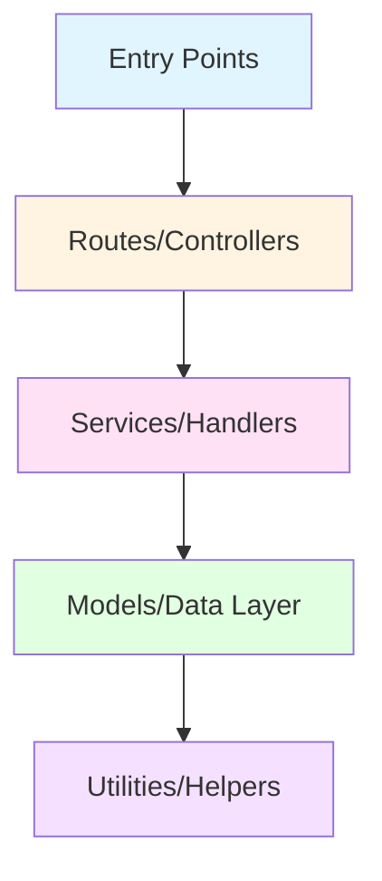
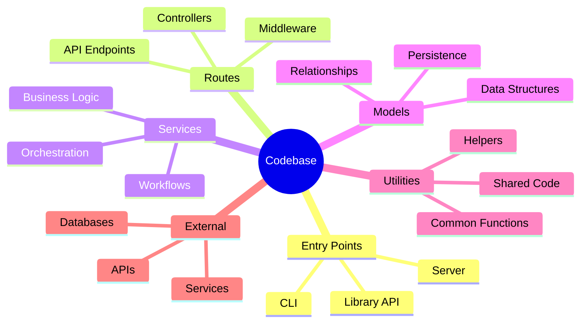
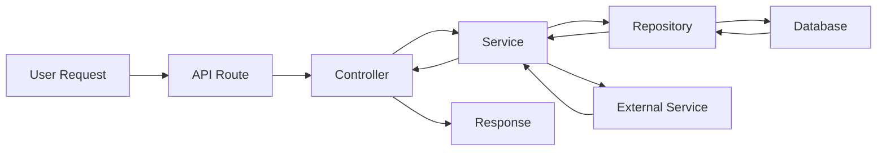
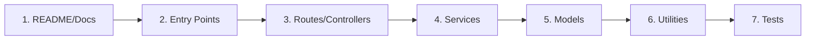

# Codebase Absorption Strategy

## Overview

Codebase absorption is the systematic process of reading and understanding a codebase to build a mental model of its structure, patterns, and relationships. This skill provides protocols for efficiently learning new codebases, identifying architectural patterns, and locating relevant code when implementing features or fixing bugs.

**When to use this skill:** When starting work on a new codebase, when joining a project, or when needing to understand unfamiliar parts of an existing codebase.

## Table of Contents

1. [The Outside-In Reading Protocol](#the-outside-in-reading-protocol)
2. [Identifying Code Smells and Patterns](#identifying-code-smells-and-patterns)
3. [Creating a Mental Map](#creating-a-mental-map)
4. [The CONTEXT.md Scratchpad](#the-contextmd-scratchpad)
5. [Code Navigation Techniques](#code-navigation-techniques)
6. [Quick Reference](#quick-reference)

---

## The Outside-In Reading Protocol

### Concept

The Outside-In approach starts from the application's entry points and progressively dives deeper into the implementation. This mimics how the application actually runs, making it easier to understand the flow of data and control.

### Reading Flow



### Step 1: Identify Entry Points

**Entry points are where the application starts or receives external input.**

#### Web Applications

```bash
# Common entry points to check
├── package.json (scripts, main entry)
├── index.js / main.js / app.js (main entry file)
├── server.js (Express/Fastify server)
├── src/index.ts (TypeScript entry)
├── public/index.html (SPA entry)
└── routes/ (HTTP route definitions)
```

**What to look for:**
- How the server is initialized
- What port it listens on
- What middleware is configured
- How routes are registered
- Environment variable loading

**Example: Express.js Entry Point**
```javascript
// server.js - Entry point analysis
const express = require('express');
const app = express();

// Middleware configuration
app.use(express.json());
app.use(express.static('public'));
app.use('/api', apiRoutes);

// Route registration
app.get('/', (req, res) => {
  res.sendFile('index.html');
});

// Server start
const PORT = process.env.PORT || 3000;
app.listen(PORT, () => {
  console.log(`Server running on port ${PORT}`);
});

module.exports = app;
```

#### CLI Applications

```bash
# CLI entry points
├── bin/ (executable scripts)
├── cli.js (main CLI handler)
├── commands/ (command definitions)
└── package.json (bin field)
```

**What to look for:**
- Command parsing (yargs, commander, etc.)
- Command handlers
- Configuration loading
- Exit codes

#### Libraries/SDKs

```bash
# Library entry points
├── index.js / main.js (public API)
├── package.json (main field)
└── src/ (implementation)
```

**What to look for:**
- Exported functions/classes
- Public API surface
- Default exports
- Named exports

### Step 2: Examine Routes/Controllers

**Routes define the application's external interface and how requests flow inward.**

```javascript
// routes/index.js - Route analysis
const express = require('express');
const router = express.Router();

// User routes
router.get('/users', userController.getAllUsers);
router.get('/users/:id', userController.getUserById);
router.post('/users', userController.createUser);
router.put('/users/:id', userController.updateUser);
router.delete('/users/:id', userController.deleteUser);

// Product routes
router.get('/products', productController.getAllProducts);
router.get('/products/:id', productController.getProductById);

module.exports = router;
```

**Route Analysis Checklist:**
```markdown
## Route Analysis

### Endpoints
- [ ] List all endpoints (method + path)
- [ ] Identify authentication requirements
- [ ] Note input validation rules
- [ ] Document response formats

### Controllers
- [ ] Map routes to controller functions
- [ ] Identify middleware used
- [ ] Note error handling patterns
- [ ] Document side effects

### Dependencies
- [ ] What services do controllers use?
- [ ] What models do they interact with?
- [ ] Are there shared utilities?
```

### Step 3: Explore Services/Handlers

**Services contain the business logic and coordinate between different layers.**

```javascript
// services/userService.js - Service analysis
class UserService {
  constructor(userRepository, emailService) {
    this.userRepository = userRepository;
    this.emailService = emailService;
  }

  async createUser(userData) {
    // Validation
    if (!this.validateEmail(userData.email)) {
      throw new Error('Invalid email');
    }

    // Check for existing user
    const existing = await this.userRepository.findByEmail(userData.email);
    if (existing) {
      throw new Error('User already exists');
    }

    // Create user
    const user = await this.userRepository.create(userData);

    // Send welcome email
    await this.emailService.sendWelcomeEmail(user);

    return user;
  }

  validateEmail(email) {
    return /^[^\s@]+@[^\s@]+\.[^\s@]+$/.test(email);
  }
}
```

**Service Analysis Checklist:**
```markdown
## Service Analysis

### Responsibilities
- [ ] What business logic does it implement?
- [ ] What are the main methods?
- [ ] What are the inputs and outputs?

### Dependencies
- [ ] What repositories does it use?
- [ ] What external services does it call?
- [ ] What utilities does it depend on?

### Patterns
- [ ] Is there error handling?
- [ ] Is there logging?
- [ ] Are there transactions?
- [ ] Is there caching?
```

### Step 4: Understand Models/Data Layer

**Models define the data structures and how data is persisted and retrieved.**

```javascript
// models/User.js - Model analysis
const { Model } = require('sequelize');

class User extends Model {
  static init(sequelize) {
    super.init({
      id: {
        type: DataTypes.INTEGER,
        primaryKey: true,
        autoIncrement: true
      },
      email: {
        type: DataTypes.STRING,
        allowNull: false,
        unique: true,
        validate: {
          isEmail: true
        }
      },
      password: {
        type: DataTypes.STRING,
        allowNull: false
      },
      role: {
        type: DataTypes.ENUM('admin', 'user', 'guest'),
        defaultValue: 'user'
      }
    }, {
      sequelize,
      modelName: 'User',
      tableName: 'users'
    });
  }

  static associate(models) {
    User.hasMany(models.Order, { foreignKey: 'userId' });
    User.belongsTo(models.Profile, { foreignKey: 'profileId' });
  }

  async validatePassword(password) {
    return bcrypt.compare(password, this.password);
  }
}
```

**Model Analysis Checklist:**
```markdown
## Model Analysis

### Structure
- [ ] What are the fields and types?
- [ ] What are the constraints?
- [ ] What are the relationships?

### Methods
- [ ] What instance methods exist?
- [ ] What static methods exist?
- [ ] What are the custom queries?

### Validation
- [ ] What validations are defined?
- [ ] What are the default values?
- [ ] What are the hooks/callbacks?
```

### Step 5: Review Utilities/Helpers

**Utilities contain reusable functions and helper methods.**

```javascript
// utils/helpers.js - Utility analysis
const crypto = require('crypto');

function generateId() {
  return crypto.randomBytes(16).toString('hex');
}

function formatDate(date) {
  return new Date(date).toISOString().split('T')[0];
}

function sanitizeInput(input) {
  return input.trim().replace(/[<>]/g, '');
}

function parsePagination(query) {
  const page = Math.max(1, parseInt(query.page) || 1);
  const limit = Math.min(100, parseInt(query.limit) || 10);
  const offset = (page - 1) * limit;
  return { page, limit, offset };
}

module.exports = {
  generateId,
  formatDate,
  sanitizeInput,
  parsePagination
};
```

**Utility Analysis Checklist:**
```markdown
## Utility Analysis

### Functions
- [ ] What utility functions exist?
- [ ] What are their purposes?
- [ ] How are they used?

### Dependencies
- [ ] What external libraries are used?
- [ ] Are there any side effects?
- [ ] Are they pure functions?

### Reusability
- [ ] Are they well-documented?
- [ ] Are they tested?
- [ ] Could they be extracted to a library?
```

---

## Identifying Code Smells and Patterns

### God Objects

**Definition:** A God Object is a class or module that knows too much or does too much. It's a monolithic component that has excessive responsibilities.

**Characteristics:**
- Hundreds or thousands of lines of code
- Many methods (often 50+)
- Knows about many other parts of the system
- Changes frequently for different reasons
- Hard to test in isolation

**Example:**
```javascript
// BAD: God Object
class UserManager {
  // User CRUD
  async createUser(data) { /* ... */ }
  async getUser(id) { /* ... */ }
  async updateUser(id, data) { /* ... */ }
  async deleteUser(id) { /* ... */ }

  // Authentication
  async login(email, password) { /* ... */ }
  async logout(userId) { /* ... */ }
  async resetPassword(email) { /* ... */ }

  // Email
  async sendWelcomeEmail(user) { /* ... */ }
  async sendPasswordReset(user) { /* ... */ }
  async sendNewsletter(users) { /* ... */ }

  // Reporting
  async generateUserReport() { /* ... */ }
  async exportUsersToCSV() { /* ... */ }
  async calculateUserStats() { /* ... */ }

  // Profile
  async updateProfile(userId, data) { /* ... */ }
  async uploadAvatar(userId, file) { /* ... */ }
  async deleteAvatar(userId) { /* ... */ }

  // ... 50 more methods
}
```

**How to identify:**
1. Look for files with 500+ lines
2. Check for classes with 20+ methods
3. Search for classes that import many other modules
4. Look for classes that handle multiple concerns

### Utility Bags

**Definition:** A Utility Bag is a module or class that contains many unrelated utility functions. It's a dumping ground for code that doesn't have a clear home.

**Characteristics:**
- Functions with no common theme
- Mixed levels of abstraction
- No clear purpose or responsibility
- Functions that could belong elsewhere

**Example:**
```javascript
// BAD: Utility Bag
const utils = {
  // String utilities
  capitalize(str) { return str.charAt(0).toUpperCase() + str.slice(1); },
  truncate(str, len) { return str.length > len ? str.slice(0, len) + '...' : str; },

  // Date utilities
  formatDate(date) { /* ... */ },
  isWeekend(date) { /* ... */ },

  // Math utilities
  round(num, decimals) { /* ... */ },
  percentage(part, total) { /* ... */ },

  // API utilities
  async fetch(url) { /* ... */ },
  async post(url, data) { /* ... */ },

  // File utilities
  readFile(path) { /* ... */ },
  writeFile(path, data) { /* ... */ },

  // Validation utilities
  isEmail(str) { /* ... */ },
  isPhone(str) { /* ... */ },

  // ... 50 more unrelated functions
};
```

**How to identify:**
1. Look for files named `utils.js`, `helpers.js`, `common.js`
2. Check for modules with many exports (>10)
3. Look for functions with different purposes in the same file
4. Search for modules that are imported everywhere

### Other Common Code Smells

| Smell | Description | How to Identify |
|-------|-------------|-----------------|
| **Long Method** | Methods that do too much | Methods > 50 lines |
| **Duplicate Code** | Same code in multiple places | Search for similar patterns |
| **Shotgun Surgery** | One change requires many files | Changes affect multiple modules |
| **Feature Envy** | Method uses data from another class | Methods accessing other objects' data |
| **Data Clumps** | Variables always together | Same parameters in multiple methods |
| **Primitive Obsession** | Using primitives instead of objects | Strings/numbers for complex data |
| **Switch Statements** | Long switch/case chains | Multiple conditions in one method |

---

## Creating a Mental Map

### The Mental Map Framework

A mental map is a cognitive representation of the codebase structure. It helps you navigate and understand relationships between components.

### Map Components



### Building the Map

#### Step 1: Identify Major Modules

```markdown
## Module Identification

### Core Modules
- User Management
- Product Catalog
- Order Processing
- Payment Processing
- Authentication/Authorization

### Supporting Modules
- Email Service
- File Storage
- Logging
- Caching
- Monitoring

### Infrastructure
- Database
- API Gateway
- Message Queue
- Background Jobs
```

#### Step 2: Document Relationships

```markdown
## Relationship Map

### User Module
- Depends on: Database, Email Service
- Used by: Order Processing, Authentication
- Exposes: User CRUD, Authentication

### Order Module
- Depends on: User, Product, Payment
- Used by: API Routes
- Exposes: Order CRUD, Status Updates

### Payment Module
- Depends on: Payment Gateway, Order
- Used by: Order Processing
- Exposes: Payment Processing, Refunds
```

#### Step 3: Identify Data Flow



### Mental Map Template

```markdown
# Codebase Mental Map

## Architecture Overview
- Architecture Pattern: [MVC / Clean Architecture / Microservices / etc.]
- Main Framework: [Express / Fastify / React / etc.]
- Database: [PostgreSQL / MongoDB / etc.]

## Entry Points
- Server: `server.js`
- Main Route: `/api`
- CLI: `bin/cli.js`

## Core Modules

### Module 1: [Name]
- **Purpose:** [What it does]
- **Location:** `path/to/module`
- **Key Files:** [List important files]
- **Dependencies:** [What it depends on]
- **Used By:** [What uses it]

### Module 2: [Name]
- **Purpose:** [What it does]
- **Location:** `path/to/module`
- **Key Files:** [List important files]
- **Dependencies:** [What it depends on]
- **Used By:** [What uses it]

## Data Models
- User: `models/User.js`
- Order: `models/Order.js`
- Product: `models/Product.js`

## Key Patterns
- Authentication: JWT tokens
- Error Handling: Global error middleware
- Validation: Joi schemas
- Logging: Winston

## External Dependencies
- Database: PostgreSQL
- Cache: Redis
- Email: SendGrid
- Storage: AWS S3

## Known Issues
- God Object: `UserManager` (needs refactoring)
- Utility Bag: `utils/helpers.js` (needs organization)
```

---

## The CONTEXT.md Scratchpad

### Purpose

A `CONTEXT.md` file is a scratchpad for documenting findings while learning a codebase. It's a living document that grows as understanding deepens.

### When to Use CONTEXT.md

- When first learning a codebase
- When working on a complex feature
- When debugging a tricky issue
- When onboarding new team members

### CONTEXT.md Template

```markdown
# Codebase Context

## Project Overview
**Name:** [Project Name]
**Purpose:** [What the project does]
**Tech Stack:** [List technologies]

## Architecture
- **Pattern:** [MVC / Clean / Microservices]
- **Entry Point:** `path/to/entry`
- **Main Framework:** [Framework name]

## Module Map

### Core Modules
| Module | Location | Purpose | Dependencies |
|--------|----------|---------|--------------|
| [Name] | `path/` | [Purpose] | [Deps] |

### Data Models
| Model | Location | Fields | Relationships |
|-------|----------|--------|--------------|
| [Name] | `path/` | [Fields] | [Relations] |

## Key Findings

### Code Smells Identified
- [ ] God Object: `path/to/file` - [Description]
- [ ] Utility Bag: `path/to/file` - [Description]
- [ ] Duplicate Code: `path/to/file` - [Description]

### Patterns Observed
- [ ] [Pattern 1]: [Description]
- [ ] [Pattern 2]: [Description]
- [ ] [Pattern 3]: [Description]

### External Dependencies
- [ ] [Dependency]: [Purpose, API endpoints]
- [ ] [Dependency]: [Purpose, API endpoints]

## Current Task Context

### What I'm Working On
- [Task description]

### Relevant Files
- `path/to/file1` - [Why it's relevant]
- `path/to/file2` - [Why it's relevant]

### Key Functions/Classes
- `functionName()` - [What it does, where it's used]
- `ClassName.method()` - [What it does, where it's used]

### Data Flow
[Describe how data flows through the relevant parts]

## Questions & Notes
- [ ] [Question about the codebase]
- [ ] [Note about something learned]
- [ ] [Todo item to investigate]

## References
- [Link to documentation]
- [Link to related issues]
- [Link to design docs]
```

### Example CONTEXT.md

```markdown
# E-Commerce Codebase Context

## Project Overview
**Name:** ShopNow API
**Purpose:** REST API for e-commerce platform
**Tech Stack:** Node.js, Express, PostgreSQL, Redis

## Architecture
- **Pattern:** MVC with Service Layer
- **Entry Point:** `server.js`
- **Main Framework:** Express.js

## Module Map

### Core Modules
| Module | Location | Purpose | Dependencies |
|--------|----------|---------|--------------|
| User | `services/userService.js` | User management | UserRepository, EmailService |
| Product | `services/productService.js` | Product catalog | ProductRepository, CacheService |
| Order | `services/orderService.js` | Order processing | OrderRepository, PaymentService, UserService |
| Payment | `services/paymentService.js` | Payment processing | Stripe API, OrderRepository |

### Data Models
| Model | Location | Fields | Relationships |
|-------|----------|--------|--------------|
| User | `models/User.js` | id, email, password, role | hasMany(Order) |
| Product | `models/Product.js` | id, name, price, stock | belongsTo(Category) |
| Order | `models/Order.js` | id, userId, status, total | belongsTo(User), hasMany(OrderItem) |

## Key Findings

### Code Smells Identified
- [x] God Object: `services/userService.js` - Has 45+ methods, handles users, auth, emails, profiles
- [x] Utility Bag: `utils/helpers.js` - Contains 30+ unrelated functions
- [ ] Duplicate Code: Validation logic repeated in multiple services

### Patterns Observed
- [x] Service Layer: All business logic in service classes
- [x] Repository Pattern: Data access abstracted in repositories
- [x] Middleware Chain: Auth, validation, error handling as middleware
- [x] Async/Await: All async operations use async/await

### External Dependencies
- [x] Stripe: Payment processing (API: https://api.stripe.com)
- [x] SendGrid: Email service (API: https://api.sendgrid.com)
- [x] Redis: Caching layer
- [x] PostgreSQL: Primary database

## Current Task Context

### What I'm Working On
Implementing order status tracking with email notifications

### Relevant Files
- `services/orderService.js` - Core order logic, needs status update method
- `services/emailService.js` - Email templates, needs order status template
- `models/Order.js` - Order model, needs status enum
- `routes/orders.js` - Order routes, needs status update endpoint

### Key Functions/Classes
- `OrderService.createOrder()` - Creates order, sets status to 'pending'
- `OrderService.updateOrderStatus()` - Needs implementation
- `EmailService.sendOrderStatusEmail()` - Needs implementation
- `Order.status` - Field to track: pending, processing, shipped, delivered, cancelled

### Data Flow
```
User Request → API Route → OrderController → OrderService
                                          → EmailService
                                          → OrderRepository → Database
```

## Questions & Notes
- [ ] Should order status changes trigger webhook notifications?
- [ ] Need to verify email templates with marketing team
- [x] Redis cache should be invalidated when order status changes
- [ ] Consider adding order status history tracking

## References
- [Stripe API Docs](https://stripe.com/docs/api)
- [Project Wiki](https://wiki.company.com/shopnow)
- [Order Status Requirements](https://jira.company.com/PROJ-123)
```

---

## Code Navigation Techniques

### Using Search Effectively

#### Grep for Patterns

```bash
# Find all usages of a function
grep -r "functionName" --include="*.js" .

# Find all imports of a module
grep -r "require.*moduleName" --include="*.js" .

# Find all exports of a module
grep -r "module.exports\|export" path/to/module/

# Find TODO comments
grep -r "TODO\|FIXME\|XXX" --include="*.js" .
```

#### Find File Relationships

```bash
# Find all files that import a module
grep -r "from './userService'" --include="*.js" .

# Find all files that use a specific model
grep -r "User\.find\|User\.create" --include="*.js" .

# Find all route definitions
grep -r "router\.\(get\|post\|put\|delete\)" --include="*.js" routes/
```

### Using IDE Features

#### VS Code Tips

```markdown
## VS Code Navigation

### Keyboard Shortcuts
- `Ctrl+P` - Quick file open
- `Ctrl+Shift+F` - Global search
- `F12` - Go to definition
- `Shift+F12` - Find all references
- `Ctrl+Shift+H` - Replace in files

### Extensions
- **Path Intellisense** - Auto-complete file paths
- **Import Cost** - Show import sizes
- **TODO Highlight** - Highlight TODO comments
- **Bookmarks** - Mark important code locations

### Features
- **Call Hierarchy** - See function call tree
- **Type Hierarchy** - See class/type relationships
- **Go to Symbol** - Jump to functions/classes
- **Peek Definition** - Preview without leaving
```

### Using Code Analysis Tools

#### Static Analysis

```bash
# ESLint - Find code issues
npx eslint . --ext .js

# JSHint - JavaScript linter
npx jshint .

# SonarQube - Deep code analysis
# (requires setup)

# Complexity analysis
npx complexity-report src/
```

#### Dependency Analysis

```bash
# npm ls - See dependency tree
npm ls

# npm outdated - Check for updates
npm outdated

# depcheck - Find unused dependencies
npx depcheck

# madge - Visualize module dependencies
npx madge --image deps.png src/
```

### Reading Strategy for Specific Tasks

#### Task: Adding a New Feature

```markdown
## Feature Implementation Reading Strategy

1. **Understand the Domain**
   - Read README and documentation
   - Look at similar existing features
   - Identify relevant models and services

2. **Find the Entry Point**
   - Locate where the feature will be accessed
   - Check existing routes/controllers
   - Understand the request flow

3. **Identify Dependencies**
   - What services will be needed?
   - What models will be modified?
   - What external APIs will be called?

4. **Follow the Pattern**
   - Look at how similar features are implemented
   - Follow the same structure and conventions
   - Reuse existing utilities and helpers
```

#### Task: Fixing a Bug

```markdown
## Bug Fix Reading Strategy

1. **Understand the Bug**
   - Read the bug report carefully
   - Reproduce the issue if possible
   - Identify the affected area

2. **Trace the Code Path**
   - Start from the entry point
   - Follow the execution flow
   - Identify where the bug occurs

3. **Check Related Code**
   - Look for similar patterns that work
   - Check for recent changes
   - Review related tests

4. **Understand the Context**
   - Why was the code written this way?
   - What are the constraints?
   - What are the edge cases?
```

#### Task: Refactoring

```markdown
## Refactoring Reading Strategy

1. **Assess the Current State**
   - Identify code smells
   - Understand dependencies
   - Check test coverage

2. **Plan the Refactoring**
   - Define the target structure
   - Break into small steps
   - Identify verification points

3. **Understand the Impact**
   - What depends on this code?
   - What will break?
   - What needs to be updated?

4. **Document the Changes**
   - Why is this refactoring needed?
   - What are the benefits?
   - How will it be tested?
```

---

## Quick Reference

### Reading Order



### File Type Guide

| File Type | Purpose | Reading Priority |
|-----------|---------|------------------|
| `README.md` | Project overview | High |
| `package.json` | Dependencies, scripts | High |
| `server.js` / `main.js` | Entry point | High |
| `routes/` | API definition | High |
| `controllers/` | Request handlers | Medium |
| `services/` | Business logic | High |
| `models/` | Data structures | Medium |
| `utils/` | Helper functions | Low |
| `tests/` | Expected behavior | Medium |

### Search Patterns

```bash
# Find entry point
grep -r "app.listen\|server.listen" --include="*.js" .

# Find route definitions
grep -r "router\.\(get\|post\|put\|delete\)" --include="*.js" routes/

# Find model definitions
grep -r "Schema\|Model\|sequelize.define" --include="*.js" models/

# Find service methods
grep -r "async.*(" --include="*.js" services/

# Find exports
grep -r "module.exports\|export" --include="*.js" .
```

### Code Smell Detection

```bash
# Find long files (>500 lines)
find . -name "*.js" -exec wc -l {} + | awk '$1 > 500'

# Find files with many functions (>20)
grep -r "function\|=>" --include="*.js" | cut -d: -f1 | sort | uniq -c | awk '$1 > 20'

# Find files with many imports (>10)
grep -r "require\|import" --include="*.js" | cut -d: -f1 | sort | uniq -c | awk '$1 > 10'
```

---

## Common Pitfalls

1. **Reading from the inside out** - Start from entry points, not utilities
2. **Getting lost in details** - Focus on structure first, details later
3. **Not documenting findings** - Use CONTEXT.md to track understanding
4. **Skipping tests** - Tests reveal expected behavior
5. **Ignoring documentation** - READMEs and comments provide context
6. **Making assumptions** - Verify your understanding with code
7. **Not asking questions** - Don't be afraid to ask for clarification
8. **Trying to understand everything** - Focus on relevant parts

## Additional Resources

- [Understanding Codebases](https://www.youtube.com/watch?v=5Z1m1o7jQeM)
- [Code Reading Techniques](https://www.amazon.com/Code-Reading-Open-Source-Perspective/dp/0201799405)
- [Software Architecture Patterns](https://www.youtube.com/watch?v=3kzHmaeozDI)
